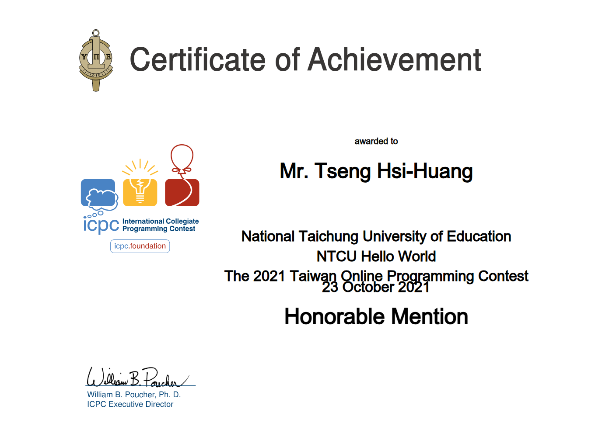
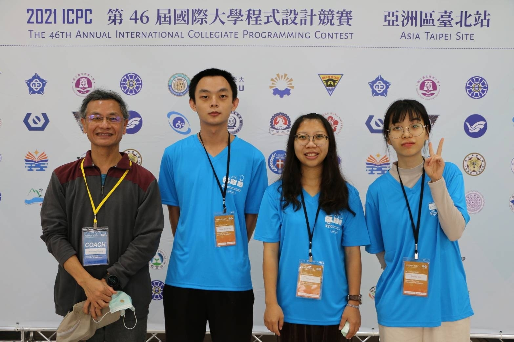
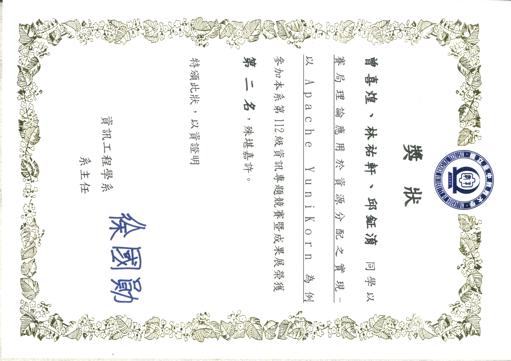
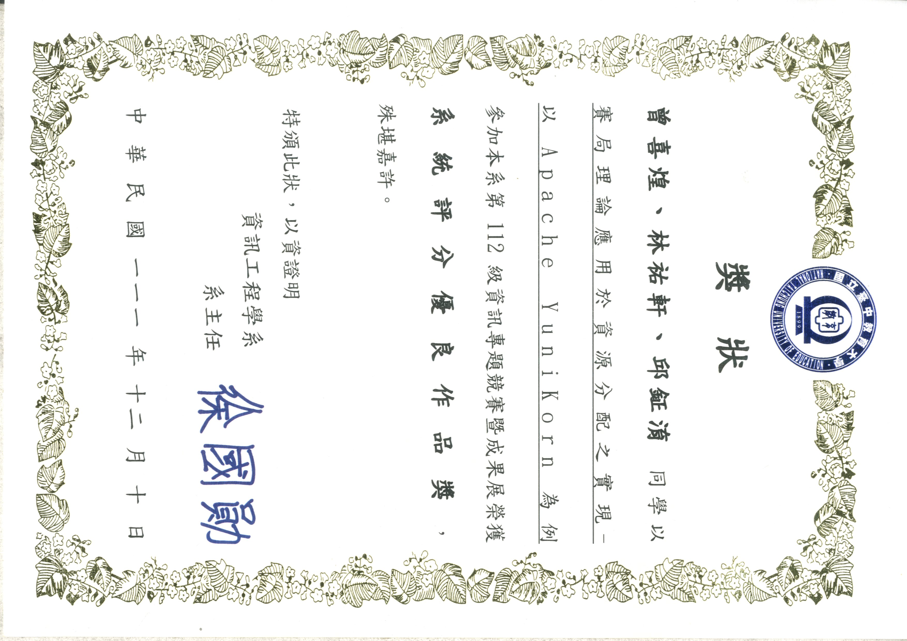

## 曾喜煌

---
### 學歷：
* 國立臺中教育大學 資訊工程學系 學士畢業 (2019/09 ~ 2023/06)
* 國立臺中教育大學 資訊工程學系 碩士畢業 (2023/09 ~ 2025/07)

### 專長：
C, C++, Linux, Shell, Makefile, gdb, Golang, Kubernetes, Docker, Dockerfile

## 專業技能
---
### Linux
* 從大一開始把筆電灌成 Linux，長期並持續使用的情況下，熟悉 Linux 的命令操作
* 曾經使用 Ubuntu, Debian, CentOS, Arch, 等等的 Linux 發行版
* 習慣且熟悉使用 tmux + vim 作為我的開發環境
    * [我的 vim 環境設定](https://github.com/9501sam/.vim)
    * [我的 tmux 環境設定](https://github.com/9501sam/.tmux)

### C Language and System Software
* 2021 iThome 鐵人賽以「[C 語言筆記](https://ithelp.ithome.com.tw/users/20137780/ironman/4752)」作為主題並完賽
* 自學 MIT 的作業系統課程 [6.1810: Operating System Engineering](https://pdos.csail.mit.edu/6.S081/2022/schedule.htm://pdos.csail.mit.edu/6.S081/2022/schedule.html) 並寫成系列文章 [xv6 學習紀錄](./xv6)
* 會使用 `gdb` 做 debugging
    * Hardware: 以 `qemu` 做模擬
    * Operating System: [xv6-riscv](https://github.com/mit-pdos/xv6-riscv)

### Cloud Computing

* 大學專題與研究所的研究領域，
    * 大學專題：**「賽局理論應用於資源分配之實現——以 Apache Yunikorn 為例」**
    * 碩士論文：**「雲端邊緣運算中微服務部署之離散化粒子群最佳化演算法」**
* Apache Yunikorn contributor
    * 在實驗室學長的帶領之下，

## 作品集與個人經歷
---
### xv6 學習紀錄
系列文章連結：[xv6 學習紀錄](./xv6)

### The 2021 Taiwan Online Programming Contest

### The 2021 ICPC Asia Taipei Regional Programming Contest

* [恭賀！本系大學部曾喜煌、林家羽、顏岑宇同學榮獲第46屆國際大學程式設計競賽(ICPC)銅牌獎！](https://cs.ntcu.edu.tw/announcement/143)

### 2021 iThome 鐵人賽 (主題: C 語言筆記)
系列文章連結：[C 語言筆記](https://ithelp.ithome.com.tw/users/20137780/ironman/4752)

### 這個網站的誕生
* 系列文章連結：[這個網站的誕生](./dev-log)
* Git Repository Link: [yamatrail-site](https://github.com/9501sam/yamatrail-site)
* 學習以下技能：
    * Google Cloud Platform 建立及管理虛擬機
    * Cloudflare 註冊 Domain 及產生憑證
    * Nginx 建立 HTTPS server
    * Hugo 建立部落格網站

### LeetCode 解題
系列文章連結：[LeetCode 解題](./leetcode)

### Apache Yunikorn contributor

### 大學專題：**「賽局理論應用於資源分配之實現——以 Apache Yunikorn 為例」**

### 碩士論文：**「雲端邊緣運算中微服務部署之離散化粒子群最佳化演算法」**

## Contact Me

- **Email:** [yama.tseng@gmail.com](mailto:yama.tseng@gmail.com)
- **GitHub:** [@9501sam](https://github.com/9501sam)
- **IT 邦幫忙:** [https://ithelp.ithome.com.tw/users/20137780](https://ithelp.ithome.com.tw/users/20137780)

---
