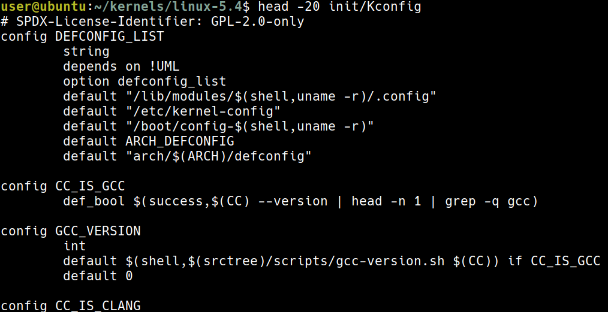
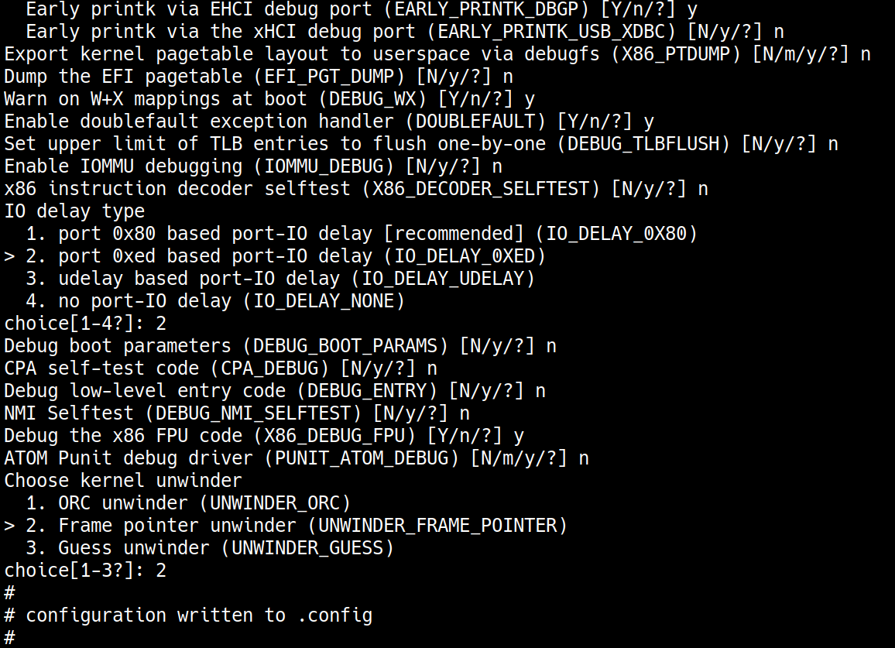
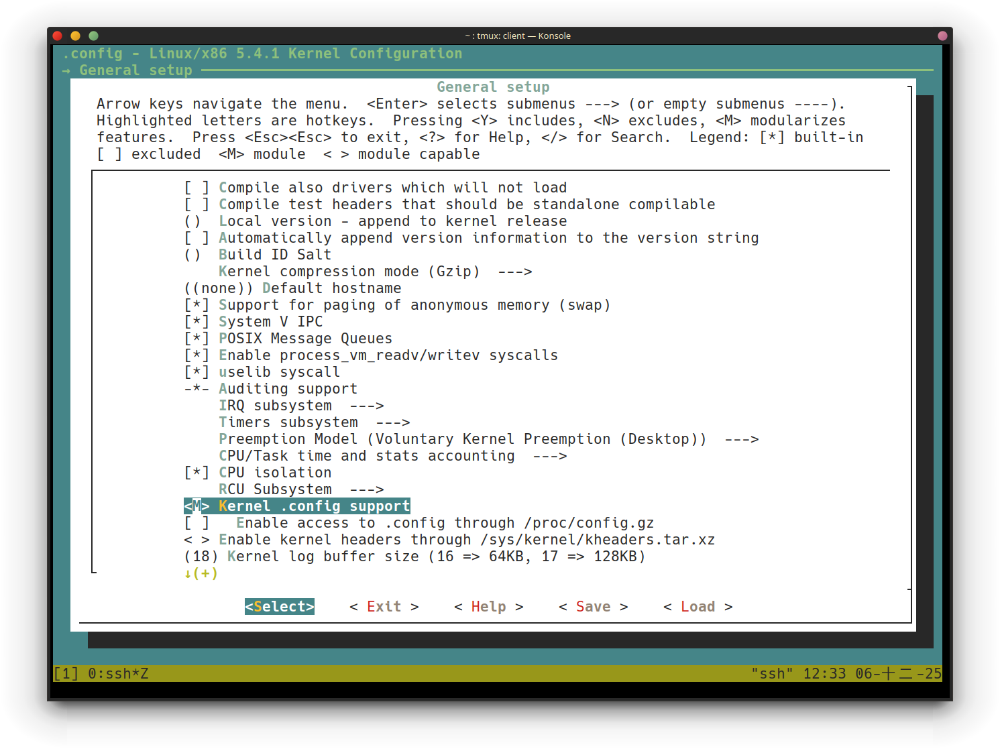
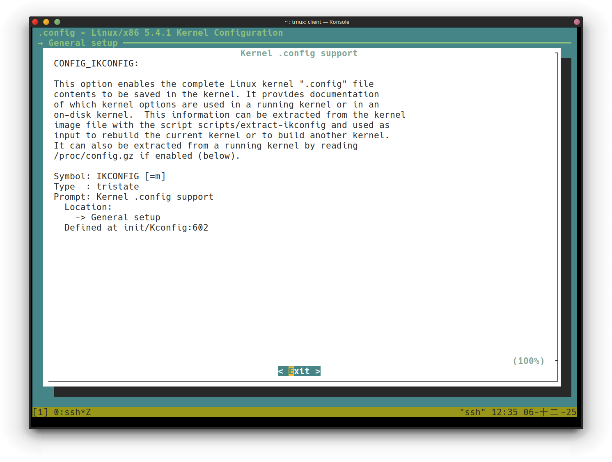
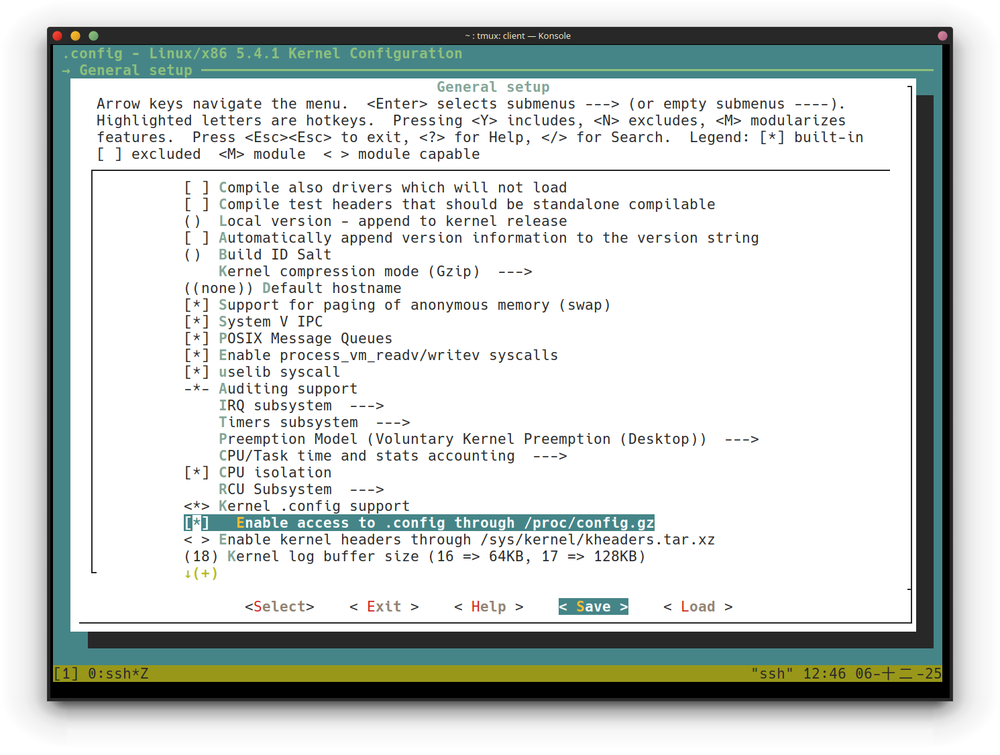
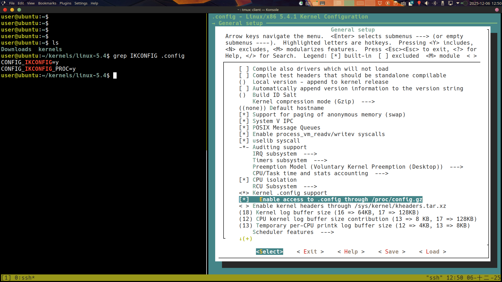
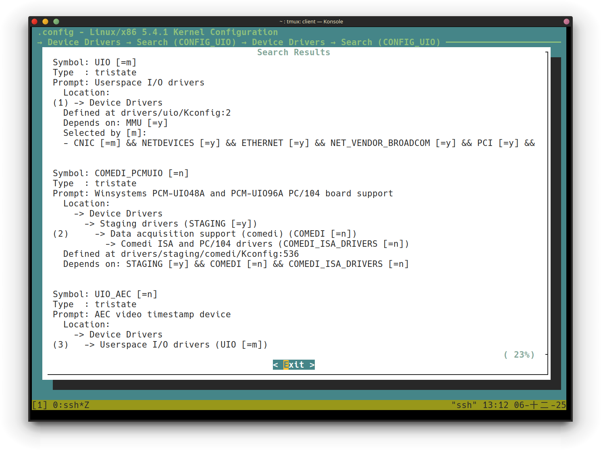
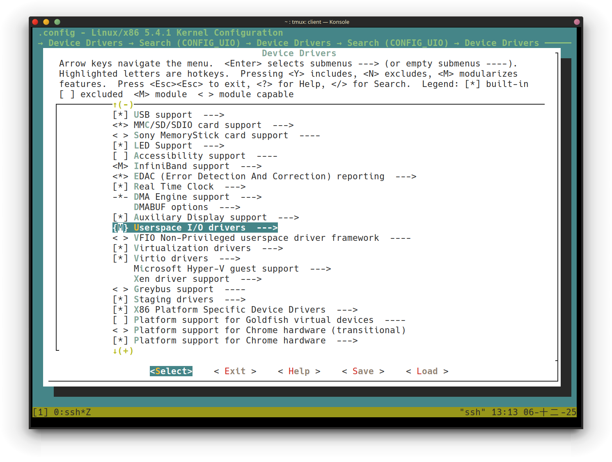
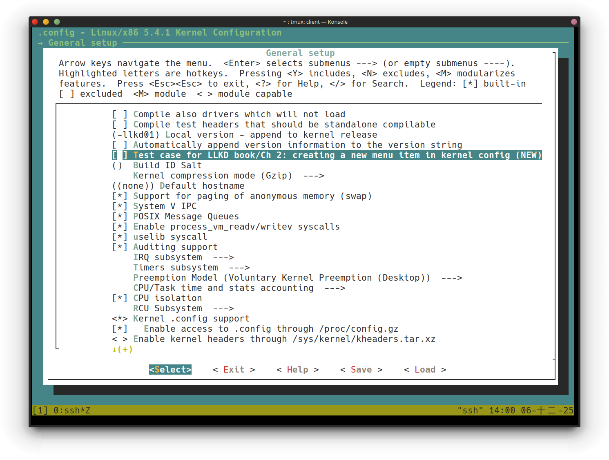
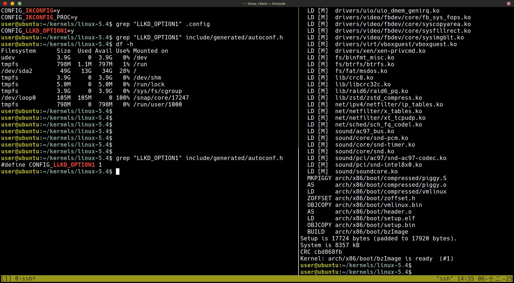

+++
date = '2025-12-03T20:16:29+08:00'
draft = false
title = 'Ch02: Building the 5.x Linux Kernel from Source - Part 1'
+++

# Step 1 – obtaining a Linux kernel source tree
```sh
wget --https-only -O ~/Downloads/linux-5.4.1.tar.xz https://mirrors.edge.kernel.org/pub/linux/kernel/v5.x/linux-5.4.1.tar.xz
```

# Step 2 – extracting the kernel source tree
```sh
cd ~/Downloads ; ls -lh linux-5.4.1.tar.xz
```

```sh
tar xf ~/Downloads/linux-5.4.1.tar.xz
```

```sh
mkdir -p ~/kernels
tar xf ~/Downloads/linux-5.4.1.tar.xz --directory=${HOME}/kernels/
```

設定環境變數是一個 good practice，可加入 `~/.bashrc` 中:
```sh
export LLKD_KSRC=${HOME}/kernels/linux-5.4
```

* 現在已經不像以前一定會把 source code 放到 `usr/src` 了
## A brief tour of the kernel source tree
```sh
user@ubuntu:~/kernels/linux-5.4$ ls
COPYING        Kconfig      README  crypto   init    mm       security  virt
CREDITS        LICENSES     arch    drivers  ipc     net      sound
Documentation  MAINTAINERS  block   fs       kernel  samples  tools
Kbuild         Makefile     certs   include  lib     scripts  usr
```

* 使用 `du -m .` 可以看到檔案大小為 `1011M` 幾乎是 1 GB 了

```sh
user@ubuntu:~/kernels/linux-5.4$ head Makefile
# SPDX-License-Identifier: GPL-2.0
VERSION = 5
PATCHLEVEL = 4
SUBLEVEL = 1
EXTRAVERSION =
NAME = Kleptomaniac Octopus

# *DOCUMENTATION*
# To see a list of typical targets execute "make help"
# More info can be located in ./README
```
* 這裡可以知道目前的 source code 版本為 5.4.1

### 最上層的檔案與資料夾
* `README`: 告知 documents 的所在位置
* `COPYING`: licence 的所在位置
* `MAINTAINERS`

#### Major subsystem directories
* `Makefile`: 這是 top-level 的 `Makefile` 使用 `kbuild` 與 kernel modules 使用這個 `Makefile` (至少在初始化階段)
* `kernel`: Core kernel subsystem
    * process/thread life cycle
    * CPU scheduling
    * locking
    * cgroups,
    * timers
    * interrupts
    * signaling
    * modules
    * tracing
* `mm`: memory management
* `fs`: virtual file system
* `block`: block I/O, file system 的更底層
* `net`: network
* `ipc`: inter-processes communication
* `sound`: Advanced Linux Sound Architecture (ALSA)
* `virt`: virtualization code like KVM

#### Infrastructure/misc
* `arch`: architecture 相關，像是 x86-64, risc-v, arm 等等
* `crypto`: 加密相關
* `include`: arch-independent kernel headers, 但也有例外，像是 `arch/<cpu>/include/...`
* `init`: 初始化的過程 `init/main.c:start_kernel()`, `start_kernel()`
* `lib`: 注意 kernel 並不支援 shared library
* `scripts`: 一些有用的 scripts
* `security`: Linux Security Module (LSM)
* `tools`: mostly userspace applications

```sh
user@ubuntu:~/kernels/linux-5.4$ cd ${LLKD_KSRC} ; ls arch/
Kconfig  arm    csky     ia64        mips   openrisc  riscv  sparc      x86
alpha    arm64  h8300    m68k        nds32  parisc    s390   um         xtensa
arc      c6x    hexagon  microblaze  nios2  powerpc   sh     unicore32
```
kernel 所支援的 ISA

# Step 3 – configuring the Linux kernel
## Understanding the kbuild build system

## Arriving at a default configuration
有以下三種可以切入的方式
1. default
1. 用現有的 linux 發行版的 config
1. 看看現在 memory 中所使用的 module, 使用這些 module 就好

default config 存放於 `init/Kconfig:DEFCONFIG_LIST` 中：

這裡代表的意義是
1. 先 check `/lib/modules/$(shell,uname -r)/.config` 是否存在
1. 有的話就使用 `/lib/modules/$(shell,uname -r)/.config`
1. 沒有的話就檢查 `/etc/kernel-config` 依此類推

## Obtaining a good starting point for kernel configuration
### Kernel config for typical embedded Linux systems
例如使用 arm 的話：

有這些 config 可以用

### Kernel config using distribution config as a starting point
```sh
cp /boot/config-5.0.0-36-generic ${LLKD_KSRC}/.config
```
使用這個指令就可以直接用當前 distribution 的 config

### Tuned kernel config via the localmodconfig approach
```sh
lsmod > /tmp/lsmod.now
cd ${LLKD_KSRC}
make LSMOD=/tmp/lsmod.now localmodconfig
```
這就是使用現在正在運行的 moduel 來作為 config

使用 `make help` 可以獲得一些幫助

## Getting started with the localmodconfig approach
這裡先用先前所提到的第三種方式，也就是 localmodconfig 的方式
* 書上這裡有提到，這個作法最好是使用 x86-based 的平台上
    * 這裡的前提為我們現在使用的也是一個 x86-based 的 VM

```sh
lsmod > /tmp/lsmod.now
cd ${LLKD_KSRC} ; make LSMOD=/tmp/lsmod.now localmodconfig
```


每當有新的 config 時，就會停下來要做選擇就會停下來要做選擇就會停下來要做選擇就會停下來要做選擇，按 [Enter] 就可以選 default selection


最後就會得到一個 `.config` 的檔案

## Tuning our kernel configuration via the make menuconfig UI
針對 localmodconfig 產出的 config 還可以進一步的使用 `make menuconfig` 進行更加細部的調整

* `[.]`: boolean value
    * `[*]`: yes
    * `[ ]`: no
* `<.>`
    * `<*>`: 直接跟在 kernel image
    * `<M>`: 以 module 的形式
    * `< >`: off
* `{.}`: 需要 dependency `.`
* `-*-`: 這個選項是別人的 dependency
* `(...)`: 需要打字輸入，按 [Enter] 可進入輸入
* `<Menu entry>`: sub-menu

書中提及經驗還是很重要，這是下一小節的重點
    
### Sample usage of the make menuconfig
* `Kernel .config support` 初始時是 `off` 先把它變成 `on` (find it under `General Setup`)
* 當這個 `Kernel .config support` 的選項開啟時 (`y` or `M`)，可以用以下兩種方式查看當前運行的 kernel config:
    1. 執行 `scripts/extract-ikconfig` script
    1. 直接 read `/proc/config.gz` (pseudo-file)

這裡書中列了一個表格，告訴我們要更改的選項，但是這裡只先告訴我們第二、三項，剩下的要自行去更改，畢竟選項有太多了
| Feature | Effect and location in the menuconfig UI | CONFIG\_<FOO> option | Value: original -> new value |
| :--- | :--- | :--- | :--- |
| **Kernel config file support** | Allows you to see the current kernel configuration details; General Setup / **Kernel .config support** | `CONFIG_IKCONFIG` | `n -> y` |
| **The same as the preceding plus access via procfs** | Allows you to see the current kernel configuration details via **proc filesystem (procfs)**; General Setup / Enable access to .config through /proc/config.gz | `CONFIG_IKCONFIG_PROC` | `n -> y` |
| **Local version** | Sets the -EXTRAVERSION component of the kernel release/version (seen with `uname -r`); General Setup / **Local version - append to kernel release** | `CONFIG_LOCALVERSION` | `(none) -> -llkd01` |
| **Kernel profiling** | Kernel profiling support; General Setup / **Profiling support** | `CONFIG_PROFILING` | `y -> n` |
| **HAM radio** | Support for HAM radio; Networking support / Amateur Radio support | `CONFIG_HAMRADIO` | `y -> n` |
| **VirtualBox support** | (Para)virtualization support for VirtualBox; Device Drivers / Virtualization drivers / **Virtual Box Guest integration support** | `CONFIG_VBOXGUEST` | `n -> m` |
| **Userspace IO Drivers (UIO)** | UIO support; Device Drivers / **Userspace I/O Drivers** | `CONFIG_UIO` | `n -> m` |
| **The preceding plus the UIO platform driver with generic IRQ handling** | UIO platform driver with generic IRQ handling; Device Drivers / Userspace I/O Drivers / **Userspace I/O platform driver with generic IRQ handling** | `CONFIG_UIO_PDRV_GENIRQ` | `n -> m` |
| **MS-DOS filesystem support** | File systems / DOS/FAT/NT filesystems / **MSDOS FS support** | `CONFIG_MSDOS_FS` | `n -> m` |
| **Security: LSMs** | Turn off kernel LSMs; Security options / **Enable different security models** (NOTE: it's typically safer to keep this ON for production systems!) | `CONFIG_SECURITY` | `y -> n` |
| **Kernel debug: stack utilization info** | Kernel hacking / Memory Debugging / **Stack utilization instrumentation** | `CONFIG_DEBUG_STACK_USAGE` | `y -> n` |

#### 1. 先移動到 root of kernel source tree
```sh
cd ${LLKD_KSRC}
```
#### 2. 產生初始的 kernel configuration file
```sh
lsmod > /tmp/lsmod.now
make LSMOD=/tmp/lsmod.now localmodconfig
```

#### 3. 啟動 UI
```sh
make menuconfig
```

#### 4. 進入 `General Setup` menu 

#### 5. 移動到 `Kernel .config support` 的選項


#### 6. `<M>` 代表一個 tristate menu `M` 代表用 moduel 的形式
#### 7. 進入到 `<Help>`

書中提及有些 `<Help>` 很有幫助，有些則幫助有限

#### 8. 按下 `<Exit>` 回到上一頁
#### 9. 按下 `<Space>` 可以更改選項，把他更改到 `<*>`


#### 10. 進一步的選下 `Enable access to .config through /proc/config.gz` 的選項

#### 11. save configuration
這裡我跟書上的 `<save>` 的位置有一點不一樣，但功能一樣都是儲存變更



#### 12. 檢查存下來的變更

會存放在 `.config` 中

改完這兩個選項之後，再繼續的把表格中剩下的更改給操作完

## More on kbuild

#### 如何搜尋
因為書中要我們更改的東西有許多，因此使用搜尋功能會方便許多，例如以下這個修改


先在主畫面中進入 `Device Drivers`:


按下 `/` 就跟 `vim` 的搜尋一樣，搜尋 `CONFIG_UIO`


在這個畫面中會出現搜尋結果，我們要的是第 `(1)` 個，在鍵盤上按下 1


接著就會跳到我們要的位置了，這樣就不用一個一個慢慢找

### Looking up the differences in configuration
```sh
scripts/diffconfig .config.old .config
```
* `kconfig-hardened-check` 這個專案可以檢查 kernel configuration 的安全性

# Customizing the kernel menu – adding our own menu item
在先前的 `make menuconfig` 畫面中，我們可以自己新增一些選項
## The Kconfig\* files
| Menu | Kconfig file location for it |
| :--- | :--- |
| **The main menu, the initial screen** | `Kconfig` |
| **General setup** + Enable loadable module support | `init/Kconfig` |
| **Processor types and features** + Bus options + Binary Emulations (arch-specific; above the menu title is for x86; in general, the Kconfig file is here: arch/<arch>/Kconfig) | `arch/<arch>/Kconfig` |
| **Power management** | `kernel/power/Kconfig` |
| **Firmware drivers** | `drivers/firmware/Kconfig` |
| **Virtualization** | `arch/<arch>/kvm/Kconfig` |
| **General architecture-dependent options** | `arch/Kconfig` |
| **Enable the block layer** + IO Schedulers | `block/Kconfig` |
| **Executable file formats** | `fs/Kconfig.binfmt` |
| **Memory Management options** | `mm/Kconfig` |
| **Networking support** | `net/Kconfig`, `net/*/Kconfig` |
| **Device Drivers** | `drivers/Kconfig`, `drivers/*/Kconfig` |
| **File systems** | `fs/Kconfig`, `fs/*/Kconfig` |
| **Security options** | `security/Kconfig`, `security/*/Kconfig` |
| **Cryptographic API** | `crypto/Kconfig`, `crypto/*/Kconfig` |
| **Library routines** | `lib/Kconfig`, `lib/*/Kconfig` |
| **Kernel hacking** | `lib/Kconfig.debug`, `lib/Kconfig.*` |

## Creating a new menu item in the Kconfig file
### 1. To be safe, always make a backup copy:
```sh
cp init/Kconfig init/Kconfig.orig
```

### 2. Now, edit the `init/Kconfig` file:
```sh
vim init/Kconfig
```

在本書的 github repo 中可以找到這段 config

### 3. Save the file and exit the editor.
### 4. configure the kernel.
```sh
make menuconfig
```

出現了新的選項
### 5. Turn it on 
### 6. Check whether our feature has been selected:

變更已經出現在 `.config` 了，但是還沒出現在 auto-generated header file，這要在 build kernel 之後才會出現 
### 7. Build the kernel

### 8. `autoconf.h` 出現了 `LLKD_OPTION1`
```sh
grep "LLKD_OPTION1" include/generated/autoconf.h
```

## A few details on the Kconfig language

# Summary

# Qestions
[https://github.com/PacktPublishing/Linux-Kernel-Programming/tree/master/questions](https://github.com/PacktPublishing/Linux-Kernel-Programming/tree/master/questions)

[https://github.com/PacktPublishing/Linux-Kernel-Programming/tree/master/solutions_to_assgn](https://github.com/PacktPublishing/Linux-Kernel-Programming/tree/master/solutions_to_assgn)
