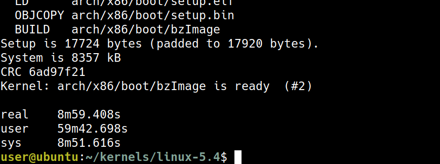
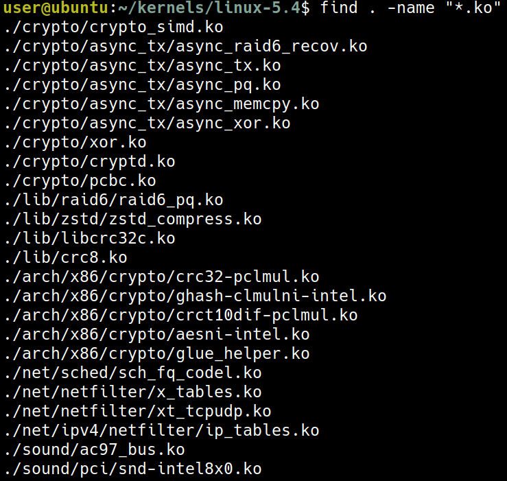
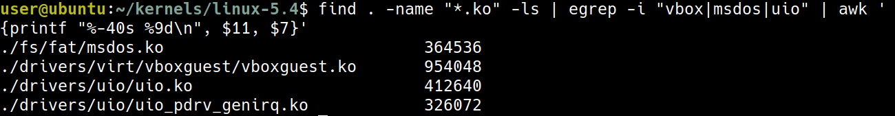
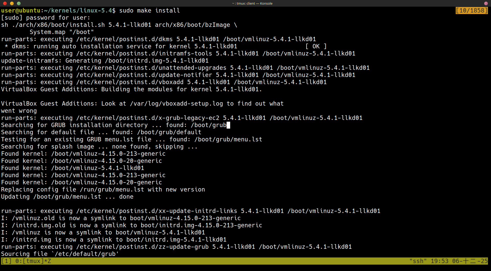
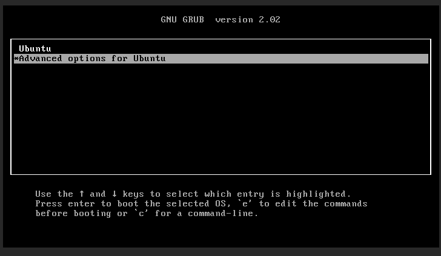
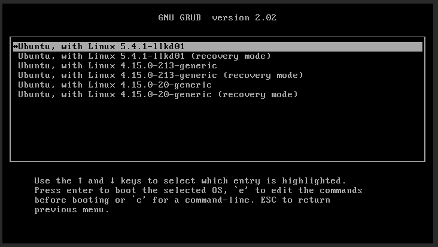
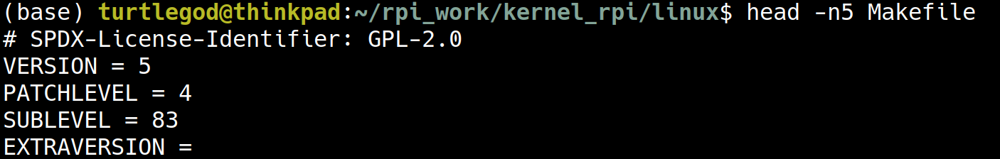
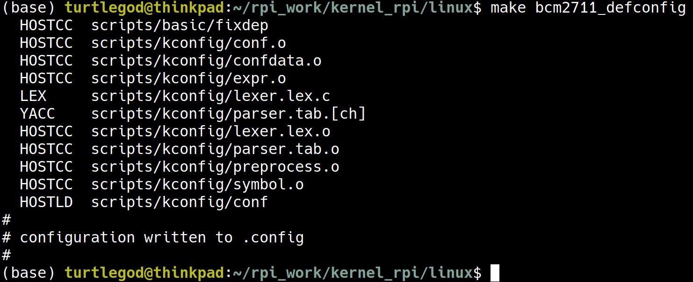
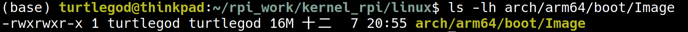
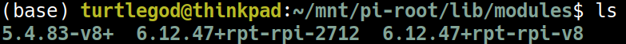

+++
date = '2025-12-06T15:00:38+08:00'
draft = false
title = 'Ch03: Building the 5.x Linux Kernel from Source - Part 2'
weight = 3
+++

# Step 4 – building the kernel image and modules
從使用者的角度而言，這非常的簡單，只需要 `make` 就行了

`make help` 可以看到 help，這裡可以先觀察 target `all`
```sh
$ make help
[...]
Other generic targets:
  all - Build all targets marked with [*]
* vmlinux - Build the bare kernel
* modules - Build all modules
[...]
Architecture specific targets (x86):
* bzImage - Compressed kernel image (arch/x86/boot/bzImage)
[...]
```

從這裡可以得知，`make all` 的時候會有 `vmlinux`, `modules`, `bzImage` 這三個 target 被觸發
* `vmlinux`: 未壓縮的 kernel image
* `modules`: 在 config 中被標記為 `M` 的會變成 kernel modules (`.ko` files)
* `bzImage`: 壓縮過後的 kernel image (x86)

實際在開機時，會用壓縮過後的 `bzImage`，`vmlinux` 是作為 debug 用，（不在這本書的範圍）

這裡推薦的平行化程度 `n` 為
```text
n = num-CPU-cores * factor
```

`factor` 推薦為 2，或是 1.5 (如果是高階有著 100 cpu cores 的系統)


我自己在 virtural box 的設定是 8 core，根據書上的說法，我要使用 `-j16`，大約花了 9 分鐘

`(#2)` 代表的是這是第二次 build，這個數字會在之後遞增

`make all` 之後，現在我們得到了 3 個東西：
* 未壓縮的 `vmlinux`
* Symbol-address mapping file, `System.map`
* 壓縮過後的 `bzImage`


`vmlinux` 的檔案非常大，`vmlinux` 與 `System.map` 這兩個檔案室用來 debug 用的

實際上用來開機的會是壓縮過後的 `bzImage`，會放在 `arch/<arch>/boot/`

`bzImage` 只有 8.2 MB 跟 582 MB 的 `vmlinux` 差很多

# Step 5 – installing the kernel modules
在前一個步驟中，我們看到了 `vmlinux` 與 `bzImage`，現在還少了一個東西：modules，Step 5 會告訴我們 modules 該如何處理

## Locating the kernel modules within the kernel source
kernel moduels 會以 `*.ko` 作為結尾



```sh
find . -name "*.ko" -ls | egrep -i "vbox|msdos|uio" | awk '{printf "%-40s %9d\n", $11, $7}'
```

這裡對應到的是在 chapter 2 做 config 的時候，
1. VirtualBox support, n -> m
1. Userspace I/O (UIO) drivers, n -> m
1. MS-DOS filesystem support, n -> m

現在我們知道需要的 `.ko` 已經存在了，但我們需要放在 filesystem 中的 `/lib/modules/$(uname -r)/` 這是下一小節的任務

## Getting the kernel modules installed
只需要用這個命令就可以做到 kernel module installation 
```sh
sudo make modules_install
```


在 `/lib/modules/` 中多了 `5.4.1-llkd01`，當之後用 `5.4.1-llkd01` 開機時，就會 load `/lib/modules/5.4.1-llkd01/` 中的 modules

檢查剛剛我們看到的那些 `.ko` 有沒有放到 `/lib/modules/5.4.1-llkd01/kernel/` 了
```sh
find /lib/modules/5.4.1-llkd01/kernel/ -name "*.ko" | egrep "vboxguest|msdos|uio"
```


最後，書中提及，我們其實可以自己指定 moduel 的 path 例如
```sh
export STG_MYKMODS=../staging/rootfs/my_kernel_modules
make INSTALL_MOD_PATH=${STG_MYKMODS} modules_install
```
並且在這個例子中，如果 `STG_MYKMODS` 在 user 可以 access 的權限，則可以不使用 `sudo`

# Step 6 – generating the initramfs image and bootloader setup
* initramfs 代表 initial RAM filesystem
* 要注意的是這裡在討論的是 x86 底下的架構，分為兩個部份
1. 產生 `initramfs` image
1. (GRUB) bootloader setup
之所以會變成一個步驟 Step 6 是因為有很方便的工具可以讓兩個步驟變成一個步驟

```sh
sudo make install
```
這個命令就包含了 
1. 產生 `initramfs` image
1. (GRUB) bootloader setup



## Generating the initramfs image – under the hood
在最一開始的 `sudo make install` 的時候，實際上會執行 `./arch/x86/boot/install.sh` 這個腳本
```sh
$ sudo make install
sh ./arch/x86/boot/install.sh 5.4.0-llkd01 arch/x86/boot/bzImage \
System.map "/boot"
```
並且在腳本 `./arch/x86/boot/install.sh` 執行完之後，會在 `/boot` 中產生這些檔案


* `initramfs`(`initrd.img-5.4.0-llkd01`) image 是藉由腳本 `update-initramfs` 產生
* 如果所有的 file 複製到了 `boot` 中，原本的檔案會變成 `<filename>-$(uname -r).old`
* 壓縮過後的 `vmlinuz-<kernel-ver>` 是 `arch/x86/boot/bzImage` 的 copy
* `vmlinuz-<kernel-ver>` 是 `arch/x86/boot/bzImage` 的 copy
* 回想一下 `vmlinux` 是未壓縮過後的，`vmlinuz` 則是壓縮過後的 
* GRUB 的 config 檔也會更新在 `/boot/grub/grub.cfg` 中
* 這些流程是非常的 architecture-specific

# Understanding the initramfs framework
## Why the initramfs framework?
* 可以跑一些 user space application 在 kernel boot 之前
## Understanding the basics of the boot process on the x86
1. BIOS
2. bootloader (grub)
3. vmlinuz + initramfs
    * low-level hardware initialization
    * Load these images to RAM and uncompressing
    * jump to the kernel entry point
## More on the initramfs framework

# Step 7 – customizing the GRUB bootloader

## Customizing GRUB – the basics
1. keep a backup
```sh
sudo cp /etc/default/grub /etc/default/grub.orig
```
2. 修改 config
```sh
sudo vim /etc/default/grub
```
3. 設定一定要顯示 grub menu
```sh
GRUB_HIDDEN_TIMEOUT_QUIET=false
```

```sh
sudo update-grub
```

## Selecting the default kernel to boot into
## Booting our VM via the GNU GRUB bootloader



## Experimenting with the GRUB prompt

# Verifying our new kernel's configuration

# Kernel build for the Raspberry Pi
## Step 1 – cloning the kernel source tree
我這裡是使用自己的 ubuntu 筆電，而不是像書上使用 virtual box 上的 gest VM
```sh
export RPI_STG=~/rpi_work
mkdir -p ${RPI_STG}/kernel_rpi ${RPI_STG}/rpi_tools
```

```sh
cd ${RPI_STG}/kernel_rpi
git clone --depth=1 --branch rpi-5.4.y https://github.com/raspberrypi/linux.git
```



現在我們拿到了 5.4.83 Raspberry Pi kernel 跟書上的有一點不一樣 (5.4.51 Raspberry Pi kernel) 但沒這裡差一點點沒有關係

## Step 2 – installing a cross-toolchain

### First method – package install via apt
書上的範例是使用 32-bit 的樹莓派，我手上的樹莓派是 64-bit，所以要用 

```sh
# Install general build tools
sudo apt update
sudo apt install build-essential git bc bison flex libssl-dev make libc6-dev libncurses5-dev
# Install the 64-bit ARM cross-compiler toolchain
sudo apt install crossbuild-essential-arm64
```
### Second method – installation via the source repo

## Step 3 – configuring and building the kernel
```sh
# Set target architecture to ARM 64-bit
export ARCH=arm64
# Set cross-compiler prefix
export CROSS_COMPILE=aarch64-linux-gnu-
# Set the kernel image filename for the Pi 4 (64-bit)
export KERNEL=kernel8
```

```sh
# Load the default configuration for BCM2711 (Pi 4) 64-bit
make bcm2711_defconfig
```



```sh
make menuconfig
```

```sh
# Compile the kernel image (Image), modules, and device tree blobs (dtbs)
make -j$(nproc) Image modules dtbs
```

最後的 kernel image 會存放於 `arch/arm64/boot/Image`

### 放到 SD Card 中
在 build 之後要把
1. kernel image
1. device tree files
1. modules
放入 SD Card 中

把 SD card 的 boot partition 與 root partition mount 到 `~/mnt/pi-boot` 與 `~/mnt/pi-root`

```sh
# Example mounting setup (create directories first if they don't exist)
sudo mkdir -p ~/mnt/pi-boot ~/mnt/pi-root
# Replace /dev/sdX1 and /dev/sdX2 with your SD card device names
sudo mount /dev/mmcblk0p1 ~/mnt/pi-boot   # Boot partition (FAT32)
sudo mount /dev/mmcblk0p2 ~/mnt/pi-root   # Root partition (Ext4)
```


### Copy Kernel Image
這裡的 `kernel8.img` 是原本的 kernel，現在我們把 build 出來的 `arch/arm64/boot/Image` 複製到這裡的 `kernel54.img`

* Copy the kernel binary
```sh
sudo cp ~/rpi_work/kernel_rpi/linux/arch/arm64/boot/Image ~/mnt/pi-boot/kernel54.img
```

### Install Kernel Modules
```sh
# The path INSTALL_MOD_PATH must point to the root partition of the Pi
sudo env PATH=$PATH make modules_install INSTALL_MOD_PATH=~/mnt/pi-root
```
現在多了一個 `5.4.83-v8+` 的 module


### Update config.txt
```sh
sudo vim ~/mnt/pi-boot/config.txt
```

```text
[all]
# Current kernel is still kernel8.img (6.12)

# --- Start of 5.4 Kernel Block ---
[include boot54.rc]
# This setting is specific to the 5.4 kernel
kernel=kernel54.img
# Optional: If you customized the 5.4 DTB, you can point to it here:
# device_tree=bcm2711-rpi-4-b-54.dtb 
[all]
# --- End of 5.4 Kernel Block ---
```

在 `boot/config.txt` 中所新增的 `[include boot54.rc]` 的區域，代表在 `boot/boot54.rc` 存在，這個 section 的設定才成立

* 所以現在新增一個空的 `boot/boot54.rc` 來讓這個區塊的設定成立

```sh
# create the trigger file
sudo touch ~/mnt/pi-boot/boot54.rc
```

### Unmount and Boot
```sh
sudo umount ~/mnt/pi-boot
sudo umount ~/mnt/pi-root
```

# Miscellaneous tips on the kernel build
