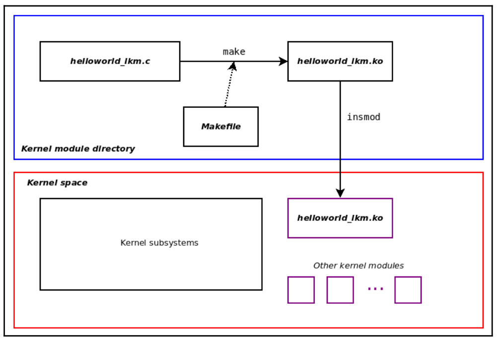
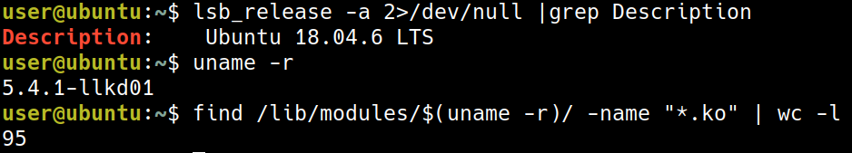
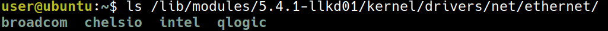
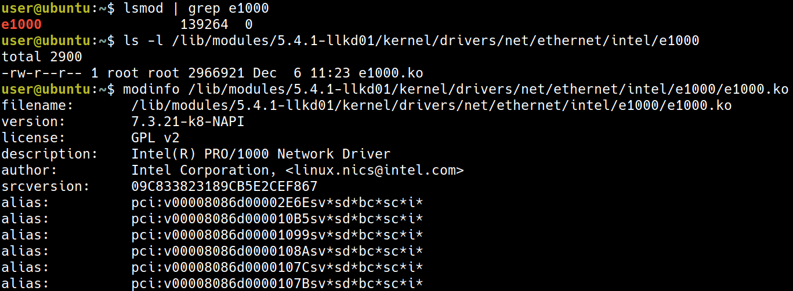
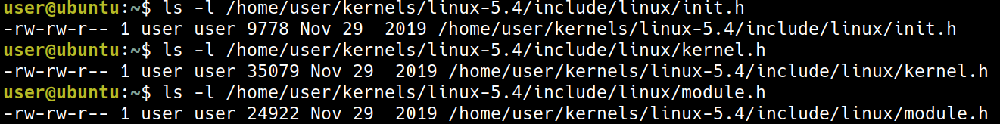
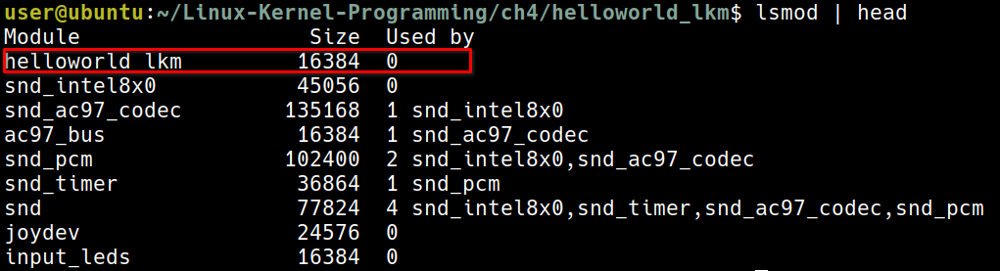

+++
date = '2025-12-08T08:39:49+08:00'
draft = false
title = 'Ch04: Writing Your First Kernel Module - LKMs Part 1'
weight = 4
+++
# Understanding kernel architecture – part 1
# Exploring LKMs
## The LKM framework


## Kernel modules within the kernel source tree
* kernel modules 存放於 `/lib/modules/$(uname -r)/`

以我的例子來說，正在運行 95 個 modules，可以發現跟書上的範例 5359 差很多，我的推測是我使用的是 server 版，書上使用的是 desktop 版。

其中一個大量使用 modules 這種方式的是 device driver，例如可以看 `kernel/drivers/net/ethernet`
* 原先 Ubuntu 18.04 的 netword drivers:

* 我自己編譯的 `5.4.1-llkd01` 的 device drivers:

明顯少了許多，這是因為當初在 build 時，是使用 `lsmod` 抓取正在運行中的 module，並不像 ubuntu 需要考慮各種可能的情境

* 其中的個有名的 driver 是 Intel 1GbE Network Interface Card (NIC)
```sh
lsmod | grep e1000
```


* 使用 `modinfo` 可以獲取更多的資訊
```sh
ls -l /lib/modules/5.4.1-llkd01/kernel/drivers/net/ethernet/intel/e1000
```
```sh
modinfo /lib/modules/5.4.1-llkd01/kernel/drivers/net/ethernet/intel/e1000/e1000.ko
```


# Writing our very first kernel module
這節開始很俗氣的來寫 Hello World
怕打錯字的話，可以用連結
[https://github.com/PacktPublishing/Linux-Kernel-Programming](https://github.com/PacktPublishing/Linux-Kernel-Programming)
## Introducing our Hello, world LKM C code
```c
/*
 * ch4/helloworld_lkm/helloworld_lkm.c
 ***************************************************************
 * This program is part of the source code released for the book
 *  "Linux Kernel Programming"
 *  (c) Author: Kaiwan N Billimoria
 *  Publisher:  Packt
 *  GitHub repository:
 *  https://github.com/PacktPublishing/Linux-Kernel-Programming
 *
 * From: Ch 4: Writing your First Kernel Module - LKMs Part 1
 ****************************************************************
 * Brief Description:
 * Our very first kernel module, the 'Hello, world' of course! The
 * idea being to explain the essentials of the Linux kernel's LKM
 * framework.
 *
 * For details, please refer the book, Ch 4.
 */
#include <linux/init.h>
#include <linux/kernel.h>
#include <linux/module.h>

MODULE_AUTHOR("<insert your name here>");
MODULE_DESCRIPTION("LKP book:ch4/helloworld_lkm: hello, world, our first LKM");
MODULE_LICENSE("Dual MIT/GPL");
MODULE_VERSION("0.1");

static int __init helloworld_lkm_init(void)
{
	printk(KERN_INFO "Hello, world\n");
	return 0;		/* success */
}

static void __exit helloworld_lkm_exit(void)
{
	printk(KERN_INFO "Goodbye, world\n");
}

module_init(helloworld_lkm_init);
module_exit(helloworld_lkm_exit);
```

```sh
cd ~/Linux-Kernel-Programming/ch4/helloworld_lkm
../../lkm helloworld_lkm
```


## Breaking it down
### Kernel headers
```c
#include <linux/init.h>
#include <linux/kernel.h>
#include <linux/module.h>
```
這三個 include，實際上是 include `/lib/modules/$(uname -r)/build/include/` 中的檔案


* 實際上也就是這三個檔案



* include `/lib/modules/5.4.1-llkd01/build/include` 這裡的檔案
* 也是 `/home/user/kernels/linux-5.4/include` 的意思
### Module macros
這四個 macro 也都蠻直觀的
* `MODULE_AUTHOR()`
* `MODULE_DESCRIPTION()`
* `MODULE_LICENSE()`
* `MODULE_VERSION()`

### Entry and exit points
* 並不像是寫 application 時會使用 `main()`，module 則是使用這兩個 macro 來指定 entry and exit points

```c
module_init(helloworld_lkm_init);
module_exit(helloworld_lkm_exit);
```

可以想成有點像是 C++ 中的 constructor/destructor

### Return values
```c
static int __init <modulename>_init(void);
static void __exit <modulename>_exit(void);
```

注意這裡的 `__init()` 跟 `__exit()` 長成這個樣子，在技術上來說並不是必須的，不過這是一個好的 naming practice
#### The 0/-E return conventio
* 如果成功，回傳 0
* 失敗則回傳 `errno`
* `include/uapi/asm-generic/errno-base.h` 與 `include/uapi/asm-generic/errno.h` 定義了一些 `errono`

例如可能像是下面這種使用方式，像是 `ENOMEM` 就定義在 `include/uapi/asm-generic/errno.h` 中
```c
[...]
ptr = kmalloc(87, GFP_KERNEL);
if (!ptr) {
pr_warning("%s:%s:%d: kmalloc failed!\n", __FILE__, __func__,
__LINE__);
return -ENOMEM;

}
[...]
return 0; /* success */
```

* 如果 `CONFIG_MODULE_FORCE_UNLOAD` 設為 disable，則 `module_exit()` 有可能可以放入一些無法 unload 的程式碼（當然這是不理想的情況）
#### The `ERR_PTR` and `PTR_ERR` macros
這裡主要要解決的問題是如果我希望這個 function 要回傳像是 address，這樣可能會把 address 誤認為錯誤碼，所以需要一些macro 來處理及判斷。
```c
struct mystruct * myfunc(void)
{
    struct mystruct *mys = NULL;
    // 嘗試分配記憶體
    mys = kzalloc(sizeof(struct mystruct), GFP_KERNEL);
    
    // 檢查記憶體分配是否失敗
    if (!mys)
        // 失敗時，返回一個偽裝成指標的錯誤碼：-ENOMEM
        return ERR_PTR(-ENOMEM); 
    
    [...]
    // 成功時，返回實際的結構體指標
    return mys;
}
```

```c
[...]
gmys = myfunc(); // 接收返回值，它可能是指標或錯誤碼

// 檢查返回的「指標」是否是一個錯誤碼
if (IS_ERR(gmys)) {
    pr_warn("%s: myfunc alloc failed, aborting...\n", OURMODNAME);
    
    // 將偽裝的錯誤碼指標還原為原始的整數錯誤碼
    stat = PTR_ERR(gmys); /* sets 'stat' to the value -ENOMEM */
    
    goto out_fail_1;
}

// 程式碼繼續執行 (如果 gmys 是有效指標)
[...]
return stat;

out_fail_1:
return stat;
}
```

#### The `__init` and `__exit` keywords
* `__init`: 代表這個 function 只會使用一次，使用之後就可以利用 `free_initmem()` 刪除掉
* `__exit`: 在這個 function 結束之後，all the memory is freed

# Common operations on kernel modules
這裡要開始說明如何 build, load, unload kernel modules
## Building the kernel module
* 先 clone 這個 repo [https://github.com/PacktPublishing/Linux-Kernel-Programming](https://github.com/PacktPublishing/Linux-Kernel-Programming)

```sh
cd ~/Linux-Kernel-Programming/ch4/helloworld_lkm
```

```sh
make
```


出現了一個 `helloworld_lkm.ko`

## Running the kernel module
為了要啟用這個 kernle module, 我們需要把 `helloworld_lkm.ko` 載入到記憶體，有數種方式，像是 `init_module` system call，或是這本書使用的工具 `insmod`

```sh
sudo insmod ./helloworld_lkm.ko
```


現在成功載入這個 module 了

可能會讓 `init_module` 失敗的原因有幾個：
* 權限不足
* `/proc/sys/kernel/modules_disabled`, is set to 1 (it defaults to 0).
* 撞到相同的名子

## A quick first look at the kernel `printk()`
跟 `printf()` 的用法很像，但是 `printf()` 會直接 print 到螢幕上，`printk()` 可能輸出到
* A kernel log buffer in RAM (volatile)
* A log file, the kernel log file (non-volatile)
* The console device

使用 `dmesg` 可以看到 `printk()` 印出的東西


## Listing the live kernel modules
現在我們的 `helloworld_lkm.ko` 在輸出訊息之後，就不做任何事情了，它現在就單純的存在於 kernel memory and do nothing

使用 `lsmod` 可以看到現在還存在哪些 module

## Unloading the module from kernel memory
使用 `rmmod` 可以移除 module
```sh
sudo rmmod helloworld_lkm
```

`rmmod` 失敗的情境如下
* Permissions
* 如果要刪除的 module 是其他 module 的 dependency
* 沒有 destructor `module_exit()` and `CONFIG_MODULE_FORCE_UNLOAD` is disable
## Our lkm convenience script

可以使用 `lkm` 這個腳本做 insert, 記得要用 `rmmod` 把 module 刪掉

# Understanding kernel logging and printk
再複習一次 `printk()` 可能輸出的地方有：
* A kernel log buffer (in RAM; volatile)
* A kernel log file (non-volatile)
* The console device
## Using the kernel memory ring buffer
* 存放於 kernel address space，也就是在 RAM 中，所以例如電腦突然關機，我們就會失去可以用來 debug 的資料
* log buffer 大約只有 256 KB，並且是一個 ring buffer 所以有可能舊的資料會被洗掉
## Kernel logging and systemd's journalctl
為了解決 ring buffer 的問題，我們可以把資料寫到一個 file 中
* Red-Hat based: `/var/log/messages`
* Debian based: `/var/log/syslog`
* 較舊的版本可使用 system logger daemon (`syslogd`)
* 比較新的版本使用 `systemd` 並且在 `systemd` 的框架下，使搭配 `systemd-journal`, `journalctl`

```sh
journalctl -k | tail -n2
```


## Using printk log levels
在 `helloworld_lkm` 的例子中，
```sh
printk(KERN_INFO "Hello, world\n");
```
這裡的 `KERN_INFO` 表示了 log level，但是要注意這並不是一個 parameter，他並沒有用逗號隔開
在 `include/linux/kern_levels.h` 中可以看到這些 log level 的定義


要注意這裡的 log level 並不是 priority 的概念，而是單純的作為一種 filtering 的功能

* 以 `hangcheck-timer` 作為例子
* `hangcheck-timer` 可以當成 watch dog 的功能
* 在 `drivers/char/hangcheck-timer.c`: 像是這裡，使用了 `KERN_CRIT` 的 log level

* `printk` 的 default level 是 4 也就是 `KERN_WARNING`

### The `pr_<foo>` convenience macros
如果每次都要用
```c
printk(KERN_INFO "Hello, world\n");
```
會很麻煩，所以使用這時候就可以用 `pr_info()` 這個 macro, 同理這個系列有
* `include/linux/printk.h`
```c
#ifndef pr_fmt
#define pr_fmt(fmt) fmt
#endif

/*
 * These can be used to print at the various log levels.
 * All of these will print unconditionally, although note that pr_debug()
 * and other debug macros are compiled out unless either DEBUG is defined
 * or CONFIG_DYNAMIC_DEBUG is set.
 */
#define pr_emerg(fmt, ...) \
    printk(KERN_EMERG pr_fmt(fmt), ##__VA_ARGS__)
#define pr_alert(fmt, ...) \
    printk(KERN_ALERT pr_fmt(fmt), ##__VA_ARGS__)
#define pr_crit(fmt, ...) \
    printk(KERN_CRIT pr_fmt(fmt), ##__VA_ARGS__)
#define pr_err(fmt, ...) \
    printk(KERN_ERR pr_fmt(fmt), ##__VA_ARGS__)
#define pr_warning(fmt, ...) \
    printk(KERN_WARNING pr_fmt(fmt), ##__VA_ARGS__)
#define pr_warn pr_warning
#define pr_notice(fmt, ...) \
    printk(KERN_NOTICE pr_fmt(fmt), ##__VA_ARGS__)
#define pr_info(fmt, ...) \
    printk(KERN_INFO pr_fmt(fmt), ##__VA_ARGS__)
/*
 * Like KERN_CONT, pr_cont() should only be used when continuing
 * a line with no newline ('\n') enclosed. Otherwise it defaults
 * back to KERN_DEFAULT.
 */
#define pr_cont(fmt, ...) \
    printk(KERN_CONT fmt, ##__VA_ARGS__)

/* pr_devel() should produce zero code unless DEBUG is defined */
#ifdef DEBUG
#define pr_devel(fmt, ...) \
    printk(KERN_DEBUG pr_fmt(fmt), ##__VA_ARGS__)
#else
#define pr_devel(fmt, ...) \
    no_printk(KERN_DEBUG pr_fmt(fmt), ##__VA_ARGS__)
#endif
```
可以做使用

### Wiring to the console
再再次的回想一下，`printk()` 可以 output 的範圍有：

* The first being the kernel memory log buffer (always)
* The second being non-volatile log files
* The last one (that we'll address here): the console device

```sh
(base) turtlegod@thinkpad:~$ cat /proc/sys/kernel/printk
4       4       1       7
```
這四個數字分別代表
- The current (console) log level
    - The implication being that all messages less than this value will appear on
- the console device!
- The default level for messages that lack an explicit log level
- The minimum allowed log level
- The boot-time default log level

* all printk instances lower than log level 4 will appear on the console device

### Writing output to the Raspberry Pi console
這裡需要一條 USB to TTL 的線才可以繼續做實驗
### Enabling the `pr_debug()` kernel messages

## Rate limiting the printk instances
## Generating kernel messages from the user space
## Standardizing printk output via the `pr_fmt` macro
## Portability and the printk format specifiers

# Understanding the basics of a kernel module Makefile

```make
# ch4/printk_loglvl/Makefile
PWD          := $(shell pwd)
obj-m        += printk_loglvl.o

# Enable the pr_debug() and pr_devel() as well by removing the comment from
# one of the lines below
#EXTRA_CFLAGS += -DDEBUG
#CFLAGS_printk_loglvl.o := -DDEBUG

all:
    make -C /lib/modules/$(shell uname -r)/build/ M=$(PWD) modules
install:
    make -C /lib/modules/$(shell uname -r)/build/ M=$(PWD) modules_install
clean:
    make -C /lib/modules/$(shell uname -r)/build/ M=$(PWD) clean
```
可以注意到這裡並沒有使用 `gcc` 而是在這裡面用了 `make`

```Makefile
target: [dependent-source-file(s)]
    rule(s)
```
