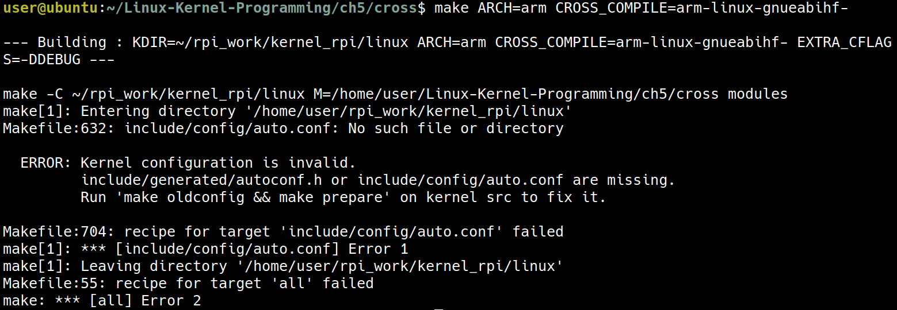
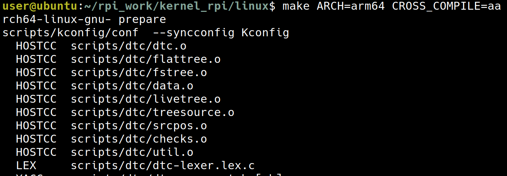
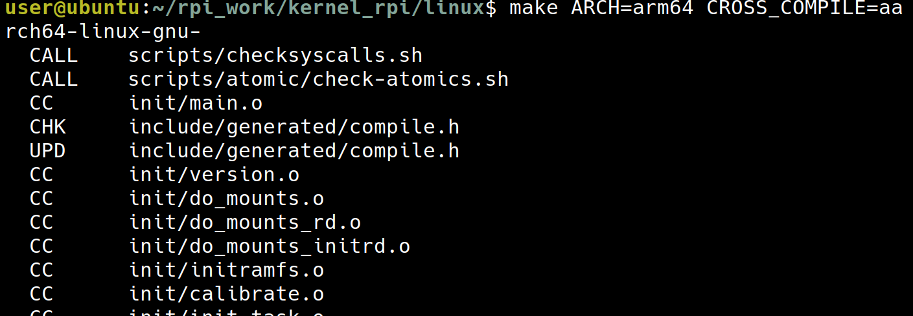
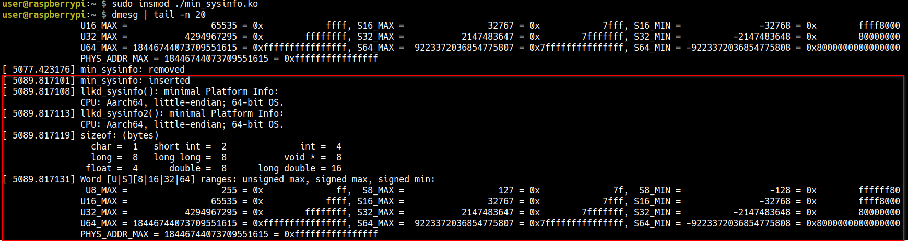
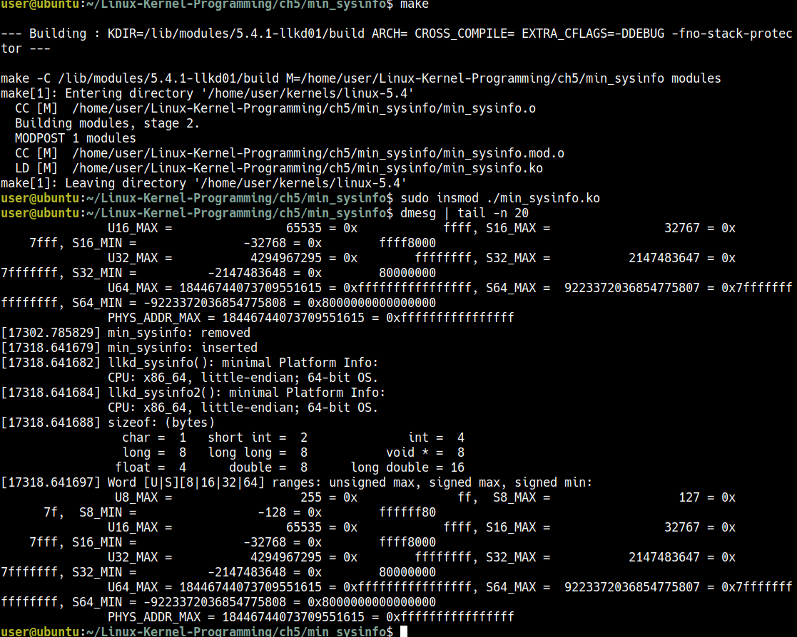
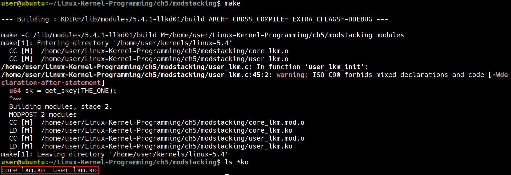
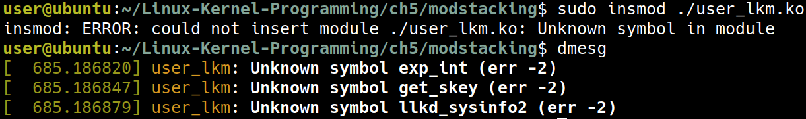
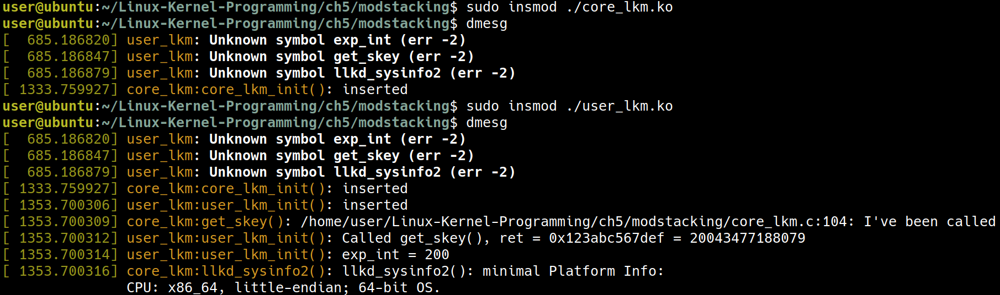

+++
date = '2025-12-25T10:07:49+08:00'
draft = false
title = 'Ch05: Writing Your First Kernel Module - LKMs Part 2'
weight = 5
+++

# Cross-compiling a kernel module
在 ch4 時，我們 compile 了一個 kernel module, 這次則是要 cross-compile 一個 kernel module

## Attempt 1 – setting the "special" environment variables
先試著設定 `ARCH` 與 `CROSS_COMPILE`
```sh
cd ~/Linux-Kernel-Programming/ch5/cross
```

```sh
make ARCH=arm CROSS_COMPILE=arm-linux-gnueabihf-
```



但這個嘗試失敗了，這是因為在這個例子中，是因為 `Makefile` 會去找目前這台電腦的 Kernel source，因此要來對 `Makefile` 做下列的修改

```makefile
ifeq ($(ARCH),arm)
  # *UPDATE* 'KDIR' below to point to the ARM Linux kernel source tree on your box
  KDIR ?= /home/user/rpi_work/kernel_rpi/linux
else ifeq ($(ARCH),arm64)
  # *UPDATE* 'KDIR' below to point to the ARM64 (Aarch64) Linux kernel source
  # tree on your box
  KDIR ?= /home/user/rpi_work/kernel_rpi/linux
else ifeq ($(ARCH),powerpc)
  # *UPDATE* 'KDIR' below to point to the PPC64 Linux kernel source tree on your box
  KDIR ?= ~/kernel/linux-4.9.1
else
  # 'KDIR' is the Linux 'kernel headers' package on your host system; this is
  # usually an x86_64, but could be anything, really (f.e. building directly
  # on a Raspberry Pi implies that it's the host)
  KDIR ?= /lib/modules/$(shell uname -r)/build
endif
```

這裡主要是把 kernel source 的路徑改為正確的 `/home/user/rpi_work/kernel_rpi/linux`

## Attempt 2 – pointing the Makefile to the correct kernel source tree for the target

修正路徑之後，再一次嘗試 cross compile

```sh
make ARCH=arm CROSS_COMPILE=arm-linux-gnueabihf-
```


這是因為現在的 `rpi_work/kernel_rpi` 還是一個 "virgin" state, 它還沒有獲得一個 `.config` 的設定檔

```sh
cd ~/rpi_work/kernel_rpi/linux
```

* 書上用的是 `bcmrpi_defconfig` 但我用的是 64-bit 的 raspberry pi 4 所以要用 `bcm2711_defconfig`
```sh
make ARCH=arm64 bcm2711_defconfig
```


```sh
make ARCH=arm64 CROSS_COMPILE=aarch64-linux-gnu- oldconfig
```


到了這裡，已經產生出一個 `.config` 了

```sh
make ARCH=arm64 CROSS_COMPILE=aarch64-linux-gnu- prepare
```


```sh
make ARCH=arm64 CROSS_COMPILE=aarch64-linux-gnu- 
```

(這個會跑一陣子)
這個指令會產生出以下的檔案
* `arch/arm64/boot/Image`: 未壓縮的 Kernel Image
* `arch/arm64/boot/dts/broadcom/*.dtb`: Device Tree Blobs
* `arch/arm64/boot/dts/overlays/*.dtbo`: Device Tree Overlays

這裡的流程跟 ch03 在 corss compile pi 的 kernel 時有一點類似

## Attempt 3 – cross-compiling our kernel module
現在 kernel 已經 build 好了，現在就可以再重新的 build 一次
```sh
cd /home/user/Linux-Kernel-Programming/ch5/cross
make ARCH=arm64 CROSS_COMPILE=aarch64-linux-gnu-
```

現在 `make` 時，就會搭配上個步驟產生出的 `.config` 以及上個步驟 `make` 出來的東西產生出我們需要的 `.ko` file


現在這個 `./helloworld_lkm.ko` 出現了！

接著把檔案複製到 pi 中
```sh
scp ./helloworld_lkm.ko user@192.168.100.104:/home/user
```

```sh
sudo insmod ./helloworld_lkm.ko
```


這是因為目前 pi 上跑的 kernel version 跟這個 moduel 所對應的 kernel version 不一樣
```sh
cat /proc/version
modinfo ./helloworld_lkm.ko
```


這讓我們學到了 module 只被允許被 insert 到它所對應的 kernel 版本，在這裡來回想一下 module 的 kernel version 跟我們現在 pi 上的 kernel version 是怎麼來的

1. module 的 kernel version:
    1. `Makefile` 中指定 kernel source 路徑為 `~/rpi_work/kernel_rpi/linux`
    1. 在 `~/rpi_work/kernel_rpi/linux` 裡我們針對這個 kernel version 做 config 以及 compile
    1. 回到 `/home/user/Linux-Kernel-Programming/ch5/cross` 來 `make` 出 `.ko` 時，它所搭配的 kernel version 就被前兩個步驟決定好了
1. pi 上的 kernel version
    * 這是單純使用 imager 工具所提供的 Pi OS 版本

## Attempt 4 – cross-compiling our kernel module
為了解決 Attempt 3 所留下的問題，有兩種解決方式，要麼 module 去搭配現在 pi 上運行的 kernel version，要麼 kernel 去搭配現在要使用的 module 的版本，以現在的環境來說，後者比較方便一些

這裡基本上只需要用 ch03 的方式去更改 pi 中的 kernel version 就可以了

```sh
cat /proc/version
modinfo ./helloworld_lkm.ko
sudo insmod ./helloworld_lkm.ko
dmesg | tail -n 5
sudo rmmod helloworld_lkm 2>/dev/null
dmesg | tail -n 5
```

到了這裡，我們已經可以 cross compile 一個 module 到手上的 pi 上了!

# Gathering minimal system information
這裡要開始蒐集一些系統上的資訊並且作為 log 輸出，書上提供範例 `ch5/min_sysinfo`
```sh
cd ch5/min_sysinfo
make ARCH=arm64 CROSS_COMPILE=aarch64-linux-gnu-
```

這裡我遇到了這個問題
```sh
user@raspberrypi:~ $ sudo insmod ./min_sysinfo.ko
insmod: ERROR: could not insert module ./min_sysinfo.ko: Unknown symbol in module
```
解決方式為在 `Makefile` 中加入
```makefile
EXTRA_CFLAGS   += -DDEBUG -fno-stack-protector
```

產生出 `min_sysinfo.ko` 之後，複製到 pi 上，並且在 pi 上
```sh
sudo insmod ./min_sysinfo.ko
dmesg
```


除了用 cross compile 的方式跑在 arm64 上，這個 `min_sysinfo.c` 也可以為了 x86 編譯


這個範例主要顯現了同一個 `.c` file 可以經由編譯程序上的調整達到 portability

## Being a bit more security-aware

# Emulating "library-like" features for kernel modules
實際上不是 Library，但是有一些技巧可以做到 Library-like 的事情，有以下這兩種方式可以做到類似於 library-like 的功能
1. including the "library" code to your kernel module object
1. module stacking

通常第二個方式會比較好一些
## Performing library emulation via multiple source files
到了目前為止的範例，我們都只有用一個 `.c` file，但是在現實的環境當中，經常是使用多個 C source file 所 compile 出一個 `.ko` binary object

例如現在有一個 kernel module project 叫做 `projx`，並且是透過三個檔案 `prj1.c`, `prj2.c`, `prj3.c` 所組成，這種時候，會在 `Makefile` 中這樣寫:
```makefile
obj-m := projx.o
projx-objs := prj1.o prj2.o prj3.o
```
這可以利用 `projx` 這個 prefix 讓 `prj1.o prj2.o prj3.o` link 成 `projx.o`
## Understanding function and variable scope in a kernel module
在 2.6 Linux 之前，static and global variable 是可以被整個 kernel 看到的，現在則限縮在一個 module 中，但也可以利用 `EXPORT_SYMBOL()` 讓它變成舊有的方式
```c
static int my_glob = 5;
static long my_foo(int key)
{ [...]
}
```
像是上面這個就只有自己本身的 kernel module 可以看到

如果希望它可以被整個 kernel 看到的話可以使用：
```c
int my_glob = 5;
EXPORT_SYMBOL(my_glob);
long my_foo(int key)
{ [...]
}
EXPORT_SYMBOL(my_foo);
```
注意到這裡使用 `EXPORT_SYMBOL()` 的話，甚至連 `static` 都不用使用
利用這個特點，我們可以在某個 module 中提供一些 `EXPORT_SYMBOL()` 的 function or variable 讓其他 subsystem 或是 module 可以使用

例如 device driver 需要處理 hardware interrupt 時，會需要使用 `request_threaded_irq()`
```c
int request_threaded_irq(unsigned int irq, irq_handler_t handler,
			 irq_handler_t thread_fn, unsigned long irqflags,
			 const char *devname, void *dev_id)
{
    // [...]
}
EXPORT_SYMBOL(request_threaded_irq);

```
也或使像是一些 helper function，例如 `ilb/string.c`

* `kernel/sched/fair.c`: 像是這個 scheduler 則沒有使用 `EXPORT_SYMBOL()` 開放給其他 module or subsystem 使用
```c
static struct task_struct *
pick_next_task_fair(struct rq *rq, struct task_struct *prev, struct rq_flags *rf)
{
	struct cfs_rq *cfs_rq = &rq->cfs;
	struct sched_entity *se;
	struct task_struct *p;
	int new_tasks;
    // [...]
}
```
使用
```sh
make export_report
```
可以列出所有被 `EXPORT_SYMBOL()` 的 symbol
## Understanding module stacking
```sh
(base) turtlegod@thinkpad:~$ lsmod | grep vbox
vboxnetadp             28672  0
vboxnetflt             28672  0
vboxdrv               606208  2 vboxnetadp,vboxnetflt
```
以這個例子為例，第三個 column 是 usage count，像是 `vboxdrv` 要解讀為
> the kernel modules displayed on the right depend on the kernel module on the left

所以也就是 `vboxnetadp` 有使用到 `vboxdrv` 的 data structure 或是 API，這時候 `vboxdrv` 就有了一種 library-like 的感覺

### Trying out module stacking
這個例子只會使用兩個 module, 就只有單純呈現 module stacking 是可行的:
1. `core_lkm`: 這作為類似於 library 的東西
1. `user_lkm`: 這個 module 會使用一些 `core_lkm` 的功能（透過 `EXPORT_SYMBOL()`）

為了要達到這個任務，我們要做到以下的一些事情：
* core 會需要利用 `EXPORT_SYMBOL` 把一些 data 與 function 給 export 出去
* user 需要還是要利用 `extern` 進行 declaration (definition 在 core, declaration 在 user)
* 在 core 中，不幫那些 exported 的 symbol 加上 `static`
* 修改 `Makefire`

現在先來看這兩個 module 所對應的兩個 `.c` file

* `ch5/modstacking/core_lkm.c`
```c
#define pr_fmt(fmt) "%s:%s(): " fmt, KBUILD_MODNAME, __func__

#include <linux/init.h>
#include <linux/module.h>
#include <linux/kernel.h>

#define MODNAME   "core_lkm"
#define THE_ONE   0xfedface
MODULE_LICENSE("Dual MIT/GPL");

int exp_int = 200;
EXPORT_SYMBOL_GPL(exp_int); // <- 這裡把 exp_int 提供出來

/* Functions to be called from other LKMs */

/* llkd_sysinfo2:
 * A more security-aware version of the earlier llkd_sysinfo() routine. We use
 * David Wheeler's flawfinder(1) tool to detect possible vulnerabilities;
 * Based on it's report, we change the strlen, and replace the strncat with
 * strlcat.
 */
void llkd_sysinfo2(void)
{
#define MSGLEN   128
    char msg[MSGLEN];

    memset(msg, 0, MSGLEN);
    snprintf(msg, 48, "%s(): minimal Platform Info:\nCPU: ", __func__);

    /* Strictly speaking, all this #if... is considered ugly and should be
     * isolated as far as is possible
     */
#ifdef CONFIG_X86
#if (BITS_PER_LONG == 32)
    strlcat(msg, "x86_32, ", MSGLEN);
#else
    strlcat(msg, "x86_64, ", MSGLEN);
#endif
#endif
#ifdef CONFIG_ARM
    strlcat(msg, "ARM-32, ", MSGLEN);
#endif
#ifdef CONFIG_ARM64
    strlcat(msg, "Aarch64, ", MSGLEN);
#endif
#ifdef CONFIG_MIPS
    strlcat(msg, "MIPS, ", MSGLEN);
#endif
#ifdef CONFIG_PPC
    strlcat(msg, "PowerPC, ", MSGLEN);
#endif
#ifdef CONFIG_S390
    strlcat(msg, "IBM S390, ", MSGLEN);
#endif

#ifdef __BIG_ENDIAN
    strlcat(msg, "big-endian; ", MSGLEN);
#else
    strlcat(msg, "little-endian; ", MSGLEN);
#endif

#if (BITS_PER_LONG == 32)
    strlcat(msg, "32-bit OS.\n", MSGLEN);
#elif(BITS_PER_LONG == 64)
    strlcat(msg, "64-bit OS.\n", MSGLEN);
#endif
    pr_info("%s", msg);

}
EXPORT_SYMBOL(llkd_sysinfo2); // <- 這裡把 llkd_sysinfo2() 提供出來

#if (BITS_PER_LONG == 32)
u32 get_skey(int p)
#else               // 64-bit
u64 get_skey(int p)
#endif
{
#if (BITS_PER_LONG == 32)
    u32 secret = 0x567def;
#else               // 64-bit
    u64 secret = 0x123abc567def;
#endif
    pr_info("%s:%d: I've been called\n", __FILE__, __LINE__);
    if (p == THE_ONE)
        return secret;
    return 0;

}
EXPORT_SYMBOL(get_skey); // <- 這裡把 get_skey() 提供出來

static int __init core_lkm_init(void)
{
    pr_info("inserted\n");
    return 0;   /* success */
}

static void __exit core_lkm_exit(void)
{
    pr_info("bids you adieu\n");
}

module_init(core_lkm_init);
module_exit(core_lkm_exit);
```

* `ch5/modstacking/user_lkm.c`
```c
#define pr_fmt(fmt) "%s:%s(): " fmt, KBUILD_MODNAME, __func__

#include <linux/init.h>
#include <linux/module.h>
#include <linux/kernel.h>

#define MODNAME     "user_lkm"
#if 1
MODULE_LICENSE("Dual MIT/GPL");
#else
MODULE_LICENSE("MIT");
#endif

extern void llkd_sysinfo2(void);
extern long get_skey(int);
extern int exp_int;

/* Call some functions within the 'core' module */
static int __init user_lkm_init(void)
{
#define THE_ONE   0xfedface
    pr_info("inserted\n");
    u64 sk = get_skey(THE_ONE);

    pr_debug("Called get_skey(), ret = 0x%llx = %llu\n", sk, sk);
    pr_debug("exp_int = %d\n", exp_int);
    llkd_sysinfo2();

    return 0;

}

static void __exit user_lkm_exit(void)
{
    pr_info("bids you adieu\n");

}

module_init(user_lkm_init);
module_exit(user_lkm_exit);
```
`user_lkm.c` 的重點在於前面還是要用 `extern` 做宣告才可以使用 `core_lkm` 所提供出來的東西
```c
extern void llkd_sysinfo2(void);
extern long get_skey(int);
extern int exp_int;
```

再來看看 `Makefile`
* `ch5/modstacking/Makefile`
則是要多加這兩行
```makefile
obj-m          := core_lkm.o
obj-m          += user_lkm.o
```

#### 1. 首先使用 `make` 編譯
```sh
cd ~/Linux-Kernel-Programming/ch5/modstacking
make
ls *ko
```

現在出現了 `core_lkm.ko` 與 `user_lkm.ko`

#### 2. 直接先 insert `user_lkm` (會發生錯誤)
```sh
sudo dmesg -C
sudo insmod ./user_lkm.ko
dmesg
```

這是因為在 `user_lkm.c` 中雖然宣告了 `exp_int`, `get_skey`, `llkd_sysinfo2` 這三個 symbol, 但是定義 symbol 的 `core_lkm` 還沒有載入，所以會出錯


#### 3. 使用正確的順序，先 insert `core_lkm` 再 insert `user_lkm`
```sh
sudo insmod ./core_lkm.ko
dmesg
```

```sh
sudo insmod ./user_lkm.ko
dmesg
```

先載入 `core_lkm` 之後在載入 `user_lkm`，就可以成功把這兩個都載入進去了！

#### 4. 運行成功了! 使用 `lsmod` 來確認運行狀態
```sh
lsmod | egrep "core_lkm|user_lkm"
```

現在可以看到 `core` 被 `user` 依賴

#### 5. 來看看直接刪除掉 `core_lkm` 會發生什麼事情
```sh
sudo rmmod core_lkm
```

因為 `core` 被 `user` 依賴，所以沒辦法刪除掉
#### 6. 使用正確的方式把這兩個 module 刪除掉
```sh
sudo rmmod user_lkm core_lkm
```


# Passing parameters to a kernel module
到了目前為止的例子，都還沒有使用 parameter，試想我們想要做一個 log level 的功能，類似下面這種
```c
static int debug_level; /* will be init to zero */
func_x() {
    if (debug_level >= 1)
        pr_debug("At 1\n");
    [...]
        while (<cond>) {
            if (debug_level >= 2)
                pr_debug("At 2: j=0x%x\n", j);
            [...]

        }
    [...]
}
```
而這裡的 `debug_level` 要如何用 parameter 的方式傳入？這是這節接下來要說明的事情。
## Declaring and using module parameters
想要傳入 parameter 的時候，可以用這樣的方式：
```sh
sudo insmod modparams1.ko mp_debug_level=2
```
> 這裡的 `mp_` 代表 module prefix，這是一個命名上的建議

Q: 命令上的方法了解了，但下一個問題是他並沒有 `main(int argc, char **argv)` 可以接收參數，那麼在程式中，又要如何接收命令上傳入的參數？

A: 使用 macro `module_param()`

例如 `~/Linux-Kernel-Programming/ch5/modparams/modparams1/modparams1.c`:
```c
#include <linux/init.h>
#include <linux/module.h>
#include <linux/kernel.h>

#define OUR_MODNAME    "modparams1"
MODULE_AUTHOR("Kaiwan N Billimoria");
MODULE_DESCRIPTION("LKP book:ch5/modparams/modparams1: module parameters demo LKM #1");
MODULE_LICENSE("Dual MIT/GPL");
MODULE_VERSION("0.1");

/* Module parameters */
static int mp_debug_level;
module_param(mp_debug_level, int, 0660);
MODULE_PARM_DESC(mp_debug_level,
"Debug level [0-2]; 0 => no debug messages, 2 => high verbosity");

static char *mp_strparam = "My string param";
module_param(mp_strparam, charp, 0660);
MODULE_PARM_DESC(mp_strparam, "A demo string parameter");

static int __init modparams1_init(void)
{
    pr_info("%s: inserted\n", OUR_MODNAME);
    pr_info("module parameters passed: mp_debug_level=%d mp_strparam=%s\n",
        mp_debug_level, mp_strparam);
    return 0;       /* success */

}

static void __exit modparams1_exit(void)
{
    pr_info("module parameters passed: mp_debug_level=%d mp_strparam=%s\n",
        mp_debug_level, mp_strparam);
    pr_info("%s: removed\n", OUR_MODNAME);

}

module_init(modparams1_init);
module_exit(modparams1_exit);
```

像是這裡的
```c
module_param(mp_debug_level, int, 0660);
module_param(mp_strparam, charp, 0660);
```
這個 macro 有三個參數
1. parameter 的名稱，應該要是 `static` 的 symbol
1. data type
1. 最後的 `0660` 是權限，格式跟檔案權限的寫法一樣

`MODULE_PARM_DESC()` 用來


## Getting/setting module parameters after insertion
## Module parameter data types and validation
### Validating kernel module parameters
### Overriding the module parameter's name
### Hardware-related kernel parameters

# Floating point not allowed in the kernel
# Auto-loading modules on system boot
# Kernel modules and security – an overview
# Coding style guidelines for kernel developers
