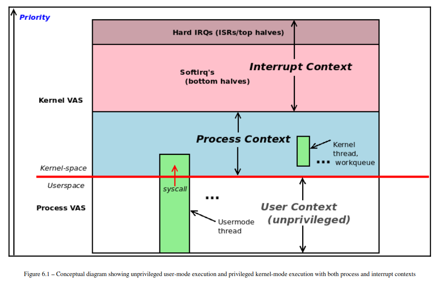
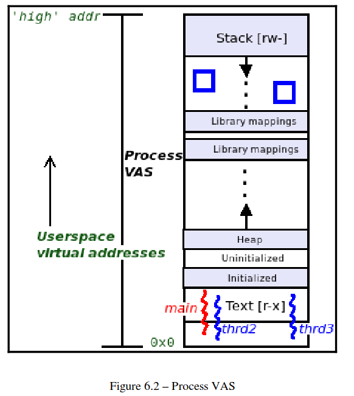
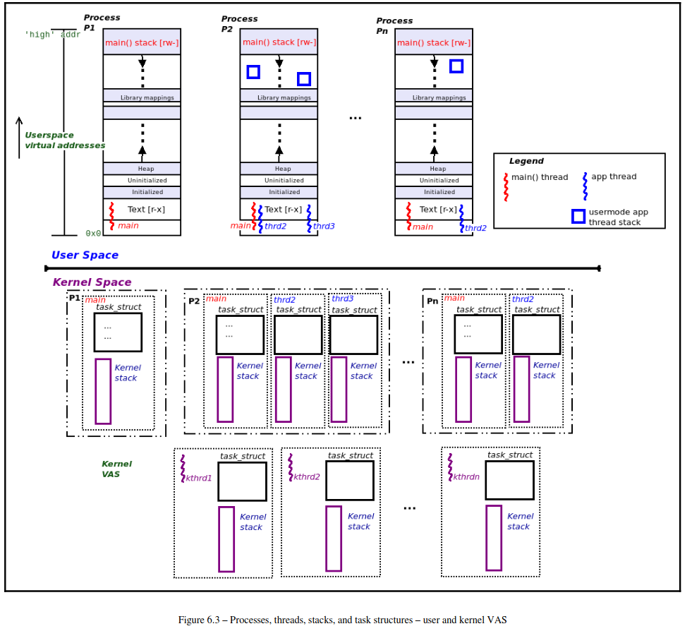
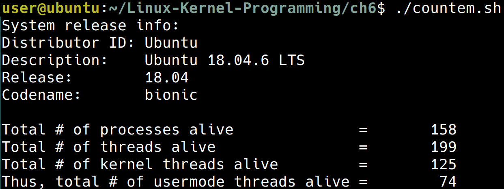

+++
date = '2026-03-07T14:59:44+08:00'
draft = false
title = 'Ch06: Kernel Internals Essentials - Processes and Threads'
weight = 6
+++

# Understanding process and interrupt contexts

各種 context 有以下的分類
* kernel code
    * interrupt context: 可能是來自於 hard ware 的 interrupt
    * process context: 來自於 system call 或是 exception
* user space
    * user context

在接下來的內容中，可以留意現在是在討論這三種 context 的那一個分類裡

# Understanding the basics of the process VAS
大致上一個 process 的 virtual address space 長成下面這個樣子


* **Text segment**: 這是 machine code 存放的地方
* **Data segment**
    * **Initialized data segment**: 已經初始化的變數
    * **Uninitialized data segment**: 還沒有被初始化的變數，有時候會被稱為 *bss*
* **Heap segment**: 被 `malloc()` 或是 `mmap()` 出來的區域會放在這裡
* **Libraries (text, data)**
* **Stack**: 這個區域會對應到 function call 的過程

# Organizing processes, threads, and their stacks – user and kernel space
thread 可以想成是 registers + stack 的組合，其他的資源都是跟 process 共用的
這本書會把重點著重於 thread 因為在最原始的 Unix 理念中

> Everything is a process; if it's not a process, it's a file

這句話雖然在當今也算是正確的，不過

> The thread, not the process, is the kernel schedulable entity

在當今會更加貼切一些

每一個 thread 都會有一個對應的 task structure (也被稱為 process descriptor)

下一個重點為：

> we require one stack per thread per privilege level supported by the CPU

所以可以得到下一個結論

> every user space thread alive has two stacks
* **A user space stack**
* **A kernel space stack**: 進入到 kernel mode 之後才會用這個 stack

但如果是 kernel thread 的話，就只會有一個 kernel thread



整個架構長成這個樣子

```sh
cd ~/Linux-Kernel-Programming/ch6/
```
```sh
./countem.sh
```


