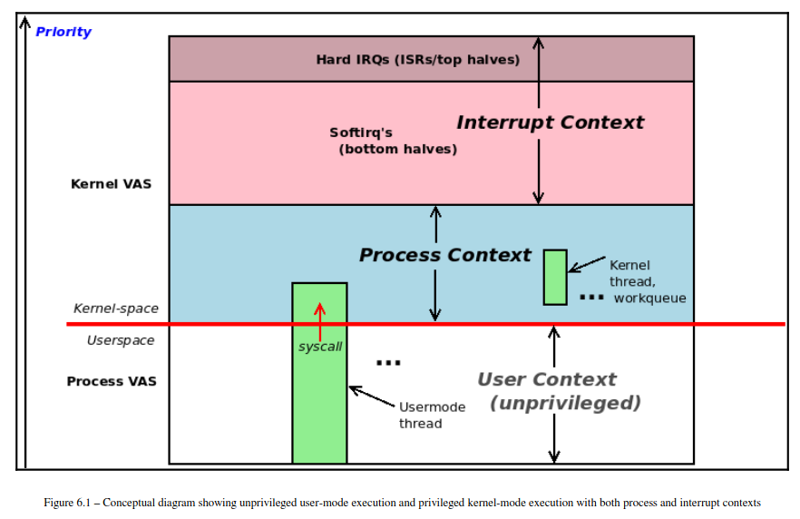
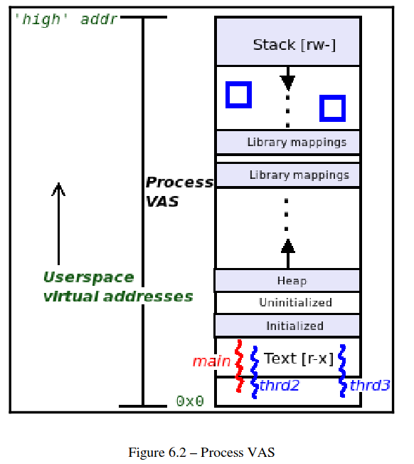
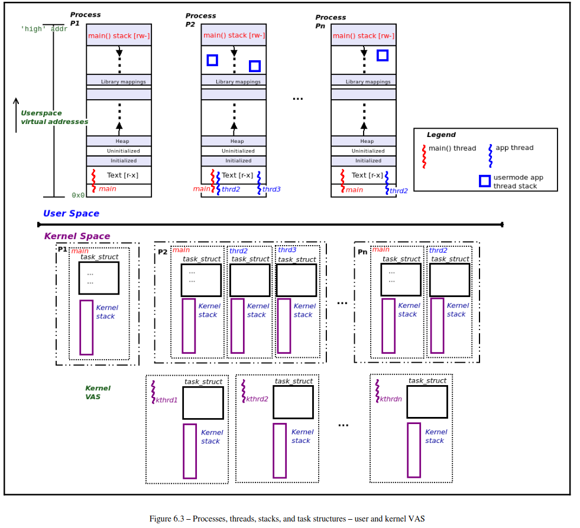
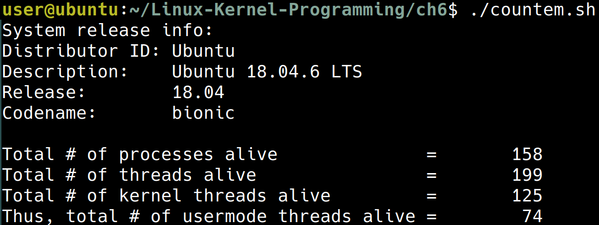
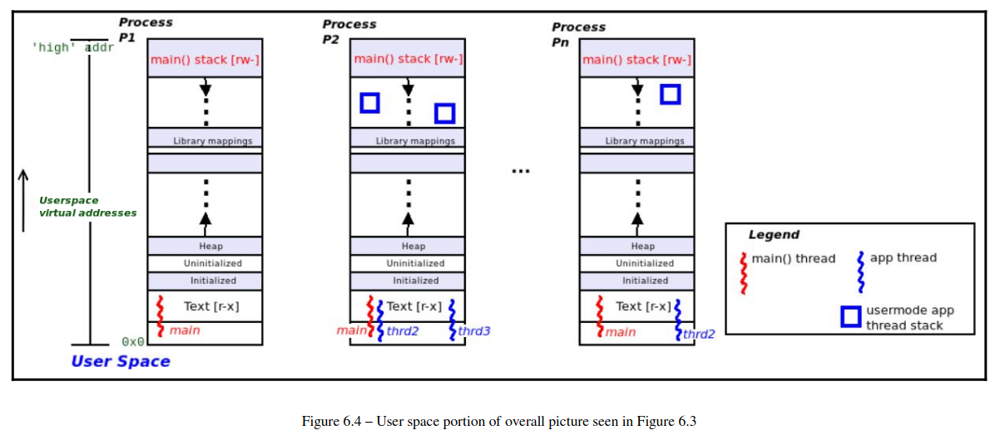
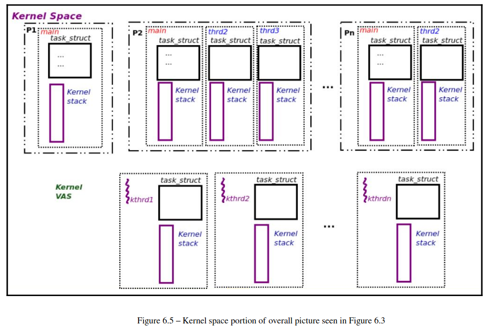
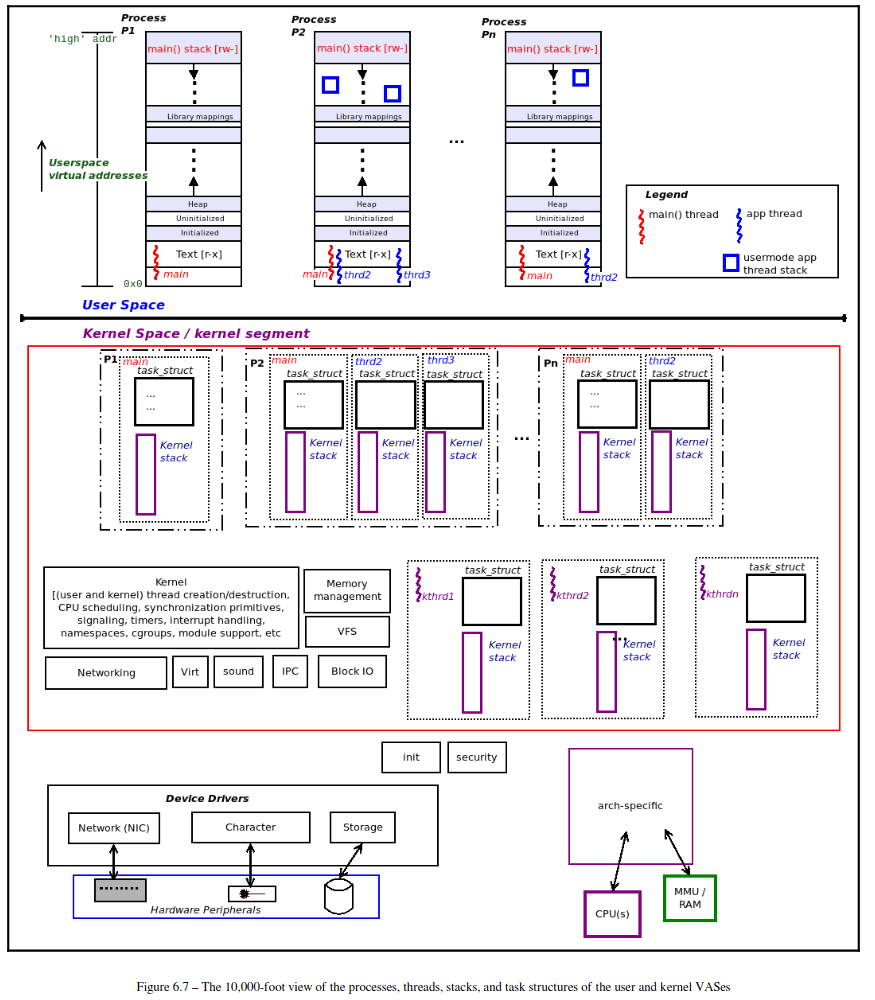
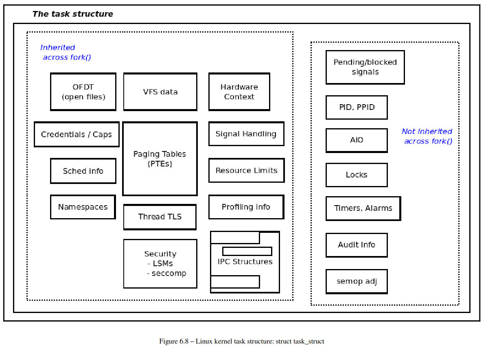
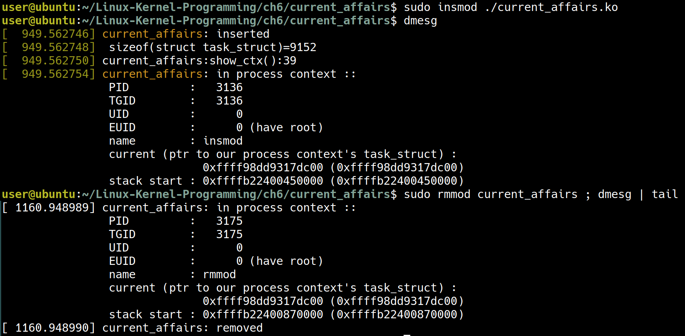
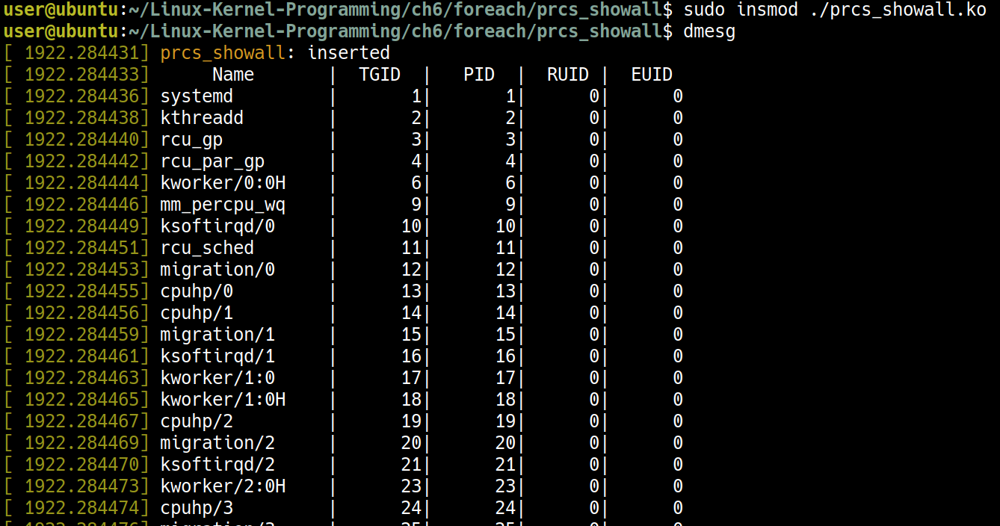

+++
date = '2026-03-07T14:59:44+08:00'
draft = false
title = 'Ch06: Kernel Internals Essentials - Processes and Threads'
weight = 6
+++

# Understanding process and interrupt contexts

各種 context 有以下的分類
* kernel code
    * interrupt context: 可能是來自於 hard ware 的 interrupt
    * process context: 來自於 system call 或是 exception
* user space
    * user context

在接下來的內容中，可以留意現在是在討論這三種 context 的那一個分類裡

# Understanding the basics of the process VAS
大致上一個 process 的 virtual address space 長成下面這個樣子


* **Text segment**: 這是 machine code 存放的地方
* **Data segment**
    * **Initialized data segment**: 已經初始化的變數
    * **Uninitialized data segment**: 還沒有被初始化的變數，有時候會被稱為 *bss*
* **Heap segment**: 被 `malloc()` 或是 `mmap()` 出來的區域會放在這裡
* **Libraries (text, data)**
* **Stack**: 這個區域會對應到 function call 的過程

# Organizing processes, threads, and their stacks – user and kernel space
thread 可以想成是 registers + stack 的組合，其他的資源都是跟 process 共用的
這本書會把重點著重於 thread 因為在最原始的 Unix 理念中

> Everything is a process; if it's not a process, it's a file

這句話雖然在當今也算是正確的，不過

> The thread, not the process, is the kernel schedulable entity

在當今會更加貼切一些

每一個 thread 都會有一個對應的 task structure (也被稱為 process descriptor)

下一個重點為：

> we require one stack per thread per privilege level supported by the CPU

所以可以得到下一個結論

> every user space thread alive has two stacks
* **A user space stack**
* **A kernel space stack**: 進入到 kernel mode 之後才會用這個 stack

但如果是 kernel thread 的話，就只會有一個 kernel thread



整個架構長成這個樣子

```sh
cd ~/Linux-Kernel-Programming/ch6/
```
```sh
./countem.sh
```

從上面的計算可以看到
```text
# of total threads == # of kthread + # of uthread
```

## User space organization

先來看 user space 的部份，每一個 process 都一定會有一個 main thread，並且每一個 process 可以有多個 thread

每一個 process 大致上會有以下的區塊：
* **Text**: code `r-x`
* **Data segments**: `rw-` 這裡包含
    1. itialized data segment
    1. unitialized data segment (or `bss`)
    1. 'upward-growing' heap
* Library mappings
* Downward-growing stack(s)

每一個 user space thread 都會有對應的 user space stack 與 kernel space stack

## Kernel space organization


這裡的 kernel thread 只有一個 kernel-mode stack

### Summarizing the current situation
* Task structures:
    * 每一個 thread (user or kernel) 都有一個相對應的 task struct
* Stacks:
    * 一個 user mode thread 會有兩個 stack
        * 一個 user mode stack
        * 一個 kernel mode stack
    * 一個純粹的 kernel mode thread 就只有一個 kernel mode stack

# Viewing the user and kernel stacks
在 debug 的時候很需要觀察 stack 裡面裝了什麼，因為 stack 中紀錄了當前的 execution context

## Traditional approach to viewing the stacks
### Viewing the kernel space stack of a given thread or process
```sh
(base) user@thinkpad:~$ pgrep bash 
8762
(base) user@thinkpad:~$ sudo cat /proc/8762/stack
[<0>] do_wait+0x171/0x310
[<0>] kernel_wait4+0xaf/0x150
[<0>] __do_sys_wait4+0x89/0xa0
[<0>] __x64_sys_wait4+0x1c/0x30
[<0>] x64_sys_call+0x1c2e/0x1fa0
[<0>] do_syscall_64+0x56/0xb0
[<0>] entry_SYSCALL_64_after_hwframe+0x6c/0xd6
```
或者直接使用
```sh
(base) user@thinkpad:~$ sudo cat /proc/$(pgrep bash)/stack
[<0>] do_wait+0x171/0x310
[<0>] kernel_wait4+0xaf/0x150
[<0>] __do_sys_wait4+0x89/0xa0
[<0>] __x64_sys_wait4+0x1c/0x30
[<0>] x64_sys_call+0x1c2e/0x1fa0
[<0>] do_syscall_64+0x56/0xb0
[<0>] entry_SYSCALL_64_after_hwframe+0x6c/0xd6 # <-- stack bottom
```
要注意這裡的輸出跟 memory 的排列是相反的，以我這裡的例子來說 `entry_SYSCALL_64_after_hwframe` 處在 stack bottom 的位置

這裡的輸出代表 bash 正在執行 `do_wait()` 並且這是透過 system call 呼叫到這裡來的

### Viewing the user space stack of a given thread or process
這裡有點諷刺的是，查看 user space stack 比 kernel space stack 還要困難
```sh
user@thinkpad:~$ sudo gdb -p 8762 -batch -ex "thread apply all bt"
Thread 1 (Thread 0x7f29b6a09740 (LWP 8762) "bash"):
#0  0x00007f29b6af63ea in __GI___wait4 (pid=-1, stat_loc=0x7ffc2376e500, options=10, usage=0x0) at ../sysdeps/unix/sysv/linux/wait4.c:30
#1  0x0000556331e9b135 in ?? ()
#2  0x0000556331dfb6a2 in wait_for ()
#3  0x0000556331de37aa in execute_command_internal ()
#4  0x0000556331de41b8 in execute_command ()
#5  0x0000556331dd53cb in reader_loop ()
#6  0x0000556331dc6c46 in main ()
[Inferior 1 (process 8762) detached]
```

## [e]BPF – the modern approach to viewing both stacks
前面的作法都是比較老一點的作法，現在比較常見的方式是用 eBPF
```sh
sudo stackcount-bpfcc -p 29819 -r ".*malloc.*" -v -d
```

## The 10,000-foot view of the process VAS


# Understanding and accessing the kernel task structure
每一個 thread 都有一個相對應的 task struct，他紀錄的這個 thread 的基本資料

## Looking into the task structure
`task_struct` 實際上定義在 `include/linux/sched.h` 中
```sh
cd $(KSRC)
vim include/linux/sched.h
```
這裡看完 1. 原始碼 2. 書上對於原始碼的註記會對於 `task_struct` 比較有感覺
## Accessing the task structure with current
使用 `current` 這個 macro 可以找到 `task_struct` 的內容，`current` 的實做非常 architecture-specific 

```sh
user@ubuntu:~/kernels/linux-5.4/arch$ find . -name "current.h"
./x86/include/asm/current.h
./xtensa/include/asm/current.h
./nds32/include/asm/current.h
./ia64/include/asm/current.h
./arc/include/asm/current.h
./microblaze/include/asm/current.h
./arm64/include/asm/current.h
./powerpc/include/asm/current.h
./m68k/include/asm/current.h
./riscv/include/asm/current.h
./sparc/include/asm/current.h
./s390/include/asm/current.h
```

例如 arm64 的實做：
```c
/* SPDX-License-Identifier: GPL-2.0 */
#ifndef __ASM_CURRENT_H
#define __ASM_CURRENT_H

#include <linux/compiler.h>

#ifndef __ASSEMBLY__

struct task_struct;

/*
 * We don't use read_sysreg() as we want the compiler to cache the value where
 * possible.
 */
static __always_inline struct task_struct *get_current(void)
{
    unsigned long sp_el0;

    asm ("mrs %0, sp_el0" : "=r" (sp_el0));

    return (struct task_struct *)sp_el0;

}

#define current get_current()

#endif /* __ASSEMBLY__ */

#endif /* __ASM_CURRENT_H */
```

使用方式如下：
```c
#include <linux/sched.h>
current->pid, current->comm
```

## Determining the context
Kernel code 會跑在下面兩種 context

* Process (or task) context
* Interrupt (or atomic) context

```sh
#include <linux/preempt.h>
in_task()
```
`in_task()` 回傳一個 boolean
* return `true`: process context (通常可以在這個情況下 sleep)
* return `false`: interrupt context (不可以在這個情況下 sleep)

 > current is only considered valid when running in process context

# Working with the task structure via current
```sh
cd /home/user/Linux-Kernel-Programming/ch6/current_affairs
vim current_affairs.c
```

```c
/*
 * ch6/current_affairs/current_affairs.c
 ***************************************************************
 * This program is part of the source code released for the book
 *  "Linux Kernel Programming"
 *  (c) Author: Kaiwan N Billimoria
 *  Publisher:  Packt
 *  GitHub repository:
 *  https://github.com/PacktPublishing/Linux-Kernel-Programming
 *
 * From: Ch 6: Kernel and Memory Management Internals -Essentials
 ****************************************************************
 * Brief Description:
 *
 * For details, please refer the book, Ch 6.
 */
#include <linux/init.h>
#include <linux/module.h>
#include <linux/kernel.h>
#include <linux/sched.h>    /* current() */
#include <linux/preempt.h>  /* in_task() */
#include <linux/cred.h>     /* current_{e}{u,g}id() */
#include <linux/uidgid.h>   /* {from,make}_kuid() */

#define OURMODNAME   "current_affairs"

MODULE_AUTHOR("Kaiwan N Billimoria");
MODULE_DESCRIPTION("LKP book:ch6/current_affairs: display a few members of"
" the current process' task structure");
MODULE_LICENSE("Dual MIT/GPL");
MODULE_VERSION("0.1");

static inline void show_ctx(char *nm)
{
    /* Extract the task UID and EUID using helper methods provided */
    unsigned int uid = from_kuid(&init_user_ns, current_uid());
    unsigned int euid = from_kuid(&init_user_ns, current_euid());

    pr_info("%s:%s():%d ", nm, __func__, __LINE__);
    if (likely(in_task())) {
        pr_info("%s: in process context ::\n"
            " PID         : %6d\n"
            " TGID        : %6d\n"
            " UID         : %6u\n"
            " EUID        : %6u (%s root)\n"
            " name        : %s\n"
            " current (ptr to our process context's task_struct) :\n"
            "               0x%pK (0x%px)\n"
            " stack start : 0x%pK (0x%px)\n", nm,
            /* always better to use the helper methods provided */
            task_pid_nr(current), task_tgid_nr(current),
            /* ... rather than the 'usual' direct lookups:
             * current->pid, current->tgid,
             */
            uid, euid,
            (euid == 0 ? "have" : "don't have"),
            current->comm,
            current, current,
            current->stack, current->stack);
    
    } else
        pr_alert("%s: in interrupt context [Should NOT Happen here!]\n", nm);

}

static int __init current_affairs_init(void)
{
    pr_info("%s: inserted\n", OURMODNAME);
    pr_info(" sizeof(struct task_struct)=%zd\n", sizeof(struct task_struct));
    show_ctx(OURMODNAME);
    return 0;       /* success */

}

static void __exit current_affairs_exit(void)
{
    show_ctx(OURMODNAME);
    pr_info("%s: removed\n", OURMODNAME);

}

module_init(current_affairs_init);
module_exit(current_affairs_exit);
```
從這個範例可以看到要如何使用 `current`，注意看這裡會使用像是

```c
#include <linux/sched.h>    /* current() */

[...]
current->comm,
current, current,
current->stack, current->stack
[...]
```
這種用法，`current` 在 `#include <linux/sched.h>` 之後，可作為一個 macro 使用

這裡的用意在於列印出當前這個 process 的 `task_struct`

### Built-in kernel helper methods and optimizations
### Trying out the kernel module to print process context info
```sh
cd ~/Linux-Kernel-Programming/ch6/current_affairs/
make
```

```sh
sudo dmesg -C
sudo insmod ./current_affairs.ko
dmesg
```


如同這份 code 所預期的，列印出一些當前 process 的資訊
#### Seeing that the Linux OS is monolithic
#### Coding for security with printk

# Iterating over the kernel's task lists
所有的 `task_struct` 是用一個 linked list 存放在 `include/linux/types.h:list_head` 中
```sh
cd ${KSRC}/include/linux/
vim ${KSRC}/include/linux/types.h
```

```c
struct list_head {
    struct list_head *next, *prev;
};
```
針對這個 list 的操作，`include/linux/signal.h` 中提供了很多 macro 可以使用
```sh
vim /home/user/kernels/linux-5.4/include/linux/signal.h
```

接下來會來嘗試完成以下兩個任務

> * One: Iterate over the kernel task list and display all processes alive.
> * Two: Iterate over the kernel task list and display all threads alive

## Iterating over the task list I – displaying all processes
```sh
~/Linux-Kernel-Programming/ch6/foreach/prcs_showall
make
sudo dmesg -C
sudo insmod ./prcs_showall.ko
```
```sh
sudo rmmod prcs_showall
```


這裡可以對照 `prcs_showall.c` 與 `signal.h`
```sh
vim ~/Linux-Kernel-Programming/ch6/foreach/prcs_showall/prcs_showall.c
```

```sh
vim ${KSRC}/include/linux/sched/signal.h
```

重點在於 `signal.h` 的 `for_each_process()`
```c
#define for_each_process(p) \
    for (p = &init_task ; (p = next_task(p)) != &init_task ; )
```

跟 `prcs_showall.c` 中的使用
```c
[...]
    rcu_read_lock();
    for_each_process(p) {
        memset(tmp, 0, 128);
        n = snprintf(tmp, 128, "%-16s|%8d|%8d|%7u|%7u\n", p->comm, p->tgid, p->pid,
                 /* (old way to disp credentials): p->uid, p->euid -or-
                  * current_uid().val, current_euid().val
                  * better way using kernel helper __kuid_val():
                  */
                 __kuid_val(p->cred->uid), __kuid_val(p->cred->euid)
            );
        numread += n;
        pr_info("%s", tmp);
        //pr_debug("n=%d numread=%d tmp=%s\n", n, numread, tmp);

        cond_resched();
        total++;
    
    }           // for_each_process()
    rcu_read_unlock();
[...]
```

## Iterating over the task list II – displaying all threads
### Differentiating between the process and thread – the TGID and the PID
## Iterating over the task list III – the code
