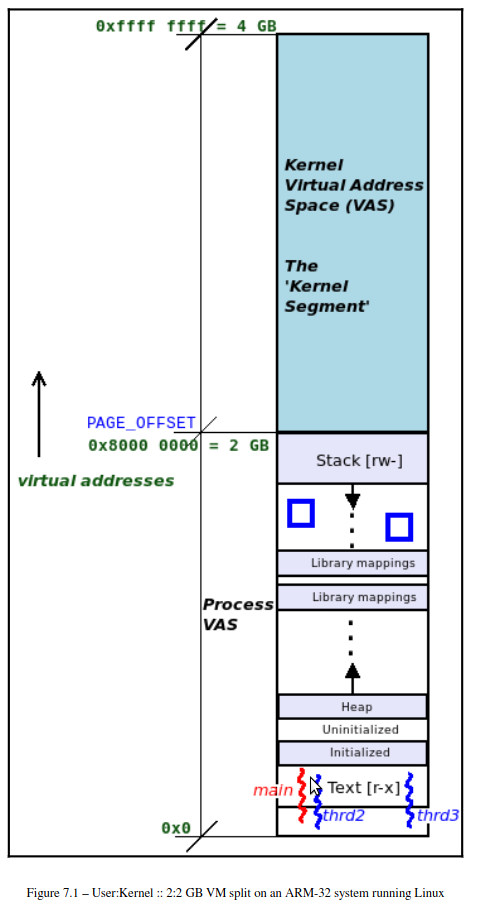
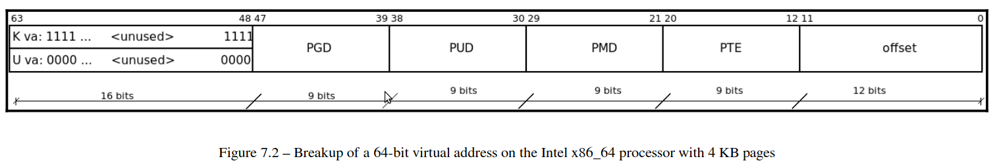
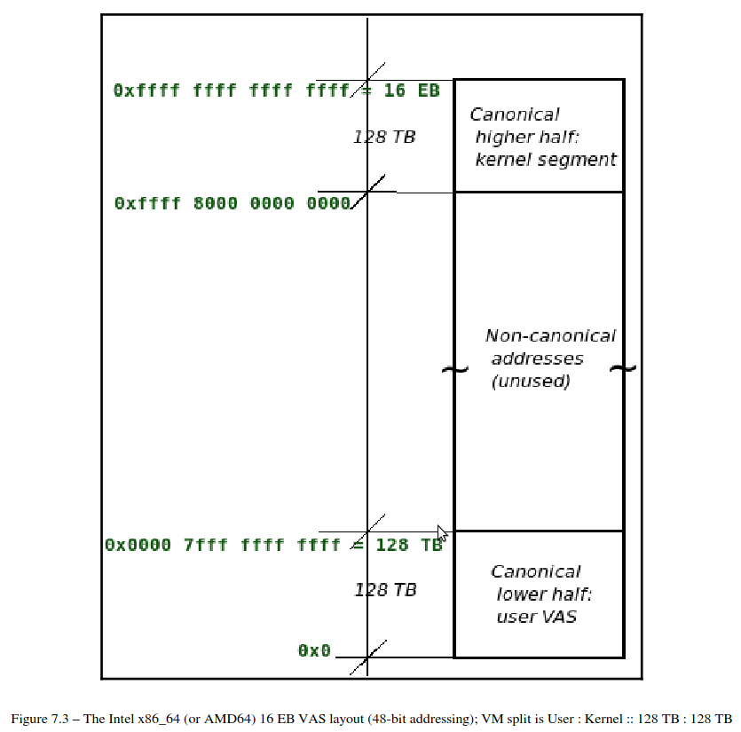
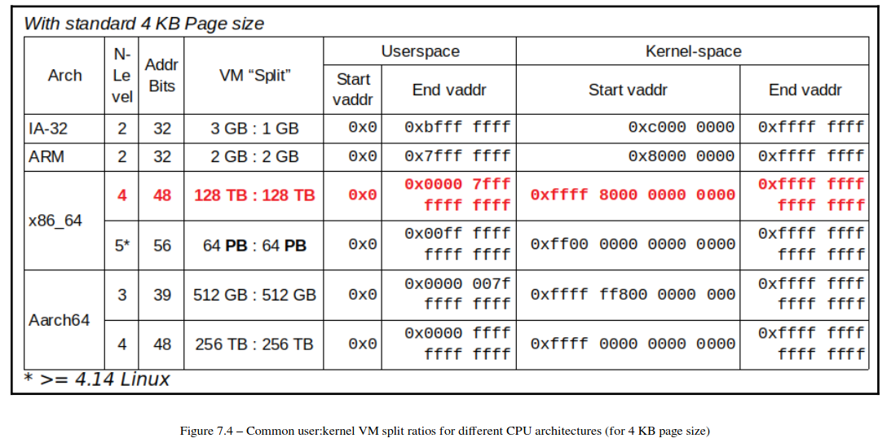
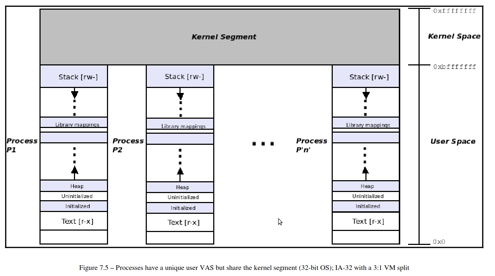
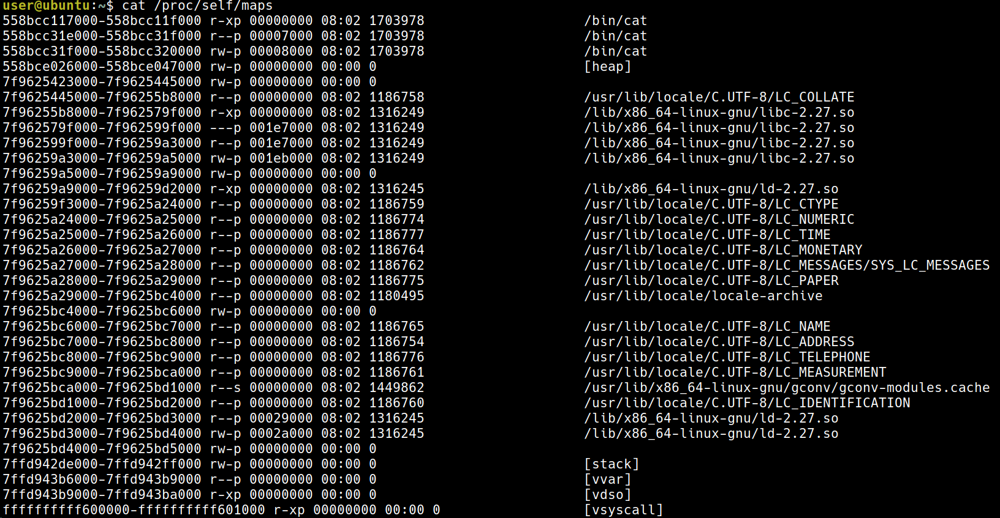
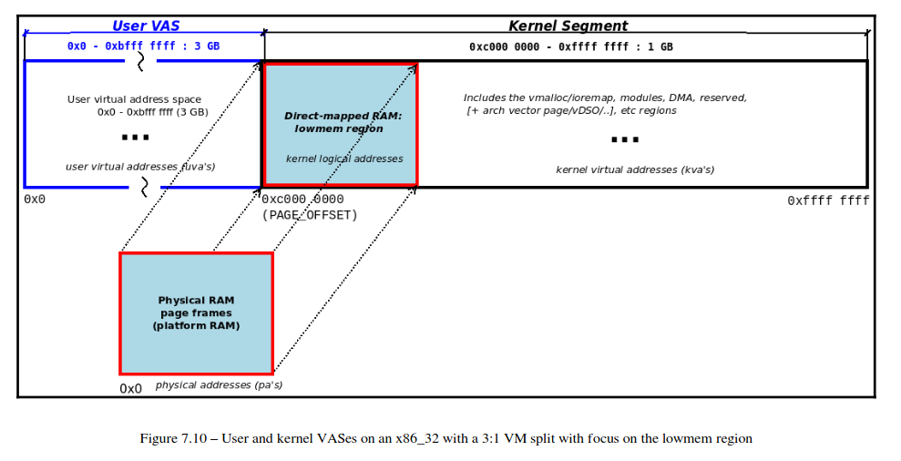

+++
date = '2026-05-04T21:02:50+08:00'
draft = false
title = 'Ch07: Memory Management Internals - Essentials'
weight = 7
+++

# Understanding the VM split
Linux kernel 管理記憶體時有一下兩種方式
* virtual memory-based (通常是使用這種方式)
* 直接以 physical memory 的觀點去處理

這個章節會先討論 virtual memory 的方式，接著再討論 physical memory 的方式

* 在 32-bit processor 上，VAS 的範圍為 0 ~ 2 ^ 32 = 4GB
* 在 64-bit processor 上，VAS 的範圍為 0 ~ 2 ^ 64 = 4EB

為了討論方便，這裡會先使用 32-bit 的方式

## Looking under the hood – the Hello, world C program
這裡在說明像是在這樣的 `helloworld.c` 中，`printf()` 是透過 loader 呼叫 system call `mmap()`，讓 `printf()` 可以被 map 到這個 process 的 VAS 中。
```c
#include <stdio.h>

int main()
{
    printf("Hello, world\n");
}
```

```sh
user@ubuntu:~/tmp$ gcc helloworld.c -o helloworld
user@ubuntu:~/tmp$ ./helloworld 
Hello, world
user@ubuntu:~/tmp$ ldd ./helloworld
        linux-vdso.so.1 (0x00007ffe497dd000)
        libc.so.6 => /lib/x86_64-linux-gnu/libc.so.6 (0x00007fd88850d000)
        /lib64/ld-linux-x86-64.so.2 (0x00007fd888b00000)
```
從這裡可以看到這個 `./helloword` link 到了 `glibc` (GNU `libc`) 函式庫，這裡面會包含 `printf()`
這裡有以下幾個重點
* 每一個 process 都會 link 到至少兩個 object: 1. `glibc`, 2. program loader
* 在上面的例子中，loader 為 `ld-linux-x86-64.so.2` 
* `libc` 被 map 到 VAS 中的 `0x00007fd88850d000`
### Going beyond the printf() API
這裡要探討的主題為 VM split，是在說 kernel space 與 user space 是共用一個 VAS 的，像是下圖這樣：


這裡的 `kernel : user` 的比例是個可以做設定的，在 `make [ARCH=xxx] menuconfig` 的時候可以做決定

在 64-bit 的架構上沒有辦法直接配置 VM split 的比例，現在在講的只是 32-bit 的架構，接下來要說明 64-bit 的架構要如何做到 VM split

## VM split on 64-bit Linux systems
首先在 64-bit 的系統上面，並不是全部的 64-bit 都拿來作為 addressing 用，實際上只使用 48-bit 用來 addressing，因為直接使用 64-bit 的話，實在是太大了。
### Virtual addressing and address translation
考量這個程式碼片段：
```c
int i = 5;
printf("address of i is 0x%x\n", &i);
```
* 如果是在 user space process 執行，看到的會是一個 User Virtual Address (UVA)
* 如果是在 kernel space process 執行（使用 `printk()`），看到的會是一個 Kernel Virtual Address (KVA)


(64-bit 的架構之下，只使用 48 個 bit)  
對應前面說的兩個情況，在這張圖中，也可以看到兩個情況
* bit [63 ~ 48] 都設為 1 : UVA
* bit [63 ~ 48] 都設為 1 : KVA

這裡想要強調的重點在於，virtual memory 包含了一些 bitmap，並不是只有 address 的部份，這個跟 xv6 中的 virtual memory 是一樣的。

現在的 64-bit 架構的 memeor 切分是當初 AMD 的工程是把 Linux 移植到 64-bit 架構時決定的，最後的決定結果為
* 48-bit addressing with a 4 KB page size


這張圖在顯示 virtual address 中，KVA 與 UVA 的範圍，這也對應到了為什麼透過第 63~48 bit 可以辨識是 UVA 還是 KVA，並且也可以注意到，中間空了好大的範圍是沒有用到的。


這張圖顯示了不同架構下的 VM split 的比例

## The process VAS – the full view

這張圖顯示的是 32-bit 架構的 VMS 的配置與 VM split，並且這裡 `user : kernel` 的比例為 `3 : 1`

接下來會介紹 `procmap` 這個工具，可以把 VM split 顯示成像是上圖那個樣子

# Examining the process VAS
這裡在講一些 `proc` filesystem (`procfs`) 的用處
## Examining the user VAS in detail
`procfs` 可以利用 pseudo-file `/proc/PID/maps` 去取得這個 process 的 VAS 資訊，實際使用上有兩種方法：
* 直接使用 `procfs`
* 使用一些 useful frontends (人類比較方便讀懂的方法)
### Directly viewing the process memory map using procfs
可以直接使用 `cat` 去看 `procfs`，像是
```sh
cat /proc/self/maps
```

#### Interpreting the /proc/PID/maps output
這裡來解讀 `cat /proc/self/maps` 的輸出結果，每一行都代表一個 segment 或是一個 VAS，以這一行來說明：
```text
start_uva - end_uva       mode,mapping start-off mj:mn inode# image-name
555d83b65000-555d83b6d000 r-xp         00000000  08:01 524313 /bin/cat
```

#### The vsyscall page
這裡在說最後的 `vsyscall` 看起來像是 kernel address，這是一個加速用的 mapping
### Frontends to view the process memory map
`pmap` 與 `smem` 可以用更好的方式

#### The procmap process VAS visualization utility
這裡要看這個 repo:  
https://github.com/kaiwan/procmap.git
```sh
git clone https://github.com/kaiwan/procmap
cd procmap
sudo ./install_procmap 
./procmap
```

```sh
./procmap --pid=$(pgrep bash)
```
### Understanding VMA basics

# Examining the kernel segment

* User VAS: 比較低的區域
* Direct-mapped RAM: 應該不是 map 到 memory
* Kernel Segment: 在比較高的位置
## High memory on 32-bit systems
## Writing a kernel module to show information about the kernel segment
### Viewing the kernel segment on a Raspberry Pi via dmesg
### Macros and variables describing the kernel segment layout
### Trying it out – viewing kernel segment details
### The kernel VAS via procmap
### Trying it out – the user segmen
#### The null trap page
### Viewing kernel documentation on the memory layout
```sh
vim ${KSRC}/Documentation/arm/memory.rst
```

```sh
vim ${KSRC}/Documentation/arm64/memory.rst
```

```sh
vim ${KSRC}/Documentation/x86/x86_64/mm.rst
```

# Randomizing the memory layout – KASLR
我猜這裡是在說前面的 layout 可以再重新隨機排列一下

# Physical memory
## Physical RAM organization
