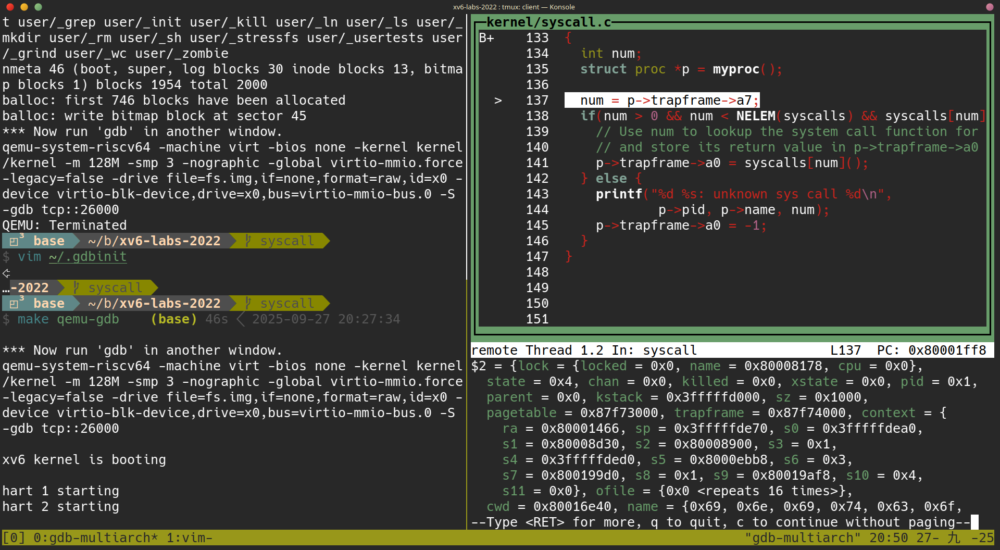

+++
date = '2025-09-24T12:50:00+08:00'
draft = false
title = 'xv6 學習紀錄'
series = "xv6"
+++
xv6 一直是我自己很喜歡的一個專案，在 2023 年時就已經在 HackMD 上紀錄了當時的[解題紀錄](https://hackmd.io/@xv6)，但當時都偏向隨筆紀錄而已，如今想來翻新一下，自己是期望可以寫得更清楚一些，另外，之前在 Lab8: networking 之後就沒有再更新了，這次希望可以把後面也補足，希望對於想學習 xv6 的人有幫助。  

[課程連結](https://pdos.csail.mit.edu/6.S081/2022/schedule.html)

