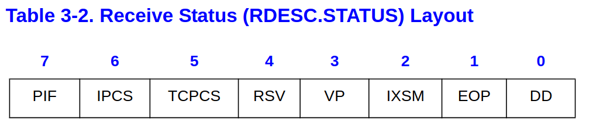
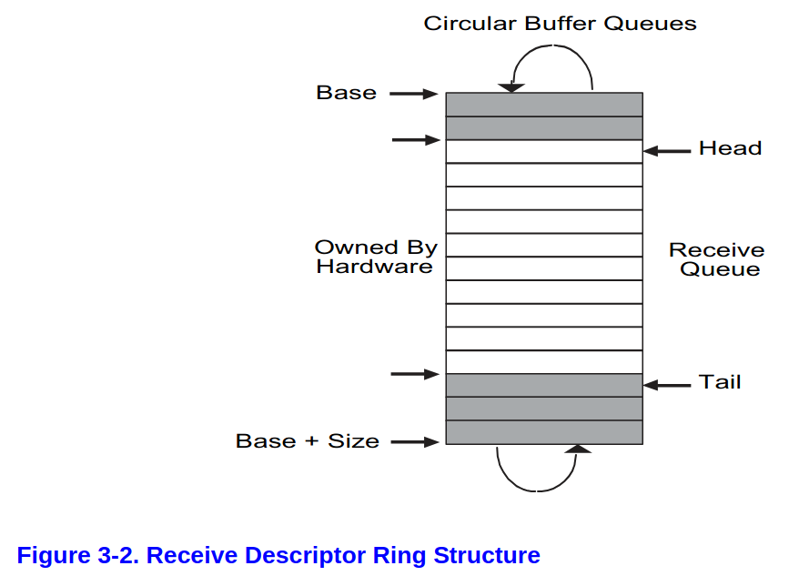
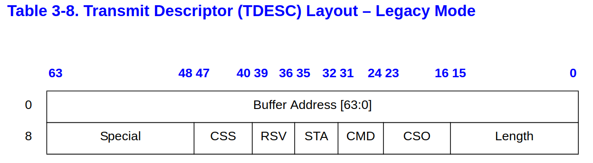

+++
date = '2025-11-21T15:49:48+08:00'
draft = false
title = '[xv6 學習紀錄 11-3] E1000 mannual 與其中概念的程式碼實做'
series = ["xv6 學習紀錄"]
weight = 113
+++

## Initialize
我們首先觀察 lab net 所提供的初始化過程，大致上了解要如何從 E1000 manual 轉換到程式碼
* `kernel/main.c: main()`
	* `kernel/pci.c: pci_init()`
		* `kernel/e1000.c: e1000_init(uint32 *xregs)`
			* `regs[XXX] = OOO`
	* `kernel/sysnet.c: sockinit()`
		* `initlock()`

* `kernel/pci.c: pci_init()`
```c
void
pci_init()
{
  // we'll place the e1000 registers at this address.
  // vm.c maps this range.
  // 我們會把 e1000 registers 放到這個位置
  // 如下圖，他會被放在 unused and other I/O devices 的區塊
  // vm.c 會負責做這個 mapping
  uint64 e1000_regs = 0x40000000L;

  // qemu -machine virt puts PCIe config space here.
  // vm.c maps this range.
  // 這裡則是在 mapping PCIe config
  // 跟前面一樣，是放在 unused and other I/O devices 的區塊
  // ECAM for Extended Configuration Access Mechanism
  uint32  *ecam = (uint32 *) 0x30000000L;
  
  // look at each possible PCI device on bus 0.
  // bus == 0 是固定的，只掃描 Primary Bus
  // dev: 0 ~ 31 設備號碼，每一個代表一個獨立設備例如 E1000 網卡、顯示卡，現在要尋找 E1000
  // func: 功能號碼，每一個設備可以有多個 function, 這裡只需要尋找第 0 個功能，E1000 也只有一個功能
  // offset: 指向配置空間中特定 4 位元組暫存器的偏移量, 設為 0
  // off: 透過上面的資訊取得總 offset
  for(int dev = 0; dev < 32; dev++){
    int bus = 0;
    int func = 0;
    int offset = 0;
    uint32 off = (bus << 16) | (dev << 11) | (func << 8) | (offset);
    volatile uint32 *base = ecam + off;
    uint32 id = base[0];
    
    // 100e:8086 is an e1000
    if(id == 0x100e8086){
      // command and status register.
      // bit 0 : I/O access enable
      // bit 1 : memory access enable
      // bit 2 : enable mastering
      base[1] = 7;
      __sync_synchronize();

      for(int i = 0; i < 6; i++){
        uint32 old = base[4+i];

        // writing all 1's to the BAR causes it to be
        // replaced with its size.
        base[4+i] = 0xffffffff;
        __sync_synchronize();

        base[4+i] = old;
      }

      // tell the e1000 to reveal its registers at
      // physical address 0x40000000.
      base[4+0] = e1000_regs;

      e1000_init((uint32*)e1000_regs);
    }
  }
}
```


## `e1000_init()`
* `kernel/e1000.c: e1000_init(uint32 *xregs)`
```c
// called by pci_init().
// xregs is the memory address at which the
// e1000's registers are mapped.
void
e1000_init(uint32 *xregs)
{
  int i;

  initlock(&e1000_lock, "e1000");

  regs = xregs;

  // Reset the device
  regs[E1000_IMS] = 0; // disable interrupts
  regs[E1000_CTL] |= E1000_CTL_RST;
  regs[E1000_IMS] = 0; // redisable interrupts
  __sync_synchronize();

  // [E1000 14.5] Transmit initialization
  memset(tx_ring, 0, sizeof(tx_ring));
  for (i = 0; i < TX_RING_SIZE; i++) {
    tx_ring[i].status = E1000_TXD_STAT_DD;
    tx_mbufs[i] = 0;
  }
  regs[E1000_TDBAL] = (uint64) tx_ring;
  if(sizeof(tx_ring) % 128 != 0)
    panic("e1000");
  regs[E1000_TDLEN] = sizeof(tx_ring);
  regs[E1000_TDH] = regs[E1000_TDT] = 0;
  
  // [E1000 14.4] Receive initialization
  memset(rx_ring, 0, sizeof(rx_ring));
  for (i = 0; i < RX_RING_SIZE; i++) {
    rx_mbufs[i] = mbufalloc(0);
    if (!rx_mbufs[i])
      panic("e1000");
    rx_ring[i].addr = (uint64) rx_mbufs[i]->head;
  }
  regs[E1000_RDBAL] = (uint64) rx_ring;
  if(sizeof(rx_ring) % 128 != 0)
    panic("e1000");
  regs[E1000_RDH] = 0;
  regs[E1000_RDT] = RX_RING_SIZE - 1;
  regs[E1000_RDLEN] = sizeof(rx_ring);

  // filter by qemu's MAC address, 52:54:00:12:34:56
  regs[E1000_RA] = 0x12005452;
  regs[E1000_RA+1] = 0x5634 | (1<<31);
  // multicast table
  for (int i = 0; i < 4096/32; i++)
    regs[E1000_MTA + i] = 0;

  // transmitter control bits.
  regs[E1000_TCTL] = E1000_TCTL_EN |  // enable
    E1000_TCTL_PSP |                  // pad short packets
    (0x10 << E1000_TCTL_CT_SHIFT) |   // collision stuff
    (0x40 << E1000_TCTL_COLD_SHIFT);
  regs[E1000_TIPG] = 10 | (8<<10) | (6<<20); // inter-pkt gap

  // receiver control bits.
  regs[E1000_RCTL] = E1000_RCTL_EN | // enable receiver
    E1000_RCTL_BAM |                 // enable broadcast
    E1000_RCTL_SZ_2048 |             // 2048-byte rx buffers
    E1000_RCTL_SECRC;                // strip CRC
  
  // ask e1000 for receive interrupts.
  regs[E1000_RDTR] = 0; // interrupt after every received packet (no timer)
  regs[E1000_RADV] = 0; // interrupt after every packet (no timer)
  regs[E1000_IMS] = (1 << 7); // RXDW -- Receiver Descriptor Write Back
}
```

### [E1000 14.5] Transmit initialization
閱讀 manual 對應的章節

需要關注的 registers
* `TDBAL/TDBAH`: Transmit Descriptor Base Address
    * 總共有 64 bits 的，但切分為兩個 32 bits (Low/High)
    * `TDBAL/TDBAH` 在 e1000 中，但它的值指向 main memory
    ```c
      regs[E1000_TDBAL] = (uint64) tx_ring;
      if(sizeof(tx_ring) % 128 != 0)
        panic("e1000");
    ```
* `TDLEN`: Transmit Descriptor Length
    * 得知 descripror ring 的大小
    ```c
    regs[E1000_TDLEN] = sizeof(tx_ring);
    ```
* `TDH/TDT`: Transmit Descriptor Head and Tail
    * initialized (by hardware) to 0b
    * 這裡需要先了解 ring 的架構
    ```c
      regs[E1000_TDH] = regs[E1000_TDT] = 0;
    ```
* `TCTL`: Transmit Control Register
    * Set the Enable (`TCTL.EN`) bit to 1b for normal operation.
    * Set the Pad Short Packets (`TCTL.PSP`) bit to 1b.
    * Set the Pad Short Packets (`TCTL.PSP`) bit to 1b.
    * Configure the Collision Distance (`TCTL.COLD`) to its expected value. For full duplex operation, this value should be set to 40h. For gigabit half duplex, this value should be set to 200h. For 10/100 half duplex, this value should be set to 40h.
    ```c
      regs[E1000_TCTL] = E1000_TCTL_EN |  // enable
        E1000_TCTL_PSP |                  // pad short packets
        (0x10 << E1000_TCTL_CT_SHIFT) |   // collision stuff
        (0x40 << E1000_TCTL_COLD_SHIFT);
      regs[E1000_TIPG] = 10 | (8<<10) | (6<<20); // inter-pkt gap
    ```
### [E1000 14.4] Receive initialization
閱讀 manual 對應的章節

需要關注的 registers
* `RDBAL/RDBAH`: Receive Descriptor Base Address
    * 跟前面一樣，指向 ring，並且把 64-bits 切分為兩個 register
    ```c
      regs[E1000_RDBAL] = (uint64) rx_ring;
    ```
* `RDH`: Receive Descriptor Head
    * 初始化為 0
    ```c
      regs[E1000_RDH] = 0;
    ```
* `RDT`: Receive Descriptor Tail
    * 初始化為 0
    ```c
      regs[E1000_RDT] = RX_RING_SIZE - 1;
    ```
* `RDLEN`: Receive Descriptor Length
    * must be 128-byte aligned
    ```c
      if(sizeof(rx_ring) % 128 != 0)
        panic("e1000");
      regs[E1000_RDLEN] = sizeof(rx_ring);
    ```
* `RAL/RAH`: Receive Address Register
    ```c
      // filter by qemu's MAC address, 52:54:00:12:34:56
      regs[E1000_RA] = 0x12005452;
      regs[E1000_RA+1] = 0x5634 | (1<<31);
    ```
* `RCTL`: Receive Control
    ```c
      // receiver control bits.
      regs[E1000_RCTL] = E1000_RCTL_EN | // enable receiver
        E1000_RCTL_BAM |                 // enable broadcast
        E1000_RCTL_SZ_2048 |             // 2048-byte rx buffers
        E1000_RCTL_SECRC;                // strip CRC
    ```

```c
// ask e1000 for receive interrupts.
regs[E1000_RDTR] = 0; // interrupt after every received packet (no timer)
regs[E1000_RADV] = 0; // interrupt after every packet (no timer)
regs[E1000_IMS] = (1 << 7); // RXDW -- Receiver Descriptor Write Back
```

看完 lab 所提供的 Receive/Transmit 的 Initialization code 之後，大概有個如何從 manual 轉換到 code 的概念，接下來來了解 Receive/Transmit 的運行過程的原理

## Receive
### [E1000 3.2.3.1] Descriptor 中的 status
```c
/* Receive Descriptor bit definitions [E1000 3.2.3.1] */
#define E1000_RXD_STAT_DD       0x01    /* Descriptor Done */
#define E1000_RXD_STAT_EOP      0x02    /* End of Packet */
```


* `E1000_TXD_STAT_DD` Descriptor Done
    * 表示 Hardware 是否處理完這個 Descriptor
    * 如果 `E1000_TXD_STAT_DD` & `E1000_TXD_CMD_EOP` 代表這個 packet 已經完全存放於 main memory
* `E1000_TXD_CMD_EOP`: End of Packet
    * 表示這個 descriptor 是所屬 packet 的最後一個 descriptor

### [E1000 3.2.3] Receive 的 descriptor
```c
// [E1000 3.2.3]
struct rx_desc
{
  uint64 addr;       /* Address of the descriptor's data buffer */
  uint16 length;     /* Length of data DMAed into data buffer */
  uint16 csum;       /* Packet checksum */
  uint8 status;      /* Descriptor status */
  uint8 errors;      /* Descriptor Errors */
  uint16 special;
};
```

* `addr`: 指向所屬的 `mbuf`
* `status`: 前一小結提及的，需要注意的只有 `DD` 與 `EOP`
* `length`: 大小，應該是 HW 幫我們做設定的，driver 的責任在於接續設定到 `mbuf`

### Receive Ring
```c
#define RX_RING_SIZE 16
static struct rx_desc rx_ring[RX_RING_SIZE] __attribute__((aligned(16)));
static struct mbuf *rx_mbufs[RX_RING_SIZE];
```


* full: `RDH == (RDT + 1) % SIZE`
* empty: `RDT == RDH`
* 先回顧一下，在初始化的階段
    ```c
    regs[E1000_RDH] = 0;
    regs[E1000_RDT] = RX_RING_SIZE - 1;
    ```
    * 這代表的意義是整個 ring 都 owned by hardware
    * owned by hard ware 代表所有區塊都是可以放入資料的，在初始化的時候也是蠻合理的

## Transmit
### CMD
```c
/* Transmit Descriptor command definitions [E1000 3.3.3.1] */
#define E1000_TXD_CMD_EOP    0x01 /* End of Packet */
#define E1000_TXD_CMD_RS     0x08 /* Report Status */
```

* `EOP`: End Of Packet
    * > When set, indicates the last descriptor making up the packet. One or many descriptors can be used to form a packet.
    * 這在寫 driver 的時候要特別注意，傳送最後一個 Packet 的時候要 set `EOP`
* `RS` (bit 3): Report Status
    * > When set, the Ethernet controller needs to report the status information. This ability may be used by software that does in-memory checks of the transmit descriptors to determine which ones are done and packets have been buffered in the transmit FIFO. Software does it by looking at the descriptor status byte and checking the Descriptor Done (DD) bit.
    * 有可能 software 會想要知道哪些 packets 已經完成了，Software 可以經由 Descriptor Done (DD) 得知

### Status
```c
/* Transmit Descriptor status definitions [E1000 3.3.3.2] */
#define E1000_TXD_STAT_DD    0x00000001 /* Descriptor Done */
```

* `DD`: Descriptor Done
    * > Indicates that the descriptor is finished and is written back either after the descriptor has been processed (with RS set) or for the 82544GC/EI, after the packet has been transmitted on the wire (with RPS set).
    * 這個跟先前的 Report Status 是配合的，有了 RS，DD 才會有用

```c
// [E1000 3.3.3]
struct tx_desc
{
  uint64 addr;
  uint16 length;
  uint8 cso;
  uint8 cmd;
  uint8 status;
  uint8 css;
  uint16 special;
};
```

* `addr`
    * 指向對應的 `mbuf`
* `CMD`
    * 如同先前提及的，只需要了解 `RS` 與 `EOP`
* `STA`
    * 裡面有 `DD` 可以查看
* `length`
    * 這個跟 `m->len` 應該要互相呼應

### Transmit Ring
```c
#define TX_RING_SIZE 16
static struct tx_desc tx_ring[TX_RING_SIZE] __attribute__((aligned(16)));
static struct mbuf *tx_mbufs[TX_RING_SIZE];
```

* 這個跟剛剛的 receive ring 很像，ring 的內容同樣是 owned by hardware
* 注意 `tx_ring` 在初始化的時候
    ```c
    regs[E1000_TDH] = regs[E1000_TDT] = 0;
    ```
    * 這代表的是 empty，這也算合理，也合理，因為 transmit 的時候要先是全部 owned by software，software 把資料放進去之後，才是 owned by hardware，給 hardware 處理
