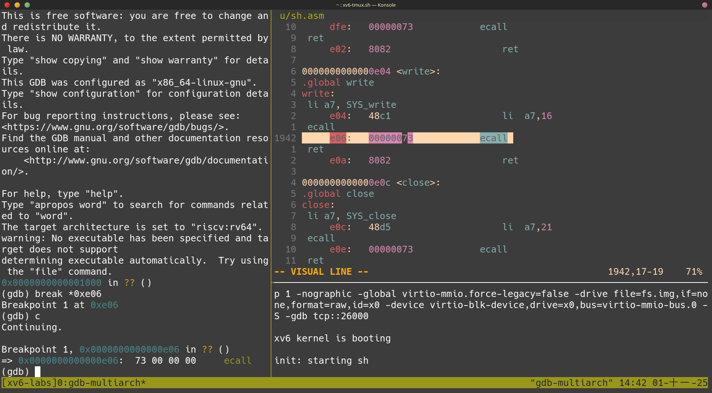
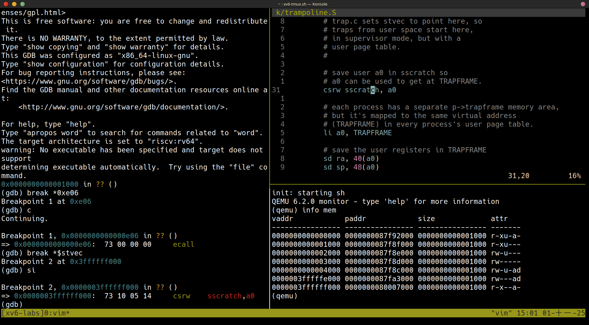
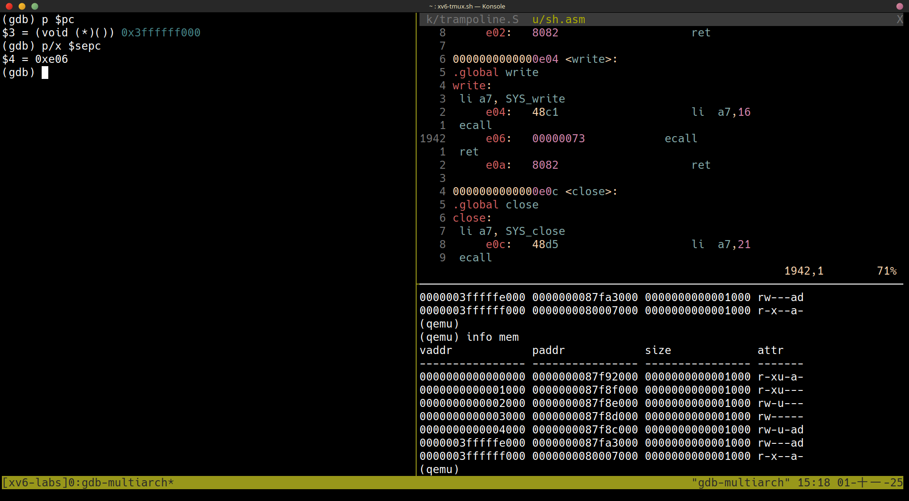

+++
date = '2025-09-27T15:46:30+08:00'
draft = false
title = '[xv6 學習紀錄 04-2] 如何使用 gdb 追蹤 xv6 的 system call 過程'
series = ["xv6 學習紀錄"]
weight = 42
+++
本文目標：照著以下步驟就可以看到整個 system call 的過程
整個過程大致上都是照著[這個影片](https://www.youtube.com/watch?v=T26UuauaxWA)做的，但其中有幾個步驟稍稍的不同。


## 2. 用 gdb-multiarch debug xv6 的方式
這裡會需要開啟 2 個終端機，  

先在其中一個終端機輸入
```sh=
make qemu-gdb #　這是被 debug 的對象
```
在另一個終端機輸入
```sh=
gdb-multiarch # 開啟 debuger 會開始針對上面的那個終端機中的程式進行除錯
```
* `gdb-multiarch` 是透過 `.gdbinit` 這個檔案找到 debug 的對象的
```sh
# .gdbinit
set confirm off
set architecture riscv:rv64
target remote 127.0.0.1:26000 # 透過這個來找到 qemu
symbol-file kernel/kernel
set disassemble-next-line auto
set riscv use-compressed-breakpoints yes
```

## 動機：`$` 的出現
`make qemu` 後 xv6 開機時，會顯示的畫面
```sh=
xv6 kernel is booting

hart 1 starting
hart 2 starting
init: starting sh
$ 
```
xv6 第一個執行的程式是 `sh`，它最一開始會 print 出字元 `$` print 的過程需要使用 system call `write`。

> 我們的目標就在於追蹤這個 `$` 如何經由 system call `write` 所產生出來的過程。

這篇文章分為以下兩個部份
1. 以程式碼的角度解釋
1. 用 `gdb` 觀察實際運行的步驟

## 以程式碼的角度解釋
直接說結論有以下的重點：
1. `user/sh.c`: `write(2, "$ ", 2)`
1. `user/sh.asm`: `write`
### 找到對應的 C 語言程式碼
在 `user/sh.c` 中
```c
// user/sh.c
int
getcmd(char *buf, int nbuf)
{
  write(2, "$ ", 2); // <------ where `sh` print `$` !
  memset(buf, 0, nbuf);
  gets(buf, nbuf);
  if(buf[0] == 0)
    return -1;
  return 0;
}
```
### 找到對應的組合語言
`write(2, "$ ", 2);` 這行式碼編譯出來的組合語言被放在 `user/sh.asm` 當中，對應到的組合語言片段如下:

```asm
  write(2, "$ ", 2);
      10:	4609                	li	a2,2
      12:	00001597          	auipc	a1,0x1
      16:	2ee58593          	addi	a1,a1,750 # 1300 <malloc+0xea>
      1a:	4509                	li	a0,2
      1c:	00001097          	auipc	ra,0x1
      20:	de8080e7          	jalr	-536(ra) # e04 <write>
```

```asm
0000000000000e04 <write>:
.global write
write:
 li a7, SYS_write
     e04:	48c1                	li	a7,16
 ecall
     e06:	00000073          	ecall
 ret
     e0a:	8082                	ret
```
組合語言解釋
* `wirte` 這個 procedure 位於 `0xe04` 中(virtual address)
* `li a7, SYS_write`
    * `li` 指的是 load immediate，把　`SYS_write`(16, 定義在 `kernel/syscall.h`) 存放到 register `a7` 當中
* `ecall` 這個指令會觸發 trap

### 觸發 trap 之後，會發生什麼事情?
觸發 trap 之後可以進入到 kernel mode，觸發 trap 有三種可能的情況
* system call  <--- `ecall` 觸發的 trap
* interrupt  
* exception  

在這個例子中，是 `ecall`  用 system call 的方式觸發 trap，在說明 trap 之後會怎麼樣前，要先來介紹一些相關的 register:
* `stvec`: 當 trap 發生時，RISC-V 會把 program counter 存在 ```stvec``` 中
* `scause`: RISC-V 會把觸發 trap 的原因放到 ```scause``` 中
* `sscratch`: 進入到 kernel space 前 ```sscratch``` 會儲存 trapframe 的位置
* `sstatus`: Supervisor status rigister
* `satp`: Supervisor Address Translation and Protection Register
* `sepc`: Supervisor Exception Program Counter, 進入 supervisor mode 後，用來紀錄回到 user mode 時，要回到什麼 address 開始執行

當 trap 發生時，會做的事情：
1. 把 `pc` 複製到 `secp`(Supervisor Exception Program Counter) 中
2. 把現在的狀態 (user or supervisor) 紀錄在 `sstatus` 的 SPP bit
3. 把造成 trap 的原因紀錄在 `scause` 
4. 把 `stvec` 放到 `pc` 中
5. 開始根據 `pc` 往下執行

## 4. 實際使用 `gdb` 追蹤這個過程

### 從 user program (`sh`) 準備進入到 sytem call `write()`
1. 把中斷點設在 `ecall` 
```gdb
(gdb) break *0xe06 # 根據 user/sh.asm, ecall 的 address (virtual)
(gdb) continue # continue 往下執行直到 ecall (正準備執行，但還沒)
(gdb) layout asm # 可以比較方便的看到目前執行的指令
```
到了這裡，我們準備要執行 `ecall` 以觸發 trap 了，執行 trap 就是想要從 `stvec` 的那裡執行




這裡也可以先用 `ctrl+a c` 進入到 qemu console 並且用 `info mem` 看一下目前的 page table，現在的 page table 是一個 user program (`sh`) 的 page table，有三大重點
1. `0x0000` ~ `0x4000` 這四個 page 是 user program 本身的資料
1. `0x3ffffff000`: 最大 address 的這個 page，是 trampoline，存放 `trampoline.S` 的 text 內容
1. `0x3fffffe000`: 第二大的 page，是 trapframe，是這個 page 進入到 supervisor mode 時，可以用來存放資料的 page

### 進入到 trampoline
> 這裡我用**影片中的方法無法正常執行**，影片中是用 `(gdb) si` 就可以往下跑到 trap 的流程，可是我在自己執行的結果卻是會直接把 trap 的流程跑完，直到 `ecall` 的下一個指令 `ret` 那裡（可能是 gdb 的版本不同），想要追蹤 trap 的流程就必須要自行設定中斷點。

2. 使用 `si` 往下執行之前，先 print 出 `stvec` 的值，並且把中斷點設到那個 address (virtual)

```gdb
(gdb) print/x $stvec # 用 /x (hex) 的格式 print 出 stvec 的值
$1 = 0x3ffffff000
(gdb) break *0x3ffffff000 # break *stvec
(gdb) si # 執行 ecall, 真正進入 supervisor mode 並且處理由 system call 觸發的 trap
```

也可以在進入 system call 之前使用
```gdb
(gdb) break *$stvec
```
會比較方便

這裡 `stvec` 的 `0x3ffffff000` 也是 memory layout 中可以看到的 trampoline 的位置，這是每一個 process 都會有的 mapping

### 跳到 trampoline (`stvec` 指向的 `0x3ffffff000`)
執行 `ecall` 之後
* 會跑到 `stvec` 指向的位置 0x3ffffff000 開始執行 (也就是 trampoline)
* 也就是跑到 `kernel/trampoline.S` 的 `<uservec>`  
* `<uservec>` 會一直執行到 `jr t0` 為止
    * 之後會跑到到 `kernel/trap.c: usertrap()` 執行


在這個時間點，page table 一樣是 user program 的 page table，也就是說 `ecall` 並沒有幫我們切換到 kernel page table 這也是每一個 user page table 都需要 trampoline 的 mapping 的原因，每一個 user program 才可以知道 trampoline 在哪裡
### `ecall` 的效果
1. change mode from user to supervisor
1. save program counter to `sepc` register
    
    * 現在的 `sepc` 中的 `0xe06` 是先前在 `sh.asm` 中 `ecall` 的位置
1. jump to the address that `stvec` point to
    * 這個很明顯，像是先前看到的，我們現在跳到了 `stvec` 指向的 `0x3ffffff000`
`ecall` 只做了最低限度所需的動作

### `trapfram.S`
影片中的版本的開頭為是使用 `csrrw`，但我看到手上版本的檔案是使用 `csrw` 搭配 `li`
```asm
# save user a0 in sscratch so
# a0 can be used to get at TRAPFRAME.
csrw sscratch, a0

# each process has a separate p->trapframe memory area,
# but it's mapped to the same virtual address
# (TRAPFRAME) in every process's user page table.
li a0, TRAPFRAME
```
`sscratch` 原先存放 trapframe 的 address，在 trapframe 的開頭，先把 `sscratch` 與 `a0` 的值互換
需要這麼做的原因在於 trapframe 一方面需要把所有的 register 存放於 trapframe 中，可是又需要 trapframe 的 virtual address 所以就先把 `a0` 當成 trapframe 的位址，並把原先 `a0` 的值暫存到 `sscratch` 中


(`li a0, TRAPFRAME` 被多個 instructions 實做出來，但總之，效果是一樣的)

這下面可以更清楚知道 `a0` 的值為什麼需要先放到其他地方，因為現在 `a0` 被當成了 trapframe 的 virtual address 來使用了
```asm
# save the user registers in TRAPFRAME
sd ra, 40(a0)
sd sp, 48(a0)
sd gp, 56(a0)
sd tp, 64(a0)
sd t0, 72(a0)
sd t1, 80(a0)
sd t2, 88(a0)
sd s0, 96(a0)
sd s1, 104(a0)
sd a1, 120(a0)
sd a2, 128(a0)
sd a3, 136(a0)
sd a4, 144(a0)
sd a5, 152(a0)
sd a6, 160(a0)
sd a7, 168(a0)
sd s2, 176(a0)
sd s3, 184(a0)
sd s4, 192(a0)
sd s5, 200(a0)
sd s6, 208(a0)
sd s7, 216(a0)
sd s8, 224(a0)
sd s9, 232(a0)
sd s10, 240(a0)
sd s11, 248(a0)
sd t3, 256(a0)
sd t4, 264(a0)
sd t5, 272(a0)
sd t6, 280(a0)
```


### `kernel/trap.c: usertrap()`
接下來就是 C 語言了
* 可以用 `(gdb) layout src` 來切換到 C 語言的檢視模式
```c
// trap.c
void
usertrap(void)
{
    /* ... */
    if(r_scause() == 8){
        syscall();
    }
    /* ... */
    usertrapret();
}
```

### `kernel/syscall.c: syscall()`
想要直接跑到 `kernel/syscall.c: syscall()` 執行了話，可以使用
```gdb
(gdb) break syscall
(gdb) continue
```
跳到 `syscall()` 執行

在 lab syscall 中有提到這段程式碼

### `usertrapret()`
想要直接跑到 `kernel/syscall.c: syscall()` 執行了話，可以使用
```gdb
(gdb) break usertrapret
(gdb) continue
```
跳到 `usertrapret()` 執行

`next` 到最後一行的 `trampoline_userret` 時，再 `next` 一次，之後又會進入到 assembly 的部份 (`kernel/trampoline.S: <userret>`)
```gdb
(gdb) layout asm # 以 assembly 檢視
```

### `kernel/trapmpoline.s` 中的 `userret`
在 `sret` 那裡，也要設 break point 才能夠回到 `user/sh.asm` 的 `ecall` 下面的 `ret`

### `user/sh.asm` 的 `ret`
```gdb
(gdb) file user/_sh
(gdb) si
(gdb) layout src # 已經執行完 write(2, "$ ", 2);
```
整個流程到此結束

## 有用的指令
### QEMU
ctrl + a c 可以 (進入/退出)到 QEMU 的 console
* `info reg`: 可以印出所有的 register
* `info mem`: 可以印出所有的 page table
### gdb
* `p/x $satp` 印出目前 pagetable 的 **physicall** address
* `x/3i 0xe06` print 出 3 個 instructions
```gdb=
(gdb) x/3i 0xe06
=> 0xe06:       li      a7,16
   0xe08:       ecall
   0xe0c:       ret
```
* `stepi`： execute one instruction
* `print $pc` print program counter
* `print/x $stvec`: 得知 trap 發生時，會跑到什麼地方開始執行
* `print/x $sepc`: `ecall` 之後，紀錄 user mode 的下一個 instruction 的位置 (紀錄 `ecall` 的位置)
* 想要在 `user/sh.c` 的 main 中設定 break point
```gdb=
(gdb) symbol-file user/_sh
(gdb) b main
```
* 遇到 `fork()` 時，gdb 預設是繼續追 parent，如果要追 child, 可以用：
```gdb=
(gdb) info inferior
(gdb) inferior 2
```

```gdb
(gdb) info threads
(gdb) thread $pid
```

```gdb
set follow-fork-mode child
```
## 疑問
* 從 user mode 進入到 kernel mode 之後，用來指向 page table 的 register `satp` 有什麼變化？kernel 的 page table 有固定的位置碼？
    * `ecall` 之後，扔然使用了是同一個 page table
* kernel 可不可以同時有許多 process?
* ```kernel/vm.c``` 這個檔案在整個 system call 的過程中，起到了什麼樣的作用？
* kernel mode 使用的是 physical memory 嗎？

## 參考資料
* https://pdos.csail.mit.edu/6.S081/2022/schedule.html
* https://blog.csdn.net/dai_xiangjun/article/details/123967946
* https://mit-public-courses-cn-translatio.gitbook.io/mit6-s081/lec06-isolation-and-system-call-entry-exit-robert/6.4-ecall-zhi-ling-zhi-hou-de-zhuang-tai
* https://blog.csdn.net/dai_xiangjun/article/details/124098461
