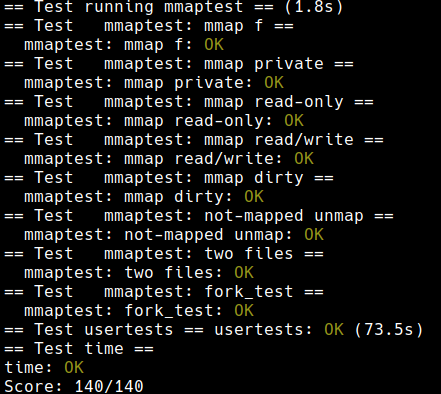

+++
date = '2025-11-01T12:05:39+08:00'
draft = false
title = '[xv6 學習紀錄 10] Lab: mmap'
series = ["xv6 學習紀錄"]
weight = 104
+++
Lab 連結：[Lab: mmap](https://pdos.csail.mit.edu/6.S081/2022/labs/mmap.html)

## Lab: mmap (hard)

>  The `mmap` and `munmap` system calls allow UNIX programs to exert detailed control over their address spaces. They can be used to share memory among processes, to map files into process address spaces, and as part of user-level page fault schemes such as the garbage-collection algorithms discussed in lecture. In this lab you'll add `mmap` and `munmap` to xv6, focusing on memory-mapped files. 

目前的理解會像是把 memory address map 到一個 file 中，可以有多個 process share 同一份資料的好處

> You should implement enough `mmap` and `munmap` functionality to make the `mmaptest` test program work. If `mmaptest` doesn't use a `mmap` feature, you don't need to implement that feature. 

這一題要我們實做出 mmap

>  The manual page (run `man 2 mmap`) shows this declaration for mmap:
> ```c
> void *mmap(void *addr, size_t length, int prot, int flags,
>            int fd, off_t offset);
> ```


>  `mmap` can be called in many ways, but this lab requires only a subset of its features relevant to memory-mapping a file. You can assume that addr will always be zero, meaning that the kernel should decide the virtual address at which to map the file. `mmap` returns that address, or `0xffffffffffffffff` if it fails. length is the number of bytes to map; it might not be the same as the file's length. `prot` indicates whether the memory should be mapped readable, writeable, and/or executable; you can assume that `prot` is `PROT_READ` or `PROT_WRITE` or both. `flags` will be either `MAP_SHARED`, meaning that modifications to the mapped memory should be written back to the file, or `MAP_PRIVATE`, meaning that they should not. You don't have to implement any other bits in `flags`. `fd` is the open file descriptor of the file to map. You can assume `offset` is zero (it's the starting point in the file at which to map). 

* 在這個 lab 的使用情境中 `addr` 永遠是 0，實際上決定 address 的地方是 kernel
    * 原先的 `mmap()` 應該是可以指定 `addr` 的，但這裡為了簡化，所以就直接讓 kernel 決定，並且回傳 `addr`
* return value: 回傳被 mapping 的 `addr`，如果 failed return `0xffffffffffffffff`
    * mapping 失敗的時候回傳 `0xffffffffffffffff`
* length: 需要 map 的 byte 數量，可以跟 file 的 length 不一樣
* `prot` (protection): 權限，可以直接認定 `prot` 為 `PROT_READ` or `PROT_WRITE` or both
    * `PROT_READ`
    * `PROT_WRITE`
    * `PROT_READ & PROT_WRITE`
* `flag` 只有可能是以下兩者擇一
    * `MAP_SHARED`: 修改寫回
    * `MAP_PRIVATE`: 修改不寫回
    * (其實還有其他 flag 但這個 lab 不必實做)
* `fd`: 被 mapping 的 file descriptor
    * 在 `fork()` 的時候要使用 `filedup()` 做 copy，因為每一個 process 的 fd->file mapping 都不一樣
* `offset`: 可以假設 `offset` 永遠為 0

根據這個 hint，可以設計出 `struct vma`
```c
struct vma {
  uint64 addr;
  uint64 len;
  int prot;
  int flags;
  struct file *f;
  uint64 offset;
  int valid;
};
```

> * Start by adding `_mmaptest` to `UPROGS`, and `mmap` and `munmap` system calls, in order to get `user/mmaptest.c` to compile. For now, just return errors from mmap and munmap. We defined `PROT_READ` etc for you in `kernel/fcntl.h`. Run `mmaptest`, which will fail at the first mmap call.

> * Fill in the page table lazily, in response to page faults. That is, `mmap` should not allocate physical memory or read the file. Instead, do that in page fault handling code in (or called by) `usertrap`, as in the lazy page allocation lab. The reason to be lazy is to ensure that `mmap` of a large file is fast, and that `mmap` of a file larger than physical memory is possible.

這裡會用到 lazy allocation 的技巧，`mmap` 只紀錄下 mapping 的關係，實際上會利用 `usertrap()` 來處理後續的動作 
* 為了更加快速
* 可以 map a file larger than physical memory

> * Keep track of what `mmap` has mapped for each process. Define a structure corresponding to the VMA (virtual memory area) described in Lecture 15, recording the address, length, permissions, file, etc. for a virtual memory range created by mmap. Since the xv6 kernel doesn't have a memory allocator in the kernel, it's OK to declare a fixed-size array of VMAs and allocate from that array as needed. A size of 16 should be sufficient.

> * Implement `mmap`: find an unused region in the process's address space in which to map the file, and add a VMA to the process's table of mapped regions. The VMA should contain a pointer to a `struct file` for the file being mapped; `mmap` should increase the file's reference count so that the structure doesn't disappear when the file is closed (hint: see `filedup`). Run `mmaptest`: the first `mmap` should succeed, but the first access to the mmap-ed memory will cause a page fault and kill `mmaptest`.

這裡在說需要在 process 的 address space 中找一塊沒有用的來當作 map to the file 的區塊
* 要使用 reference count，不然的話會讓 `mmaptest.c` 中的 `fork_test()` 無法通過
    * 這是我自己實做的時候卡很久沒有發現的地方，因為 `fork()` 之後 child 再 `exit()` 之後，會直接把一些區塊 free 掉

> * Add code to cause a page-fault in a mmap-ed region to allocate a page of physical memory, read 4096 bytes of the relevant file into that page, and map it into the user address space. Read the file with `readi`, which takes an offset argument at which to read in the file (but you will have to `lock/unlock` the inode passed to `readi`). Don't forget to set the permissions correctly on the page. Run mmaptest; it should get to the first `munmap`.

使用 page-fault 的策略

> * Implement `munmap`: find the VMA for the address range and `unmap` the specified pages (hint: use `uvmunmap`). If `munmap` removes all pages of a previous `mmap`, it should decrement the reference count of the corresponding struct file. If an unmapped page has been modified and the file is mapped `MAP_SHARED`, write the page back to the file. Look at `filewrite` for inspiration.

> * Ideally your implementation would only write back `MAP_SHARED` pages that the program actually modified. The dirty bit (D) in the RISC-V PTE indicates whether a page has been written. However, mmaptest does not check that non-dirty pages are not written back; thus you can get away with writing pages back without looking at D bits.

> * Modify exit to `unmap` the process's mapped regions as if `munmap` had been called. Run `mmaptest`; `mmap_test` should pass, but probably not `fork_test`.

> * Modify fork to ensure that the child has the same mapped regions as the parent. Don't forget to increment the reference count for a VMA's struct file. In the page fault handler of the child, it is OK to allocate a new physical page instead of sharing a page with the parent. The latter would be cooler, but it would require more implementation work. Run `mmaptest`; it should pass both `mmap_test` and `fork_test`. 

需要先了解 `filedup()`
```c
// Increment ref count for file f.
struct file*
filedup(struct file *f)
{
  acquire(&ftable.lock);
  if(f->ref < 1)
    panic("filedup");
  f->ref++;
  release(&ftable.lock);
  return f;
}
```

## 解題策略


## 程式實做
* `kernel/fcntl.h`
```c
#define O_RDONLY  0x000
#define O_WRONLY  0x001
#define O_RDWR    0x002
#define O_CREATE  0x200
#define O_TRUNC   0x400

#ifdef LAB_MMAP
#define PROT_NONE       0x0
#define PROT_READ       0x1
#define PROT_WRITE      0x2
#define PROT_EXEC       0x4

#define MAP_SHARED      0x01
#define MAP_PRIVATE     0x02
#endif
```

* `kernel/proc.h`
```c
#define MAX_VMAS 16

struct vma {
  uint64 addr;
  uint64 len;
  int prot;
  int flags;
  struct file *f;
  uint64 offset;
  int valid;
};

// Per-process state
struct proc {
  // ...

  struct vma vmas[MAX_VMAS];
};
```


