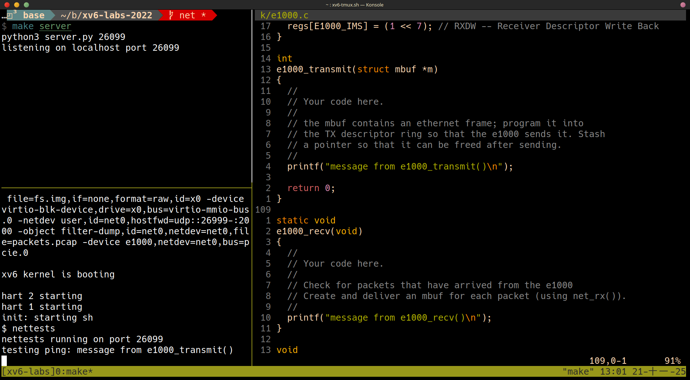
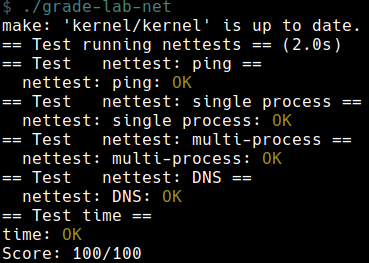

+++
date = '2025-11-01T13:01:44+08:00'
draft = false
title = '[xv6 學習紀錄 11] Lab net: Network driver'
series = ["xv6 學習紀錄"]
weight = 114
+++
Lab 連結：[Lab net: Network driver](https://pdos.csail.mit.edu/6.S081/2022/labs/net.html)

## Background

> You'll use a network device called the E1000 to handle network communication. To xv6 (and the driver you write), the E1000 looks like a real piece of hardware connected to a real Ethernet local area network (LAN). In fact, the E1000 your driver will talk to is an emulation provided by qemu, connected to a LAN that is also emulated by qemu. On this emulated LAN, xv6 (the "guest") has an IP address of `10.0.2.15`. Qemu also arranges for the computer running qemu to appear on the LAN with IP address `10.0.2.2`. When xv6 uses the E1000 to send a packet to `10.0.2.2`, qemu delivers the packet to the appropriate application on the (real) computer on which you're running qemu (the "host"). 

* 對於 xv6 來說，這就如同是連接上真正的 Ethernet
* 這個 E1000 是透過 qemu 提供模擬的
* guest IP: `10.0.2.15`
* 我的筆電的 IP: `10.0.2.2`
    * 所以當 xv6 傳送資料給 `10.0.2.2` 的時候，實際上就是跟我筆電上的某個對應到的 application

> You will use QEMU's "user-mode network stack". QEMU's documentation has more about the user-mode stack [here](https://wiki.qemu.org/Documentation/Networking). We've updated the `Makefile` to enable QEMU's user-mode network stack and the E1000 network card. 

這個 lab 使用 QEMU's "user-mode network stack" 的功能，相關的功能已經在 `Makefile` 中設定了

> The `Makefile` configures QEMU to record all incoming and outgoing packets to the file `packets.pcap` in your lab directory. It may be helpful to review these recordings to confirm that xv6 is transmitting and receiving the packets you expect. To display the recorded packets:
> 
> ```sh
> tcpdump -XXnr packets.pcap
> ```

`Makefile` 設定了所有進來與出去的 packet 都紀錄在 `packets.pcap`，使用 `tcpdump -XXnr packets.pcap` 可以顯示出裡面的內容，例如：


> We've added some files to the xv6 repository for this lab. The file `kernel/e1000.c` contains initialization code for the E1000 as well as empty functions for transmitting and receiving packets, which you'll fill in. `kernel/e1000_dev.h` contains definitions for registers and flag bits defined by the E1000 and described in the Intel E1000 Software Developer's Manual. `kernel/net.c` and `kernel/net.h` contain a simple network stack that implements the IP, UDP, and ARP protocols. These files also contain code for a flexible data structure to hold packets, called an `mbuf`. Finally, `kernel/pci.c` contains code that searches for an E1000 card on the PCI bus when xv6 boots. 

相關程式碼與檔案：

* `kernel/e1000.c`
    * `e1000_init()`
    * `e1000_transmit()` (empty)
    * `e1000_recv()` (empty)
* `kernel/e1000_dev.h`
    * registers
    * flag bits
* `mbuf` flexible data structure to hold packets
* `kernel/pci.c`
    * searches for an E1000 card on the PCI bus when xv6 boots


## Lab: networking (hard)
> Your job is to complete `e1000_transmit()` and `e1000_recv()`, both in `kernel/e1000.c`, so that the driver can transmit and receive packets. You are done when `make grade` says your solution passes all the tests. 

這一題所需的背景知識真的很多

> Browse the [E1000 Software Developer's Manual](https://pdos.csail.mit.edu/6.S081/2022/readings/8254x_GBe_SDM.pdf). This manual covers several closely related Ethernet controllers. QEMU emulates the 82540EM. Skim Chapter 2 now to get a feel for the device. To write your driver, you'll need to be familiar with Chapters 3 and 14, as well as 4.1 (though not 4.1's subsections). You'll also need to use Chapter 13 as a reference. The other chapters mostly cover components of the E1000 that your driver won't have to interact with. Don't worry about the details at first; just get a feel for how the document is structured so you can find things later. The E1000 has many advanced features, most of which you can ignore. Only a small set of basic features is needed to complete this lab. 

* skim Chapter 2 可以先稍微知道這個 device 的概念
* 想要寫出 driver 需要了解 Chapter 3 and 14 and 1.1
* Chapter 13 可以作為 reference

* 剛開始的時候不需要擔心細節，只需要先了解這個 document 的架構，有需要的時候後至少知道在哪裡
* 大多數的細節都可以忽略
* 比較 advanced 的 features 也可以忽略
* 想要做出這個 lab 只需要了解基本的 features

>  The `e1000_init()` function we provide you in `e1000.c` configures the E1000 to read packets to be transmitted from RAM, and to write received packets to RAM. This technique is called DMA, for direct memory access, referring to the fact that the E1000 hardware directly writes and reads packets to/from RAM. 

* 這裡使用 DMA 的技術，意思是我們都是透過 RAM 來跟 devices 做溝通

>  Because bursts of packets might arrive faster than the driver can process them, `e1000_init()` provides the E1000 with multiple buffers into which the E1000 can write packets. The E1000 requires these buffers to be described by an array of "descriptors" in RAM; each descriptor contains an address in RAM where the E1000 can write a received packet. struct rx_desc describes the descriptor format. The array of descriptors is called the receive ring, or receive queue. It's a circular ring in the sense that when the card or driver reaches the end of the array, it wraps back to the beginning. `e1000_init()` allocates mbuf packet buffers for the E1000 to DMA into, using mbufalloc(). There is also a transmit ring into which the driver should place packets it wants the E1000 to send. `e1000_init()` configures the two rings to have size `RX_RING_SIZE` and `TX_RING_SIZE`. 

因為度太快了，所以會有多個 buffer 需要注意

>  When the network stack in `net.c` needs to send a packet, it calls `e1000_transmit()` with an `mbuf` that holds the packet to be sent. Your transmit code must place a pointer to the packet data in a descriptor in the TX (transmit) ring. `struct tx_desc` describes the descriptor format. You will need to ensure that each `mbuf` is eventually freed, but only after the E1000 has finished transmitting the packet (the E1000 sets the E`1000_TXD_STAT_DD` bit in the descriptor to indicate this). 

在 `net.c` 中有 network stack

> In addition to reading and writing the descriptor rings in RAM, your driver will need to interact with the E1000 through its memory-mapped control registers, to detect when received packets are available and to inform the E1000 that the driver has filled in some TX descriptors with packets to send. The global variable regs holds a pointer to the E1000's first control register; your driver can get at the other registers by indexing regs as an array. You'll need to use indices `E1000_RDT` and `E1000_TDT` in particular. 

對於 descriptor rings 好像有一些印象

> To test your driver, run `make server` in one window, and in another window run `make qemu` and then run `nettests` in xv6. The first test in `nettests` tries to send a UDP packet to the host operating system, addressed to the program that `make server` runs. If you haven't completed the lab, the E1000 driver won't actually send the packet, and nothing much will happen. 

要測試 driver 時：
1. terminal 1: `make server`
2. terminal 2: `make qemu` then `nettests` (in xv6)

* 第一個 test in `nettests` 是傳送一個 UDP packet 到我的筆電上 (run `make server` 的地方)，但目前還沒有實做的狀態，還不會真的傳任何的 packets

> After you've completed the lab, the E1000 driver will send the packet, qemu will deliver it to your host computer, `make server` will see it, it will send a response packet, and the E1000 driver and then `nettests` will see the response packet. Before the host sends the reply, however, it sends an "ARP" request packet to xv6 to find out its 48-bit Ethernet address, and expects xv6 to respond with an ARP reply. `kernel/net.c` will take care of this once you have finished your work on the E1000 driver. If all goes well, `nettests` will print `testing ping: OK`, and `make server` will print `a message from xv6!`. 

在完成這個 lab 之後，理想的狀態為：
1. xv6 send the packet to host computer via driver
1. `make server` see the packet
1. `make server` send ARP reqeust to xv6 to find out its 48-bit Ethernet address and expects xv6 to respond with and ARP
    * `kernel/net.c` 會處理這部份的東西
1. response packet (from `make server`) -> E1000 driver -> `nettests` see the response packet

最後的結果：
* `nettests`: print `testing ping: OK`
* `make server`: print `a message from xv6!`

* `tcpdump -XXnr packets.pcap` 應該顯示：
```sh
reading from file packets.pcap, link-type EN10MB (Ethernet)
15:27:40.861988 IP 10.0.2.15.2000 > 10.0.2.2.25603: UDP, length 19
        0x0000:  ffff ffff ffff 5254 0012 3456 0800 4500  ......RT..4V..E.
        0x0010:  002f 0000 0000 6411 3eae 0a00 020f 0a00  ./....d.>.......
        0x0020:  0202 07d0 6403 001b 0000 6120 6d65 7373  ....d.....a.mess
        0x0030:  6167 6520 6672 6f6d 2078 7636 21         age.from.xv6!
15:27:40.862370 ARP, Request who-has 10.0.2.15 tell 10.0.2.2, length 28
        0x0000:  ffff ffff ffff 5255 0a00 0202 0806 0001  ......RU........
        0x0010:  0800 0604 0001 5255 0a00 0202 0a00 0202  ......RU........
        0x0020:  0000 0000 0000 0a00 020f                 ..........
15:27:40.862844 ARP, Reply 10.0.2.15 is-at 52:54:00:12:34:56, length 28
        0x0000:  ffff ffff ffff 5254 0012 3456 0806 0001  ......RT..4V....
        0x0010:  0800 0604 0002 5254 0012 3456 0a00 020f  ......RT..4V....
        0x0020:  5255 0a00 0202 0a00 0202                 RU........
15:27:40.863036 IP 10.0.2.2.25603 > 10.0.2.15.2000: UDP, length 17
        0x0000:  5254 0012 3456 5255 0a00 0202 0800 4500  RT..4VRU......E.
        0x0010:  002d 0000 0000 4011 62b0 0a00 0202 0a00  .-....@.b.......
        0x0020:  020f 6403 07d0 0019 3406 7468 6973 2069  ..d.....4.this.i
        0x0030:  7320 7468 6520 686f 7374 21              s.the.host!
```
可能會有一點不一，但主要會有
1. `ARP, Request`
1. `ARP, Reply`
1. `UDP`
1. `a.message.from.xv6`
1. `this.is.the.host`

> `nettests` performs some other tests, culminating in a DNS request sent over the (real) Internet to one of Google's name servers. You should ensure that your code passes all these tests, after which you should see this output: 

還有一些如向 google's name servers 發出請求的 test，最終 `nettests` 的結果應為：
```sh
$ nettests
nettests running on port 25603
testing ping: OK
testing single-process pings: OK
testing multi-process pings: OK
testing DNS
DNS arecord for pdos.csail.mit.edu. is 128.52.129.126
DNS OK
all tests passed.
```

## Hints
> Start by adding print statements to `e1000_transmit()` and `e1000_recv()`, and running `make server` and (in xv6) `nettests`. You should see from your print statements that `nettests` generates a call to `e1000_transmit`. 


從上圖可以看到 `nettests` 最開始的時候會呼叫到 `e1000_transmit()`

### Some hints for implementing `e1000_transmit`: 

> * First ask the E1000 for the TX ring index at which it's expecting the next packet, by reading the `E1000_TDT` control register.

詢問 `E1000_TDT` control register 可以得知 Transmit Descriptor Tail，我們想要知道 Tail 是因為在 transmit 時，我們會想要把 Data 塞到 Tail 的地方，之後再交給 E1000 處理

> * Then check if the the ring is overflowing. If `E1000_TXD_STAT_DD` is not set in the descriptor indexed by `E1000_TDT`, the E1000 hasn't finished the corresponding previous transmission request, so return an error.

接著 check：
1. Ring 是否 overflowing，(`(tail + 1 % ring_size) == head`)
1. `E1000_TXD_STAT_DD`: 是否 Descriptor Done，沒有 Done 就回傳 Error

> * Otherwise, use `mbuffree()` to free the last `mbuf` that was transmitted from that descriptor (if there was one).

如果有 Error 要使用 `mbuffree()` 把最後一個 `mbuf` free 掉

> * Then fill in the descriptor. `m->head` points to the packet's content in memory, and `m->len` is the packet length. Set the necessary `cmd` flags (look at Section 3.3 in the E1000 manual) and stash away a pointer to the `mbuf` for later freeing.

如果到目前都沒問題，就可以來設定 Descriptor 了
* `m->head`: 這代表的是 packet 的位置，應該就是所對應的 `mbuf`
* `m->len`: packet 的大小
* `cmd`: 設定 flag

> * Finally, update the ring position by adding one to `E1000_TDT` modulo `TX_RING_SIZE`.

我們在 Tail 的地方填入之後要傳送的資料之後，更新代表 Tail 的 `E1000_TDT`

> * If `e1000_transmit()` added the `mbuf` successfully to the ring, return 0. On failure (e.g., there is no descriptor available to transmit the mbuf), return -1 so that the caller knows to free the mbuf. 

如果成功 `return 0`; 失敗 `return -1`

### Some hints for implementing `e1000_recv`: 
> * First ask the E1000 for the ring index at which the next waiting received packet (if any) is located, by fetching the `E1000_RDT` control register and adding one modulo `RX_RING_SIZE`.

下一個 ring index 的計算方式為 `E1000_RDT + 1 % RX_RING_SIZE` 
這裡的差別在於 `RDT` 是**上一個**完成的位置

> * Then check if a new packet is available by checking for the `E1000_RXD_STAT_DD` bit in the status portion of the descriptor. If not, stop.

check if a new packet is available by checking `E1000_RXD_STAT_DD`
我想這裡的意思是說如果 `E1000_RXD_STAT_DD` 代表資料已經在 `rx_ring` 當中等著我們去處理了

> * Otherwise, update the `mbuf`'s `m->len` to the length reported in the descriptor. Deliver the `mbuf` to the network stack using `net_rx()`.

如果 `E1000_RXD_STAT_DD` (Descriptor Done) 則把 `mbuf` 的 `m->len` 更新為 descriptor 上所紀錄的 length，並且把 `mbuf` 送到 `net_rx()` 做後續的處理

> * Then allocate a new `mbuf` using `mbufalloc()` to replace the one just given to `net_rx()`. Program its data pointer (`m->head`) into the descriptor. Clear the descriptor's status bits to zero.

使用 `mbufalloc()` 出新的 `mbuf`，以取代剛剛送到 `net_rx()` 的 `mbuf`，把 `m->head` 指向對應的 descriptor，並把 desciptor 的 status set to zero

> * Finally, update the `E1000_RDT` register to be the index of the last ring descriptor processed.

`E1000_RDT` 要我們自己自行更改 (這裡還是沒有很確定 RDT 的角色為何)

> * `e1000_init()` initializes the RX ring with `mbuf`s, and you'll want to look at how it does that and perhaps borrow code.

閱讀 `e1000_init()` 對於 `mbuf` 的理解有幫助，也可以借用 `e1000_init()` 的 code

> * At some point the total number of packets that have ever arrived will exceed the ring size (16); make sure your code can handle that. 

要處理 packets 超過 ring size 的情況

### 程式實做
```c
int
e1000_transmit(struct mbuf *m)
{
  acquire(&e1000_lock);

  uint32 idx = regs[E1000_TDT]; 

  if(!(tx_ring[idx].status & E1000_TXD_STAT_DD)) {
    release(&e1000_lock);
    return -1;
  } else if (tx_mbufs[idx]) {
    mbuffree(tx_mbufs[idx]);
  }

  tx_ring[idx].addr = (uint64) m->head;
  tx_ring[idx].length = (uint16) m->len;
  tx_ring[idx].cmd = E1000_TXD_CMD_EOP | E1000_TXD_CMD_RS;

  tx_mbufs[idx] = m;

  regs[E1000_TDT] = (idx + 1) % TX_RING_SIZE;

  release(&e1000_lock);

  return 0;
}
```

```c
static void
e1000_recv(void)
{
  uint32 idx = (regs[E1000_RDT] + 1) % RX_RING_SIZE;
  while (rx_ring[idx].status & E1000_RXD_STAT_DD) {
    acquire(&e1000_lock);
    struct mbuf *m = mbufalloc(0);
    m->len = rx_ring[idx].length;
    memmove(m->head, (char *) rx_ring[idx].addr, m->len);

    rx_ring[idx].status = 0;
    release(&e1000_lock);
    net_rx(m);
    regs[E1000_RDT] = idx;
    idx = (regs[E1000_RDT] + 1) % RX_RING_SIZE;
  }
  return;
}
```


