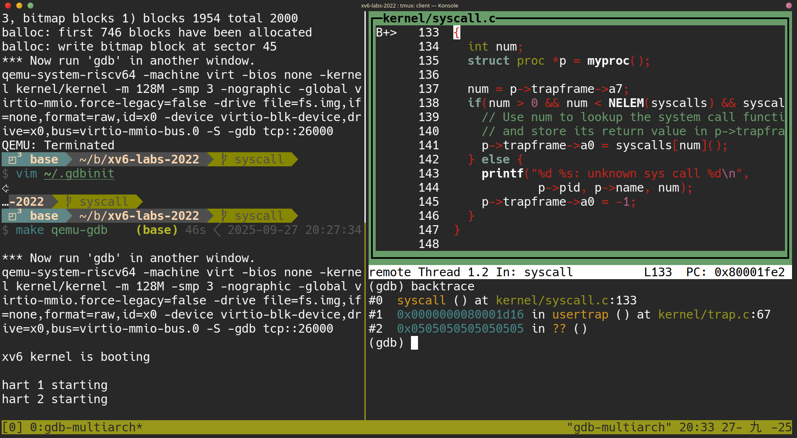
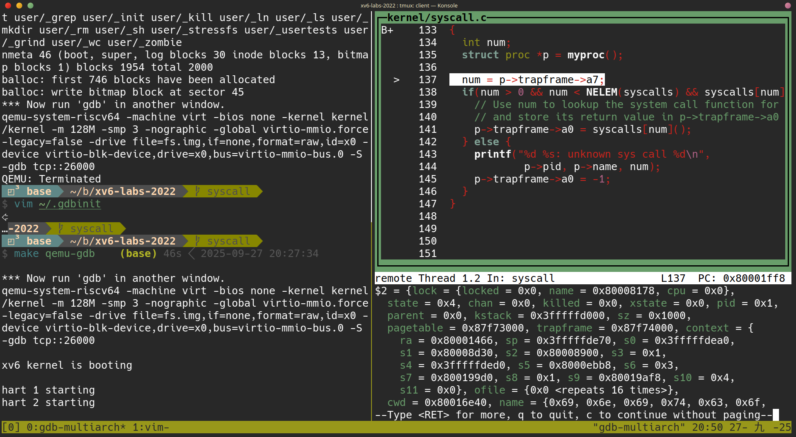
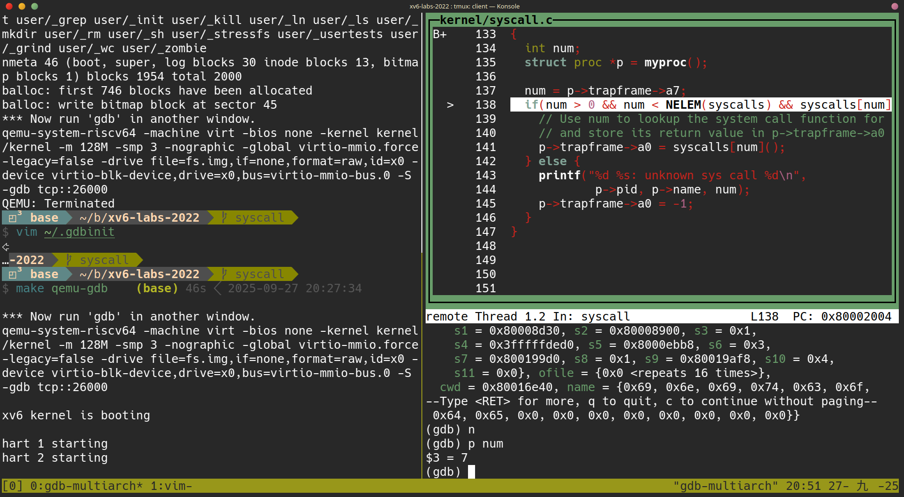
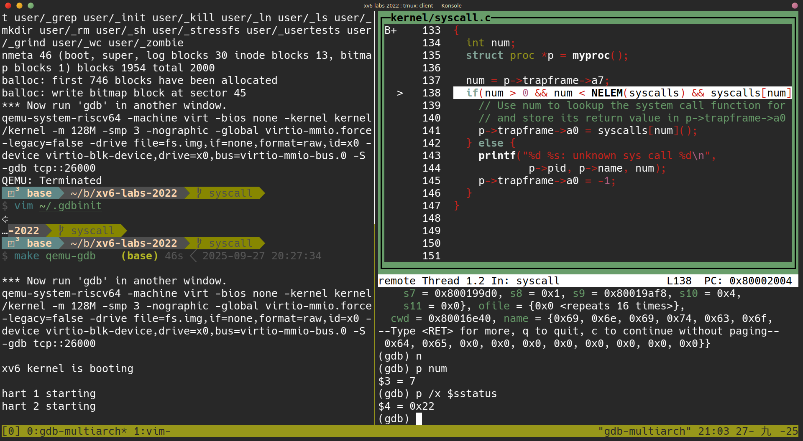

+++
date = '2025-09-24T13:07:09+08:00'
draft = false
title = '[xv6 學習紀錄 02] Lab: system calls'
series = ["xv6 學習紀錄"]
weight = 2
+++
Lab 連結: [Lab: system calls](https://pdos.csail.mit.edu/6.S081/2022/labs/syscall.html)

### 大綱
1. xv6 有哪些 system call，以及他們的作用為何 ?
1. 以程式碼的觀點來理解 xv6 的 system call 流程
1. Using gdb
1. System call tracing
---
## 1. xv6 有哪些 system call，以及他們的作用為何 ?
#### 0. ```kernel/syscall.h``` 定義 syste mcall 的編號
```c=
// System call numbers
#define SYS_fork    1
#define SYS_exit    2
#define SYS_wait    3
#define SYS_pipe    4
#define SYS_read    5
#define SYS_kill    6
#define SYS_exec    7
#define SYS_fstat   8
#define SYS_chdir   9
#define SYS_dup    10
#define SYS_getpid 11
#define SYS_sbrk   12
#define SYS_sleep  13
#define SYS_uptime 14
#define SYS_open   15
#define SYS_write  16
#define SYS_mknod  17
#define SYS_unlink 18
#define SYS_link   19
#define SYS_mkdir  20
#define SYS_close  21
```

## 2. 以程式碼的觀點來理解 xv6 的 system call 流程
以下使用 ```user/cat.c``` 為例，來探討 xv6 的 system call 流程，流程中有 3 大步驟
1. ```user/cat.c```：呼叫 ```read()```
    * ```user/user.h``` 用 C 語言宣告 ```read()```
    * ```user/usys.S``` 用組與實作 ```read()```
        * 組語 ```li a7, SYS_read``` 把 read 的編號丟到 register ```a7``` 裡
        * ```ecall``` 會連接到第2步驟
2. ```kernel/syscall.c``` 的 ```syscall()```
    * 藉由 register ```a7``` 的內容得知現在要執行 ```sys_read()```
3. ```kernel/sysfile.c``` 的 ```sys_read()``` 
    * 實際上的 system call 實作 

#### 1. ```user/cat.c```：呼叫 ```read()```
```c
// user/cat.c
#include "user/user.h"

void
cat(int fd)
{
  int n;

  while((n = read(fd, buf, sizeof(buf))) > 0) { // read() 需要呼叫到 system call
    if (write(1, buf, n) != n) {
      fprintf(2, "cat: write error\n");
      exit(1);
    }
  }
  if(n < 0){
    fprintf(2, "cat: read error\n");
    exit(1);
  }
}
```

請注意這裡的 ```read()``` 雖然在 ```user/user.h``` 中有宣告
```c
// user/user.h
int read(int, void*, int);
```

但是 ```read()``` 並沒有被 C 語言實作出來，
而是利用 ```user/usys.pl``` 這個腳本產生出來的組合語言 `user/usys.S` 

```assembly
.global read
read:
 li a7, SYS_read   # 把 read 的編號丟到 register a7 裡
 ecall             # 進入 kernel mode 並且跑到步驟 2 執行
 ret
```
 

#### 2. ```kernel/syscall.c``` 的 ```syscall()```
```syscalls``` 這個 array 的宣告比較少見，可以參考[ [C 語言筆記--Day14] pointer, function, array 同時出現在一行宣告時該如何解讀
](https://ithelp.ithome.com.tw/articles/10272059)

```c
// system 的宣告，實作位於 kernel/sysproc.c 以及 kernel/sysfile.c
extern uint64 sys_fork(void);
extern uint64 sys_exit(void);
extern uint64 sys_wait(void);
extern uint64 sys_pipe(void);
extern uint64 sys_read(void);
extern uint64 sys_kill(void);
extern uint64 sys_exec(void);
extern uint64 sys_fstat(void);
extern uint64 sys_chdir(void);
extern uint64 sys_dup(void);
extern uint64 sys_getpid(void);
extern uint64 sys_sbrk(void);
extern uint64 sys_sleep(void);
extern uint64 sys_uptime(void);
extern uint64 sys_open(void);
extern uint64 sys_write(void);
extern uint64 sys_mknod(void);
extern uint64 sys_unlink(void);
extern uint64 sys_link(void);
extern uint64 sys_mkdir(void);
extern uint64 sys_close(void);

// syscalls 應該要被解讀為
// array of
// pointers to
// function with no arguments
// returning uint64
static uint64 (*syscalls[])(void) = {
[SYS_fork]    sys_fork,
[SYS_exit]    sys_exit,
[SYS_wait]    sys_wait,
[SYS_pipe]    sys_pipe,
[SYS_read]    sys_read,
[SYS_kill]    sys_kill,
[SYS_exec]    sys_exec,
[SYS_fstat]   sys_fstat,
[SYS_chdir]   sys_chdir,
[SYS_dup]     sys_dup,
[SYS_getpid]  sys_getpid,
[SYS_sbrk]    sys_sbrk,
[SYS_sleep]   sys_sleep,
[SYS_uptime]  sys_uptime,
[SYS_open]    sys_open,
[SYS_write]   sys_write,
[SYS_mknod]   sys_mknod,
[SYS_unlink]  sys_unlink,
[SYS_link]    sys_link,
[SYS_mkdir]   sys_mkdir,
[SYS_close]   sys_close,
};

void
syscall(void)     // cat.c 呼叫 read() ，read() 執行組語 ecall 之後會跑來這裡執行
{                 // 原因要到 lab trap 才會說明，目前只需要知道他會跑來這裡就可以了
  int num;
  struct proc *p = myproc();

  num = p->trapframe->a7;
  if(num > 0 && num < NELEM(syscalls) && syscalls[num]) {
    // Use num to lookup the system call function for num, call it,
    // and store its return value in p->trapframe->a0
    p->trapframe->a0 = syscalls[num]();   // 這裡是在呼叫 kernel/sysfile.c 的 sysr_read()
  } else {
    printf("%d %s: unknown sys call %d\n",
            p->pid, p->name, num);
    p->trapframe->a0 = -1;
  }
}
```

#### 3. ```kernel/sysfile.c``` 的 ```sys_read()``` 
system call 本身的實作，systemcall 
```c
uint64
sys_read(void) // 由步驟 2 呼叫而到這裡執行
{
  struct file *f;
  int n;
  uint64 p;

  argaddr(1, &p);
  argint(2, &n);
  if(argfd(0, 0, &f) < 0)
    return -1;
  return fileread(f, p, n);
}
```
## Using gdb (easy)
這個題目是 2022 年的版本才有出現的，目的在於熟悉 gdb 的操作
#### 用 gdb-multiarch debug xv6 的方式
這裡會需要開啟 2 個終端機
先在其中一個終端機輸入
```sh=
make qemu-gdb
```
在另一個終端機輸入
```sh=
gdb-multiarch
```
第一次執行 `gdb-multiarch` 時，可能會出現
```sh
To enable execution of this file add
        add-auto-load-safe-path <path>/xv6-labs-2022/.gdbinit
line to your configuration file "<home path>/.gdbinit".
```
就照著他的指示修改你的 `~/.gdbinit` 接著在重新 `make qemu-gdb` 與 `gdb-multiarch` 就可以了。

### 呼叫到 `syscall()` 的 function

在 `gdb-multiarch` 的終端機中，執行：
```gdb=
(gdb) b syscall
```
```gdb=
(gdb) c
```
```gdb=
(gdb) layout src
```
```gdb=
(gdb) backtrace
```

> Looking at the backtrace output, which function called syscall?   
  
這題的答案直接看執行的結果，可得知是在 `usertrap() at kernel/trap.c:67`



### `p->trapframe->a7` 的意義
>  Type n a few times to step pass `struct proc *p = myproc();` Once past this statement, type `p /x *p`, which prints the current process's `proc struct` (see `kernel/proc.h`) in hex. What is the value of `p->trapframe->a7` and what does that value represent? (Hint: look `user/initcode.S`, the first user program xv6 starts.)  

這題照著題目的指示做，可以知道 `p->trapframe->a7 == 7` 他的意義在於 
* `#define SYS_exec    7`  
題目也提及可以用 `user/initcode.S` 回推他的意義
  



### `sstatus` 的意義
> The processor is running in kernel mode, and we can print privileged registers such as sstatus (see [RISC-V privileged instructions](https://github.com/riscv/riscv-isa-manual/releases/download/Priv-v1.12/riscv-privileged-20211203.pdf) for a description): 


使用 `p /x $sstatus` 可以得知現在 sstatus 的值為 `0x22`

> What was the previous mode that the CPU was in? 
觀看 [RISC-V privileged instructions](https://github.com/riscv/riscv-isa-manual/releases/download/Priv-v1.12/riscv-privileged-20211203.pdf)
---
## 4. System call tracing
這個 lab 只需要照著下面的 some hints 一步一步的做，就可以完成了

#### 4.1. 在 `Makefile` 中的 `UPROGS` 區塊新增 `$U/_trace`:
之後再執行 `make qemu` 會發現以下的錯誤訊息：
```sh
user/trace.c:17:7: error: implicit declaration of function ‘trace’ [-Werror=implicit-function-declaration]
   17 |   if (trace(atoi(argv[1])) < 0) {
      |       ^~~~~
```
這是因為 ```trace()``` 還沒有宣告

#### 4.2. 讓 ```trace()``` 可以被成功編譯
先來說一下以程式碼的關點而言，我們想要的目的是：
1. 在 user space 的 ```user/trace.c``` 使用了 ```trace()```  

最後會呼叫到  

2. kernel space 的 ```kernel/sysproc.c```  的 ```sys_trace()```(要自己加) 這個 system call

所以我們一方面要處理 user space 的編譯問題，另一方面則是 kernel space 的問題:

##### 1. user space:
* 在 ```user/user.h``` 多加 ```int trace(int)``` 這個宣告：讓 ```user/trace.c``` 知道 ```trace()``` 的 prototype
* ```trace()``` 的實作(組合語言)：
    1. 在 ```user/usys.pl``` 加入 ```entry("trace")```
    2. 在 ```kernel/syscall.h``` 加入　```#define SYS_trace 22```
    
此時使用　```make qemu``` 已經可以順利開機了，但是執行 ``` trace 32 grep hello README;``` 卻會失敗，這是因為在 kernel 中，```sys_trace()``` 還沒有被實作出來(根本還不存在)，因此接下來要在 kernel 中加入 ```sys_trace()``` 這個 function

##### 2. kernel space
1. 在 ```kernel/syscall.c``` 中加入 
```C=
...
extern uint64 sys_unlink(void);
extern uint64 sys_link(void);
extern uint64 sys_mkdir(void);
extern uint64 sys_close(void);
extern uint64 sys_trace(void); // 新增這個!

// An array mapping syscall numbers from syscall.h
// to the function that handles the system call.
static uint64 (*syscalls[])(void) = {
/* ... */
[SYS_mkdir]   sys_mkdir,
[SYS_close]   sys_close,
[SYS_trace]   sys_trace, // 新增這個！
};
```

2. 在 ```kernel/sysproc.c``` 加入 ```sys_trace()``` 的本體
```C=
uint64
sys_trace(void)
{
    // TODO
    return 0;
}
```
此時使用 ```make qemu``` 把 xv6 開機，並且執行 ```trace 32 grep hello README;``` 已經不會出現 error 了，可是行為上什麼都不會發生，因為我們還沒有把 ```sys_trace()``` 實作完成

#### 4.3. 開始實作 ```SYS_trace``` 這個 system call
