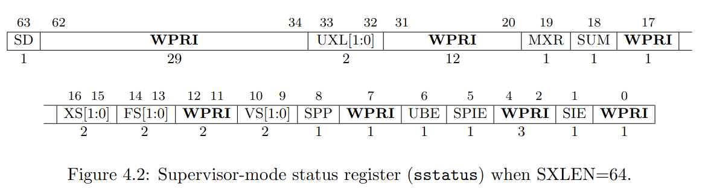

+++
date = '2025-09-24T13:07:09+08:00'
draft = false
title = '[xv6 學習紀錄 02] Lab: system calls'
series = ["xv6 學習紀錄"]
weight = 2
+++
Lab 連結: [Lab: system calls](https://pdos.csail.mit.edu/6.S081/2022/labs/syscall.html)

### 大綱
1. xv6 有哪些 system call，以及他們的作用為何 ?
1. 以程式碼的觀點來理解 xv6 的 system call 流程
1. Using gdb
1. System call tracing
---
## 1. xv6 有哪些 system call，以及他們的作用為何 ?
#### 0. ```kernel/syscall.h``` 定義 syste mcall 的編號
```c=
// System call numbers
#define SYS_fork    1
#define SYS_exit    2
#define SYS_wait    3
#define SYS_pipe    4
#define SYS_read    5
#define SYS_kill    6
#define SYS_exec    7
#define SYS_fstat   8
#define SYS_chdir   9
#define SYS_dup    10
#define SYS_getpid 11
#define SYS_sbrk   12
#define SYS_sleep  13
#define SYS_uptime 14
#define SYS_open   15
#define SYS_write  16
#define SYS_mknod  17
#define SYS_unlink 18
#define SYS_link   19
#define SYS_mkdir  20
#define SYS_close  21
```

## 2. 以程式碼的觀點來理解 xv6 的 system call 流程
以下使用 ```user/cat.c``` 為例，來探討 xv6 的 system call 流程，流程中有 3 大步驟
1. ```user/cat.c```：呼叫 ```read()```
    * ```user/user.h``` 用 C 語言宣告 ```read()```
    * ```user/usys.S``` 用組與實作 ```read()```
        * 組語 ```li a7, SYS_read``` 把 read 的編號丟到 register ```a7``` 裡
        * ```ecall``` 會連接到第2步驟
2. ```kernel/syscall.c``` 的 ```syscall()```
    * 藉由 register ```a7``` 的內容得知現在要執行 ```sys_read()```
3. ```kernel/sysfile.c``` 的 ```sys_read()``` 
    * 實際上的 system call 實作 

#### 1. ```user/cat.c```：呼叫 ```read()```
```c
// user/cat.c
#include "user/user.h"

void
cat(int fd)
{
  int n;

  while((n = read(fd, buf, sizeof(buf))) > 0) { // read() 需要呼叫到 system call
    if (write(1, buf, n) != n) {
      fprintf(2, "cat: write error\n");
      exit(1);
    }
  }
  if(n < 0){
    fprintf(2, "cat: read error\n");
    exit(1);
  }
}
```

請注意這裡的 ```read()``` 雖然在 ```user/user.h``` 中有宣告
```c
// user/user.h
int read(int, void*, int);
```

但是 ```read()``` 並沒有被 C 語言實作出來，
而是利用 ```user/usys.pl``` 這個腳本產生出來的組合語言 `user/usys.S` 

```assembly
.global read
read:
 li a7, SYS_read   # 把 read 的編號丟到 register a7 裡
 ecall             # 進入 kernel mode 並且跑到步驟 2 執行
 ret
```
 

#### 2. ```kernel/syscall.c``` 的 ```syscall()```
```syscalls``` 這個 array 的宣告比較少見，可以參考[ [C 語言筆記--Day14] pointer, function, array 同時出現在一行宣告時該如何解讀
](https://ithelp.ithome.com.tw/articles/10272059)

```c
// system 的宣告，實作位於 kernel/sysproc.c 以及 kernel/sysfile.c
extern uint64 sys_fork(void);
extern uint64 sys_exit(void);
extern uint64 sys_wait(void);
extern uint64 sys_pipe(void);
extern uint64 sys_read(void);
extern uint64 sys_kill(void);
extern uint64 sys_exec(void);
extern uint64 sys_fstat(void);
extern uint64 sys_chdir(void);
extern uint64 sys_dup(void);
extern uint64 sys_getpid(void);
extern uint64 sys_sbrk(void);
extern uint64 sys_sleep(void);
extern uint64 sys_uptime(void);
extern uint64 sys_open(void);
extern uint64 sys_write(void);
extern uint64 sys_mknod(void);
extern uint64 sys_unlink(void);
extern uint64 sys_link(void);
extern uint64 sys_mkdir(void);
extern uint64 sys_close(void);

// syscalls 應該要被解讀為
// array of
// pointers to
// function with no arguments
// returning uint64
static uint64 (*syscalls[])(void) = {
[SYS_fork]    sys_fork,
[SYS_exit]    sys_exit,
[SYS_wait]    sys_wait,
[SYS_pipe]    sys_pipe,
[SYS_read]    sys_read,
[SYS_kill]    sys_kill,
[SYS_exec]    sys_exec,
[SYS_fstat]   sys_fstat,
[SYS_chdir]   sys_chdir,
[SYS_dup]     sys_dup,
[SYS_getpid]  sys_getpid,
[SYS_sbrk]    sys_sbrk,
[SYS_sleep]   sys_sleep,
[SYS_uptime]  sys_uptime,
[SYS_open]    sys_open,
[SYS_write]   sys_write,
[SYS_mknod]   sys_mknod,
[SYS_unlink]  sys_unlink,
[SYS_link]    sys_link,
[SYS_mkdir]   sys_mkdir,
[SYS_close]   sys_close,
};

void
syscall(void)     // cat.c 呼叫 read() ，read() 執行組語 ecall 之後會跑來這裡執行
{                 // 原因要到 lab trap 才會說明，目前只需要知道他會跑來這裡就可以了
  int num;
  struct proc *p = myproc();

  num = p->trapframe->a7;
  if(num > 0 && num < NELEM(syscalls) && syscalls[num]) {
    // Use num to lookup the system call function for num, call it,
    // and store its return value in p->trapframe->a0
    p->trapframe->a0 = syscalls[num]();   // 這裡是在呼叫 kernel/sysfile.c 的 sysr_read()
  } else {
    printf("%d %s: unknown sys call %d\n",
            p->pid, p->name, num);
    p->trapframe->a0 = -1;
  }
}
```

#### 3. ```kernel/sysfile.c``` 的 ```sys_read()``` 
system call 本身的實作，systemcall 
```c
uint64
sys_read(void) // 由步驟 2 呼叫而到這裡執行
{
  struct file *f;
  int n;
  uint64 p;

  argaddr(1, &p);
  argint(2, &n);
  if(argfd(0, 0, &f) < 0)
    return -1;
  return fileread(f, p, n);
}
```
## Using gdb (easy)
這個題目是 2022 年的版本才有出現的，目的在於熟悉 gdb 的操作
#### 用 gdb-multiarch debug xv6 的方式
這裡會需要開啟 2 個終端機
先在其中一個終端機輸入
```sh=
make qemu-gdb
```
在另一個終端機輸入
```sh=
gdb-multiarch
```
第一次執行 `gdb-multiarch` 時，可能會出現
```sh
To enable execution of this file add
        add-auto-load-safe-path <path>/xv6-labs-2022/.gdbinit
line to your configuration file "<home path>/.gdbinit".
```
就照著他的指示修改你的 `~/.gdbinit` 接著在重新 `make qemu-gdb` 與 `gdb-multiarch` 就可以了。

### 呼叫到 `syscall()` 的 function

在 `gdb-multiarch` 的終端機中，執行：
```gdb=
(gdb) b syscall
```
```gdb=
(gdb) c
```
```gdb=
(gdb) layout src
```
```gdb=
(gdb) backtrace
```

> Looking at the backtrace output, which function called syscall?   
  
**答案**: 直接看執行的結果，可得知是在 `usertrap() at kernel/trap.c:67`


### `p->trapframe->a7` 的意義
>  Type n a few times to step pass `struct proc *p = myproc();` Once past this statement, type `p /x *p`, which prints the current process's `proc struct` (see `kernel/proc.h`) in hex. What is the value of `p->trapframe->a7` and what does that value represent? (Hint: look `user/initcode.S`, the first user program xv6 starts.)  

這題照著題目的指示做，可以知道 `p->trapframe->a7 == 7`
(以下兩張圖可以得知目前 `p->trapframe->a7 == 7`)


題目也提及可以用 `user/initcode.S` 回推他的意義
* `user/initcode.S`:
```asm
# Initial process that execs /init.
# This code runs in user space.

#include "syscall.h"

# exec(init, argv)
.globl start
start:
        la a0, init
        la a1, argv
        li a7, SYS_exec
        ecall

# for(;;) exit();
exit:
        li a7, SYS_exit
        ecall
        jal exit

# char init[] = "/init\0";
init:
  .string "/init\0"

# char *argv[] = { init, 0 };
.p2align 2
argv:
  .long init
  .long 0
```
**答案**：從這些訊息中，我們可以得知 `p->trapframe->a7 == 7` 的意義是源自於 `kernel/syscall.h` 中所定義的 `#define SYS_exec 7`，也可以推論出 `p->trapframe->a7` 是用來放置 system call 編號的地方。

### `sstatus` 的意義
> The processor is running in kernel mode, and we can print privileged registers such as sstatus (see [RISC-V privileged instructions](https://github.com/riscv/riscv-isa-manual/releases/download/Priv-v1.12/riscv-privileged-20211203.pdf) for a description): 


使用 `p /x $sstatus` 可以得知現在 sstatus 的值為 `0x22`  
查閱 [RISC-V privileged instructions](https://github.com/riscv/riscv-isa-manual/releases/download/Priv-v1.12/riscv-privileged-20211203.pdf) 的 Figure 4.2 我們可以知道 `sstatus` 有以下幾個 bits:



再來看看我們現在 `sstatus` 的值 `0x22 = 0b00000000000000000000000000100010` 對應到的 bits 為：
- `SIE == 1`: Supervisor Interrupt Enable bit is set, 代表在 supervisor mode 的時候，是允許 interrupt 的。
- `SPIE == 1`: Supervisor Previous Interrupt Enable bit is set, 這裡的 "Previous" 指的是在 trap 發生之前這個 bit 的狀態，可解讀為 trap 發生之前 `SIE == 1`
- `SPP == 0`: Supervisor Previous Privilege 為 0 代表前一個 CPU mode 為 user mode

> What was the previous mode that the CPU was in?   

**答案**: 根據 `SPP == 0` 得知前一個 CPU mode 為 user mode

## System call tracing (moderate)
題目敘述：
> In this assignment you will add a system call tracing feature that may help you when debugging later labs. You'll create a new trace system call that will control tracing. It should take one argument, an integer `mask`, whose bits specify which system calls to trace. For example, to trace the fork system call, a program calls `trace(1 << SYS_fork`), where `SYS_fork` is a syscall number from `kernel/syscall.h`. You have to modify the xv6 kernel to print out a line when each system call is about to return, if the system call's number is set in the `mask`. The line should contain the process id, the name of the system call and the return value; you don't need to print the system call arguments. The `trace` system call should enable tracing for the process that calls it and any children that it subsequently forks, but should not affect other processes. 

這個題目要我們實做出一個 system call `trace`

### 在 `Makefile` 中的 `UPROGS` 區塊新增 `$U/_trace`:
> Add `$U/_trace` to `UPROGS` in `Makefile`   

這個步驟跟前幾個 lab 一樣，這裡的 `user/trace.c` 是這個 lab 提供的範例程式，可以讓我們得知我們實做出來的 system call `trace` 最終會如何被使用。

### 讓 `trace()` 可以被成功編譯
> Run make qemu and you will see that the compiler cannot compile `user/trace.c`...
```sh
user/trace.c:17:7: error: implicit declaration of function ‘trace’ [-Werror=implicit-function-declaration]
   17 |   if (trace(atoi(argv[1])) < 0) {
      |       ^~~~~
```
這是因為我們在 `trace()` 還沒有在 `user/user.h` 中宣告

這裡先來回顧從 user program (`trace.c`) 要經過哪些步驟才可以呼叫到一個 system call (這個 lab 要實做的 `trace`):  
#### 1. `user/trace.c` 根據 `user/user.h` 呼叫 `trace()`
* `user/trace.c`:
```c
#include "user/user.h"    // <-- declare trace()

int
main(int argc, char *argv[])
{
  // ...
  if (trace(atoi(argv[1])) < 0) { // <-- call to trace()
    fprintf(2, "%s: trace failed\n", argv[0]);
    exit(1);
  }
  // ...
}
```
* `user/user.h`
```c
// system calls
int fork(void);
int exit(int) __attribute__((noreturn));
int wait(int*);
int pipe(int*);
int write(int, const void*, int);
int read(int, void*, int);
int close(int);
int kill(int);
int exec(const char*, char**);
int open(const char*, int);
int mknod(const char*, short, short);
int unlink(const char*);
int fstat(int fd, struct stat*);
int link(const char*, const char*);
int mkdir(const char*);
int chdir(const char*);
int dup(int);
int getpid(void);
char* sbrk(int);
int sleep(int);
int uptime(void);
int trace(int);  // <-- add declaration
```
在 user program 的這個層面上，我們要把 `int trace(int);` 加入到 `user.user.h` 中

#### 2. 利用組合語言 `user/usys.S`(透過 `user/usys.pl` 產生) 告知 `trace` 的位置
* `user/usys.S` (透過 `user/usys.pl` 產生, 它會需要吃 `kernel/syscall.h`)
```asm
#include "kernel/syscall.h" <-- add SYS_trace to "kernel/syscall.h"
.global fork
fork:
 li a7, SYS_fork
 ecall
 ret
.global exit
exit:
 li a7, SYS_exit
 ecall
 ret
...
```
* `user/usys.pl`
```perl
#!/usr/bin/perl -w

# Generate usys.S, the stubs for syscalls.

print "# generated by usys.pl - do not edit\n";

print "#include \"kernel/syscall.h\"\n";

sub entry {
    my $name = shift;
    print ".global $name\n";
    print "${name}:\n";
    print " li a7, SYS_${name}\n"; # <-- should add SYS_trace to "kernel/syscall.h"
    print " ecall\n";
    print " ret\n";
}
	
entry("fork");
entry("exit");
entry("wait");
entry("pipe");
entry("read");
entry("write");
entry("close");
entry("kill");
entry("exec");
entry("open");
entry("mknod");
entry("unlink");
entry("fstat");
entry("link");
entry("mkdir");
entry("chdir");
entry("dup");
entry("getpid");
entry("sbrk");
entry("sleep");
entry("uptime");
entry("trace"); # <-- add this entry
```
* `kernel/syscall.h`，這裡需要新增 `SYS_trace` `user/usys.pl` 在做處理的時候需要用到
```C
// System call numbers
#define SYS_fork    1
#define SYS_exit    2
#define SYS_wait    3
#define SYS_pipe    4
#define SYS_read    5
#define SYS_kill    6
#define SYS_exec    7
#define SYS_fstat   8
#define SYS_chdir   9
#define SYS_dup    10
#define SYS_getpid 11
#define SYS_sbrk   12
#define SYS_sleep  13
#define SYS_uptime 14
#define SYS_open   15
#define SYS_write  16
#define SYS_mknod  17
#define SYS_unlink 18
#define SYS_link   19
#define SYS_mkdir  20
#define SYS_close  21
#define SYS_trace  22 // <-- add this
```
在這個 user program 連接到 kernel system call 的層級上，我們需要做的就是修改 `kernel/syscall.h` 與 `user/usys.pl` 接著我們在透過 `Makefile` `make qemu` 時，就會產生出 `user/usys.S` 來告知 user program 的 `trace()` 最終要跑到 kernel 的 `sys_trace()` 執行。

現在已經可以使用 `make qemu` 編譯並跑起來了，但真的使用 `trace 32 grep hello README` 的時候卻會 fail，這是因為 `sys_trace()` 的定義還沒有寫出來

#### 寫出 `sys_trace()` 在 kernel 中的 definition
1. 在 `kernel/syscall.c` 中加入 
```C
...
extern uint64 sys_unlink(void);
extern uint64 sys_link(void);
extern uint64 sys_mkdir(void);
extern uint64 sys_close(void);
extern uint64 sys_trace(void); // 新增這個!

// An array mapping syscall numbers from syscall.h
// to the function that handles the system call.
static uint64 (*syscalls[])(void) = {
/* ... */
[SYS_mkdir]   sys_mkdir,
[SYS_close]   sys_close,
[SYS_trace]   sys_trace, // 新增這個！
};
```
順帶一題，在我先前寫過的筆記 [[C 語言筆記--Day14] pointer, function, array 同時出現在一行宣告時該如何解讀](https://ithelp.ithome.com.tw/articles/10272059) 有提及到這裡的 `syscalls` 應該解讀為

1. array of
1. pointers to
1. functions with no arguments
1. returning uint64  

因解讀時的原則為:
- 由內而外的解讀
- `[]` 跟 `()` 優先於 `*`


2. 在 `kernel/sysproc.c` 加入 `sys_trace()` 的本體
```C
uint64
sys_trace(void)
{
    // TODO
    return 0;
}
```
此時使用 `make qemu` 把 xv6 開機，並且執行 `trace 32 grep hello README;` 已經不會出現 error 了，可是行為上什麼都不會發生，因為我們還沒有把 `sys_trace()` 實作完成

### 實做 `sys_trace()`
經過先前一大串過程，終於成功編譯 `sys_trace()` 了，接著來實做 `sys_trace()`

> Add a `sys_trace()` function in `kernel/sysproc.c` that implements the new system call by remembering its argument in a new variable in the `proc` structure (see `kernel/proc.h`). The functions to retrieve system call arguments from user space are in `kernel/syscall.c`, and you can see examples of their use in `kernel/sysproc.c`. 

* `kernel/proc.h`: 在這裡新增一個記下 mask 的地方
```c
// Per-process state
struct proc {
  // ...                             
  uint trace_mask;             // for system call trace
};
```
* `kernel/sysproc.c`: 把 `trace()` 的 argiment 放入 `trace_mask` 中
```c
uint64
sys_trace(void)
{
  int trace_mask;

  argint(0, &trace_mask);
  myproc()->trace_mask = trace_mask;
  return 0;
}
```

> Modify `fork()` (see `kernel/proc.c`) to copy the trace mask from the parent to the child process.  
* `kernel/proc.c`: child 要繼承 parent 的 `trace_mask`
```c
int
fork(void)
{
  //...
  np->sz = p->sz;

  // copy saved user registers.
  *(np->trapframe) = *(p->trapframe);

  // Cause fork to return 0 in the child.
  np->trapframe->a0 = 0;

  // copy trace_mask to new process
  np->trace_mask = p->trace_mask;

  // ...
}
```

> Modify the `syscall()` function in `kernel/syscall.c` to print the trace output. You will need to add an array of `syscall` names to index into.  
* `krenel/syscall.c`: 如果有 `p->trace_mask` 的標記並且與當前的 systecm call number 符合 (`p->trace_mask & (1 << num)`) 則 `printf` 出題目所需要的資訊
```c
static char *syscall_names[] = {
[SYS_fork]    "fork",
[SYS_exit]    "exit",
[SYS_wait]    "wait",
[SYS_pipe]    "pipe",
[SYS_read]    "read",
[SYS_kill]    "kill",
[SYS_exec]    "exec",
[SYS_fstat]   "fstat",
[SYS_chdir]   "chdir",
[SYS_dup]     "dup",
[SYS_getpid]  "getpid",
[SYS_sbrk]    "sbrk",
[SYS_sleep]   "sleep",
[SYS_uptime]  "uptime",
[SYS_open]    "open",
[SYS_write]   "write",
[SYS_mknod]   "mknod",
[SYS_unlink]  "unlink",
[SYS_link]    "link",
[SYS_mkdir]   "mkdir",
[SYS_close]   "close",
[SYS_trace]   "trace",
};

void
syscall(void)
{
  int num;
  struct proc *p = myproc();

  num = p->trapframe->a7;
  if(num > 0 && num < NELEM(syscalls) && syscalls[num]) {
    // Use num to lookup the system call function for num, call it,
    // and store its return value in p->trapframe->a0
    p->trapframe->a0 = syscalls[num]();
    if (p->trace_mask & (1 << num)) {
      printf("%d: syscall %s -> %d\n", 
          p->pid, syscall_names[num], p->trapframe->a0);
    }
  } else {
    printf("%d %s: unknown sys call %d\n",
            p->pid, p->name, num);
    p->trapframe->a0 = -1;
  }
}
```
## Sysinfo (moderate)
題目敘述：
> In this assignment you will add a system call, `sysinfo`, that collects information about the running system. The system call takes one argument: a pointer to a struct `sysinfo` (see `kernel/sysinfo.h`). The kernel should fill out the fields of this struct: the `freemem` field should be set to the number of bytes of free memory, and the `nproc` field should be set to the number of processes whose state is not `UNUSED`. We provide a test program `sysinfotest`; you pass this assignment if it prints "sysinfotest: OK". 

### 新增 system call `sysinfo`
這裡跟前一題一樣，先新增一個 system call `sysinfo()`
* `user/user.h`: add `sysinfo(struct *sysinfo)`
* `user/usys.pl`: add `entry("sysinfo");`
* `kernel/syscall.h`: add `#define SYS_sysinfo 23`
* `kernel/syscall.c`: add `SYS_sysinfo` to `syscalls` and `syscall_names`
* `kernel/sysproc.c`: add the definition of `sys_sysinfo()`  

然後針對測試程式 `sysinfotest` 記得要修改 `Makefile` 中的 `UPROGS`

### 開始實做 `sys_sysinfo()`
首先我們可以先觀察題目所需要的 `sysinfo`:
```c
struct sysinfo {
  uint64 freemem;   // amount of free memory (bytes)
  uint64 nproc;     // number of process
};
```
包含了
1. `freemem`: 剩餘的 memory
2. `nproc`: 目前的 process 數量

接下來可以用三個面向來完成：
1. `sys_sysinfo()` 本身
2. `freemem()`: 取得剩餘的 memory
3. `nproc()`: 取得目前的 process 數量

### 1. `sys_sysinfo()` 本身
`sys_sysinfo()` 的實做較為單純，就只是把 kernel 中的 `kinfo` 複製到 user 中的 `uinfo`，這個動作可利用 `kernel/vm.c` 當中的 `copyout()` 達成

```c
uint64
sys_sysinfo(void)
{
  struct sysinfo *kinfo;
  struct proc *p = myproc();
  uint64 uinfo;

  argaddr(0, &uinfo);
  kinfo->freemem = freemem();
  kinfo->nproc = nproc();
  if (copyout(p->pagetable, uinfo, (char *) kinfo, sizeof(kinfo)) < 0)
    return -1;
  return 0;
}
```
接下來的重點就會在於 `freemem()` 與 `nproc()` 該如何實做出來

### 2. `nproc()`
`proc()` 需要回傳目前的

* `kernel/proc.h`: 可以利用 `struct proc` 中的 `state` 得知是否為使用中 (不為 `UNUSED` 都算)
```c
enum procstate { UNUSED, USED, SLEEPING, RUNNABLE, RUNNING, ZOMBIE };

// Per-process state
struct proc {
  struct spinlock lock;

  // p->lock must be held when using these:
  enum procstate state;        // Process state
  void *chan;                  // If non-zero, sleeping on chan
  int killed;                  // If non-zero, have been killed
  int xstate;                  // Exit status to be returned to parent's wait
  int pid;                     // Process ID

  // wait_lock must be held when using this:
  struct proc *parent;         // Parent process

  // these are private to the process, so p->lock need not be held.
  uint64 kstack;               // Virtual address of kernel stack
  uint64 sz;                   // Size of process memory (bytes)
  pagetable_t pagetable;       // User page table
  struct trapframe *trapframe; // data page for trampoline.S
  struct context context;      // swtch() here to run process
  struct file *ofile[NOFILE];  // Open files
  struct inode *cwd;           // Current directory
  char name[16];               // Process name (debugging)

  uint trace_mask;             // for system call trace
};
```
* `kernel/proc.c`: 有一個用來紀錄 process 的列表 `proc`
```c
#include "types.h"
#include "param.h"
#include "memlayout.h"
#include "riscv.h"
#include "spinlock.h"
#include "proc.h"
#include "defs.h"

struct cpu cpus[NCPU];

struct proc proc[NPROC];

// helps ensure that wakeups of wait()ing
// parents are not lost. helps obey the
// memory model when using p->parent.
// must be acquired before any p->lock.
struct spinlock wait_lock;

// ...
```
根據以上兩個程式碼片段，我們可以檢查 `proc` 中不為 `UNUSED` 的有多少
* `kernel/proc.c: nproc()`
```c
uint64
nproc()
{
  int num = 0;
  struct proc *p;

  for (p = proc; p < &proc[NPROC]; p++) {
    acquire(&p->lock);
    if (p->state != UNUSED)
      num++;
    release(&p->lock);
  }
  return num;
}
```

### 3. `freemem()`
這裡要看 `kernel/kalloc.c` 畢竟 memory allocation 的時候都是要經過這裡處理，我們也可以利用類似於 `kalloc()` 的程式碼片段
* `kernel/kalloc.c`:
```c
// ...

struct {
  struct spinlock lock;
  struct run *freelist;
} kmem;

// ...

void *
kalloc(void)
{
  struct run *r;

  acquire(&kmem.lock);
  r = kmem.freelist;
  if(r)
    kmem.freelist = r->next;
  release(&kmem.lock);

  if(r)
    memset((char*)r, 5, PGSIZE); // fill with junk
  return (void*)r;
}
```

另外要注意的事情是 `kmem.freelist` 中，每一個 node 指到的是一個 page 所以最後還要考慮到一個 page 的大小，定義於 `kernel/riscv.h` 中的 `PGSIZE`
```c
uint64
freemem(void)
{
  int npage = 0;
  struct run *r;

  acquire(&kmem.lock);
  r = kmem.freelist;
  while (r) {
    npage++;
    r = r->next;
  }
  release(&kmem.lock);
  return npage * PGSIZE;
}
```

最後要再 `kernel/defs.h` 宣告 `nproc()` 與 `freemem()`
* `kernel/defs.h`:
```c

// kalloc.c
// ...
uint64          freemem(void);

// proc.c
// ...
uint64          nproc(void);
```

最後使用 `sysinfotest` 做驗證，沒意外的話就完成這個 lab 了
