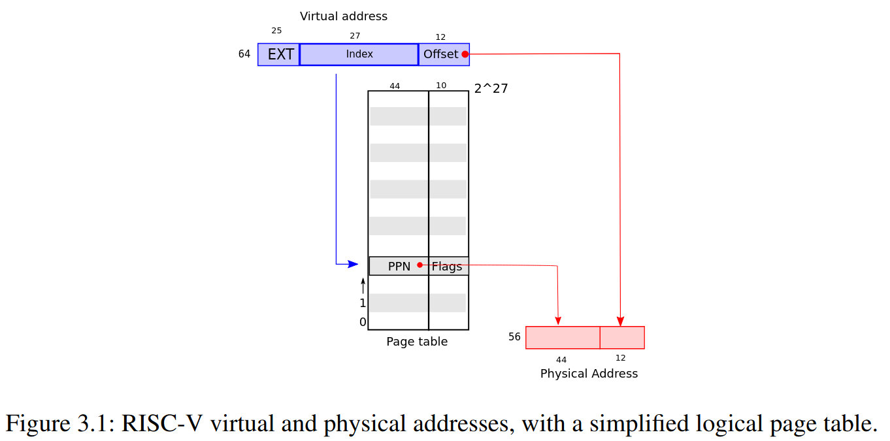
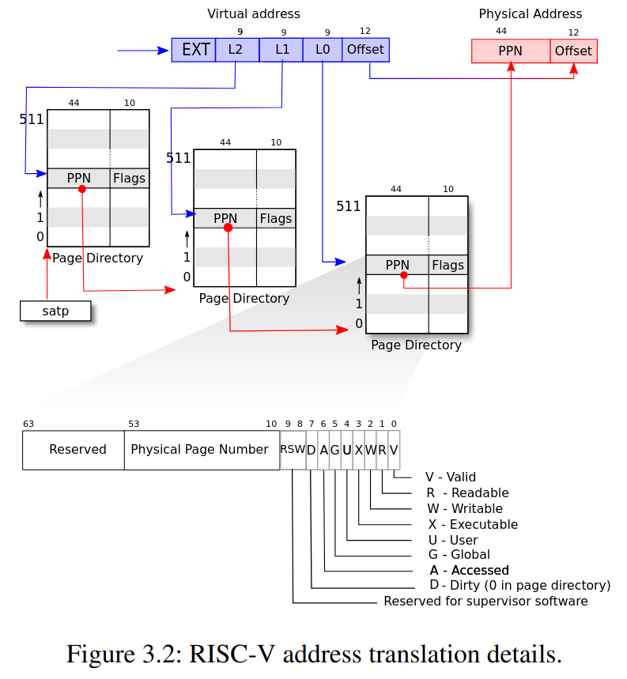
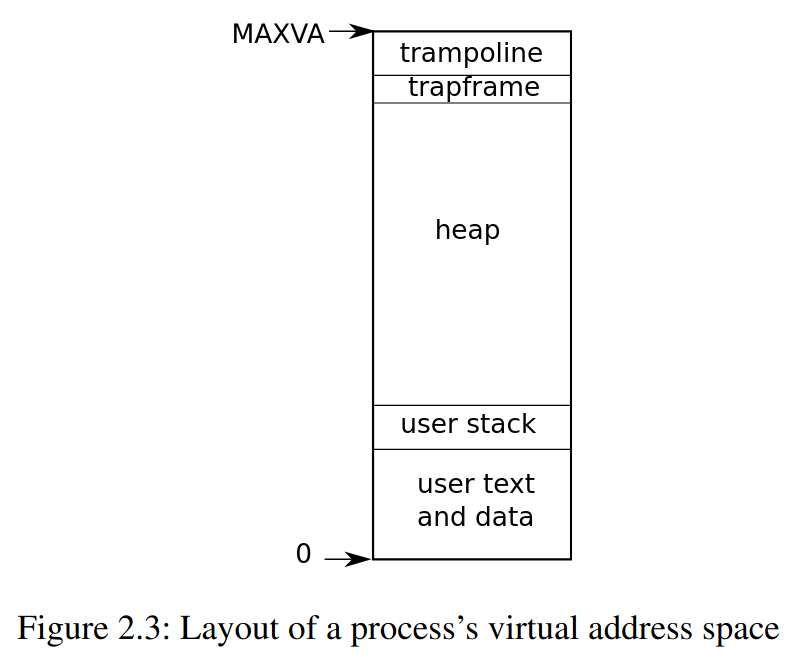
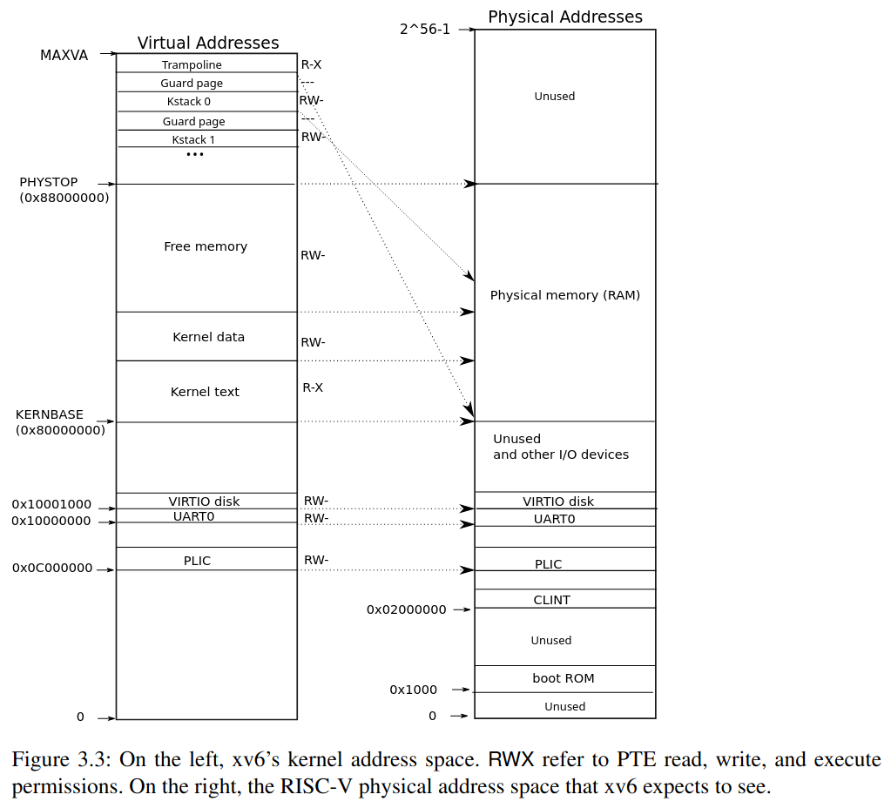
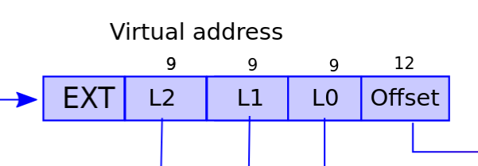
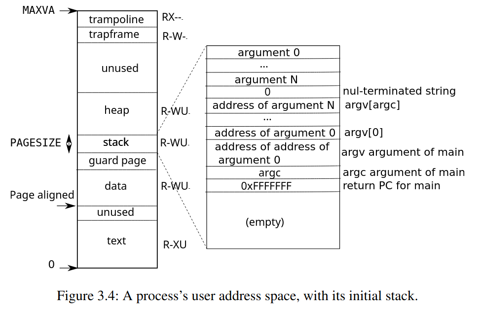

+++
date = '2025-10-13T12:32:56+08:00'
draft = false
title = '[xv6 學習紀錄 03-1] Virtual Memory 程式碼解析'
series = ["xv6 學習紀錄"]
weight = 31
+++
## xv6 中的 virtual memory



## memory layout
* 每一個 process 都會有自己的一個 page table，kernel 則是有它自己獨立的一個 page table
* 一般來說 kernel page table 會 map 所有的 physical address，這樣在 kernel mode 的時候就可以針對所有 pa 做動作



## Kernel address space

接著依序講解 `MAXVA`, `PHYSTOP`, `KERNBASE`
### `MAXVA`
* 如同先前提及，在 Sv39 中 virtual address 由 39 bits 組成

```c=
// kernel/riscv.h
// one beyond the highest possible virtual address.
// MAXVA is actually one bit less than the max allowed by
// Sv39, to avoid having to sign-extend virtual addresses
// that have the high bit set.
#define MAXVA (1L << (9 + 9 + 9 + 12 - 1))
```
最大的 virtual address `MAXVA` 是 `0b100 0000 0000 0000 0000 0000 0000 0000 0000 0000`(38 0s):
可以得知 Sv39 並沒有把 39 個 bits 用滿，實際上最大的 address 只會到
`MAXVA` - 1 = `0b011 1111 1111 1111 1111 1111 1111 1111 1111 1111`  
            = `0x3fffffffff`

### Direct Mapping 的區域：`KERNBASE` ~ `PHYSTOP`
這一段 `0x80000000` ~ `0x88000000` 是作為一般的 memory 空間使用，並且在 kernel 這一段的 mapping 中，是使用 Direct Mapping 的方式，也就是 `virtual address == physical address` 的意思，這麼做的好處在於 kernel 可以直接使用 physical address 對 memory 進行操作
```c=
// the kernel expects there to be RAM
// for use by the kernel and user pages
// from physical address 0x80000000 to PHYSTOP.
#define KERNBASE 0x80000000L
#define PHYSTOP (KERNBASE + 128*1024*1024)
```

### 非 Direct Mapping 的區域
#### Trampoline page
這是由最高的 virtual address map 到 `KERNBASE` ~ `PHYSTOP` 之中的 trampoline code 的位置，值得注意的是 trampoline code 的 page 被 map 到了兩次： 1. `MAXVA` 2. Direct mapping
#### Kernel stack page
Kernel 為每一個 process 預留了一個 kernel stack，因為這裡的 virtual address 很高，所以 xv6 還有空間可以在每一個 kernel stack 下方加一個 guard page (`PTE_V` is not set)，當 kernel stack overflow 時，這個 guard page 會觸發 `panic()` 而不會污染其他 process 的 kernel stack

另一種 kernel stack 的設計是直接把 kernel stack 使用 direct mapping 的 virtual address 中，不過這樣的壞處在於當我們要放入 guard page 時，等同於是直接浪費了 physical memory 的空間。

#### kernel 的 flag
* trampoline: `PTE_R` and `PTR_X`
* other: `PTE_R` and `PTR_W`
* guard page: invalid

## Process address space

每一個 process 都有自己的 page table，就像是上圖一樣 virtual address 的空間與 kernel address space 一樣，為 `0` ~ `MAXVA` 理論上可以 map 到 256 Gigabytes 的 memory

## 程式碼解析
在理解 virtual memory 的概念之後，題目建議我們先閱讀以下三個檔案：
> * `kernel/memlayout.h`, which captures the layout of memory.
> * `kernel/vm.c`, which contains most virtual memory (VM) code.
> * `kernel/kalloc.c`, which contains code for allocating and freeing physical memory. 

這讓我們可以清楚的知道圖片上的概念要如何與程式碼做連結

### 資料結構 `pagetable_t`, `pte_t`
那讓我們先從先前看過幾次的 page table 開始，
```C
typedef uint64 pte_t;
typedef uint64 *pagetable_t; // 512 PTEs
```
page table 對應到的是一個 `pagetable_t`，並且可以把它想成是 array of PTE(`pte_t`)，這也相當合理，如同先前的圖片所示，page table 本身也就只是用來紀錄 512 個 PTE 的資料結構。

### 用來基本操作的 macro: `PX()`, `PTE2PA()`, `PA2PTE()`
* `PX()`: **P**agetable inde**x**
* `PTE2PA()`: PTE to PA
* `PA2PTE()`: PA to PTE
#### `PX()` 解析
在 xv6 中，一個 virtual memory address 中有 3 個 9 bits 的 pagetable index，`PX()` 的功用就是把一個 virtual memory address 中的其中一個 level 的 9 physical page number (PPN) 取出來
```c=
#define PGSHIFT 12  // bits of offset within a page

// extract the three 9-bit page table indices from a virtual address.
#define PXMASK          0x1FF // 9 bits
#define PXSHIFT(level)  (PGSHIFT+(9*(level)))
#define PX(level, va) ((((uint64) (va)) >> PXSHIFT(level)) & PXMASK)
```
根據 level 把 virtual memory address 中的其中 9 bits PPN 移動到 64-bits 的最右邊，再利用 `PXMASK` 篩選剩下 9 個 bits

目前我們有了 `PX()`，可以從 va 中找到其中一個 level 的 PPN，如果現在有一個 pagetable，搭配上剛剛找到的 PPN，我們便可以找到對應的 PTE，舉例來說像是 `walk() at kernel/vm.c` 的其中一行：

`PX()` 的應用：在「va 經由 pagetable 找到對應的 PTE」的過程中，`PX()` 起到了方便的作用，舉例像是 `walk() at kernel/vm.c` 的其中一行：

```c
// kernel/vm.c
pte_t *
walk(pagetable_t pagetable, uint64 va, int alloc)
{
  if(va >= MAXVA)
    panic("walk");

  for(int level = 2; level > 0; level--) {
    pte_t *pte = &pagetable[PX(level, va)];         // 這一行！
    if(*pte & PTE_V) {
      pagetable = (pagetable_t)PTE2PA(*pte);
    } else {
      if(!alloc || (pagetable = (pde_t*)kalloc()) == 0)
        return 0;
      memset(pagetable, 0, PGSIZE);
      *pte = PA2PTE(pagetable) | PTE_V;
    }
  }
  return &pagetable[PX(0, va)];
}
```
就是一個使用到 `PX()` 的例子:
1. 利用 va, level 丟入 `PX()` 找到 index: `PX(level, va)`
2. 再利用這個 index(`PX(level, va)`) 從 pagetable 中拿到 PTE
    * `pte_t *pte = &pagetable[PX(level, va)]`

#### `PTE2PA()` 解析
剛剛我們已經利用了 `PX()` 讓 va 透過 pagetable 找到對應的 pte，拿到 pte 後，我們要有能力把這個 pte 轉換成 physical memory address (PA) 這是我們最終的目的: 「va 透過 pagetable 找到 PA」

這正是 `PTE2PA()` 所要處理的事情
```C
#define PTE2PA(pte) (((pte) >> 10) << 12)
```
把 pte 當中的 (PPN) physical page number 擷取出來

#### `PA2PTE()` 解析
```C
// shift a physical address to the right place for a PTE.
#define PA2PTE(pa) ((((uint64)pa) >> 12) << 10)
```

* 把一個 physical memory 的 offset 去掉，並且做成一個 pte (shift left 10)
* 請注意這個做好的 pte 的 flag 的地方全部都是 0，需要自己把 flag 設定上

#### `PGROUNDUP()`, `PGROUNDDOWN()` 解析
```c
// kernel/riscv.h
#define PGSIZE 4096 // bytes per page
#define PGROUNDUP(sz)  (((sz)+PGSIZE-1) & ~(PGSIZE-1))
#define PGROUNDDOWN(a) (((a)) & ~(PGSIZE-1))
```

* `& ~(PGSIZE-1)`
    1. `PGSIZE` 是 4096, 二進位為 1000000000000 (12 個 0)
    1. `PGSIZE-1` 二進位為 `0111111111111` (12 個 1)
    1. `~(PGSIZE-1)` 形成一種 mask `...1111 000000000000` (12 個 0)
    1. `& ~(PGSIZE-1)` 使用了 `&`, 也就是把低位的 12 個 bits 都變為 0, 也就是取得一個 address 的所屬 page 的起始位置
* `#define PGROUNDDOWN(a) (((a)) & ~(PGSIZE-1))`: 取得 `a` 所屬 page 的起始位置
* `#define PGROUNDUP(sz)  (((sz)+PGSIZE-1) & ~(PGSIZE-1))`: `sz` bytes 所需要的 page 數量

#### `walk()` 解析
在大多數情況下，va 透過 pagetable 得到 pa 的動作，像是：
```C
a = 10;
```
這種動作是由硬體完成的，risc-v 的 register `satp` 會紀錄當下 pagetable 的 **physicall** address
, 一旦有了 `satp` 所紀錄的這個 pagetable 的 physicall address，
硬體就有辦法把程式中的 va 藉由 pagetable(從 `satp` 得知) 轉換成 pa

可是在 kernel 中的**某些地方**(`todo`: 實際上在哪邊？)
會需要在程式中就直接拿到最後一個 level (level 0) 的 PTE (有點類似用軟體做出硬體的行為)
試想我們有一個 va 以及 pagetable，想要拿到最後一個 level 的 PTE，可以用 `walk()` 來達成:

```C
// Return the address of the PTE in page table pagetable
// that corresponds to virtual address va.  If alloc!=0,
// create any required page-table pages.
// 根據 virtual address va 以及 pate table patetable
// 回傳 PTE 的 address (physical memory)

// The risc-v Sv39 scheme has three levels of page-table
// pages. A page-table page contains 512 64-bit PTEs.
// A 64-bit virtual address is split into five fields:
//   39..63 -- must be zero.
//   30..38 -- 9 bits of level-2 index.
//   21..29 -- 9 bits of level-1 index.
//   12..20 -- 9 bits of level-0 index.
//    0..11 -- 12 bits of byte offset within the page.
pte_t *
walk(pagetable_t pagetable, uint64 va, int alloc) // pagetable 紀錄的是 pa
{
  if(va >= MAXVA)
    panic("walk");
  
  // level 只會是 2, 1, 
  // (迴圈 level == 2 開始)
  // pagetable -> level 2 的 pagetable 的 pa
  // pte_t *pte = &pagetable[PX(2, va)] 
      // -> (level 2 pagetable 中) 指向 level 1 的 pagetable 的 pte
  // pagetable = (pagetable_t)PTE2PA(*pte); -> pagetable 變成指向 level 1 的 pagetable
  // (迴圈 level == 1 開始)
  // pte_t *pte = &pagetable[PX(2, va)] -> 指向 level 0 的 pagetable 的 pte
      // -> (level 1 pagetable 中) 指向 level 0 的 pagetable 的 pte
  // pagetable = (pagetable_t)PTE2PA(*pte); -> pagetable 變成指向 level 0 的 pagetable
  for(int level = 2; level > 0; level--) {
    pte_t *pte = &pagetable[PX(level, va)]; // get pte by virtual address and level (in physical address)
    if(*pte & PTE_V) {
      pagetable = (pagetable_t)PTE2PA(*pte); // pagetable 是指向下一層的 pagetable
    } else {
      // 如果這個 PTE 還沒有被 allocate，並且 alloc != 0 (alloc == true 的意思)
      // 則 allocate 這個 PTE
      // 使用 kalloc() 告訴 xv6: 我要一塊 page 來存放一個 pagetable
      // (pte_t *) 是想表達 pagetable 是 pte_t 的 array 的意思
      if(!alloc || (pagetable = (pde_t*)kalloc()) == 0)
        return 0;
      // 清空這個新的 pagetable 
      // (注意這時候，memset 吃的是 pa, 可是 user mode 時，function 吃的是 va)
      memset(pagetable, 0, PGSIZE);
      // 把這個新的 PTE 的 flag PTE_V set 為 1
      *pte = PA2PTE(pagetable) | PTE_V; 
    }
  }

  // 到了這裡 pagetable 已經是一個指向 level 0 的 page table 的 pa
  // 有了這個 page table 以及 va 中 level 0 的 9 bits 的 index
  // 就可以拿到最終我們要的 PTE
  return &pagetable[PX(0, va)];
}
```
* `walk()` 是用來根據 pagetable 以及 virtual memory address 來取得這個 va 的 pte
* `pagetable_t` 紀錄的是 physical memory
* `walk()` 回傳 `pte_t *` 也就是 figure 3.2 所描述的那樣
    * 54..63 -- 10 bits Reserved
    * 10..53 -- 44 bits Physical Page Number
    *  0..9  -- 10 bits Flags
* 有了 PTE 之後可以幹嘛?
    * 有了 PTE 之後，就可以再利用 va 的 12 bits offset 來得到 pa
    * 請注意，在大多數真正的 access pagetable 的情況下**並不會**使用 `walk()`，而是用硬體的方式處理

#### `walkaddr()` 解析
```c
// Look up a virtual address, return the physical address,
// or 0 if not mapped.
// Can only be used to look up user pages.
uint64
walkaddr(pagetable_t pagetable, uint64 va)
{
  pte_t *pte;
  uint64 pa;

  if(va >= MAXVA)
    return 0;

  pte = walk(pagetable, va, 0);
  if(pte == 0)
    return 0;
  if((*pte & PTE_V) == 0)
    return 0;
  if((*pte & PTE_U) == 0)
    return 0;
  pa = PTE2PA(*pte);
  return pa;
}
```
`walk()` 拿到的是 PTE, `walkaddr()` 多的加工變成 physical address

#### `mappages()` 解析
現在我們有了一些 macro 可以處理 va, pa, page table, pte 的轉換

`mappages()` 使用了情況:  
在 page table `pagetale` 中記下一筆資訊:
> virtual address `va` 透過 `pagetable` 會對應到 physical address `pa`  

這也正是 page table 最主要的功能

(這個對應是以一個 page (4096 byte) 做為一個單位去做 map 的)

```C
// kernel/riscv.h
typedef uint64 pte_t;
typedef uint64 *pagetable_t; // 512 PTEs

// kernel/vm.c
int
mappages(pagetable_t pagetable, uint64 va, uint64 size, uint64 pa, int perm)
{
  uint64 a, last;
  pte_t *pte;

  if(size == 0)
    panic("mappages: size");
  
  // map 必須要以一個 page 為單位, 所以需要 round up 以及 round down
  a = PGROUNDDOWN(va);
  last = PGROUNDDOWN(va + size - 1);
  for(;;){
    // 拿到 virtual address a 的 pte (walk() 會幫我們 allocate, 它使用 kalloc())
    if((pte = walk(pagetable, a, 1)) == 0) // walk 失敗時 return 0
      return -1;
    if(*pte & PTE_V) // walk() 回傳的 pte 是還沒 set PTE_V 的
      panic("mappages: remap");

    // 在這裡，我們拿到了 level 0 pagetable 中對應到 va `a` 的 pte
    // 現在它還沒被賦予值，現在我們要告訴這個 PTE: 你要指到 pa 去!
    *pte = PA2PTE(pa) | perm | PTE_V; // pte 對應到了 pa
    if(a == last)
      break;
    a += PGSIZE;
    pa += PGSIZE;
  }
  return 0;
}
```
`mappages()` 是用來把一個 pa 塞進一個 pagetable 裡，並且我們可以指定它的 va 以及 flag

#### `proc_pagetable()` 解析
`proc_pagetable()` 用來初始化一個新的 process 中的 `pagetable`
```c
// Per-process state
struct proc {
  // ...
  pagetable_t pagetable; // proc_pagetable() 負責初始這裡
  // ...
};
```
```c
// Create a user page table for a given process, with no user memory,
// but with trampoline and trapframe pages.
// 把一個 process 的 pagetable 做出來，
// 但這時候只有 trampoline 跟 trapframe 有被紀錄在 page table 中
pagetable_t
proc_pagetable(struct proc *p)
{
  pagetable_t pagetable;

  // An empty page table.
  pagetable = uvmcreate();
  if(pagetable == 0)
    return 0;

  // map the trampoline code (for system call return)
  // at the highest user virtual address.
  // only the supervisor uses it, on the way
  // to/from user space, so not PTE_U.
  if(mappages(pagetable, TRAMPOLINE, PGSIZE,
              (uint64)trampoline, PTE_R | PTE_X) < 0){
    uvmfree(pagetable, 0);
    return 0;
  }

  // map the trapframe page just below the trampoline page, for
  // trampoline.S.
  if(mappages(pagetable, TRAPFRAME, PGSIZE,
              (uint64)(p->trapframe), PTE_R | PTE_W) < 0){
    uvmunmap(pagetable, TRAMPOLINE, 1, 0);
    uvmfree(pagetable, 0);
    return 0;
  }

  return pagetable;
}
```
* `proc_pagetable()` 所使用的 function 有:
    * `mappages()`: 宣稱 `va` 經由 `pagetable` map 到 `pa` (可利用 `walk()` 查詢)
    * `uvmcreate()`: 利用 `kalloc()` 做出一個全新的 pagetable (只有一個 level)
    * `uvmunmap()`
    * `uvmfree()`


#### `uvmcreate()` 解析
```C
// create an empty user page table.
// returns 0 if out of memory.
pagetable_t
uvmcreate()
{
  pagetable_t pagetable;
  pagetable = (pagetable_t) kalloc();
  if(pagetable == 0)
    return 0;
  memset(pagetable, 0, PGSIZE);
  return pagetable;
}
```
* `uvmcreate()` 利用 `kalloc()` 做出一個全新的 pagetable
* 請注意，pagetable 所紀錄的是 physical memory


#### `uvmunmap()` 解析: `mappages()` 的相反, 宣稱一些 va 取消 mapping 了
```C
// Remove npages of mappings starting from va. va must be
// page-aligned. The mappings must exist.
// Optionally free the physical memory.
void
uvmunmap(pagetable_t pagetable, uint64 va, uint64 npages, int do_free)
{
  uint64 a;
  pte_t *pte;

  if((va % PGSIZE) != 0) // 傳進來的 va 應該要是 start of the pagetable
    panic("uvmunmap: not aligned");

  for(a = va; a < va + npages*PGSIZE; a += PGSIZE){
    // 如果這個要被 unmap 的 page (virtual address) 根本沒有 map 到 pa
    if((pte = walk(pagetable, a, 0)) == 0)
      panic("uvmunmap: walk");
    // 它應該要是 valid
    if((*pte & PTE_V) == 0)
      panic("uvmunmap: not mapped");
    if(PTE_FLAGS(*pte) == PTE_V)
      panic("uvmunmap: not a leaf");
    if(do_free){
      uint64 pa = PTE2PA(*pte);
      kfree((void*)pa);
    }
    *pte = 0;
  }
}
```
* `va` 必須為 `PGSIZE` 的倍數 (start of the pagetable)
* unmap 跟 free 是兩回事
    * free: 把這個 physical address 加回 `kmem.freelist` 中
        * 要用 `kfree((void *) pa)`
    * unmap: 僅限於對於這個 pagetable 而言，把這個 virtual memory address 移除
        * 所謂的移除，也就是把最後一層的 page table entry 給清為 0 `*pte = 0`

#### `uvmfree()` 解析
```C
// Free user memory pages,
// then free page-table pages.
void
uvmfree(pagetable_t pagetable, uint64 sz)
{
  if(sz > 0)
    uvmunmap(pagetable, 0, PGROUNDUP(sz)/PGSIZE, 1);
  freewalk(pagetable);
}
```
`uvmfree()` 不只把 va unmap 還會把這些 memory free 掉

#### `freewalk()` 解析
```c
// Recursively free page-table pages.
// All leaf mappings must already have been removed.
void
freewalk(pagetable_t pagetable)
{
  // there are 2^9 = 512 PTEs in a page table.
  for(int i = 0; i < 512; i++){
    pte_t pte = pagetable[i];
    if((pte & PTE_V) && (pte & (PTE_R|PTE_W|PTE_X)) == 0){
      // PTE_V 為 1 PTE_R, PTE_W, PTE_X 為 0 代表:
      // this PTE points to a lower-level page table.
      // 因為在 level 0 pagetable 中的 PTE 如果 PTE_V == 0 
      // 必定 PTE_R, PTE_W, PTE_X 會有至少一個為 1
      uint64 child = PTE2PA(pte);
      freewalk((pagetable_t)child);
      pagetable[i] = 0;
    } else if(pte & PTE_V){
      // 在呼叫 freewalk() 之前，
      // caller (例如 uvmfree() )
      // 具有先將這段 va uvmunmap() 的責任
      // freewalk() 只負責清理 pagetable 的部份
      // 所以不該進到這個 condition
      panic("freewalk: leaf");
    }
  }
  kfree((void*)pagetable);
}
```


#### `kalloc()` 解析
```C
// Allocate one 4096-byte page of physical memory.
// Returns a pointer that the kernel can use.
// Returns 0 if the memory cannot be allocated.
void *
kalloc(void)
{
  struct run *r;

  acquire(&kmem.lock);
  r = kmem.freelist;
  if(r)
    kmem.freelist = r->next;
  release(&kmem.lock);

  if(r)
    memset((char*)r, 5, PGSIZE); // fill with junk
  return (void*)r;
}
```
* 在 xv6 中，所有可以用的 page 會被紀錄在 `kmem.freelist` 當中
```C
struct run {
  struct run *next;
};

struct {
  struct spinlock lock;
  struct run *freelist;
} kmem;
```
* `kalloc()` 回傳一個 4096-bytes(`PGSIZE`) 的 page
* 回傳的 pointer 指向 physical memory
    * supervisor mode 時，kernel page table 具有 `Virtual Address = Physical Address` 的特性
* kmem 的初始化過程很值得追蹤


#### `uvmcopy()` 解析

```C
// 把 old 的內容複製給 new
// sz 為 page 的數量，每個 page 的大小為 4096 byte
int
uvmcopy(pagetable_t old, pagetable_t new, uint64 sz)
{
  pte_t *pte;
  uint64 pa, i;
  uint flags;
  char *mem;

  for(i = 0; i < sz; i += PGSIZE){
    if((pte = walk(old, i, 0)) == 0)
      panic("uvmcopy: pte should exist");
    if((*pte & PTE_V) == 0)
      panic("uvmcopy: page not present");
    pa = PTE2PA(*pte); // 用 parent 的 pte 拿到 physical address
    flags = PTE_FLAGS(*pte); // 拿到 parent 的 pte 的 flags

    // mem 是 child 的 physical memory (其中一個 page, 目前是全新的)
    if((mem = kalloc()) == 0) // mem 是 child 的 physical memory (其中一個 page)
      goto err;
    memmove(mem, (char*)pa, PGSIZE); // parent 的內容搬到 child 的 memory 中 (都用 pa)
    // 現在有了 mem (一個 page 的 pa)
    // 接下來要把這個 page map 到 child 的 pagetable (new) 中
    if(mappages(new, i, PGSIZE, (uint64)mem, flags) != 0){
      kfree(mem);
      goto err;
    }
  }
  return 0;

 err:
  uvmunmap(new, 0, i / PGSIZE, 1);
  return -1;
}
```
* `uvmcopy()` 在 `fork()` 的過程中扮演了重要的角色，這也是為什麼使用 `fork()` 時，會有 parent 與 child 的 memory 內容一樣的特性
* `uvmcopy()` 把一個 parent 的 page table 複製給 child，
* 包含了 page table 以及 physical memory 的內容
* 失敗時回傳 `-1`，並且把先前 allocate 的 page 都給 free 掉

#### `memmove()` 解析
`memmove()` 把 `n` bytes 的內容從 `src` 搬到 `dst`
```C
void*
memmove(void *dst, const void *src, uint n)
{
  const char *s;
  char *d;

  if(n == 0)
    return dst;
  
  s = src;
  d = dst;
  if(s < d && s + n > d){
    s += n;
    d += n;
    while(n-- > 0)
      *--d = *--s;
  } else
    // 這個 loop 也寫的太 clever 了
    while(n-- > 0)
      *d++ = *s++;

  return dst;
}
```

#### `malloc()` 解析
`malloc()` 用來 allocate `nbytes` 個 bytes 的記憶體空間
```C
void*
malloc(uint nbytes)
{
  Header *p, *prevp;
  uint nunits;

  nunits = (nbytes + sizeof(Header) - 1)/sizeof(Header) + 1;
  if((prevp = freep) == 0){
    base.s.ptr = freep = prevp = &base;
    base.s.size = 0;
  }
  for(p = prevp->s.ptr; ; prevp = p, p = p->s.ptr){
    if(p->s.size >= nunits){
      if(p->s.size == nunits)
        prevp->s.ptr = p->s.ptr;
      else {
        p->s.size -= nunits;
        p += p->s.size;
        p->s.size = nunits;
      }
      freep = prevp;
      return (void*)(p + 1);
    }
    if(p == freep)
      if((p = morecore(nunits)) == 0)
        return 0;
  }
}
```

#### `copyout()` 解析
```C
// Copy from kernel to user.
// Copy len bytes from src to virtual address dstva in a given page table.
// Return 0 on success, -1 on error.
int
copyout(pagetable_t pagetable, uint64 dstva, char *src, uint64 len)
{
  uint64 n, va0, pa0;

  while(len > 0){
    va0 = PGROUNDDOWN(dstva);
    pa0 = walkaddr(pagetable, va0);
    if(pa0 == 0)
      return -1;
    n = PGSIZE - (dstva - va0);
    if(n > len)
      n = len;
    // 因為這裡吃的都是 pa
    memmove((void *)(pa0 + (dstva - va0)), src, n);

    len -= n;
    src += n;
    dstva = va0 + PGSIZE;
  }
  return 0;
}
```

## Creating an address space
在 `vm.c` 中，最重要的 struct 就是 `pagetable_t`
另外有兩個重要的 function:
1. `walk()`: 利用 virtual address 找到 physical address
1. `mappages()`: 把 `va -> pa` 的資訊填入 pagetable 中
這兩個幾乎就是 pagetable 會用到的最主要的功能

在 `vm.c` 中，還有許多操作上的 function
1. `kvm` 開頭的是針對 kernel page table
1. `uvm` 開頭的是針對 user page table

另外要使用
1. `copyout()`: 從 kernel copy 到 user
1. `copyin()`: 從 user copy 到 kernel

* `kernel/main.c: main()`: 在初始階段使用 `kvminit()`
```c
// start() jumps here in supervisor mode on all CPUs.
void
main()
{
  if(cpuid() == 0){
    consoleinit();
    printfinit();
    printf("\n");
    printf("xv6 kernel is booting\n");
    printf("\n");
    kinit();         // physical page allocator
    kvminit();       // create kernel page table
    kvminithart();   // turn on paging
    // ...
  } else {
    // ...
  }

  scheduler();        
}
```

* `kvminit()`: 接著使用 `kvmmake()`
```c
// Initialize the one kernel_pagetable
void
kvminit(void)
{
  kernel_pagetable = kvmmake();
}
```

* `kvmmake()`:
```c
// Make a direct-map page table for the kernel.
pagetable_t
kvmmake(void)
{
  pagetable_t kpgtbl;

  // 初始一個 page
  kpgtbl = (pagetable_t) kalloc();
  memset(kpgtbl, 0, PGSIZE);

  // 使用 kvmmap() 把一些 mapping 填入 kpgtbl
  // uart registers
  kvmmap(kpgtbl, UART0, UART0, PGSIZE, PTE_R | PTE_W);

  // virtio mmio disk interface
  kvmmap(kpgtbl, VIRTIO0, VIRTIO0, PGSIZE, PTE_R | PTE_W);

  // PLIC
  kvmmap(kpgtbl, PLIC, PLIC, 0x400000, PTE_R | PTE_W);

  // map kernel text executable and read-only.
  kvmmap(kpgtbl, KERNBASE, KERNBASE, (uint64)etext-KERNBASE, PTE_R | PTE_X);

  // map direct mapping 的區段
  // map kernel data and the physical RAM we'll make use of.
  kvmmap(kpgtbl, (uint64)etext, (uint64)etext, PHYSTOP-(uint64)etext, PTE_R | PTE_W);

  // map the trampoline for trap entry/exit to
  // the highest virtual address in the kernel.
  kvmmap(kpgtbl, TRAMPOLINE, (uint64)trampoline, PGSIZE, PTE_R | PTE_X);

  // 每一個 process 都需要一個 kernel stack
  // allocate and map a kernel stack for each process.
  proc_mapstacks(kpgtbl);
  
  return kpgtbl;
}
```


`kernel/proc.c: proc_mapstacks()`: 每一個 process 都需要一個 kernel stack
```c
// Allocate a page for each process's kernel stack.
// Map it high in memory, followed by an invalid
// guard page.
void
proc_mapstacks(pagetable_t kpgtbl)
{
  struct proc *p;
  
  for(p = proc; p < &proc[NPROC]; p++) {
    char *pa = kalloc();
    if(pa == 0)
      panic("kalloc");
    uint64 va = KSTACK((int) (p - proc));
    kvmmap(kpgtbl, va, (uint64)pa, PGSIZE, PTE_R | PTE_W);
  }
}
```

* `kvmmap()`: 單純的使用 `mappages()` 把 mapping 的資訊填入 kernel page table
```c
// add a mapping to the kernel page table.
// only used when booting.
// does not flush TLB or enable paging.
void
kvmmap(pagetable_t kpgtbl, uint64 va, uint64 pa, uint64 sz, int perm)
{
  if(mappages(kpgtbl, va, sz, pa, perm) != 0)
    panic("kvmmap");
}
```
> The above code depends on physical memory being direct-mapped into the kernel virtual ad-
dress space. For example, as walk descends levels of the page table, it pulls the (physical) address
of the next-level-down page table from a PTE (kernel/vm.c:94), and then uses that address as a
virtual address to fetch the PTE at the next level down (kernel/vm.c:92).


* `kernel/main.c: main()`: 使用 `kvminithart()`
```c
// start() jumps here in supervisor mode on all CPUs.
void
main()
{
  if(cpuid() == 0){
    consoleinit();
    printfinit();
    printf("\n");
    printf("xv6 kernel is booting\n");
    printf("\n");
    kinit();         // physical page allocator
    kvminit();       // create kernel page table
    kvminithart();   // turn on paging
    // ...
  } else {
    // ...
  }

  scheduler();        
}
```

* `kernel/vm.c: kvminithart()`
    * 負責把 kernel page table 的 pa 寫入 `stap`
    * 在這之後 CPU 使用 kernel page table 進行 va -> pa 的轉換
```c
// Switch h/w page table register to the kernel's page table,
// and enable paging.
void
kvminithart()
{
  // wait for any previous writes to the page table memory to finish.
  sfence_vma();

  w_satp(MAKE_SATP(kernel_pagetable));

  // flush stale entries from the TLB.
  sfence_vma();
}
```

> Each RISC-V CPU caches page table entries in a Translation Look-aside Buffer (TLB), and
when xv6 changes a page table, it must tell the CPU to invalidate corresponding cached TLB
entries. If it didn’t, then at some point later the TLB might use an old cached mapping, point-
ing to a physical page that in the meantime has been allocated to another process, and as a re-
sult, a process might be able to scribble on some other process’s memory. The RISC-V has an
instruction sfence.vma that flushes the current CPU’s TLB. Xv6 executes sfence.vma in
kvminithart after reloading the satp register, and in the trampoline code that switches to a
user page table before returning to user space (kernel/trampoline.S:89)

* instruction `sfence.vma` 的作用在於把 cache 中的 page table 資訊清除掉，這會在使用其他 page table 之前使用

* `kernel/trampoline.S` 在 kernel 與 user mode 的切換時就會使用 `sfence.vma`

## Physical memory allocation
* 使用一個 linked list 來紀錄 pages 的使用情形

## Code: Physical memory allocator
```c
struct run {
  struct run *next;
};

struct {
  struct spinlock lock;
  struct run *freelist;
} kmem;
```
使用 `freelist` 紀錄可以使用的 page 並且用 `lock` 處理同步的問題

* `kernel/main.c:main()`: `main()` 使用 `kinit()` 初始 allocator
    * `kernel/kalloc.c:kinit()`
        * `kernel/spinlock.c: initlock()`
        * `kernel/kalloc.c: freerange()`
            * `kernel/kalloc.c: kfree(void *pa)`
```c
extern char end[]; // first address after kernel.
                   // defined by kernel.ld.

// ... 

void
kinit()
{
  initlock(&kmem.lock, "kmem");
  freerange(end, (void*)PHYSTOP);
}

void
freerange(void *pa_start, void *pa_end)
{
  char *p;
  p = (char*)PGROUNDUP((uint64)pa_start);
  for(; p + PGSIZE <= (char*)pa_end; p += PGSIZE)
    kfree(p);
}
```
初始 end of kernel ~ `PHYSTOP` 的區域，也就是 fig 3.3 中 free memory 的區域

```c
// Free the page of physical memory pointed at by pa,
// which normally should have been returned by a
// call to kalloc().  (The exception is when
// initializing the allocator; see kinit above.)
void
kfree(void *pa)
{
  struct run *r;

  // 1. pa should be start of the page
  // 2. pa should be greater than "kerenl data" and "kernel text"
  // 3. pa should less than PHYSTOP == 0x88000000
  if(((uint64)pa % PGSIZE) != 0 || (char*)pa < end || (uint64)pa >= PHYSTOP)
    panic("kfree");

  // Fill with junk to catch dangling refs.
  memset(pa, 1, PGSIZE);

  r = (struct run*)pa;

  acquire(&kmem.lock);
  r->next = kmem.freelist;
  kmem.freelist = r;
  release(&kmem.lock);
}
```

這裡的 address 有時候作為 `uint64` 有時候則是 pointer

## Process address space

當一個 process 要求更多的 memory 時，xv6 增加他的 heap
1. `kalloc()` one page
1. `PTE` points to the page
1. set `PTE_W`, `PTE_R`, `PTE_U`, and `PTE_V` flags

> We see here a few nice examples of use of page tables. First, different processes’ page tables
translate user addresses to different pages of physical memory, so that each process has private user
memory. Second, each process sees its memory as having contiguous virtual addresses starting at
zero, while the process’s physical memory can be non-contiguous. Third, the kernel maps a page
with trampoline code at the top of the user address space (without PTE_U), thus a single page of
physical memory shows up in all address spaces, but can be used only by the kernel

## `sbrk()`
`sbrk()` 的作用在於改變 process 的 size
* `kernel/sysproc.c: sys_sbrk()`
    * `kernel/proc.c: growproc()`
        * `kernel/vm.c: uvmalloc()`
            * `kerenl/kalloc.c: kalloc()`
            * `kerenl/vm.c: mappages()`
        * `kernel/vm.c: uvmdealloc()`
            * `kerenl/vm.c: walk()`
            * `kerenl/kalloc.c: kfree()`

```c
uint64
sys_sbrk(void)
{
  uint64 addr;
  int n;

  argint(0, &n);
  if(growproc(n) < 0)
    return -1;
  myproc()->sz += n;
  return addr;
}
```

* `growproc()`: grow or shink the process
```c
// Grow or shrink user memory by n bytes.
// Return 0 on success, -1 on failure.
int
growproc(int n)
{
  uint64 sz;
  struct proc *p = myproc();

  // 使用 uvmalloc() 或是 uvmdealloc 來達成 process 的縮放
  sz = p->sz;
  if(n > 0){
    if((sz = uvmalloc(p->pagetable, sz, sz + n, PTE_W)) == 0) {
      return -1;
    }
  } else if(n < 0){
    sz = uvmdealloc(p->pagetable, sz, sz + n);
  }
  p->sz = sz;
  return 0;
}
```

* `kernel/vm.c: uvmalloc()`
    * `kerenl/kalloc.c: kalloc()`
    * `kerenl/vm.c: mappages()`
```c
// Allocate PTEs and physical memory to grow process from oldsz to
// newsz, which need not be page aligned.  Returns new size or 0 on error.
uint64
uvmalloc(pagetable_t pagetable, uint64 oldsz, uint64 newsz, int xperm)
{
  char *mem;
  uint64 a;

  if(newsz < oldsz)
    return oldsz;

  oldsz = PGROUNDUP(oldsz);
  for(a = oldsz; a < newsz; a += PGSIZE){

    // 順利的情形之下就是:
    // 1. kalloc() a new page
    // 2. mappages(): a -> newpage
    mem = kalloc();
    if(mem == 0){
      uvmdealloc(pagetable, a, oldsz);
      return 0;
    }
    memset(mem, 0, PGSIZE);
    if(mappages(pagetable, a, PGSIZE, (uint64)mem, PTE_R|PTE_U|xperm) != 0){
      kfree(mem);
      uvmdealloc(pagetable, a, oldsz);
      return 0;
    }
  }
  return newsz;
}
```

* `kernel/vm.c: uvmdealloc()`: 縮小 page 的大小
    * `kernel/vm.c: uvmunmap()`
        * `kerenl/vm.c: walk()`
        * `kerenl/kalloc.c: kfree()`
```c
// Deallocate user pages to bring the process size from oldsz to
// newsz.  oldsz and newsz need not be page-aligned, nor does newsz
// need to be less than oldsz.  oldsz can be larger than the actual
// process size.  Returns the new process size.
uint64
uvmdealloc(pagetable_t pagetable, uint64 oldsz, uint64 newsz)
{
  // newsz 應該要比較小，這裡是為了縮小成 newsz 而存在的
  if(newsz >= oldsz)
    return oldsz;

  // 把多餘的 page 都 unmap 掉，並且使用 kfree() 的版本
  if(PGROUNDUP(newsz) < PGROUNDUP(oldsz)){
    int npages = (PGROUNDUP(oldsz) - PGROUNDUP(newsz)) / PGSIZE;
    uvmunmap(pagetable, PGROUNDUP(newsz), npages, 1);
  }

  return newsz;
}

// Remove npages of mappings starting from va. va must be
// page-aligned. The mappings must exist.
// Optionally free the physical memory.
// 對於 pagetable, 從 va 開始，unmap 掉 npages 個 page
void
uvmunmap(pagetable_t pagetable, uint64 va, uint64 npages, int do_free)
{
  uint64 a;
  pte_t *pte;

  if((va % PGSIZE) != 0)
    panic("uvmunmap: not aligned");

  // 迭代所有需要 unmap 的 virtual address a
  for(a = va; a < va + npages*PGSIZE; a += PGSIZE){
    if((pte = walk(pagetable, a, 0)) == 0)
      panic("uvmunmap: walk");
    // 原本根本就沒有這筆 mapping
    if((*pte & PTE_V) == 0)
      panic("uvmunmap: not mapped");
    // 照理來說 walk() 應該會 return 一個 feaf
    if(PTE_FLAGS(*pte) == PTE_V)
      panic("uvmunmap: not a leaf");
    // 可以選擇要不要 do_free, 以 uvmunmap() 的例子來說，要 do_free
    if(do_free){
      uint64 pa = PTE2PA(*pte);
      kfree((void*)pa);
    }
    *pte = 0;
  }
}
```

## `exec()`
`exec()` 用於執行一個 binary file
* `kernel/sysfile.c: sys_exec()`
    * `kernel/exec.c: exec()`
        * `kernel/fs.c: namei()`

* `kernel/sysfile.c: sys_exec()`
```c
uint64
sys_exec(void)
{
  char path[MAXPATH], *argv[MAXARG];
  int i;
  uint64 uargv, uarg;

  argaddr(1, &uargv);
  if(argstr(0, path, MAXPATH) < 0) {
    return -1;
  }
  memset(argv, 0, sizeof(argv));
  for(i=0;; i++){
    if(i >= NELEM(argv)){
      goto bad;
    }
    if(fetchaddr(uargv+sizeof(uint64)*i, (uint64*)&uarg) < 0){
      goto bad;
    }
    if(uarg == 0){
      argv[i] = 0;
      break;
    }
    argv[i] = kalloc();
    if(argv[i] == 0)
      goto bad;
    if(fetchstr(uarg, argv[i], PGSIZE) < 0)
      goto bad;
  }

  int ret = exec(path, argv);

  for(i = 0; i < NELEM(argv) && argv[i] != 0; i++)
    kfree(argv[i]);

  return ret;

 bad:
  for(i = 0; i < NELEM(argv) && argv[i] != 0; i++)
    kfree(argv[i]);
  return -1;
}
```

* `kernel/exec.c: exec()`
```c
int
exec(char *path, char **argv)
{
  char *s, *last;
  int i, off;
  uint64 argc, sz = 0, sp, ustack[MAXARG], stackbase;
  struct elfhdr elf;
  struct inode *ip;
  struct proghdr ph;
  pagetable_t pagetable = 0, oldpagetable;
  struct proc *p = myproc();

  begin_op();

  if((ip = namei(path)) == 0){
    end_op();
    return -1;
  }
  ilock(ip);

  // Check ELF header
  if(readi(ip, 0, (uint64)&elf, 0, sizeof(elf)) != sizeof(elf))
    goto bad;

  if(elf.magic != ELF_MAGIC)
    goto bad;

  if((pagetable = proc_pagetable(p)) == 0)
    goto bad;

  // Load program into memory.
  for(i=0, off=elf.phoff; i<elf.phnum; i++, off+=sizeof(ph)){
    if(readi(ip, 0, (uint64)&ph, off, sizeof(ph)) != sizeof(ph))
      goto bad;
    if(ph.type != ELF_PROG_LOAD)
      continue;
    if(ph.memsz < ph.filesz)
      goto bad;
    if(ph.vaddr + ph.memsz < ph.vaddr)
      goto bad;
    if(ph.vaddr % PGSIZE != 0)
      goto bad;
    uint64 sz1;
    if((sz1 = uvmalloc(pagetable, sz, ph.vaddr + ph.memsz, flags2perm(ph.flags))) == 0)
      goto bad;
    sz = sz1;
    if(loadseg(pagetable, ph.vaddr, ip, ph.off, ph.filesz) < 0)
      goto bad;
  }
  iunlockput(ip);
  end_op();
  ip = 0;

  p = myproc();
  uint64 oldsz = p->sz;

  // Allocate two pages at the next page boundary.
  // Make the first inaccessible as a stack guard.
  // Use the second as the user stack.
  sz = PGROUNDUP(sz);
  uint64 sz1;
  if((sz1 = uvmalloc(pagetable, sz, sz + 2*PGSIZE, PTE_W)) == 0)
    goto bad;
  sz = sz1;
  uvmclear(pagetable, sz-2*PGSIZE);
  sp = sz;
  stackbase = sp - PGSIZE;

  // Push argument strings, prepare rest of stack in ustack.
  for(argc = 0; argv[argc]; argc++) {
    if(argc >= MAXARG)
      goto bad;
    sp -= strlen(argv[argc]) + 1;
    sp -= sp % 16; // riscv sp must be 16-byte aligned
    if(sp < stackbase)
      goto bad;
    if(copyout(pagetable, sp, argv[argc], strlen(argv[argc]) + 1) < 0)
      goto bad;
    ustack[argc] = sp;
  }
  ustack[argc] = 0;

  // push the array of argv[] pointers.
  sp -= (argc+1) * sizeof(uint64);
  sp -= sp % 16;
  if(sp < stackbase)
    goto bad;
  if(copyout(pagetable, sp, (char *)ustack, (argc+1)*sizeof(uint64)) < 0)
    goto bad;

  // arguments to user main(argc, argv)
  // argc is returned via the system call return
  // value, which goes in a0.
  p->trapframe->a1 = sp;

  // Save program name for debugging.
  for(last=s=path; *s; s++)
    if(*s == '/')
      last = s+1;
  safestrcpy(p->name, last, sizeof(p->name));
    
  // Commit to the user image.
  oldpagetable = p->pagetable;
  p->pagetable = pagetable;
  p->sz = sz;
  p->trapframe->epc = elf.entry;  // initial program counter = main
  p->trapframe->sp = sp; // initial stack pointer
  proc_freepagetable(oldpagetable, oldsz);

  return argc; // this ends up in a0, the first argument to main(argc, argv)

 bad:
  if(pagetable)
    proc_freepagetable(pagetable, sz);
  if(ip){
    iunlockput(ip);
    end_op();
  }
  return -1;
}
```

* `kernel/fs.c`
```c
struct inode*
namei(char *path)
{
  char name[DIRSIZ];
  return namex(path, 0, name);
}
```
(TODO: exec, elf.h)
```c
// Format of an ELF executable file

#define ELF_MAGIC 0x464C457FU  // "\x7FELF" in little endian

// File header
struct elfhdr {
  uint magic;  // must equal ELF_MAGIC
  uchar elf[12];
  ushort type;
  ushort machine;
  uint version;
  uint64 entry;
  uint64 phoff;
  uint64 shoff;
  uint flags;
  ushort ehsize;
  ushort phentsize;
  ushort phnum;
  ushort shentsize;
  ushort shnum;
  ushort shstrndx;
};

// Program section header
struct proghdr {
  uint32 type;
  uint32 flags;
  uint64 off;
  uint64 vaddr;
  uint64 paddr;
  uint64 filesz;
  uint64 memsz;
  uint64 align;
};

// Values for Proghdr type
#define ELF_PROG_LOAD           1

// Flag bits for Proghdr flags
#define ELF_PROG_FLAG_EXEC      1
#define ELF_PROG_FLAG_WRITE     2
#define ELF_PROG_FLAG_READ      4
```

### TODO
TRAMPOLINE, TRAPFRAME
