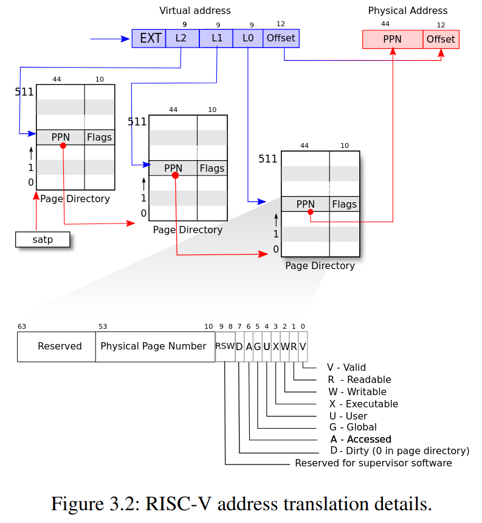

+++
date = '2025-10-02T13:09:35+08:00'
draft = false
title = '[xv6 學習紀錄 03] Lab: page tables'
series = ["xv6 學習紀錄"]
weight = 30
+++
Lab 連結: [lab pgtbl](https://pdos.csail.mit.edu/6.S081/2022/labs/pgtbl.html)

## xv6 中的 virtual memory



## memory layout
* 每一個 process 都會有自己的一個 page table，kernel 則是有它自己獨立的一個 page table
* 一般來說 kernel page table 會 map 所有的 physical address，這樣在 kernel mode 的時候就可以針對所有 pa 做動作


## Kernel address space

接著依序講解 `MAXVA`, `PHYSTOP`, `KERNBASE`
### `MAXVA`
* 如同先前提及，在 Sv39 中 virtual address 由 39 bits 組成

所以最大的 virtual address `MAXVA`也就是 `0b111111111111111111111111111111111111111`(39 1s):
```c=
// kernel/riscv.h
// one beyond the highest possible virtual address.
// MAXVA is actually one bit less than the max allowed by
// Sv39, to avoid having to sign-extend virtual addresses
// that have the high bit set.
#define MAXVA (1L << (9 + 9 + 9 + 12 - 1))
```

### Direct Mapping 的區域：`KERNBASE` ~ `PHYSTOP`
這一段 `0x80000000` ~ `0x88000000` 是作為一般的 memory 空間使用，並且在 kernel 這一段的 mapping 中，是使用 Direct Mapping 的方式，也就是 `virtual address == physical address` 的意思，這麼做的好處在於 kernel 可以直接使用 physical address 對 memory 進行操作
```c=
// the kernel expects there to be RAM
// for use by the kernel and user pages
// from physical address 0x80000000 to PHYSTOP.
#define KERNBASE 0x80000000L
#define PHYSTOP (KERNBASE + 128*1024*1024)
```

### 非 Direct Mapping 的區域
#### Trampoline page
這是由最高的 virtual address map 到 `KERNBASE` ~ `PHYSTOP` 之中的 trampoline code 的位置，值得注意的是 trampoline code 的 page 被 map 到了兩次： 1. `MAXVA` 2. Direct mapping
#### Kernel stack page
Kernel 為每一個 process 預留了一個 kernel stack，因為這裡的 virtual address 很高，所以 xv6 還有空間可以在每一個 kernel stack 下方加一個 guard page (`PTE_V` is not set)，當 kernel stack overflow 時，這個 guard page 會觸發 `panic()` 而不會污染其他 process 的 kernel stack

另一種 kernel stack 的設計是直接把 kernel stack 使用 direct mapping 的 virtual address 中，不過這樣的壞處在於當我們要放入 guard page 時，等同於是直接浪費了 physical memory 的空間。

#### kernel 的 flag
* trampoline: `PTE_R` and `PTR_X`
* other: `PTE_R` and `PTR_W`
* guard page: invalid

## Process address space

每一個 process 都有自己的 page table，就像是上圖一樣 virtual address 的空間與 kernel address space 一樣，為 `0` ~ `MAXVA` 理論上可以 map 到 256 Gigabytes 的 memory

## 程式碼解析
在理解 virtual memory 的概念之後，題目建議我們先閱讀以下三個檔案：
> * `kernel/memlayout.h`, which captures the layout of memory.
> * `kernel/vm.c`, which contains most virtual memory (VM) code.
> * `kernel/kalloc.c`, which contains code for allocating and freeing physical memory. 

這讓我們可以清楚的知道圖片上的概念要如何與程式碼做連結

### 資料結構 `pagetable_t`, `pte_t`
那讓我們先從先前看過幾次的 page table 開始，
```C
typedef uint64 pte_t;
typedef uint64 *pagetable_t; // 512 PTEs
```
page table 對應到的是一個 `pagetable_t`，並且可以把它想成是 array of PTE(`pte_t`)，這也相當合理，如同先前的圖片所示，page table 本身也就只是用來紀錄 512 個 PTE 的資料結構。

### 用來基本操作的 macro: `PX()`, `PTE2PA()`, `PA2PTE()`
* `PX()`: **P**agetable inde**x**
* `PTE2PA()`: PTE to PA
* `PA2PTE()`: PA to PTE
#### `PX()` 解析
在 xv6 中，一個 virtual memory address 中有 3 個 9 bits 的 pagetable index，`PX()` 的功用就是把一個 virtual memory address 中的其中一個 level 的 9 physical page number (PPN) 取出來
```c=
#define PGSHIFT 12  // bits of offset within a page

// extract the three 9-bit page table indices from a virtual address.
#define PXMASK          0x1FF // 9 bits
#define PXSHIFT(level)  (PGSHIFT+(9*(level)))
#define PX(level, va) ((((uint64) (va)) >> PXSHIFT(level)) & PXMASK)
```
根據 level 把 virtual memory address 中的其中 9 bits PPN 移動到 64-bits 的最右邊，再利用 `PXMASK` 篩選剩下 9 個 bits

目前我們有了 `PX()`，可以從 va 中找到其中一個 level 的 PPN，如果現在有一個 pagetable，搭配上剛剛找到的 PPN，我們便可以找到對應的 PTE，舉例來說像是 `walk() at kernel/vm.c` 的其中一行：

`PX()` 的應用：在「va 經由 pagetable 找到對應的 PTE」的過程中，`PX()` 起到了方便的作用，舉例像是 `walk() at kernel/vm.c` 的其中一行：

```c
// kernel/vm.c
pte_t *
walk(pagetable_t pagetable, uint64 va, int alloc)
{
  if(va >= MAXVA)
    panic("walk");

  for(int level = 2; level > 0; level--) {
    pte_t *pte = &pagetable[PX(level, va)];         // 這一行！
    if(*pte & PTE_V) {
      pagetable = (pagetable_t)PTE2PA(*pte);
    } else {
      if(!alloc || (pagetable = (pde_t*)kalloc()) == 0)
        return 0;
      memset(pagetable, 0, PGSIZE);
      *pte = PA2PTE(pagetable) | PTE_V;
    }
  }
  return &pagetable[PX(0, va)];
}
```
就是一個使用到 `PX()` 的例子:
1. 利用 va, level 丟入 `PX()` 找到 index: `PX(level, va)`
2. 再利用這個 index(`PX(level, va)`) 從 pagetable 中拿到 PTE
    * `pte_t *pte = &pagetable[PX(level, va)]`

#### `PTE2PA()` 解析
剛剛我們已經利用了 `PX()` 讓 va 透過 pagetable 找到對應的 pte，拿到 pte 後，我們要有能力把這個 pte 轉換成 physical memory address (PA) 這是我們最終的目的: 「va 透過 pagetable 找到 PA」

這正是 `PTE2PA()` 所要處理的事情
```C
#define PTE2PA(pte) (((pte) >> 10) << 12)
```
把 pte 當中的 (PPN) physical page number 擷取出來

#### `PA2PTE()` 解析
```C
// shift a physical address to the right place for a PTE.
#define PA2PTE(pa) ((((uint64)pa) >> 12) << 10)
```

* 把一個 physical memory 的 offset 去掉，並且做成一個 pte (shift left 10)
* 請注意這個做好的 pte 的 flag 的地方全部都是 0，需要自己把 flag 設定上

#### `PGROUNDUP()`, `PGROUNDDOWN()` 解析
```c
// kernel/riscv.h
#define PGSIZE 4096 // bytes per page
#define PGROUNDUP(sz)  (((sz)+PGSIZE-1) & ~(PGSIZE-1))
#define PGROUNDDOWN(a) (((a)) & ~(PGSIZE-1))
```

* `& ~(PGSIZE-1)`
    1. `PGSIZE` 是 4096, 二進位為 1000000000000 (12 個 0)
    1. `PGSIZE-1` 二進位為 `0111111111111` (12 個 1)
    1. `~(PGSIZE-1)` 形成一種 mask `...1111 000000000000` (12 個 0)
    1. `& ~(PGSIZE-1)` 使用了 `&`, 也就是把低位的 12 個 bits 都變為 0, 也就是取得一個 address 的所屬 page 的起始位置
* `#define PGROUNDDOWN(a) (((a)) & ~(PGSIZE-1))`: 取得 `a` 所屬 page 的起始位置
* `#define PGROUNDUP(sz)  (((sz)+PGSIZE-1) & ~(PGSIZE-1))`: `sz` bytes 所需要的 page 數量

#### `walk()` 解析
在大多數情況下，va 透過 pagetable 得到 pa 的動作，像是：
```C
a = 10;
```
這種動作是由硬體完成的，risc-v 的 register `satp` 會紀錄當下 pagetable 的 **physicall** address
, 一旦有了 `satp` 所紀錄的這個 pagetable 的 physicall address，
硬體就有辦法把程式中的 va 藉由 pagetable(從 `satp` 得知) 轉換成 pa

可是在 kernel 中的**某些地方**(`todo`: 實際上在哪邊？)
會需要在程式中就直接拿到最後一個 level (level 0) 的 PTE (有點類似用軟體做出硬體的行為)
試想我們有一個 va 以及 pagetable，想要拿到最後一個 level 的 PTE，可以用 `walk()` 來達成:

```C
// Return the address of the PTE in page table pagetable
// that corresponds to virtual address va.  If alloc!=0,
// create any required page-table pages.
// 根據 virtual address va 以及 pate table patetable
// 回傳 PTE 的 address (physical memory)

// The risc-v Sv39 scheme has three levels of page-table
// pages. A page-table page contains 512 64-bit PTEs.
// A 64-bit virtual address is split into five fields:
//   39..63 -- must be zero.
//   30..38 -- 9 bits of level-2 index.
//   21..29 -- 9 bits of level-1 index.
//   12..20 -- 9 bits of level-0 index.
//    0..11 -- 12 bits of byte offset within the page.
pte_t *
walk(pagetable_t pagetable, uint64 va, int alloc) // pagetable 紀錄的是 pa
{
  if(va >= MAXVA)
    panic("walk");
  
  // level 只會是 2, 1, 
  // (迴圈 level == 2 開始)
  // pagetable -> level 2 的 pagetable 的 pa
  // pte_t *pte = &pagetable[PX(2, va)] 
      // -> (level 2 pagetable 中) 指向 level 1 的 pagetable 的 pte
  // pagetable = (pagetable_t)PTE2PA(*pte); -> pagetable 變成指向 level 1 的 pagetable
  // (迴圈 level == 1 開始)
  // pte_t *pte = &pagetable[PX(2, va)] -> 指向 level 0 的 pagetable 的 pte
      // -> (level 1 pagetable 中) 指向 level 0 的 pagetable 的 pte
  // pagetable = (pagetable_t)PTE2PA(*pte); -> pagetable 變成指向 level 0 的 pagetable
  for(int level = 2; level > 0; level--) {
    pte_t *pte = &pagetable[PX(level, va)]; // get pte by virtual address and level (in physical address)
    if(*pte & PTE_V) {
      pagetable = (pagetable_t)PTE2PA(*pte); // pagetable 是指向下一層的 pagetable
    } else {
      // 如果這個 PTE 還沒有被 allocate，並且 alloc != 0 (alloc == true 的意思)
      // 則 allocate 這個 PTE
      // 使用 kalloc() 告訴 xv6: 我要一塊 page 來存放一個 pagetable
      // (pte_t *) 是想表達 pagetable 是 pte_t 的 array 的意思
      if(!alloc || (pagetable = (pde_t*)kalloc()) == 0)
        return 0;
      // 清空這個新的 pagetable 
      // (注意這時候，memset 吃的是 pa, 可是 user mode 時，function 吃的是 va)
      memset(pagetable, 0, PGSIZE);
      // 把這個新的 PTE 的 flag PTE_V set 為 1
      *pte = PA2PTE(pagetable) | PTE_V; 
    }
  }

  // 到了這裡 pagetable 已經是一個指向 level 0 的 page table 的 pa
  // 有了這個 page table 以及 va 中 level 0 的 9 bits 的 index
  // 就可以拿到最終我們要的 PTE
  return &pagetable[PX(0, va)];
}
```
* `walk()` 是用來根據 pagetable 以及 virtual memory address 來取得這個 va 的 pte
* `pagetable_t` 紀錄的是 physical memory
* `walk()` 回傳 `pte_t *` 也就是 figure 3.2 所描述的那樣
    * 54..63 -- 10 bits Reserved
    * 10..53 -- 44 bits Physical Page Number
    *  0..9  -- 10 bits Flags
* 有了 PTE 之後可以幹嘛?
    * 有了 PTE 之後，就可以再利用 va 的 12 bits offset 來得到 pa
    * 請注意，在大多數真正的 access pagetable 的情況下**並不會**使用 `walk()`，而是用硬體的方式處理

#### `walkaddr()` 解析
```c
// Look up a virtual address, return the physical address,
// or 0 if not mapped.
// Can only be used to look up user pages.
uint64
walkaddr(pagetable_t pagetable, uint64 va)
{
  pte_t *pte;
  uint64 pa;

  if(va >= MAXVA)
    return 0;

  pte = walk(pagetable, va, 0);
  if(pte == 0)
    return 0;
  if((*pte & PTE_V) == 0)
    return 0;
  if((*pte & PTE_U) == 0)
    return 0;
  pa = PTE2PA(*pte);
  return pa;
}
```
`walk()` 拿到的是 PTE, `walkaddr()` 多的加工變成 physical address

#### `mappages()` 解析
現在我們有了一些 macro 可以處理 va, pa, page table, pte 的轉換

`mappages()` 使用了情況:  
在 page table `pagetale` 中記下一筆資訊:
> virtual address `va` 透過 `pagetable` 會對應到 physical address `pa`  

這也正是 page table 最主要的功能

(這個對應是以一個 page (4096 byte) 做為一個單位去做 map 的)

```C
// kernel/riscv.h
typedef uint64 pte_t;
typedef uint64 *pagetable_t; // 512 PTEs

// kernel/vm.c
int
mappages(pagetable_t pagetable, uint64 va, uint64 size, uint64 pa, int perm)
{
  uint64 a, last;
  pte_t *pte;

  if(size == 0)
    panic("mappages: size");
  
  // map 必須要以一個 page 為單位, 所以需要 round up 以及 round down
  a = PGROUNDDOWN(va);
  last = PGROUNDDOWN(va + size - 1);
  for(;;){
    // 拿到 virtual address a 的 pte (walk() 會幫我們 allocate, 它使用 kalloc())
    if((pte = walk(pagetable, a, 1)) == 0) // walk 失敗時 return 0
      return -1;
    if(*pte & PTE_V) // walk() 回傳的 pte 是還沒 set PTE_V 的
      panic("mappages: remap");

    // 在這裡，我們拿到了 level 0 pagetable 中對應到 va `a` 的 pte
    // 現在它還沒被賦予值，現在我們要告訴這個 PTE: 你要指到 pa 去!
    *pte = PA2PTE(pa) | perm | PTE_V; // pte 對應到了 pa
    if(a == last)
      break;
    a += PGSIZE;
    pa += PGSIZE;
  }
  return 0;
}
```
`mappages()` 是用來把一個 pa 塞進一個 pagetable 裡，並且我們可以指定它的 va 以及 flag

#### `proc_pagetable()` 解析
`proc_pagetable()` 用來初始化一個新的 process 中的 `pagetable`
```c
// Per-process state
struct proc {
  // ...
  pagetable_t pagetable; // proc_pagetable() 負責初始這裡
  // ...
};
```
```c
// Create a user page table for a given process, with no user memory,
// but with trampoline and trapframe pages.
// 把一個 process 的 pagetable 做出來，
// 但這時候只有 trampoline 跟 trapframe 有被紀錄在 page table 中
pagetable_t
proc_pagetable(struct proc *p)
{
  pagetable_t pagetable;

  // An empty page table.
  pagetable = uvmcreate();
  if(pagetable == 0)
    return 0;

  // map the trampoline code (for system call return)
  // at the highest user virtual address.
  // only the supervisor uses it, on the way
  // to/from user space, so not PTE_U.
  if(mappages(pagetable, TRAMPOLINE, PGSIZE,
              (uint64)trampoline, PTE_R | PTE_X) < 0){
    uvmfree(pagetable, 0);
    return 0;
  }

  // map the trapframe page just below the trampoline page, for
  // trampoline.S.
  if(mappages(pagetable, TRAPFRAME, PGSIZE,
              (uint64)(p->trapframe), PTE_R | PTE_W) < 0){
    uvmunmap(pagetable, TRAMPOLINE, 1, 0);
    uvmfree(pagetable, 0);
    return 0;
  }

  return pagetable;
}
```
* `proc_pagetable()` 所使用的 function 有:
    * `mappages()`: 宣稱 `va` 經由 `pagetable` map 到 `pa` (可利用 `walk()` 查詢)
    * `uvmcreate()`: 利用 `kalloc()` 做出一個全新的 pagetable (只有一個 level)
    * `uvmunmap()`
    * `uvmfree()`


#### `uvmcreate()` 解析
```C
// create an empty user page table.
// returns 0 if out of memory.
pagetable_t
uvmcreate()
{
  pagetable_t pagetable;
  pagetable = (pagetable_t) kalloc();
  if(pagetable == 0)
    return 0;
  memset(pagetable, 0, PGSIZE);
  return pagetable;
}
```
* `uvmcreate()` 利用 `kalloc()` 做出一個全新的 pagetable
* 請注意，pagetable 所紀錄的是 physical memory


#### `uvmunmap()` 解析: `mappages()` 的相反, 宣稱一些 va 取消 mapping 了
```C
// Remove npages of mappings starting from va. va must be
// page-aligned. The mappings must exist.
// Optionally free the physical memory.
void
uvmunmap(pagetable_t pagetable, uint64 va, uint64 npages, int do_free)
{
  uint64 a;
  pte_t *pte;

  if((va % PGSIZE) != 0) // 傳進來的 va 應該要是 start of the pagetable
    panic("uvmunmap: not aligned");

  for(a = va; a < va + npages*PGSIZE; a += PGSIZE){
    // 如果這個要被 unmap 的 page (virtual address) 根本沒有 map 到 pa
    if((pte = walk(pagetable, a, 0)) == 0)
      panic("uvmunmap: walk");
    // 它應該要是 valid
    if((*pte & PTE_V) == 0)
      panic("uvmunmap: not mapped");
    if(PTE_FLAGS(*pte) == PTE_V)
      panic("uvmunmap: not a leaf");
    if(do_free){
      uint64 pa = PTE2PA(*pte);
      kfree((void*)pa);
    }
    *pte = 0;
  }
}
```
* `va` 必須為 `PGSIZE` 的倍數 (start of the pagetable)
* unmap 跟 free 是兩回事
    * free: 把這個 physical address 加回 `kmem.freelist` 中
        * 要用 `kfree((void *) pa)`
    * unmap: 僅限於對於這個 pagetable 而言，把這個 virtual memory address 移除
        * 所謂的移除，也就是把最後一層的 page table entry 給清為 0 `*pte = 0`

#### `uvmfree()` 解析
```C
// Free user memory pages,
// then free page-table pages.
void
uvmfree(pagetable_t pagetable, uint64 sz)
{
  if(sz > 0)
    uvmunmap(pagetable, 0, PGROUNDUP(sz)/PGSIZE, 1);
  freewalk(pagetable);
}
```
`uvmfree()` 不只把 va unmap 還會把這些 memory free 掉

#### `freewalk()` 解析
```c
// Recursively free page-table pages.
// All leaf mappings must already have been removed.
void
freewalk(pagetable_t pagetable)
{
  // there are 2^9 = 512 PTEs in a page table.
  for(int i = 0; i < 512; i++){
    pte_t pte = pagetable[i];
    if((pte & PTE_V) && (pte & (PTE_R|PTE_W|PTE_X)) == 0){
      // PTE_V 為 1 PTE_R, PTE_W, PTE_X 為 0 代表:
      // this PTE points to a lower-level page table.
      // 因為在 level 0 pagetable 中的 PTE 如果 PTE_V == 0 
      // 必定 PTE_R, PTE_W, PTE_X 會有至少一個為 1
      uint64 child = PTE2PA(pte);
      freewalk((pagetable_t)child);
      pagetable[i] = 0;
    } else if(pte & PTE_V){
      // 在呼叫 freewalk() 之前，
      // caller (例如 uvmfree() )
      // 具有先將這段 va uvmunmap() 的責任
      // freewalk() 只負責清理 pagetable 的部份
      // 所以不該進到這個 condition
      panic("freewalk: leaf");
    }
  }
  kfree((void*)pagetable);
}
```


#### `kalloc()` 解析
```C
// Allocate one 4096-byte page of physical memory.
// Returns a pointer that the kernel can use.
// Returns 0 if the memory cannot be allocated.
void *
kalloc(void)
{
  struct run *r;

  acquire(&kmem.lock);
  r = kmem.freelist;
  if(r)
    kmem.freelist = r->next;
  release(&kmem.lock);

  if(r)
    memset((char*)r, 5, PGSIZE); // fill with junk
  return (void*)r;
}
```
* 在 xv6 中，所有可以用的 page 會被紀錄在 `kmem.freelist` 當中
```C
struct run {
  struct run *next;
};

struct {
  struct spinlock lock;
  struct run *freelist;
} kmem;
```
* `kalloc()` 回傳一個 4096-bytes(`PGSIZE`) 的 page
* 回傳的 pointer 指向 physical memory
    * supervisor mode 時，kernel page table 具有 `Virtual Address = Physical Address` 的特性
* kmem 的初始化過程很值得追蹤


#### `uvmcopy()` 解析

```C
// 把 old 的內容複製給 new
// sz 為 page 的數量，每個 page 的大小為 4096 byte
int
uvmcopy(pagetable_t old, pagetable_t new, uint64 sz)
{
  pte_t *pte;
  uint64 pa, i;
  uint flags;
  char *mem;

  for(i = 0; i < sz; i += PGSIZE){
    if((pte = walk(old, i, 0)) == 0)
      panic("uvmcopy: pte should exist");
    if((*pte & PTE_V) == 0)
      panic("uvmcopy: page not present");
    pa = PTE2PA(*pte); // 用 parent 的 pte 拿到 physical address
    flags = PTE_FLAGS(*pte); // 拿到 parent 的 pte 的 flags

    // mem 是 child 的 physical memory (其中一個 page, 目前是全新的)
    if((mem = kalloc()) == 0) // mem 是 child 的 physical memory (其中一個 page)
      goto err;
    memmove(mem, (char*)pa, PGSIZE); // parent 的內容搬到 child 的 memory 中 (都用 pa)
    // 現在有了 mem (一個 page 的 pa)
    // 接下來要把這個 page map 到 child 的 pagetable (new) 中
    if(mappages(new, i, PGSIZE, (uint64)mem, flags) != 0){
      kfree(mem);
      goto err;
    }
  }
  return 0;

 err:
  uvmunmap(new, 0, i / PGSIZE, 1);
  return -1;
}
```
* `uvmcopy()` 在 `fork()` 的過程中扮演了重要的角色，這也是為什麼使用 `fork()` 時，會有 parent 與 child 的 memory 內容一樣的特性
* `uvmcopy()` 把一個 parent 的 page table 複製給 child，
* 包含了 page table 以及 physical memory 的內容
* 失敗時回傳 `-1`，並且把先前 allocate 的 page 都給 free 掉

#### `memmove()` 解析
`memmove()` 把 `n` bytes 的內容從 `src` 搬到 `dst`
```C
void*
memmove(void *dst, const void *src, uint n)
{
  const char *s;
  char *d;

  if(n == 0)
    return dst;
  
  s = src;
  d = dst;
  if(s < d && s + n > d){
    s += n;
    d += n;
    while(n-- > 0)
      *--d = *--s;
  } else
    // 這個 loop 也寫的太 clever 了
    while(n-- > 0)
      *d++ = *s++;

  return dst;
}
```

#### `malloc()` 解析
`malloc()` 用來 allocate `nbytes` 個 bytes 的記憶體空間
```C
void*
malloc(uint nbytes)
{
  Header *p, *prevp;
  uint nunits;

  nunits = (nbytes + sizeof(Header) - 1)/sizeof(Header) + 1;
  if((prevp = freep) == 0){
    base.s.ptr = freep = prevp = &base;
    base.s.size = 0;
  }
  for(p = prevp->s.ptr; ; prevp = p, p = p->s.ptr){
    if(p->s.size >= nunits){
      if(p->s.size == nunits)
        prevp->s.ptr = p->s.ptr;
      else {
        p->s.size -= nunits;
        p += p->s.size;
        p->s.size = nunits;
      }
      freep = prevp;
      return (void*)(p + 1);
    }
    if(p == freep)
      if((p = morecore(nunits)) == 0)
        return 0;
  }
}
```

#### `copyout()` 解析
```C
// Copy from kernel to user.
// Copy len bytes from src to virtual address dstva in a given page table.
// Return 0 on success, -1 on error.
int
copyout(pagetable_t pagetable, uint64 dstva, char *src, uint64 len)
{
  uint64 n, va0, pa0;

  while(len > 0){
    va0 = PGROUNDDOWN(dstva);
    pa0 = walkaddr(pagetable, va0);
    if(pa0 == 0)
      return -1;
    n = PGSIZE - (dstva - va0);
    if(n > len)
      n = len;
    // 因為這裡吃的都是 pa
    memmove((void *)(pa0 + (dstva - va0)), src, n);

    len -= n;
    src += n;
    dstva = va0 + PGSIZE;
  }
  return 0;
}
```

## Speed up system calls (easy)
題目敘述:
> When each process is created, map one read-only page at `USYSCALL` (a virtual address defined in `memlayout.h`). At the start of this page, store a struct `usyscall` (also defined in `memlayout.h`), and initialize it to store the PID of the current process. For this lab, `ugetpid()` has been provided on the userspace side and will automatically use the `USYSCALL` mapping. You will receive full credit for this part of the lab if the `ugetpid` test case passes when running `pgtbltest`. 

### 目標：寫出 `ugetpid()` (優化版本的 `getpid()`)
* `getpid()`: 
    * 會需要使用到 `SYS_getpid` 這個 system call
    * 但是使用 system call 本身是耗費時間的
* `ugetpid()` 
    * 這個 function 直接不需要經由 system call 就可以達到相同的效果

### 作法
當一個 proccess 開始執行時，在 virtual memory address `USYSCALL`(定義在 `kernel/memlayout.h`) 中存放 `struct usyscall` 並且把 PID 存放於這個 struct 中。`ugetpid()` 是一個 user space 就可以執行的 function，所以可以跳過原本的 system call 的過程，以達到加速的效果。


### 原本的 `getpid()` 的流程為何
1. `user/pgtbltest.c: ugetpid_test()`
1. `getpid()`
1. `usys.S`
    ```asm
    .global getpid
    getpid:
     li a7, SYS_getpid
     ecall
     ret
    ```
1. `kernel/trampoline.S: uservec`
1. `kernel/trap.c: usertrap()`
1. `syscall.c: syscall()`
1. `sysproc.c: sys_getpid()`
1. `myproc()`
1. `kernel/trampoline.S: uservec`
    ```c
    uint64
    sys_getpid(void)
    {
      return myproc()->pid;
    }
    ```

### 優化版的 `getpid()` 的流程為何
1. `user/pgtbltest.c: ugetpid_test()`
1. `ugetpid()`
1. `user/ulib.c: ugetpid()`
    ```C
    // ulib.c

    int
    ugetpid(void)
    {
      struct usyscall *u = (struct usyscall *)USYSCALL;
      return u->pid;
    }
    ```
如同先前看到的 process address space

最高的 address 依序是 `MAXVA`, `TRAMPOLINE`, `TRAPFRAME`, 這一題則是要再加上 `USYSCALL`
### 程式實作
#### `usyscall` 題目幫我們定義好了
```c
// kernel/memlayout.h
struct usyscall {
  int pid;  // Process ID
};
```

之後每一個 process 都會存放一份 `usyscall`

#### `kernel/proc.h` 中
先在 `proc_pagetable()` 中加入
```C
// Per-process state
struct proc {
  struct spinlock lock;

  // p->lock must be held when using these:
  enum procstate state;        // Process state
  void *chan;                  // If non-zero, sleeping on chan
  int killed;                  // If non-zero, have been killed
  int xstate;                  // Exit status to be returned to parent's wait
  int pid;                     // Process ID

  // wait_lock must be held when using this:
  struct proc *parent;         // Parent process

  // these are private to the process, so p->lock need not be held.
  uint64 kstack;               // Virtual address of kernel stack
  uint64 sz;                   // Size of process memory (bytes)
  pagetable_t pagetable;       // User page table
  struct trapframe *trapframe; // data page for trampoline.S
  struct context context;      // swtch() here to run process
  struct file *ofile[NOFILE];  // Open files
  struct inode *cwd;           // Current directory
  char name[16];               // Process name (debugging)

  struct usyscall *usyscall;   // add this !!!!!!!!!!!!!!!
};
```

準備好 data 之後，之後要在 allocate 時以及 free 時做一些處理
#### allocate 時:
* `kernel/proc.c: allocproc()`
* `kernel/proc.c: proc_pagetable()`
#### free 時:
* `kernel/proc.c: freeproc()`
* `kernel/proc.c: proc_freepagetable()`

#### `kernel/proc.c: allocproc()`
```C
static struct proc*
allocproc(void)
{
  struct proc *p;

  for(p = proc; p < &proc[NPROC]; p++) {
    acquire(&p->lock);
    if(p->state == UNUSED) {
      goto found;
    } else {
      release(&p->lock);
    }
  }
  return 0;

found:
  p->pid = allocpid();
  p->state = USED;

  // Allocate a trapframe page.
  if((p->trapframe = (struct trapframe *)kalloc()) == 0){
    freeproc(p);
    release(&p->lock);
    return 0;
  }

  // Allocate and initialize a usyscall page !!!!!!!!!!!
  if((p->usyscall = (struct usyscall *)kalloc()) == 0){ // here!
    freeproc(p);
    release(&p->lock);
    return 0;
  }
  p->usyscall->pid = p->pid; !!!!!!!!!!!!!!

  // An empty user page table.
  p->pagetable = proc_pagetable(p);
  if(p->pagetable == 0){
    freeproc(p);
    release(&p->lock);
    return 0;
  }

  // Set up new context to start executing at forkret,
  // which returns to user space.
  memset(&p->context, 0, sizeof(p->context));
  p->context.ra = (uint64)forkret;
  p->context.sp = p->kstack + PGSIZE;

  return p;
}
```

#### `kernel/proc.c: proc_pagetable()`:
```C
// Create a user page table for a given process, with no user memory,
// but with trampoline and trapframe pages.
pagetable_t
proc_pagetable(struct proc *p)
{
  pagetable_t pagetable;

  // An empty page table.
  pagetable = uvmcreate();
  if(pagetable == 0)
    return 0;

  // map the trampoline code (for system call return)
  // at the highest user virtual address.
  // only the supervisor uses it, on the way
  // to/from user space, so not PTE_U.
  if(mappages(pagetable, TRAMPOLINE, PGSIZE,
              (uint64)trampoline, PTE_R | PTE_X) < 0){
    uvmfree(pagetable, 0);
    return 0;
  }

  // map the trapframe page just below the trampoline page, for
  // trampoline.S.
  if(mappages(pagetable, TRAPFRAME, PGSIZE,
              (uint64)(p->trapframe), PTE_R | PTE_W) < 0){
    uvmunmap(pagetable, TRAMPOLINE, 1, 0);
    uvmfree(pagetable, 1);
    return 0;
  }

  // map one read-only page at USYSCALL !!!!!!!!!!!!!!!!!!!!!!!
  if(mappages(pagetable, USYSCALL, PGSIZE,
              (uint64)(p->usyscall), PTE_R | PTE_U) < 0){
    // 注意是 unmap 己經被 map 好的 TRAMPOLINE, TRAPFRAME
    uvmunmap(pagetable, TRAMPOLINE, 1, 0);
    uvmunmap(pagetable, TRAPFRAME, 1, 0);
    uvmfree(pagetable, 0);
    return 0;
  }

  return pagetable;
}
```

#### `kernel/proc.c: freeproc()`
```C
// free a proc structure and the data hanging from it,
// including user pages.
// p->lock must be held.
static void
freeproc(struct proc *p)
{
  if(p->trapframe)
    kfree((void*)p->trapframe);
  p->trapframe = 0;

  // free usyscall !!!!!!!!
  if (proc->usyscall)
    kfree((void *) p->usyscall);
  p->usyscall = 0;

  if(p->pagetable)
    proc_freepagetable(p->pagetable, p->sz);
  p->pagetable = 0;
  p->sz = 0;
  p->pid = 0;
  p->parent = 0;
  p->name[0] = 0;
  p->chan = 0;
  p->killed = 0;
  p->xstate = 0;
  p->state = UNUSED;
}
```

#### `kernel/proc.c: proc_freepagetable()`
```C
// Free a process's page table, and free the
// physical memory it refers to.
void
proc_freepagetable(pagetable_t pagetable, uint64 sz)
{
  uvmunmap(pagetable, TRAMPOLINE, 1, 0);
  uvmunmap(pagetable, TRAPFRAME, 1, 0);
  uvmunmap(pagetable, USYSCALL, 1, 0); // unmap USYSCALL !!!!!!!
  uvmfree(pagetable, sz);
}
```

## Print a page table (easy)
題目敘述：
> prints the contents of a page table Define a function called `vmprint()`. It should take a `pagetable_t` argument, and print that pagetable in the format described below. Insert `if(p->pid==1) vmprint(p->pagetable)` in `exec.c` just before the return argc, to print the first process's page table. You receive full credit for this part of the lab if you pass the pte printout test of make grade. 
* You can put `vmprint()` in `kernel/vm.c`.
* Use the macros at the end of the file `kernel/riscv.h`.
* The function `freewalk()` may be inspirational.
* Define the prototype for `vmprint` in `kernel/defs.h` so that you can call it from `exec.c`.
* Use `%p` in your `printf` calls to print out full 64-bit hex PTEs and addresses as shown in the example.

```asm
page table 0x0000000087f6b000
 ..0: pte 0x0000000021fd9c01 pa 0x0000000087f67000
 .. ..0: pte 0x0000000021fd9801 pa 0x0000000087f66000
 .. .. ..0: pte 0x0000000021fda01b pa 0x0000000087f68000
 .. .. ..1: pte 0x0000000021fd9417 pa 0x0000000087f65000
 .. .. ..2: pte 0x0000000021fd9007 pa 0x0000000087f64000
 .. .. ..3: pte 0x0000000021fd8c17 pa 0x0000000087f63000
 ..255: pte 0x0000000021fda801 pa 0x0000000087f6a000
 .. ..511: pte 0x0000000021fda401 pa 0x0000000087f69000
 .. .. ..509: pte 0x0000000021fdcc13 pa 0x0000000087f73000
 .. .. ..510: pte 0x0000000021fdd007 pa 0x0000000087f74000
 .. .. ..511: pte 0x0000000020001c0b pa 0x0000000080007000
init: starting sh
```

#### `kernel/defs.h`
```C
void            vmprint(pagetable_t pagetable);
```

#### `vm.c`
```C
void
vmprint(pagetable_t pagetable)
{
  printf("page table %p\n", pagetable); // print level 2 pagetable

  // there are 2^9 = 512 PTEs in a page table.
  for (int i = 0; i < 512; i++) { // iterate PTEs in level 2 pagetable
    pte_t pte = pagetable[i];
    if ((pte & PTE_V) && (pte & (PTE_R|PTE_W|PTE_X)) == 0) { 
      // find a valid PTE in level 2 pagetable
      uint64 lv1pa = PTE2PA(pte);
      pagetable_t lv1pagetable = (pagetable_t) lv1pa;
      printf(" ..%d: pte %p pa %p\n", i, pte, lv1pagetable); // print leve 1 pagetable

      for (int j = 0; j < 512; j++) { // iterate PTEs in level 1 pagetable
        pte_t pte = lv1pagetable[j];
        if ((pte & PTE_V) && (pte & (PTE_R|PTE_W|PTE_X)) == 0) { 
          // find a valid PTE in level 1 pagetable
          uint64 lv0pa = PTE2PA(pte);
          pagetable_t lv0pagetable = (pagetable_t) lv0pa;
          printf(" .. ..%d: pte %p pa %p\n", j, pte, lv0pagetable); // print level 0 pagetable

          for (int k = 0; k < 512; k++) { // iterage PTEs in level 0 pagetable
            pte_t pte = lv0pagetable[k];
            if ((pte & PTE_V) && (pte & (PTE_R|PTE_W|PTE_X)) == 0) {
              panic("vmptint: pagetable PTE in level 0 pagetable");
            } else if (pte & PTE_V) { // find a leaf
              uint64 pa = PTE2PA(pte);
              // pagetable_t lv0pagetable = (pagetable_t) lv1pa;
              printf(" .. .. ..%d: pte %p pa %p\n", k, pte, pa); // print leaf
            }
          }
        } else if (pte & PTE_V) {
          panic("vmptint: leaf in level 1 pagetable");
        }
      }
    } else if (pte & PTE_V) {
      panic("vmptint: leaf in level 2 pagetable");
    }
  }
}
```

> Insert `if(p->pid==1) vmprint(p->pagetable)` in `exec.c` just before the return argc, to print the first process's page table  

這裡只是希望 `pid == 1` 的 process (`sh`) 可以自動利用 `vmprint()` print 出 page tabel
#### `kernel/exec.c`
```C
int
exec(char *path, char **argv)
{
  // ... //

  if(p->pid==1)
    vmprint(p->pagetable);

  return argc; // this ends up in a0, the first argument to main(argc, argv)

  // ... //
}
```

> Explain the output of `vmprint` in terms of Fig 3-4 from the text. What does page 0 contain? What is in page 2? When running in user mode, could the process read/write the memory mapped by page 1? What does the third to last page contain? 

(TODO)

## Detect which pages have been accessed (hard)
題目敘述：
> Some garbage collectors (a form of automatic memory management) can benefit from information about which pages have been accessed (read or write). In this part of the lab, you will add a new feature to xv6 that detects and reports this information to userspace by inspecting the access bits in the RISC-V page table. The RISC-V hardware page walker marks these bits in the PTE whenever it resolves a TLB miss. 

> Your job is to implement `pgaccess()`, a system call that reports which pages have been accessed. The system call takes three arguments. First, it takes the starting virtual address of the first user page to check. Second, it takes the number of pages to check. Finally, it takes a user address to a buffer to store the results into a bitmask (a datastructure that uses one bit per page and where the first page corresponds to the least significant bit). You will receive full credit for this part of the lab if the pgaccess test case passes when running pgtbltest. 

題目提示：
* Read `pgaccess_test()` in `user/pgtlbtest.c` to see how pgaccess is used.
* Start by implementing `sys_pgaccess()` in `kernel/sysproc.c`.
* You'll need to parse arguments using `argaddr()` and `argint()`.
* For the output bitmask, it's easier to store a temporary buffer in the kernel and copy it to the user (via `copyout()`) after filling it with the right bits.
* It's okay to set an upper limit on the number of pages that can be scanned.
    * 題目的測試是用 `unsigned int`，因此設定為 32 的 pages 就足夠了
* `walk()` in `kernel/vm.c` is very useful for finding the right PTEs.
* You'll need to define `PTE_A`, the access bit, in `kernel/riscv.h`. Consult the [RISC-V privileged architecture manual](https://github.com/riscv/riscv-isa-manual/releases/download/Ratified-IMFDQC-and-Priv-v1.11/riscv-privileged-20190608.pdf) to determine its value.
    * 根據 manual, acessed bit 在 `1 << 6` 的位置
    
    * 並且這個 bit 的賦值是硬體上幫我們做的，不需要用軟體 set
* Be sure to clear `PTE_A` after checking if it is set. Otherwise, it won't be possible to determine if the page was accessed since the last time `pgaccess()` was called (i.e., the bit will be set forever).
* `vmprint()` may come in handy to debug page tables. 

這題要我們時做出 `pgaccess()`，先觀察 `pgaccess_test()` 是如何使用 `pgaccess()` 的
```C
void
pgaccess_test()
{
  char *buf;
  unsigned int abits;
  printf("pgaccess_test starting\n");
  testname = "pgaccess_test";
  // buf 有 
  // 32 個 page == 32 * PGSIZE bytes == 32 * 2 ^ 12 bytes == 32 * 4096 bytes 大小
  buf = malloc(32 * PGSIZE);

  // buf 都還沒被 access 過，理論上這時候 abits 應該為 
  // 0b00000000000000000000000000000000
  // (32 個 0，代表 buf 的 32 個 page 都還沒被 access 過)
  if (pgaccess(buf, 32, &abits) < 0)
    err("pgaccess failed");
  buf[PGSIZE * 1] += 1; // 第 1 個 page 被 access
  buf[PGSIZE * 2] += 1; // 第 2 個 page 被 access
  buf[PGSIZE * 30] += 1; // 第 30 個 page 被 access

  // 經過上面第 1, 2, 30 個 page 被 access 之後，abits 應該為
  // 0b00100000000000000000000000000110
  // 第 1, 2, 30 bits 被設定為 1
  if (pgaccess(buf, 32, &abits) < 0)
    err("pgaccess failed");
  if (abits != ((1 << 1) | (1 << 2) | (1 << 30)))
    err("incorrect access bits set");
  free(buf);
  printf("pgaccess_test: OK\n");
}
```

這就是一個 `pgaccess` 的使用例子

### 程式實做
* `kernel/riscv.h`
```c
#define PTE_V (1L << 0) // valid
#define PTE_R (1L << 1)
#define PTE_W (1L << 2)
#define PTE_X (1L << 3)
#define PTE_U (1L << 4) // user can access
#define PTE_A (1L << 6)
```
在這裡加上 `PTE_A` 的定義，並且這個 bit 是硬體上會幫我們 set 好的，所以我們**不需要**考慮 `buf[PGSIZE * 1] += 1;` 時還要特地去更改這個 bit。

* `kernel/sysproc.c: sys_pgaccess()`
```c
int
sys_pgaccess(void)
{
  uint64 base;
  int npages;
  uint64 umask;
  uint64 mask;
  uint64 abits;
  uint64 va;
  pte_t *pte;
  struct proc *p;

  p = myproc();
  argaddr(0, &base);
  argint(1, &npages);
  argaddr(2, &umask);
  if (npages > 32)
    return -1;
  mask = 1;
  abits = 0;
  for (va = base; va < base + npages * PGSIZE; va += PGSIZE) {
    pte = walk(p->pagetable, va, 0);
    if (pte == 0)
      continue;
    if (*pte & PTE_A) {
      abits |= mask;
      *pte = *pte & (~PTE_A);
    }
    mask <<= 1;
  }
  if (copyout(p->pagetable, umask, (char *) &abits, 4) < 0)
    return -1;
  return 0;
}
```
接著就一個 page 一個 page 的檢查 `PTE_A`，如果為 1 則 unset 並且紀錄在 `abits` 中，最後在用 `copyout()` 把答案寫回給 user process 就行了。
