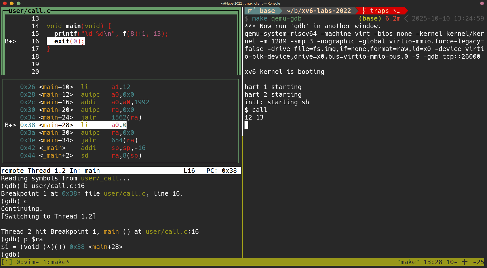
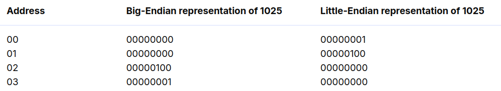
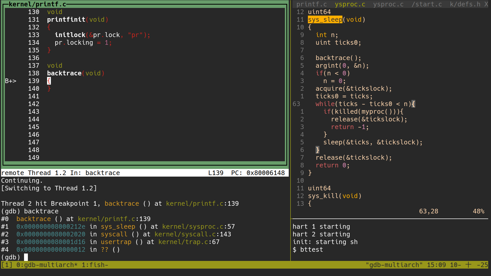
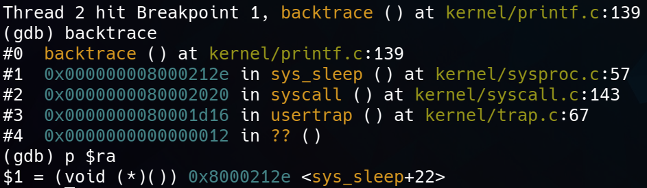
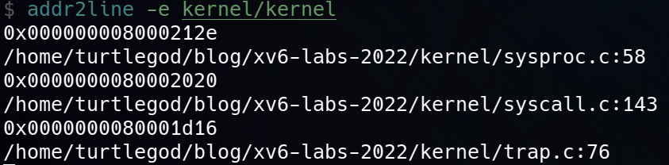
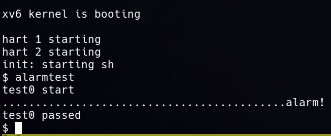
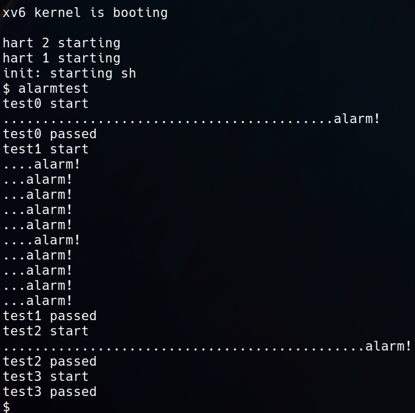
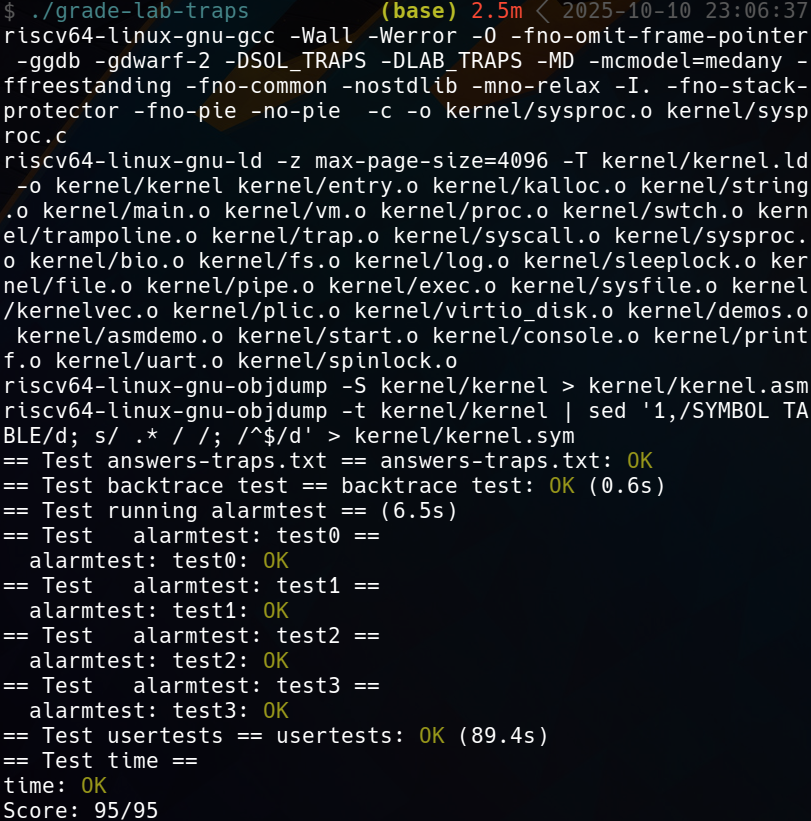

+++
date = '2025-10-09T11:31:37+08:00'
draft = false
title = '[xv6 學習紀錄 04] Lab: Traps'
series = ["xv6 學習紀錄"]
weight = 43
+++

Lab 連結: [lab traps](https://pdos.csail.mit.edu/6.S081/2022/labs/traps.html)

課程影片連結：
* [6.S081 Fall 2020 Lecture 5: RISC-V Calling Convention and Stack Frames ](https://www.youtube.com/watch?v=s-Z5t_yTyTM)
* [6.S081 Fall 2020 Lecture 6: Isolation & System Call Entry/Exit](https://www.youtube.com/watch?v=T26UuauaxWA)


## RISC-V assembly (easy)
> It will be important to understand a bit of RISC-V assembly, which you were exposed to in 6.1910 (6.004). There is a file `user/call.c` in your xv6 repo. `make fs.img` compiles it and also produces a readable assembly version of the program in `user/call.asm`.
> Read the code in `call.asm` for the functions `g`, `f`, and `main`. The instruction manual for RISC-V is on the reference page. Here are some questions that you should answer (store the answers in a file `answers-traps.txt`): 

這題要我們閱讀 `user/call.c` 對應的 `call.asm` 確保我們對於 C 語言到 RISC-V 的轉換是有概念的，我們需要回答以下問題：

>  Which registers contain arguments to functions? For example, which register holds 13 in main's call to `printf`? 

arguments 是存放於 `a0`, `a1`, `a2` ... 例如
```c
printf("%d %d\n", f(8)+1, 13);
```
`13` 是第 3 個 argument, 存放於 `a2`，在 `call.asm` 中也可以看到
```asm
  printf("%d %d\n", f(8)+1, 13);
  24:	4635                	li	a2,13 # <-- put value 13 to a2
  26:	45b1                	li	a1,12
  28:	00000517          	auipc	a0,0x0
  2c:	7b850513          	addi	a0,a0,1976 # 7e0 <malloc+0xe6>
  30:	00000097          	auipc	ra,0x0
  34:	612080e7          	jalr	1554(ra) # 642 <printf>
```

>  Where is the call to function `f` in the assembly code for `main`? Where is the call to `g`? (Hint: the compiler may inline functions.) 

* `user/call.c`
```c
int g(int x) {
  return x+3;
}

int f(int x) {
  return g(x);
}

void main(void) {
  printf("%d %d\n", f(8)+1, 13);
  exit(0);
}
```
就以 `user/call.c` 來說，`f()` 只是呼叫 `g()`, `g()` 的作用只是回傳 `x + 3`，在 `call.asm` 中，可以看到 compiler 直接把 `f(8)+1` 的答案 `12` 算出來並且寫死丟入 `f(8)+1` 所代表的第 2 個 argument `a1` 中
```asm
void main(void) {
  1c:	1141                	addi	sp,sp,-16
  1e:	e406                	sd	ra,8(sp)
  20:	e022                	sd	s0,0(sp)
  22:	0800                	addi	s0,sp,16
  printf("%d %d\n", f(8)+1, 13);
  24:	4635                	li	a2,13 # <-- call to f and call to g
  26:	45b1                	li	a1,12
  28:	00000517          	auipc	a0,0x0
  2c:	7b850513          	addi	a0,a0,1976 # 7e0 <malloc+0xe6>
  30:	00000097          	auipc	ra,0x0
  34:	612080e7          	jalr	1554(ra) # 642 <printf>
  exit(0);
  38:	4501                	li	a0,0
  3a:	00000097          	auipc	ra,0x0
  3e:	28e080e7          	jalr	654(ra) # 2c8 <exit>
```

>  At what address is the function `printf` located? 

根據 
```asm
  34:	612080e7          	jalr	1554(ra) # 642 <printf>
```
可得知 `printf` 的 address 在 `642` 中，`jalr 1554(ra)` 做了一下兩件事
* jump 到 `printf`
* Link: saves the address of the next instruction
    * 
```asm
void
printf(const char *fmt, ...)
{
 642:	711d                	addi	sp,sp,-96
 644:	ec06                	sd	ra,24(sp)
 646:	e822                	sd	s0,16(sp)
 648:	1000                	addi	s0,sp,32
 64a:	e40c                	sd	a1,8(s0)
 64c:	e810                	sd	a2,16(s0)
...
```
也可以在這裡的 `642` 中看到


>  What value is in the register `ra` just after the `jalr` to `printf` in `main`? 
1. terminal 1: `make qemu-gdb`
1. terminal 2: `gdb-multiarch`, `layout split`
1. 於 termianl 2:
    ```gdb
    (gdb) add-symbol-file user/_call
    ```
    *  set a break point at `printf()` 的下一行 `exit()` line 16
    ```gdb
    (gdb) b user/call.c:16
    ```
    * continue
    ```gdb
    (gdb) c
    ```
1. 於 termianl 1: `$ call`
1. 於 termianl 2: `p $ra`
    * 得知這題的答案: `$ra` 為這一個 instruction `li a0, 0` 本身的 address `0x38`
    
    * 解釋：因為在 `jalr 1562(ra)` 就已經把 `ra` 設為 `0x38` 了，直到 `printf` return 回來，都還是 `0x38`，`ra` 是 caller saved register，所以要 caller (`main()`) 自己在事前把 `ra` 的值保留在 stack 中，並且在 function call (`printf()`) 結束之後把 `ra` restore 回來
    * 在 `call`, `jalr` 這種 function call 的 instruction 會在硬體上修改 `ra` 的效果的前提之下，`ra` 是 caller saved register 是一個必要的設計


> Run the following code.
> 
> 	```c
>   unsigned int i = 0x00646c72;
> 	printf("H%x Wo%s", 57616, &i);
> 	```
>       
> 
> What is the output? [Here's an ASCII table](https://www.asciitable.com/) that maps bytes to characters.
> 
> The output depends on that fact that the RISC-V is little-endian. If the RISC-V were instead big-endian what would you set `i` to in order to yield the same output? Would you need to change `57616` to a different value?
> [Here's a description of little- and big-endian](http://www.webopedia.com/TERM/b/big_endian.html) and a more whimsical description.


* Big-endian: 
output 為 
```sh
HE111 World
```
* 57616 in `%x`
* `i = 0x00646c72` in `%s`

如果改為 big-endian 則會相反過來
(TODO: 再寫的更詳細一些)

> In the following code, what is going to be printed after `'y='`? (note: the answer is not a specific value.) Why does this happen?
> 
> ```c
> printf("x=%d y=%d", 3);
> ```

這取決於當時 (call to `printf` 的當下) `a2`(代表第 3 個 argument) 的值是多少，順帶一題這時代表第一個 argument 的 `a0` 為 address of `"x=%d y=%d"`, `a1` 為 `3`

## Backtrace (moderate)


> Implement a `backtrace()` function in `kernel/printf.c`. Insert a call to this function in `sys_sleep`, and then run `bttest`, which calls `sys_sleep`. Your output should be a list of return addresses with this form (but the numbers will likely be different):
> 
> ```shell
>     backtrace:
>     0x0000000080002cda
>     0x0000000080002bb6
>     0x0000000080002898
> ```
>   
> 
> After `bttest` exit qemu. In a terminal window: run `addr2line -e kernel/kernel` (or `riscv64-unknown-elf-addr2line -e kernel/kernel`) and cut-and-paste the addresses from your backtrace, like this:
> 
> ```shell
>     $ addr2line -e kernel/kernel
>     0x0000000080002de2
>     0x0000000080002f4a
>     0x0000000080002bfc
>     Ctrl-D
> ```
>   
> 
> You should see something like this:
> 
> ```sh
>     kernel/sysproc.c:74
>     kernel/syscall.c:224
>     kernel/trap.c:85
> ```
我們需要先了解 xv6 的 stack 長什麼樣子才有辦法解這一題
```text
                   .
                   .
      +->          .
      |   +-----------------+   |
      |   | return address  |   |
      |   |   previous fp ------+
      |   | saved registers |
      |   | local variables |
      |   |       ...       | <-+
      |   +-----------------+   |
      |   | return address  |   |
      +------ previous fp   |   |
          | saved registers |   |
          | local variables |   |
      +-> |       ...       |   |
      |   +-----------------+   |
      |   | return address  |   |
      |   |   previous fp ------+
      |   | saved registers |
      |   | local variables |
      |   |       ...       | <-+
      |   +-----------------+   |
      |   | return address  |   |
      +------ previous fp   |   |
          | saved registers |   |
          | local variables |   |
  $fp --> |       ...       |   |
          +-----------------+   |
          | return address  |   |
          |   previous fp ------+
          | saved registers |
  $sp --> | local variables |
          +-----------------+
```
從這裡可以看到，理論上我們可以從 `sp` 開始，一次一次的利用 `fp` 往上找尋前一個 frame，就可以達成題目要的 `backtrace`
* `sp`: 指向 stack 的頂端，由 assembly 自行控制，是一個 convention
* `fp`: 指向前一個 stack 的頂端，由 assembly 自行控制，是一個 convention


值得注意的是，在 xv6 的設計中，stack 的大小只有一個 page，這在之後 `backtrace()` 是否抵達第一個 frame 的判斷可以起到作用，不過這個 stack 的 virtual address 並不是固定的

* `kernel/defs.h`:
```c
// printf.c
void            printf(char*, ...);
void            panic(char*) __attribute__((noreturn));
void            printfinit(void);
void            backtrace(void);
```

* `kernel/printf.c`
```c
void
backtrace(void)
{
  // TODO
}
```

* `kernel/riscv.h`
```c
static inline uint64
r_fp()
{
  uint64 x;
  asm volatile("mv %0, s0" : "=r" (x) );
  return x;
}
```

* `kernel/sysproc.c`: 在 `sys_sleep()` 中呼叫 `backtrace()`
```c
uint64
sys_sleep(void)
{
  int n;
  uint ticks0;

  backtrace();
  argint(0, &n);
  if(n < 0)
    n = 0;
  acquire(&tickslock);
  ticks0 = ticks;
  while(ticks - ticks0 < n){
    if(killed(myproc())){
      release(&tickslock);
      return -1;
    }
    sleep(&ticks, &tickslock);
  }
  release(&tickslock);
  return 0;
}
```

### 先用 `gdb` 的 `backtrace`
1. termianl 1: `make qemu-gdb`
1. termianl 2: `gdb-multiarch`
1. termianl 1: 
    ```gdb
    (gdb) layout src
    (gdb) b backtrace
    (gdb) c
    ```
1. termianl 2: `bttest`
1. termianl 1: 
    ```gdb
    (gdb) backtrace
    ```
    
    
    * 在這裡可以看到 `backtrace` 要 print 出來的 address 是各個 return address，像是這個當下的 `ra`

### 在 `gdb` 中不使用 `backtrace` 但做到 `backtrace` 要達成的事情
(TODO)

### `backtrace()` 程式實做
先嘗試這樣一層一層的找上去:
```c
void
backtrace(void)
{
  uint64 fp_bt;
  uint64 fp_slp;
  uint64 fp_sysc;
  uint64 fp_usrtp;
  
  fp_bt = r_fp();
  printf("fp of backtrace() = %p\n", fp_bt);
  printf("ra to sys_sleep() = %p\n", *(void **)(fp_bt - 8));

  fp_slp = (uint64) *(void **)(fp_bt - 16);
  printf("fp of sys_sleep() = %p\n", fp_slp);
  printf("ra to syscall() = %p\n", *(void **)(fp_slp - 8));

  fp_sysc = (uint64) *(void **)(fp_slp - 16);
  printf("fp of syscall() = %p\n", fp_sysc);
  printf("ra to usertrap() = %p\n", *(void **)(fp_sysc - 8));
  
  fp_usrtp = (uint64) *(void **)(fp_sysc - 16);
  printf("fp of usertrap() = %p\n", fp_usrtp);
  printf("ra to ?? = %p\n", *(void **)(fp_usrtp - 8));

  printf("backtrace:\n");
  printf("ra to sys_sleep() = %p\n", *(void **)(fp_bt - 8));
  printf("ra to syscall() = %p\n", *(void **)(fp_slp - 8));
  printf("ra to usertrap() = %p\n", *(void **)(fp_sysc - 8));
}
```
* output:
```sh
$ bttest
fp of backtrace() = 0x0000003fffff9f80
ra to sys_sleep() = 0x000000008000212e
fp of sys_sleep() = 0x0000003fffff9fc0
ra to syscall() = 0x0000000080002020
fp of syscall() = 0x0000003fffff9fe0
ra to usertrap() = 0x0000000080001d16
fp of usertrap() = 0x0000003fffffa000
ra to ?? = 0x0000000000000012
backtrace:
ra to sys_sleep() = 0x000000008000212e
ra to syscall() = 0x0000000080002020
ra to usertrap() = 0x0000000080001d16
```

做成迴圈的版本：
```c
void
backtrace(void)
{
  uint64 fp_curr;
  uint64 top;

  fp_curr = r_fp();
  top = PGROUNDUP(fp_curr);
  while (fp_curr < top) {
    printf("%p\n", *(void **)(fp_curr - 8));
    fp_curr = (uint64) *(void **)(fp_curr - 16);
  }
}
```


* 最後加到 `panic()` 中
```c
void
panic(char *s)
{
  backtrace();
  pr.locking = 0;
  printf("panic: ");
  printf(s);
  printf("\n");
  panicked = 1; // freeze uart output from other CPUs
  for(;;)
    ;
}
```

## Alarm (hard)
> In this exercise you'll add a feature to xv6 that periodically alerts a process as it uses CPU time. This might be useful for compute-bound processes that want to limit how much CPU time they chew up, or for processes that want to compute but also want to take some periodic action. More generally, you'll be implementing a primitive form of user-level interrupt/fault handlers; you could use something similar to handle page faults in the application, for example. Your solution is correct if it passes `alarmtest` and `usertests -q`.

這個 lab 要我們計算 cpu 的時間

`sigalarm(interval, handler)` 的作用在於經過 `interval` 個 ticks 之後，就執行 `handler()`，例如 `sigalarm(2, periodic)` 就是經過 2 個 ticks 就執行一次 `periodic()`

在 `test0` 中，

### test0: invoke handler
* add `user/alarmtest.c` to `Makefile`
* add system call `sigalarm(n, fn)` and `sigalarm()`
    * `user/user.h`
        ```c
        int sigalarm(int, void (*handler)());
        int sigreturn(void);
        ```
    * `user/usys.pl`
    * `kernel/syscall.h`
    * `user/usys.pl`

> * Your `sys_sigalarm()` should store the alarm interval and the pointer to the handler function in new fields in the `proc` structure (in `kernel/proc.h`). 
* `kernel/proc.h`
> * You'll need to keep track of how many ticks have passed since the last call (or are left until the next call) to a process's alarm handler; you'll need a new field in `struct proc` for this too. You can initialize `proc` fields in `allocproc()` in `proc.c`. 

* `kernel/proc.h`
```c
struct proc {
  // ...
  int interval;
  int ticks_since_handler;
  void (*handler)(void);
};
```

* `kernel/proc.c`
```c
static struct proc*
allocproc(void)
{
  // ...
  p->interval = 0;
  p->ticks_since_handler = 0;
  p->handler = 0;

  // Set up new context to start executing at forkret,
  // which returns to user space.
  memset(&p->context, 0, sizeof(p->context));
  p->context.ra = (uint64)forkret;
  p->context.sp = p->kstack + PGSIZE;

  return p;
}
```

> Every tick, the hardware clock forces an interrupt, which is handled in `usertrap()` in `kernel/trap.c`. 
* `kernel/trap.c`
```c
void
clockintr()
{
  acquire(&tickslock);
  ticks++;
  wakeup(&ticks);
  release(&tickslock);
}
```

> You only want to manipulate a process's alarm ticks if there's a timer interrupt; you want something like
> ```c
> if(which_dev == 2) ...
> ```
* `kernel/trap.c`
```c
void
usertrap(void)
{
  // ...
  // give up the CPU if this is a timer interrupt.
  if(which_dev == 2)
    yield();

  usertrapret();
}
```
原本是長這個樣子，意思是說如果遇到 timer interrupt 則 `yeild()`，現在則要多考慮 ticks 的問題
```c
void
usertrap(void)
{
  // ...
  // give up the CPU if this is a timer interrupt.
  if(which_dev == 2) {
    if (p->interval > 0) {
      if (p->ticks_since_handler++ > p->interval) {
        p->ticks_since_handler = 0;
      } 
    }else {
      yield();
    }
  }

  usertrapret();
}
```

> Only invoke the alarm function if the process has a timer outstanding. Note that the address of the user's alarm function might be 0 (e.g., in `user/alarmtest.asm`, periodic is at address 0). 

> You'll need to modify `usertrap()` so that when a process's alarm interval expires, the user process executes the handler function. When a trap on the RISC-V returns to user space, what determines the instruction address at which user-space code resumes execution? 

這裡直接把 program counter 指到 `p->handler`, 回到 user space 之後，讓他進入 `handler()` 執行
```c
void
usertrap(void)
{
  // ...
  // give up the CPU if this is a timer interrupt.
  if(which_dev == 2) {
    if (p->interval > 0) {
      if (p->ticks_since_handler++ > p->interval) {
        p->ticks_since_handler = 0;
        p->trapframp->epc = (uint64) p->handler;
      } 
    }else {
      yield();
    }
  }

  usertrapret();
}
```

> It will be easier to look at traps with gdb if you tell qemu to use only one CPU, which you can do by running
> ```sh
> make CPUS=1 qemu-gdb
> ```

> You've succeeded if alarmtest prints "alarm!". 



### test1/test2()/test3(): resume interrupted code
> Chances are that alarmtest crashes in test0 or test1 after it prints "alarm!", or that alarmtest (eventually) prints "test1 failed", or that alarmtest exits without printing "test1 passed". To fix this, you must ensure that, when the alarm handler is done, control returns to the instruction at which the user program was originally interrupted by the timer interrupt. You must ensure that the register contents are restored to the values they held at the time of the interrupt, so that the user program can continue undisturbed after the alarm. Finally, you should "re-arm" the alarm counter after each time it goes off, so that the handler is called periodically. 

目前的版本中，只有到 `test0` 之後就停下來了，這裡的問題在於這裡在 `handler` 結束之後，`alarmtest` 並沒有回覆到原先的狀態，整個 registers 的內容都被 `handler` 打亂了，理想的狀態是在 `hadnler` 結束之後，`alarmtest` 的所有 register 都復原到原先進入 `handler` 之前的樣子。

> As a starting point, we've made a design decision for you: user alarm handlers are required to call the sigreturn system call when they have finished. Have a look at `periodic` in `alarmtest.c` for an example. This means that you can add code to `usertrap` and `sys_sigreturn` that cooperate to cause the user process to resume properly after it has handled the alarm. 

這裡說明這裡可以設計為 alarm handlers 在 return 之前必須要呼叫 `sigreturn()`，像是這樣：
```c
void
periodic()
{
  count = count + 1;
  printf("alarm!\n");
  sigreturn();
}
```

接下來的任務就在於：
1. 想辦法在進入 `handler` 之前保留 registers
1. 想辦法在 `sigreturn()` 把之前保留的 registers restore 回去

> Your solution will require you to save and restore registers---what registers do you need to save and restore to resume the interrupted code correctly? (Hint: it will be many). 
這裡會是所有的 register，不論事 callee saved or caller saved 因為度 user program 而言，他根本就不會知道自己即將要進入 `handler`，所以是所有 32 registers
* `kernel/proc.h`
```c
struct trapframe {
  /*   0 */ uint64 kernel_satp;   // kernel page table
  /*   8 */ uint64 kernel_sp;     // top of process's kernel stack
  /*  16 */ uint64 kernel_trap;   // usertrap()
  /*  24 */ uint64 epc;           // saved user program counter
  /*  32 */ uint64 kernel_hartid; // saved kernel tp
  /*  40 */ uint64 ra;
  /*  48 */ uint64 sp;
  /*  56 */ uint64 gp;
  /*  64 */ uint64 tp;
  /*  72 */ uint64 t0;
  /*  80 */ uint64 t1;
  /*  88 */ uint64 t2;
  /*  96 */ uint64 s0;
  /* 104 */ uint64 s1;
  /* 112 */ uint64 a0;
  /* 120 */ uint64 a1;
  /* 128 */ uint64 a2;
  /* 136 */ uint64 a3;
  /* 144 */ uint64 a4;
  /* 152 */ uint64 a5;
  /* 160 */ uint64 a6;
  /* 168 */ uint64 a7;
  /* 176 */ uint64 s2;
  /* 184 */ uint64 s3;
  /* 192 */ uint64 s4;
  /* 200 */ uint64 s5;
  /* 208 */ uint64 s6;
  /* 216 */ uint64 s7;
  /* 224 */ uint64 s8;
  /* 232 */ uint64 s9;
  /* 240 */ uint64 s10;
  /* 248 */ uint64 s11;
  /* 256 */ uint64 t3;
  /* 264 */ uint64 t4;
  /* 272 */ uint64 t5;
  /* 280 */ uint64 t6;
};
```
這所有都要 restore 回去

> Have `usertrap` save enough state in `struct proc` when the timer goes off that `sigreturn` can correctly return to the interrupted user code. 

> Prevent re-entrant calls to the handler----if a handler hasn't returned yet, the kernel shouldn't call it again. `test2` tests this. 
這裡也要防止進入 `handler` 的時候，又再次觸發 alarm，這裡立一個 flag 判斷就行了

> Make sure to restore `a0`. `sigreturn` is a system call, and its return value is stored in `a0`. 

* `kernel/proc.h`
```c
struct proc {
  // ...
  struct trapframe *alarmframe;
  // ...
  int interval;
  int ticks_since_handler;
  void (*handler)(void);
  int alarm_state;
};
```

* `kernel/proc.c: allocproc()`
```c
static struct proc*
allocproc(void)
{
  // ...
  // Allocate a trapframe page.
  if((p->trapframe = (struct trapframe *)kalloc()) == 0){
    freeproc(p);
    release(&p->lock);
    return 0;
  }

  // Allocate a alarmframe page.
  if((p->alarmframe = (struct trapframe *)kalloc()) == 0){
    freeproc(p);
    release(&p->lock);
    return 0;
  }
  // ...
  p->interval = 0;
  p->ticks_since_handler = 0;
  p->handler = 0;
  p->alarm_state = 0;

  // Set up new context to start executing at forkret,
  // which returns to user space.
  memset(&p->context, 0, sizeof(p->context));
  p->context.ra = (uint64)forkret;
  p->context.sp = p->kstack + PGSIZE;

  return p;
}
```

* `kernel/proc.c: freeproc()`
```c
static void
freeproc(struct proc *p)
{
  if(p->trapframe)
    kfree((void*)p->trapframe);
  p->trapframe = 0;
  // add for alarmframe
  if(p->alarmframe)
    kfree((void*)p->alarmframe);
  p->alarmframe = 0;
  if(p->pagetable)
    proc_freepagetable(p->pagetable, p->sz);
  p->pagetable = 0;
  p->sz = 0;
  p->pid = 0;
  p->parent = 0;
  p->name[0] = 0;
  p->chan = 0;
  p->killed = 0;
  p->xstate = 0;
  p->state = UNUSED;
  // add these
  p->interval = 0;
  p->ticks_since_handler = 0;
  p->handler = 0;
  p->alarm_state = 0;
}
```

* `kernel/sysproc.c`
```c
uint64
sys_sigalarm(void)
{
  int interval;
  uint64 handler;
  struct proc *p = myproc();
  
  argint(0, &interval);
  argaddr(1, &handler);
  p->interval = interval;
  p->handler = (void ((*)(void))) handler;
  return 0;
}

uint64
sys_sigreturn(void)
{
  struct proc *p = myproc();

  *p->trapframe = *p->alarmframe;
  p->alarm_state = 0;
  return p->trapframe->a0;
}
```

* `kernel/trap.c`: 加上判斷 `alarm_state`
```c
void
usertrap(void)
{
  // ...
  // give up the CPU if this is a timer interrupt.
  if(which_dev == 2) {
    if (p->interval > 0) {
      if (p->ticks_since_handler++ > p->interval && !p->alarm_state) {
        p->ticks_since_handler = 0;
		*p->alarmframe = *p->trapframe; // save all the registers
        p->trapframe->epc = (uint64) p->handler;
        p->alarm_state = 1;
      } 
    }else {
      yield();
    }
  }

  usertrapret();
}
```


