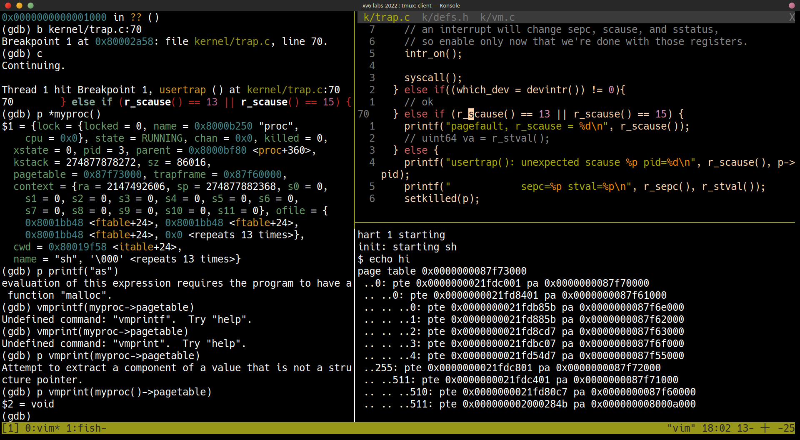
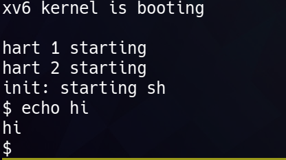
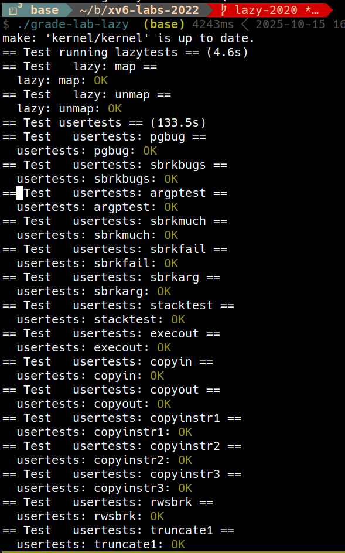
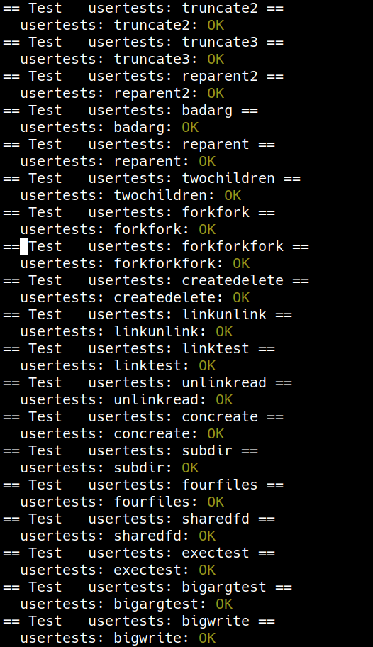
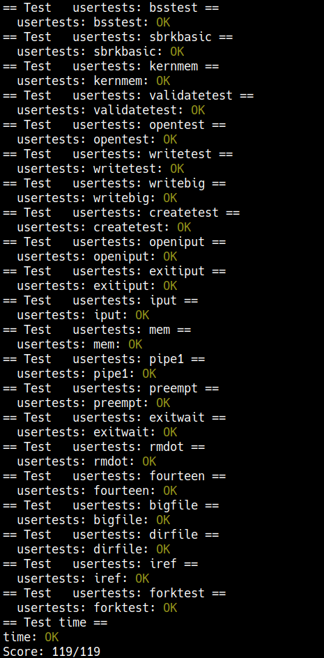

+++
date = '2025-10-11T11:28:40+08:00'
draft = false
title = '[xv6 學習紀錄 05] Lab: xv6 lazy page allocation'
series = ["xv6 學習紀錄"]
weight = 52
+++

* Lab 連結: [Lab: xv6 lazy page allocation](https://pdos.csail.mit.edu/6.S081/2020/labs/lazy.html)

## Eliminate allocation from sbrk() (easy)
> Your first task is to delete page allocation from the `sbrk(n)` system call implementation, which is the function `sys_sbrk()` in `sysproc.c`. The `sbrk(n)` system call grows the process's memory size by `n` bytes, and then returns the start of the newly allocated region (i.e., the old size). Your new `sbrk(n)` should just increment the process's size (`myproc()->sz`) by `n` and return the old size. It should not allocate memory -- so you should delete the call to `growproc()` (but you still need to increase the process's size!). 
* origin `sys_sbrk()`:
```c
uint64
sys_sbrk(void)
{
  int addr;
  int n;

  if(argint(0, &n) < 0)
    return -1;
  addr = myproc()->sz;
  if(growproc(n) < 0)
    return -1;
  return addr;
}
```
題目要我們改成這樣：
```c
uint64
sys_sbrk(void)
{
  uint64 addr;
  int n;

  argint(0, &n);
  addr = myproc()->sz;
  // if(growproc(n) < 0)
  //   return -1;
  myproc()->sz += n;
  return addr;
}
```

接著執行 `echo hi` 的結果：
```sh
xv6 kernel is booting

hart 2 starting
hart 1 starting
init: starting sh
$ echo hi
usertrap(): unexpected scause 0x000000000000000f pid=3
            sepc=0x00000000000012c4 stval=0x0000000000005008
panic: uvmunmap: not mapped
```

### 錯誤訊息解釋
* `usertrap()`:
    * 這些錯誤訊息是從 `kernel/trap.c: usertrap()` 產生出來的
* `unexpected scause 0x000000000000000f`:
    * register `scause` = 0x0f，是 page fault (TODO: 貼上來源)
* `pid = 3` 是 `sh` 的 pid
    * 在後面用 gdb 分析會知道這是 `sh`
* `sepc=0x00000000000012c4`:
    * 對應到 `sh.asm` 中的 `12ac: ld	ra,56(sp)`
* `stval=0x0000000000004008`:
    * 造成 page trap 的 virtual memory

### 使用 `gdb` 解析
```gdb
(gdb) b kernel/trap.c:70
(gdb) c
```
* `scause`
* `sepc`
* `stval`
* `struct proc p`
```gdb
(gdb) p *p
```

* `malloc()`
```gdb
(gdb) add-symbol-file user/_sh
```
`sh.c` 透過 `user/user.h` 引入 `user/umalloc.c` 的 `malloc.c`
```gdb
(gdb) b user/umalloc.c:malloc
```
問題發生在 sh -> malloc() -> morecore()

(TODO: more detailed, 說明跟 sbrk() 的關係為何)

## Lazy allocation (moderate)
> Modify the code in `trap.c` to respond to a page fault from user space by mapping a newly-allocated page of physical memory at the faulting address, and then returning back to user space to let the process continue executing. You should add your code just before the `printf` call that produced the "`usertrap(): ...`" message. Modify whatever other xv6 kernel code you need to in order to get `echo hi` to work. 

當 page fault 發生時：
1. 確認情形是正常的
1. allocate 一個新的 page 並且做 mapping
1. 處理完 page fault 之後要回到原本的 user process 繼續執行
1. 把程式碼加在這裡
    ```c
      } else {
        // TODO
        printf("usertrap(): unexpected scause %p pid=%d\n", r_scause(), p->pid);
        printf("            sepc=%p stval=%p\n", r_sepc(), r_stval());
        setkilled(p);
      }
    ```
處理完之後，`echo hi` 應該要可以正常執行

這裡我要先用 gdb debug 時，發現沒辦法設定到想要的地方，先把 `CFLAGS` 中的 `-O` 移除
```sh
make CFLAGS="-Wall -Werror -fno-omit-frame-pointer -ggdb -gdwarf-2 -DSOL_TRAPS -DLAB_TRAPS -MD -mcmodel=medany -ffreestanding -fno-common -nostdlib -mno-relax -I. -fno-stack-protector -fno-pie -no-pie" qemu-gdb
```
(注意要先 `make clean` 之後才會有效果)

```sh
(gdb) p *myproc()
$2 = {lock = {locked = 0, name = 0x8000b170 "proc", cpu = 0x0},
  state = RUNNING, chan = 0x0, killed = 0, xstate = 0, pid = 3,
  parent = 0x8000bea0 <proc+360>, kstack = 274877878272,
  sz = 86016, pagetable = 0x87f73000, trapframe = 0x87f60000,
  context = {ra = 2147492142, sp = 274877882368, s0 = 0,
    s1 = 0, s2 = 0, s3 = 0, s4 = 0, s5 = 0, s6 = 0, s7 = 0,
    s8 = 0, s9 = 0, s10 = 0, s11 = 0}, ofile = {
    0x8001ba68 <ftable+24>, 0x8001ba68 <ftable+24>,
    0x8001ba68 <ftable+24>, 0x0 <repeats 13 times>},
  cwd = 0x80019e78 <itable+24>,
  name = "sh", '\000' <repeats 13 times>}
(gdb) p/x myproc()->sz
$3 = 0x15000
(gdb) p/x $stval
$4 = 0x5008
```


```sh
page table 0x0000000087f73000
 ..0: pte 0x0000000021fdc001 pa 0x0000000087f70000
 .. ..0: pte 0x0000000021fd8401 pa 0x0000000087f61000
 .. .. ..0: pte 0x0000000021fdb85b pa 0x0000000087f6e000
 .. .. ..1: pte 0x0000000021fd885b pa 0x0000000087f62000
 .. .. ..2: pte 0x0000000021fd8cd7 pa 0x0000000087f63000
 .. .. ..3: pte 0x0000000021fdbc07 pa 0x0000000087f6f000
 .. .. ..4: pte 0x0000000021fd54d7 pa 0x0000000087f55000
 ..255: pte 0x0000000021fdc801 pa 0x0000000087f72000
 .. ..511: pte 0x0000000021fdc401 pa 0x0000000087f71000
 .. .. ..510: pte 0x0000000021fd80c7 pa 0x0000000087f60000 # trapframe
 .. .. ..511: pte 0x000000002000284b pa 0x000000008000a000 # trampoline
```
1. `myproc()->sz`: `0x15000`
1. `stval`: `0x5008`
1. 實際 pagetable 的內容，總共只有 5 個 page (不算 trampoline and trapframe)
    * 實際 size 為 5 * `PGSIZE` = `0x5000` (所以想 access va `0x5008` 時會 page fault)

解決方法：
* `sys_sbrk()`
    * `growproc()`
        * `uvmalloc()`
原本的呼叫如上，最終使用 `uvmalloc()`，因此學習 `uvmalloc()` 的作法，理論上可以讓 `echo hi` 正常執行

* `kernel/vm.c`:
```c
// Allocate PTEs and physical memory to grow process from oldsz to
// newsz, which need not be page aligned.  Returns new size or 0 on error.
uint64
uvmalloc(pagetable_t pagetable, uint64 oldsz, uint64 newsz, int xperm)
{
  char *mem;
  uint64 a;

  if(newsz < oldsz)
    return oldsz;

  oldsz = PGROUNDUP(oldsz);
  for(a = oldsz; a < newsz; a += PGSIZE){
    mem = kalloc();
    if(mem == 0){
      uvmdealloc(pagetable, a, oldsz);
      return 0;
    }
    memset(mem, 0, PGSIZE);
    if(mappages(pagetable, a, PGSIZE, (uint64)mem, PTE_R|PTE_U|xperm) != 0){
      kfree(mem);
      uvmdealloc(pagetable, a, oldsz);
      return 0;
    }
  }
  return newsz;
}
```
原先版本中的 `uvmalloc()` 是多 alloc 了多個 page，現在在這裡的版本只需要多 alloc 現在這個 va (`$stval`) 這一個 page 就好，之後如果又有沒有 allocate 的 page，就一樣會來到 page fault 的這裡，然後一樣專注於一個 page 的處理

```c
void
usertrap(void)
{
  // ...
  } else if((which_dev = devintr()) != 0){
    // ok
  } else if(r_scause() == 13 || r_scause() == 15){
    uint64 va = r_stval();
    lazy_alloc(va);
  } else {
    printf("usertrap(): unexpected scause %p pid=%d\n", r_scause(), p->pid);
    printf("            sepc=%p stval=%p\n", r_sepc(), r_stval());
    p->killed = 1;
  }
  
  // ...
}
```

```c
// Returns 0 on success, -1 if not
int
lazy_alloc(uint64 va)
{
  char *mem;
  uint64 a;

  a = PGROUNDDOWN(va);
  mem = kalloc();
  memset(mem, 0, PGSIZE);
  if(mappages(myproc()->pagetable, a, PGSIZE, (uint64)mem, PTE_R|PTE_U|PTE_W) != 0){
    kfree(mem);
    return -1;
  }
  return 0;
}
```
```c
void
uvmunmap(pagetable_t pagetable, uint64 va, uint64 npages, int do_free)
{
  uint64 a;
  pte_t *pte;

  if((va % PGSIZE) != 0)
    panic("uvmunmap: not aligned");

  for(a = va; a < va + npages*PGSIZE; a += PGSIZE){
    if((pte = walk(pagetable, a, 0)) == 0)
      // panic("uvmunmap: walk");
      continue;
    if((*pte & PTE_V) == 0)
      // panic("uvmunmap: not mapped");
      continue;
    if(PTE_FLAGS(*pte) == PTE_V)
      panic("uvmunmap: not a leaf");
    if(do_free){
      uint64 pa = PTE2PA(*pte);
      kfree((void*)pa);
    }
    *pte = 0;
  }
}
```
在 lazy allocation 的設計底下，`PTE_V == 0` 本來就是正常的


## Lazytests and Usertests (moderate)
> We've supplied you with `lazytests`, an xv6 user program that tests some specific situations that may stress your lazy memory allocator. Modify your kernel code so that all of both `lazytests` and `usertests` pass.
> * Handle negative `sbrk()` arguments.
> * Kill a process if it page-faults on a virtual memory address higher than any allocated with `sbrk()`.
> * Handle the parent-to-child memory copy in `fork()` correctly.
> * Handle the case in which a process passes a valid address from `sbrk()` to a system call such as read or write, but the memory for that address has not yet been allocated.
> * Handle out-of-memory correctly: if `kalloc()` fails in the page fault handler, kill the current process.
> * Handle faults on the invalid page below the user stack. 

目前的 lazy test 還有很多破綻，現在來一個一個的解決
> * Handle negative `sbrk()` arguments.

* `kernel/sysproc.c: sys_sbrk()`: 縮小的時候就還是跟原版的一樣使用 `growproc()` 去處裡就行了，`growproc()` 會有幫我們 `kfree` 不需要的 page 的作用
```c
uint64
sys_sbrk(void)
{
  uint64 addr;
  int n;
  struct proc *p = myproc();


  addr = p->sz;
  if (argint(0, &n))
    return 0;
  if (n < 0) {
    if (p->sz + n < 0)
      return -1;
    if (growproc(n) < 0)
      return -1;
  } else {
    myproc()->sz += n;
  }
  return addr;
}
```

> * Kill a process if it page-faults on a virtual memory address higher than any allocated with `sbrk()`.

`usertrap()` 在處理 page fualt 時，也不是所有 page fault 都符合，lazy allocation 的條件，例如 `stval` 中的 va 大於 size 的時候，就還是一個確確實實的錯誤情況，在這個情況下，把這個 process kill 掉

以下幾種方情況並不是 lazy allocation 的情形
1. `va` > `MAXVA`
1. 如果一個 page 的 `PTE_V` == 1 那麼他就一定不是 lazy alloc, 因為它已經被分配了
1. `va` >= `p->sz` 因為並沒有藉由 `sbrk()` 去新增位置

解決方法:
```c
int
is_lazy_addr(int va)
{
  struct proc *p = myproc();

  if (va > MAXVA)
    return 0;
  pte_t *pte = walk(p->pagetable, va, 0);
  if (pte && (*pte & PTE_V))
    return 0;
  if (PGROUNDDOWN(va) > PGROUNDDOWN(p->sz))
    return 0;
  return 1;
}
```

* `kernel/trap.c: usertrap()`
```c
void
usertrap(void)
{
  // ...
  } else if((which_dev = devintr()) != 0){
    // ok
  } else if(r_scause() == 13 || r_scause() == 15){
    struct proc *p = myproc();
    uint64 va = r_stval();

    if (is_lazy_addr(va)) {
      if (lazy_alloc(va) < 0)
        p->killed = 1;
    } else {
      p->killed = 1;
    }
  } else {
    printf("usertrap(): unexpected scause %p pid=%d\n", r_scause(), p->pid);
    printf("            sepc=%p stval=%p\n", r_sepc(), r_stval());
    p->killed = 1;
  }
  
  // ...
}
```

> * Handle the parent-to-child memory copy in `fork()` correctly.

主要在講 `kernel/proc.c: fork()` 中的呼叫的，`kernel/vm.c: uvmcopy`
原本的 `uvmcopy` 是 copy 一段連續的 memory, 可是現在使用 lazy alloc 了話，就不一定是連續的
* `kernel/proc.c: fork()`
```c
int
fork(void)
{
  int i, pid;
  struct proc *np;
  struct proc *p = myproc();

  // Allocate process.
  if((np = allocproc()) == 0){
    return -1;
  }

  // Copy user memory from parent to child.
  // 這裡使用 uvmcopy()
  if(uvmcopy(p->pagetable, np->pagetable, p->sz) < 0){
    freeproc(np);
    release(&np->lock);
    return -1;
  }
  np->sz = p->sz;

  // copy saved user registers.
  *(np->trapframe) = *(p->trapframe);

  // Cause fork to return 0 in the child.
  np->trapframe->a0 = 0;

  // increment reference counts on open file descriptors.
  for(i = 0; i < NOFILE; i++)
    if(p->ofile[i])
      np->ofile[i] = filedup(p->ofile[i]);
  np->cwd = idup(p->cwd);

  safestrcpy(np->name, p->name, sizeof(p->name));

  pid = np->pid;

  release(&np->lock);

  acquire(&wait_lock);
  np->parent = p;
  release(&wait_lock);

  acquire(&np->lock);
  np->state = RUNNABLE;
  release(&np->lock);

  return pid;
}
```

* `kernel/vm.c: uvmcopy`
```c
int
uvmcopy(pagetable_t old, pagetable_t new, uint64 sz)
{
  pte_t *pte;
  uint64 pa, i;
  uint flags;
  char *mem;

  for(i = 0; i < sz; i += PGSIZE){
    // 在 lazy allocation 的設計中，沒有找到對應的 pte 是正常的
    if((pte = walk(old, i, 0)) == 0)
      // panic("uvmcopy: pte should exist");
      continue;
    // 在 lazy allocation 的設計中，PTE_V == 0 是正常的
    if((*pte & PTE_V) == 0)
      // panic("uvmcopy: page not present");
      continue;
    pa = PTE2PA(*pte);
    flags = PTE_FLAGS(*pte);
    if((mem = kalloc()) == 0)
      goto err;
    memmove(mem, (char*)pa, PGSIZE);
    if(mappages(new, i, PGSIZE, (uint64)mem, flags) != 0){
      kfree(mem);
      goto err;
    }
  }
  return 0;

 err:
  uvmunmap(new, 0, i / PGSIZE, 1);
  return -1;
}
```

> * Handle the case in which a process passes a valid address from `sbrk()` to a system call such as read or write, but the memory for that address has not yet been allocated.

這裡在說的是如果是在 system call 如 `read()` 或是 `write()` 的過程中使用 lazy address，會發生問題，因為目前只有處理 user program 所產生的 page fault, 並沒有處理 system call 所產生的 page fault

例如可以像是 
```c
char buf[1024];
```
像是這種時候，`buf` 有可能是 lazy allocation，在之後如果利用 `write` 對於 `buf` 的操作會造成 page fault 但這時候已經進入到 supervisor mode 了，會無法進入到我們目前處理 page fault 的 `usertrap()`

流程:
* `kernel/sysfile.c: sys_write()`
    * `kernel/file.c: filewrite()`
        * `kernel/pipe.c: pipewrite()`
            * `kernel/vm.c: copyin()`
                * `kernel/vm.c: walkaddr()`
                    * `kernel/vm.c: walk()`

* `kernel/vm.c: copyin()`
```c
// Copy from user to kernel.
// Copy len bytes to dst from virtual address srcva in a given page table.
// Return 0 on success, -1 on error.
int
copyin(pagetable_t pagetable, char *dst, uint64 srcva, uint64 len)
{
  uint64 n, va0, pa0;

  while(len > 0){
    va0 = PGROUNDDOWN(srcva);
    pa0 = walkaddr(pagetable, va0); // 這個 va0 有可能是一個 lazy address
    if(pa0 == 0)
      return -1;
    n = PGSIZE - (srcva - va0);
    if(n > len)
      n = len;
    memmove(dst, (void *)(pa0 + (srcva - va0)), n);

    len -= n;
    dst += n;
    srcva = va0 + PGSIZE;
  }
  return 0;
}
```

* `kernel/vm.c: walkaddr()`
```c
// Look up a virtual address, return the physical address,
// or 0 if not mapped.
// Can only be used to look up user pages.
uint64
walkaddr(pagetable_t pagetable, uint64 va)
{
  pte_t *pte;
  uint64 pa;

  if(va >= MAXVA)
    return 0;

  pte = walk(pagetable, va, 0); // 如果是 lazy address 這裡應該會 walk 不出來
  if(pte == 0)
    return 0;
  if((*pte & PTE_V) == 0)
    return 0;
  if((*pte & PTE_U) == 0)
    return 0;
  pa = PTE2PA(*pte);
  return pa;
}
```

* `kernel/vm.c: walk()`
```c
pte_t *
walk(pagetable_t pagetable, uint64 va, int alloc)
{
  if(va >= MAXVA)
    panic("walk");

  for(int level = 2; level > 0; level--) {
    pte_t *pte = &pagetable[PX(level, va)];
    if(*pte & PTE_V) {
      pagetable = (pagetable_t)PTE2PA(*pte);
    } else {
      // 在 lazy address 的情況下，因為還沒有 allocate 所以會進入到這裡來
      // 最終會回傳 0
      if(!alloc || (pagetable = (pde_t*)kalloc()) == 0) 
        return 0;
      memset(pagetable, 0, PGSIZE);
      *pte = PA2PTE(pagetable) | PTE_V;
    }
  }
  return &pagetable[PX(0, va)];
}
```

解決方法：在 `walkaddr()` 遇到一個 lazy address 時，allocate 一個 page

* `kernel/vm.c: walkaddr()`
```c
uint64
walkaddr(pagetable_t pagetable, uint64 va)
{
  pte_t *pte;
  uint64 pa;

  if(va >= MAXVA)
    return 0;

  pte = walk(pagetable, va, 0);
  if (pte == 0 || (*pte & PTE_V) == 0) {
    struct proc *p = myproc();
    if(va >= p->sz || va < PGROUNDUP(p->trapframe->sp)) return 0;
    pa = (uint64)kalloc();
    if (pa == 0) return 0;
    if (mappages(p->pagetable, va, PGSIZE, pa, PTE_W|PTE_R|PTE_U|PTE_X) != 0) {
      kfree((void*)pa);
      return 0;
    }
    return pa;
  }
  if((*pte & PTE_U) == 0)
    return 0;
  pa = PTE2PA(*pte);
  return pa;
}
```
(TODO: more detailed)

> * Handle out-of-memory correctly: if `kalloc()` fails in the page fault handler, kill the current process.

```c
// Returns 0 on success, -1 if not
int
lazy_alloc(uint64 va)
{
  char *mem;
  uint64 a;

  a = PGROUNDDOWN(va);
  mem = kalloc();
  if (mem == 0) {
    return -1;
  }
  memset(mem, 0, PGSIZE);
  if(mappages(myproc()->pagetable, a, PGSIZE, (uint64)mem, PTE_W|PTE_R|PTE_X|PTE_U) != 0){
    kfree(mem);
    return -1;
  }
  return 0;
}
```

> * Handle faults on the invalid page below the user stack. 

```c
// Returns 0 on success, -1 if not
int
lazy_alloc(uint64 va)
{
  char *mem;
  uint64 a;

  a = PGROUNDDOWN(va);
  mem = kalloc();
  if (mem == 0) {
    return -1;
  }
  memset(mem, 0, PGSIZE);
  if(mappages(myproc()->pagetable, a, PGSIZE, (uint64)mem, PTE_W|PTE_R|PTE_X|PTE_U) != 0){
    kfree(mem);
    return -1;
  }
  return 0;
}
```
(TODO: more detailed)





## References
* [6.S081 2020](https://pdos.csail.mit.edu/6.S081/2020/schedule.html)
* [Lab lazy](https://pdos.csail.mit.edu/6.S081/2020/labs/lazy.html)
* [xv6 book](https://pdos.csail.mit.edu/6.S081/2020/xv6/book-riscv-rev1.pdf)
* [video](https://youtu.be/KSYO-gTZo0A)
* [Lazy Page Allocation 实验记录](https://ttzytt.com/2022/07/xv6_lab5_record/)


