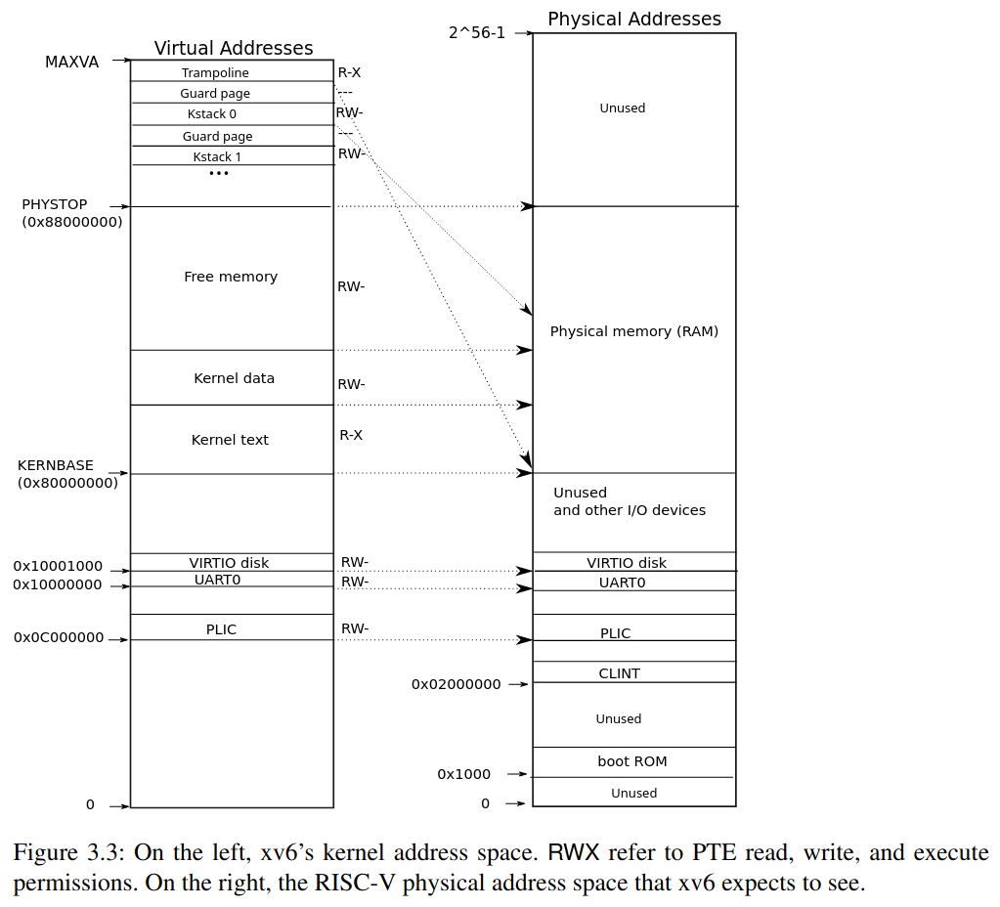

+++
date = '2025-10-15T17:47:29+08:00'
draft = false
title = '[xv6 學習紀錄 06] Lab: Copy-on-Write Fork for xv6'
series = ["xv6 學習紀錄"]
weight = 61
+++
Lab 連結：[Lab: Copy-on-Write Fork for xv6](https://pdos.csail.mit.edu/6.S081/2022/labs/cow.html)

## 題目解析

> ## The problem
>  The fork() system call in xv6 copies all of the parent process's user-space memory into the child. If the parent is large, copying can take a long time. Worse, the work is often largely wasted: fork() is commonly followed by exec() in the child, which discards the copied memory, usually without using most of it. On the other hand, if both parent and child use a copied page, and one or both writes it, the copy is truly needed. 

在現在的 xv6 設計中，`fork()` 出來的 child 會複製 parent 的所有 memory，但是在很多時候，child 會直接接著執行 `exec()`，也就直接把先前的一大票 memory 覆蓋掉了，這讓當 memory 的複製便得很浪費。

想要節省這樣的浪費可以在 `fork()` 的時候只複製一份 page table 給 child，但是這麼做的話，每當 parent or child 想要 write 的時候，就會需要真的 copy 一份才行

> ## The solution
>  Your goal in implementing copy-on-write (COW) fork() is to defer allocating and copying physical memory pages until the copies are actually needed, if ever. 

這個 lab 要我們實做一個 copy-on-write (COW) fork() 的技術，跟先前提到的一樣，只有在「真的需要的時候」才真的複製一個 page 出來。

>  COW `fork()` creates just a pagetable for the child, with PTEs for user memory pointing to the parent's physical pages. COW `fork()` marks all the user PTEs in both parent and child as read-only. When either process tries to write one of these COW pages, the CPU will force a page fault. The kernel page-fault handler detects this case, allocates a page of physical memory for the faulting process, copies the original page into the new page, and modifies the relevant PTE in the faulting process to refer to the new page, this time with the PTE marked writeable. When the page fault handler returns, the user process will be able to write its copy of the page. 

實際的作法是把 child 的 pagetable 跟 parent 的一樣指向同樣的 physical memory 區域，並且都 mark 為 read only，當有 process 想要 write 的時候，就會進入到 page fault 處理，page fault 會複製出一份可以 write 的 page

> Here's a reasonable plan of attack.
>    1. Modify `uvmcopy()` to map the parent's physical pages into the child, instead of allocating new pages. Clear `PTE_W` in the PTEs of both child and parent for pages that have `PTE_W` set.

在 `uvmcopy()` 中執行複製 pagetable 並且設定 `PTE_W` 的計畫
* `uvmcopy()` 的使用時機也只有 `fork()` 的時候會用到

>    2. Modify `usertrap()` to recognize page faults. When a write page-fault occurs on a COW page that was originally writeable, allocate a new page with `kalloc()`, copy the old page to the new page, and install the new page in the PTE with `PTE_W` set. Pages that were originally read-only (not mapped `PTE_W`, like pages in the text segment) should remain read-only and shared between parent and child; a process that tries to write such a page should be killed.

在 (write to read only) page fault 時，會進入到 `usertrap()` 處理，這時候會分為一下兩種情況：
1. 這個 page 在最初的時候，是 `PTE_W` (在這個情況下才需要 Copy-on-Write)
1. 這個 page 在最初的時候，是本來就不是 `PTE_W`: 這是真正的 page fault, kill the process
	* 像是 text segment (instructions 的區域)
* 這裡就需要考慮一下該把最初 `PTE_W` 存放在哪裡了

>    3. Ensure that each physical page is freed when the last PTE reference to it goes away -- but not before. A good way to do this is to keep, for each physical page, a "reference count" of the number of user page tables that refer to that page. Set a page's reference count to one when `kalloc()` allocates it. Increment a page's reference count when fork causes a child to share the page, and decrement a page's count each time any process drops the page from its page table. `kfree()` should only place a page back on the free list if its reference count is zero. It's OK to to keep these counts in a fixed-size array of integers. You'll have to work out a scheme for how to index the array and how to choose its size. For example, you could index the array with the page's physical address divided by `4096`, and give the array a number of elements equal to highest physical address of any page placed on the free list by `kinit()` in `kalloc.c`. Feel free to modify `kalloc.c` (e.g., `kalloc()` and `kfree()`) to maintain the reference counts.

這裡是在探討把 physical page free 掉的時機，「沒有任何 process 使用」時才真的 free 掉，雖然概念上很清楚的知道是這個時機，但其實要實做出來也沒有那麼容易。
* 每當 `kalloc()` 之後，就給這個 page 一個 reference count
* `kalloc()` 的時候，reference count 設定為 1
* Increase: 因為 `fork()` 產生出 child 的時候
* Decrease: 一個 process drop 這個 page 的時候
* `kfree()` 只有在 reference count 減少到 0 時才會真的把 page 放回 free list 中
* 計算 reference count 的 data structure 可以是放在一個 fixed size 的 array 中
	* 需要多大？
	* 如何做 index 的 mapping?
	* 要放在哪裡？(於 `kinit()` 中放置這個 array)
		* 學習 free list 的初始化過程


>    1. Modify `copyout()` to use the same scheme as page faults when it encounters a COW page. 

在 `copyout()` 的時候，也需要判斷有沒有遇到 COW page，如果是 COW page, 就比照辦理
* 這裡可以發現跟 Lazy allocation 的時候一樣，在 supervisor mode 的時候因為不會進入 `usertrap()` 所以要自行處理。


> * It may be useful to have a way to record, for each PTE, whether it is a COW mapping. You can use the RSW (reserved for software) bits in the RISC-V PTE for this.

可以在每個 PTE 中新增像是 `PTE_C` 去紀錄這是不是一個 COW mapping
* 其實有一點想要把原本的所有狀態都塞進去，

> * `usertests -q` explores scenarios that `cowtest` does not test, so don't forget to check that all tests pass for both.

> * Some helpful macros and definitions for page table flags are at the end of `kernel/riscv.h`.

> * If a COW page fault occurs and there's no free memory, the process should be killed. 

* 如果沒有free memory 時，就直接 kill the process

## `fork()` 的當下
其實我覺得與其說是 `fork()` 時複製出一個 "read-only" 的 page table，不如說他是 "cannot-be-write" 會比較貼切，這麼說是因為 "要 write 的時候必須特別處理" 才是 copy-on-write 的核心，變成 read-only 並不那麼精確，另外，把他們一律視為 read-only 會有兩個壞處：
1. "原本的 page 是否能 read" 這個資訊被洗掉了
1. "原本的 page 是否能 write" 這個資訊被洗掉了

所以我這裡的策略到不是把所有 PTE 都變成 read-only 這裡的策略是
* 把所有的 `PTE_W == 0`
* 把原本的 `PTE_W` 的資訊放在 `PTE_RES`
* 設定 `PTE_COW`


這時候可以利用 RSW 的 bit 8, 9 資訊紀錄

* `kernel/riscv.h`
```c
#define PTE_V (1L << 0) // valid
#define PTE_R (1L << 1)
#define PTE_W (1L << 2)
#define PTE_X (1L << 3)
#define PTE_U (1L << 4) // user can access

#define PTE_COW   (1L << 8) // is COW page
#define PTE_COW_W (1L << 9) // PET_W before becomming COW
```

* `uvmcopy()`
```c
int
uvmcopy(pagetable_t old, pagetable_t new, uint64 sz)
{
  pte_t *pte;
  uint64 pa, i;
  uint flags;
  char *mem;

  for(i = 0; i < sz; i += PGSIZE){
    if((pte = walk(old, i, 0)) == 0)
      panic("uvmcopy: pte should exist");
    if((*pte & PTE_V) == 0)
      panic("uvmcopy: page not present");
    pa = PTE2PA(*pte);
    flags = PTE_FLAGS(*pte);
    if((mem = kalloc()) == 0)
      goto err;
    memmove(mem, (char*)pa, PGSIZE);
    if(mappages(new, i, PGSIZE, (uint64)mem, flags) != 0){
      kfree(mem);
      goto err;
    }
  }
  return 0;

 err:
  uvmunmap(new, 0, i / PGSIZE, 1);
  return -1;
}
```
改成下面這樣：
```c
int
uvmcopy(pagetable_t old, pagetable_t new, uint64 sz)
{
  pte_t *pte;
  uint64 pa, i;
  uint flags;
  char *mem;

  for(i = 0; i < sz; i += PGSIZE){
    if((pte = walk(old, i, 0)) == 0)
      panic("uvmcopy: pte should exist");
    if((*pte & PTE_V) == 0)
      panic("uvmcopy: page not present");
    pa = PTE2PA(*pte);
    flags = PTE_FLAGS(*pte);
    // parent pte
    // set PTE_COW and PTE_COW_W
    *pte = *pte | PTE_COW; // set PTE_COW
    if (*pte & PTE_W)
      *pte = *pte | PTE_COW_W; // set PTE_COW_W
    *pte = *pte & ~PTE_W; // cannot be wite
    // child pte
    flags = PTE_FLAGS(*pte); // as same as parent
    if(mappages(new, i, PGSIZE, (uint64)pa, flags) != 0){
      kfree(mem);
      goto err;
    }
  }
  return 0;

 err:
  uvmunmap(new, 0, i / PGSIZE, 1);
  return -1;
}
```
## Reference Count
### 有多少 page 需要 Reference Count

```c
// the kernel expects there to be RAM
// for use by the kernel and user pages
// from physical address 0x80000000 to PHYSTOP.
#define KERNBASE 0x80000000L
#define PHYSTOP (KERNBASE + 128*1024*1024)
```
真的是 Physical memory (RAM) 的 address 為 `KERNBASE` ~ `PHYSTOP`  
-> `0x80000000 ~ 0x88000000`
在 Physical memory (RAM) 又因為 kernel text 與 kernel data 佔去了一部分
實際上 user program 會用到的只有 `end` ~ `PHYSTOP`

* `kernel/kalloc.c`
```c
extern char end[]; // first address after kernel.
                   // defined by kernel.ld.

void
kinit()
{
  initlock(&kmem.lock, "kmem");
  freerange(end, (void*)PHYSTOP);
}

void
freerange(void *pa_start, void *pa_end)
{
  char *p;
  p = (char*)PGROUNDUP((uint64)pa_start);
  for(; p + PGSIZE <= (char*)pa_end; p += PGSIZE)
    kfree(p);
}
```
這裡需要小注意一下 
* `PHYSTOP` 是包含的
* `end` 則不一定，要看 `PGROUNDUP()` 的結果 (因為不可以跟 kerenl 塞在同一個 page 中)

需要 reference count 的 page 數量為
```c
(PHYSTOP - PGROUNDUP((uint64)pa_start) + 1) / PGSIZE;
```
但題目說可以用一個 fix-sized 的 array 就好，言下之意就是雖然 kernel text 與 kernel data 雖然實際上部需要 reference count 的管理，但還是給它們 refrence count 單純為了求一個方便

結論：大小為
```c
(PHYSTOP - KERNBASE) / PGSIZE;
(PGROUNDUP(PHYSTOP) - KERNBASE) / PGSIZE;
```


### Reference Count 的 Data Structure

#### 存放位置
* 這個 array 最終實際上的位置會在 kernel data 的區域中
* `kernel/kalloc.c`
```c
int ref_cnt[(PHYSTOP - KERNBASE / PGSIZE)]; // TODO
```

#### index 的方法
* `kernel/memlayout.h`
```c
REFCNT(pa) ref_cnf[PGROUNDDOWN(pa) - xxx]; // TODO
```

### Reference Count 的 Increament/Decreament
#### 初始為 1 時
* `kalloc()`
```c
void *
kalloc(void)
{
  struct run *r;

  acquire(&kmem.lock);
  r = kmem.freelist;
  if(r)
    kmem.freelist = r->next;
  release(&kmem.lock);

  if(r)
    memset((char*)r, 5, PGSIZE); // fill with junk
  return (void*)r;
}
```

#### Increament
`fork()` 所導致的 `uvmcopy()`
```c
int
uvmcopy(pagetable_t old, pagetable_t new, uint64 sz)
{
  pte_t *pte;
  uint64 pa, i;
  uint flags;
  char *mem;

  for(i = 0; i < sz; i += PGSIZE){
    if((pte = walk(old, i, 0)) == 0)
      panic("uvmcopy: pte should exist");
    if((*pte & PTE_V) == 0)
      panic("uvmcopy: page not present");
    pa = PTE2PA(*pte);
    flags = PTE_FLAGS(*pte);
    // 1. Parent pte
    // set PTE_COW and PTE_COW_W
    *pte = *pte | PTE_COW; // set PTE_COW
    if (*pte & PTE_W)
      *pte = *pte | PTE_COW_W; // set PTE_COW_W
    *pte = *pte & ~PTE_W; // cannot be wite
    // 2. Child pte
    flags = PTE_FLAGS(*pte); // as same as parent
    if(mappages(new, i, PGSIZE, (uint64)pa, flags) != 0){
      kfree(mem);
      goto err;
    }
  }
  return 0;

 err:
  uvmunmap(new, 0, i / PGSIZE, 1);
  return -1;
}
```

#### Decreament
`kfree()`
```c
void
kfree(void *pa)
{
  struct run *r;

  if(((uint64)pa % PGSIZE) != 0 || (char*)pa < end || (uint64)pa >= PHYSTOP)
    panic("kfree");

  // Fill with junk to catch dangling refs.
  memset(pa, 1, PGSIZE);

  r = (struct run*)pa;

  acquire(&kmem.lock);
  r->next = kmem.freelist;
  kmem.freelist = r;
  release(&kmem.lock);
}
```

#### 降為 0 時
`kfree()`
```c
void
kfree(void *pa)
{
  struct run *r;

  if(((uint64)pa % PGSIZE) != 0 || (char*)pa < end || (uint64)pa >= PHYSTOP)
    panic("kfree");

  // Fill with junk to catch dangling refs.
  memset(pa, 1, PGSIZE);

  r = (struct run*)pa;

  acquire(&kmem.lock);
  r->next = kmem.freelist;
  kmem.freelist = r;
  release(&kmem.lock);
}
```

### Page Fault 的處理
這裡跟 Lazy allocation 的處理類似
* `kernel/trap.c: usertrap()`
```c
void
usertrap(void)
{
  // ...
  } else if((which_dev = devintr()) != 0){
    // ok
  } else if(r_scause() == 13 || r_scause() == 15){
    uint64 va = r_stval();
    struct proc *p = myproc();

    if () {
	} else {
      setkilled(p);
    }
  } else {
    printf("usertrap(): unexpected scause %p pid=%d\n", r_scause(), p->pid);
    printf("            sepc=%p stval=%p\n", r_sepc(), r_stval());
    setkilled(p);
  }
  // ...
}
```

## kernel 中的 Copy-on-Write 如何處理
這裡就有一點像是前面 `copyin()` `copyout()`

doing
