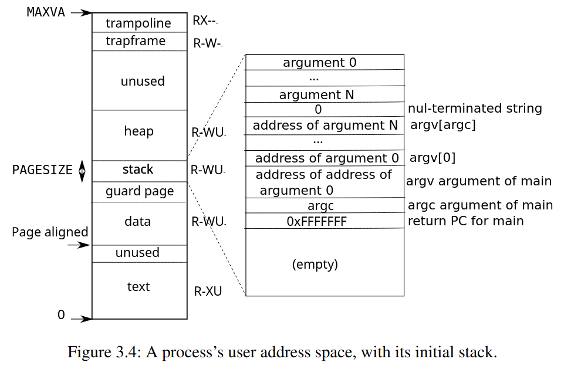
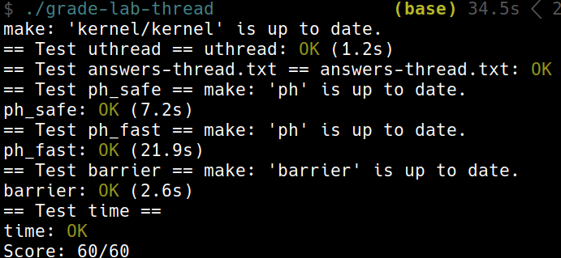

+++
date = '2025-10-21T19:35:33+08:00'
draft = false
title = '[xv6 學習紀錄 07] Lab thread: Multithreading'
series = ["xv6 學習紀錄"]
weight = 72
+++
Lab 連結：[Lab: Multithreading](https://pdos.csail.mit.edu/6.S081/2022/labs/thread.html)

## Uthread: switching between threads (moderate)
> In this exercise you will design the context switch mechanism for a user-level threading system, and then implement it. To get you started, your xv6 has two files `user/uthread.c` and `user/uthread_switch.S`, and a rule in the `Makefile` to build a uthread program. uthread.c contains most of a user-level threading package, and code for three simple test threads. The threading package is missing some of the code to create a thread and to switch between threads. 

> Your job is to come up with a plan to create threads and save/restore registers to switch between threads, and implement that plan. When you're done, `make grade` should say that your solution passes the `uthread` test. 

這一題要我們做的是在 User Program 的 level 再做出一個多個 thread 的層級


* `user/uthread.c`: 先來看 data structure 
```c
/* Possible states of a thread: */
#define FREE        0x0
#define RUNNING     0x1
#define RUNNABLE    0x2

#define STACK_SIZE  8192
#define MAX_THREAD  4


struct thread {
  char       stack[STACK_SIZE]; /* the thread's stack */
  int        state;             /* FREE, RUNNING, RUNNABLE */
};
struct thread all_thread[MAX_THREAD];
struct thread *current_thread;
```
* `stack` 可供我們儲存這個 stack 的相關資訊
    * 這裡功能的會是原先 memory layout 中的 stack
    * 
* `state` 可代表 這個 state 的狀態，跟 `proc.h` 中的類似
* 這裡的 `thread` 就很單純的用一個 fix-sized 的 array 存放
* `current_thread` 代表當前所運行的 thread

```c
extern void thread_switch(uint64, uint64);
```
* `extern` 只是宣告，真正的 `thread_switch` 寫在 `user/uthread_switch.S` 中  

接著看 `main()`
```c
int 
main(int argc, char *argv[]) 
{
  a_started = b_started = c_started = 0;
  a_n = b_n = c_n = 0;
  thread_init();
  thread_create(thread_a);
  thread_create(thread_b);
  thread_create(thread_c);
  thread_schedule();
  exit(0);
}
```
1. `thread_init()`
1. `thread_create()`
1. `thread_schedule()`

* 先用 `thread_init()` 決定第一個運行的 thread

```c
void 
thread_init(void)
{
  // main() is thread 0, which will make the first invocation to
  // thread_schedule().  it needs a stack so that the first thread_switch() can
  // save thread 0's state.  thread_schedule() won't run the main thread ever
  // again, because its state is set to RUNNING, and thread_schedule() selects
  // a RUNNABLE thread.
  current_thread = &all_thread[0];
  current_thread->state = RUNNING;
}
```

* `thread_create()` 可以用一個 pointer to a function 作為參數
    * 這部份需要我們自行實做完成
```c
void 
thread_create(void (*func)())
{
  struct thread *t;

  for (t = all_thread; t < all_thread + MAX_THREAD; t++) {
    if (t->state == FREE) break;
  }
  t->state = RUNNABLE;
  // YOUR CODE HERE
}
```

* `thread_schedule()`: 可以持續的更換不同的 thread 執行
```c
void 
thread_schedule(void)
{
  struct thread *t, *next_thread;

  /* Find another runnable thread. */
  next_thread = 0;
  t = current_thread + 1;
  for(int i = 0; i < MAX_THREAD; i++){
    if(t >= all_thread + MAX_THREAD)
      t = all_thread;
    if(t->state == RUNNABLE) {
      next_thread = t;
      break;
    }
    t = t + 1;
  }

  if (next_thread == 0) {
    printf("thread_schedule: no runnable threads\n");
    exit(-1);
  }

  if (current_thread != next_thread) {         /* switch threads?  */
    next_thread->state = RUNNING;
    t = current_thread;
    current_thread = next_thread;
    /* YOUR CODE HERE
     * Invoke thread_switch to switch from t to next_thread:
     * thread_switch(??, ??);
     */
  } else
    next_thread = 0;
}

void 
thread_create(void (*func)())
{
  struct thread *t;

  for (t = all_thread; t < all_thread + MAX_THREAD; t++) {
    if (t->state == FREE) break;
  }
  t->state = RUNNABLE;
  // YOUR CODE HERE
}
```

* `user/uthread_switch.S`: 基本上可以學 `swtch.S`
```asm
	.text

	/*
         * save the old thread's registers,
         * restore the new thread's registers.
         */

	.globl thread_switch
thread_switch:
	/* YOUR CODE HERE */
	ret    /* return to ra */
```

### Hints:
>  `thread_switch` needs to save/restore only the callee-save registers. Why? 

應該是不用的，這個問題可以先放到心裡，等等在實做的時候會感受到

>  You can see the assembly code for `uthread` in `user/uthread.asm`, which may be handy for debugging. 

### 什麼構成一個 thread 運行的狀態?
這一題的核心在於必須要了解 thread 需要哪些東西才符合運行的條件，或是說本質上不論是這次題目要做的 uthread 或是 xv6 原先在 kernel 做的 thread switching，本質上都是 save/restore thread 的問題，而我們這裡可以想像

1. save memory 與 register 的狀態
1. restore memory 與 register 的狀態

只要 memory 與 register (包含 program counter) 的狀態可以 save 與 restore 我們就可以做到不同 thread 之間的 switch，接著來依序討論 register 與 memory 的細節。

#### registers

以下是需要 save/restore 的 registers
* `ra`: instruction `ret` 會跑回去的 address
* `sp`: 現在的 stack 的位置，這會搭配 `(struct *thread) t->stack` 等等在 memory layout 的討論會再一次看到

在進入 `thread_switch()` 的 register 的狀態
* 所有 Caller saved registers 會自然而然的被存下來，這是 compiler 保證會做到的事情
* 所有 Callee saved registers 需要在 `thread_switch()` 的時候 save 到 register 中
    * 因為在 `thread_switch()` 之後，這些 Callee saved registers 會被下一個 thread 的 callee saved 洗掉，which is 原本被保證說在 function call 的過程中 callee 負擔 save 與 restore 的責任
    * 我們利用 `thread_switch()` 的機制，確實是有讓 `thread_switch()` 這個 callee 附起了 save/restore 的責任，只是跟一般的 jump/ret 的方式複雜了些

總結：
* callee-saved:
    * 以 caller 的角度而言
        * 不管我呼叫到了多少的 funcfion，這些 register 都不應該會被改變
		* 在 `thread_yield()` -> `thread_schedule()` -> `thread_switch()` 的過程中 compiler 產出的 assembly 會保證把這些 register 放入 stack 中
    * 以 callee 的角度而言
        * 如果我需要使用 callee-saved regisger，那麼我一定要把值還給 caller 再 return
		* 這進入到 `thread_switch()` 之後沒有 compiler 為我們做這件事情，我們自己把他們放入 `(struct *thread) t->context` 中
* caller-saved:
    * 以 caller 的角度而言
        * 在呼叫別的 function 之前，我一定要自己把 caller-saved register 紀錄下來才行
    * 以 callee 的角度而言
        * 我可以隨意的使用 caller-saved register，因為我知道 caller 會自己 value 的還原處理好
		* 所以 `thread_switch()` 可以不用管是否洗掉 caller-saved registers，因為 compiler 有幫我們放入 stack 中了

* `ra`
	* 是 caller saved register，因為 `call` 會直接改掉 `ra` callee 沒有辦法負起 save/restore 的責任
	* 進入 `thread_switch()` 之前的 `ra`: 會被存放於 stack 中，這是 compiler 保證的
	* 剛進入到 `thread_switch()` 的 `ra`: 放入當前的 `(struct *thread) t->context->ra` 中，這之後要回來當前 thread 的時候會用到
	* 之後再把下一個 thread 當初的 `t->context->ra` 放入 register `ra` 中，等等 `ret` 的時候就會直接跳到他上次執行的地方了。

#### memory layout
並不需要思考 text ,data 與 heap 的部份，那些是這 3 個 thread 都會一起共享的，比較麻煩的會在於 stack
```c
void 
thread_a(void)
{
  int i;
  printf("thread_a started\n");
  a_started = 1;
  while(b_started == 0 || c_started == 0)
    thread_yield();
  
  for (i = 0; i < 100; i++) {
    printf("thread_a %d\n", i);
    a_n += 1;
    thread_yield();
  }
  printf("thread_a: exit after %d\n", a_n);

  current_thread->state = FREE;
  thread_schedule();
}
```
例如像是 `thread_a()` 當中的 `int i`, 他有可能需要放入 stack 中
* 這個 process 的 main thread 的 stack
* `thread_a()` 的 stack

```text
                   .
                   .
      +->          .
      |   +-----------------+   |
      |   | return address  |   |
      |   |   previous fp ------+
      |   | saved registers |
      |   | local variables |
      |   |       ...       | <-+
      |   +-----------------+   |
      |   | return address  |   |
      +------ previous fp   |   |
          | saved registers |   |
          | local variables |   |
      +-> |       ...       |   |
      |   +-----------------+   |
      |   | return address  |   |
      |   |   previous fp ------+
      |   | saved registers |
      |   | local variables |
      |   |       ...       | <-+
      |   +-----------------+   |
      |   | return address  |   |
      +------ previous fp   |   |
          | saved registers |   |
          | local variables |   |
  $fp --> |       ...       |   |
          +-----------------+   |
          | return address  |   |
          |   previous fp ------+
          | saved registers |
  $sp --> | local variables |
          +-----------------+
```

一切要先回到 current 的當前狀態，來看看 `uthread.asm`
注意
```text
void 
thread_a(void)
{
 100:	7179                	addi	sp,sp,-48
 102:	f406                	sd	ra,40(sp)
 104:	f022                	sd	s0,32(sp)
 106:	ec26                	sd	s1,24(sp)
 108:	e84a                	sd	s2,16(sp)
 10a:	e44e                	sd	s3,8(sp)
 10c:	e052                	sd	s4,0(sp)
 10e:	1800                	addi	s0,sp,48
  int i;
  printf("thread_a started\n");
 110:	00001517          	auipc	a0,0x1

...
...

 1bc:	70a2                	ld	ra,40(sp)
 1be:	7402                	ld	s0,32(sp)
 1c0:	64e2                	ld	s1,24(sp)
 1c2:	6942                	ld	s2,16(sp)
 1c4:	69a2                	ld	s3,8(sp)
 1c6:	6a02                	ld	s4,0(sp)
 1c8:	6145                	addi	sp,sp,48
 1ca:	8082                	ret
```

這裡可以看到前後對於 `sp` 的操作，

一般情況下在同一個 process 的範圍內，只需要單純的往下長就好，這裡則需要特別設定`sp` 指向特定在 `struct thread` 中專屬的 `stack`

(TODO: 這裡沒有用 `fp`，跟 lab trap 中的 backtrace 不一樣，這方面可以再詳述)
這裡的 `s0` 就是 `fp` 的意思

總結一下我們要如何回答「如何

### 實做 `thread_create()`
```c
struct context {
  uint64 ra;
  uint64 sp;

  // callee-saved
  uint64 s0;
  uint64 s1;
  uint64 s2;
  uint64 s3;
  uint64 s4;
  uint64 s5;
  uint64 s6;
  uint64 s7;
  uint64 s8;
  uint64 s9;
  uint64 s10;
  uint64 s11;
};

struct thread {
  char       stack[STACK_SIZE]; /* the thread's stack */
  int        state;             /* FREE, RUNNING, RUNNABLE */
  struct context context;
};

void 
thread_create(void (*func)())
{
  struct thread *t;

  for (t = all_thread; t < all_thread + MAX_THREAD; t++) {
    if (t->state == FREE) break;
  }
  t->state = RUNNABLE;

  // YOUR CODE HERE
  t->context->ra = (uint64) func;
  t->context->sp = (uint64) (t->stack + STACK_SIZE - 1);
}
```
* `context`: 這裡跟 `kernel/proc.h` 的 `context` 一樣，並且如同先前分析需要 save/restore 的 register 一樣
* `ra` 直接設定到 `func` 的 address，在第一次執行到的時候，就會直接 ret 到 very first instruction of this function 了
* 如同先前分析的 stack 的使用，thread 在初始時，會需要先把 stack 的頂端的資訊給設定下來，這裡要記得 stack 是往下長的

### 實做 `thread_schedule()`
```c
void 
thread_schedule(void)
{
  struct thread *t, *next_thread;

  /* Find another runnable thread. */
  next_thread = 0;
  t = current_thread + 1;
  for(int i = 0; i < MAX_THREAD; i++){
    if(t >= all_thread + MAX_THREAD)
      t = all_thread;
    if(t->state == RUNNABLE) {
      next_thread = t;
      break;
    }
    t = t + 1;
  }

  if (next_thread == 0) {
    printf("thread_schedule: no runnable threads\n");
    exit(-1);
  }

  if (current_thread != next_thread) {         /* switch threads?  */
    next_thread->state = RUNNING;
    t = current_thread;
    current_thread = next_thread;
    /* YOUR CODE HERE
     * Invoke thread_switch to switch from t to next_thread:
     * thread_switch(??, ??);
     */
    thread_switch((uint64) &t->context, (uint64) &next_thread->context);
  } else
    next_thread = 0;
}
```

### 實做 `thread_switch`
這裡直接照抄 `kernel/swtch.S` 就好
```asm
	.globl thread_switch
thread_switch:
	/* YOUR CODE HERE */
        sd ra, 0(a0)
        sd sp, 8(a0)
        sd s0, 16(a0)
        sd s1, 24(a0)
        sd s2, 32(a0)
        sd s3, 40(a0)
        sd s4, 48(a0)
        sd s5, 56(a0)
        sd s6, 64(a0)
        sd s7, 72(a0)
        sd s8, 80(a0)
        sd s9, 88(a0)
        sd s10, 96(a0)
        sd s11, 104(a0)

        ld ra, 0(a1)
        ld sp, 8(a1)
        ld s0, 16(a1)
        ld s1, 24(a1)
        ld s2, 32(a1)
        ld s3, 40(a1)
        ld s4, 48(a1)
        ld s5, 56(a1)
        ld s6, 64(a1)
        ld s7, 72(a1)
        ld s8, 80(a1)
        ld s9, 88(a1)
        ld s10, 96(a1)
        ld s11, 104(a1)
        
	ret    /* return to ra */
```

最後看 `make qemu` 之後 `uthread` 看有沒有出錯就好了

## Using threads (moderate)
使用 `table_locks` 解決

```C
struct entry {
  int key;
  int value;
  struct entry *next;
};
struct entry *table[NBUCKET];
pthread_mutex_t table_locks[NBUCKET];
int keys[NKEYS];
int nthread = 1;
```

在 `main()` 中初始化
```C
int
main(int argc, char *argv[])
{
  // ...

  if (argc < 2) {
    fprintf(stderr, "Usage: %s nthreads\n", argv[0]);
    exit(-1);
  }
  for (int i = 0; i < NBUCKET; i++)
    pthread_mutex_init(&table_locks[i], NULL);

  // ...
}
```

在使用到 `table[i]` 的前後使用 `pthread_mutex_lock()` 以及 `pthread_mutex_unlock()`
```C
static 
void put(int key, int value)
{
  int i = key % NBUCKET;

  pthread_mutex_lock(&table_locks[i]); // lock!!!!!

  struct entry *e = 0;
  for (e = table[i]; e != 0; e = e->next) {
    if (e->key == key)
      break;
  }
  if(e){
    e->value = value;
  } else {
    insert(key, value, &table[i], table[i]);
  }

  pthread_mutex_unlock(&table_locks[i]); // unlock!!!
}
```
(TODO: 分析與解釋)
## Barrier(moderate)
Barrier 的用意在於希望多個 thread 可以到達某個 點之後，大家再一起繼續執行下去

### `struct barrier` 解釋
```c
static int nthread = 1; // 總共有多少個 thread

struct barrier {
  // pthread_cond_wait() 需要有 cond 以及 mutex 作為參數
  pthread_mutex_t barrier_mutex; // 必須拿到 mutex 針對 bstate 做動作
  pthread_cond_t barrier_cond;

  int nthread;      // 有多少 thread 到達了 barrier
  int round;        // 總共有 20000 回合的 barrier
} bstate;           // round 用來紀錄現在進行到了第幾回合
```

### 程式實做
```c
static void 
barrier()
{
  // YOUR CODE HERE
  //
  // Block until all threads have called barrier() and
  // then increment bstate.round.
  //
  pthread_mutex_lock(&bstate.barrier_mutex);

  bstate.nthread++;
  if (bstate.nthread < nthread) {
    pthread_cond_wait(&bstate.barrier_cond, &bstate.barrier_mutex);
  } else {
    bstate.round++;
    bstate.nthread = 0;
    pthread_cond_broadcast(&bstate.barrier_cond);
  }

  pthread_mutex_unlock(&bstate.barrier_mutex);
}
```
(TODO: 分析與解釋)


