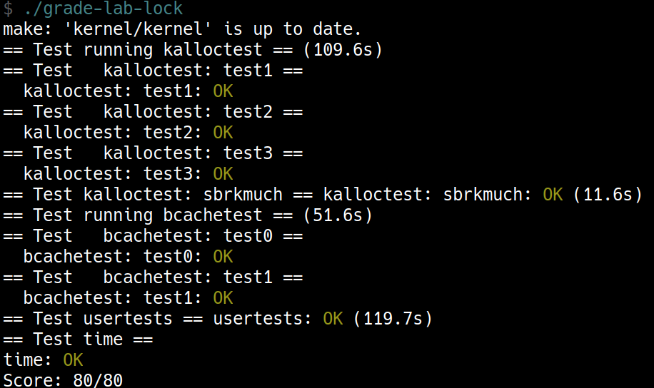

+++
date = '2025-10-23T14:41:29+08:00'
draft = false
title = '[xv6 學習紀錄 08] Lab: locks'
series = ["xv6 學習紀錄"]
weight = 84
+++
Lab 連結：[Lab: locks](https://pdos.csail.mit.edu/6.S081/2022/labs/lock.html)

## Memory allocator (moderate)
> Your job is to implement per-CPU freelists, and stealing when a CPU's free list is empty. You must give all of your locks names that start with "kmem". That is, you should call `initlock` for each of your locks, and pass a name that starts with "kmem". Run kalloctest to see if your implementation has reduced lock contention. To check that it can still allocate all of memory, run `usertests` `sbrkmuch`. Your output will look similar to that shown below, with much-reduced contention in total on kmem locks, although the specific numbers will differ. Make sure all tests in `usertests -q` pass. make grade should say that the `kalloctests` pass. 

### 做出 per-CPU freelists
> You can use the constant `NCPU` from `kernel/param.h` 

把原先的 `kmem` 變成一個 array，題目說大小可以直接用 `NCPU` 的 8 個 CPU
```c
struct {
  struct spinlock lock;
  struct run *freelist;
} kmem[NCPU];
```

> Let `freerange` give all free memory to the CPU running `freerange`. 

這裡的意思也就是 CPU 0 在初始的過程中會拿到所有的 memory，這裡要想到的問題是 CPU 1 ~ CPU 7 在初始過後沒有拿到任何的 memory 
這在之後 steal 的機制會說明
`freerange`
```c
void
kinit()
{
  for (int i = 0; i < NCPU; i++)
    initlock(&kmem[i].lock, "kmem");

  freerange(end, (void*)PHYSTOP);
}
```

* `kfree()` 與 `kalloc()` 變成了都只針對
```c
void
kfree(void *pa)
{
  int id;
  struct run *r;

  if(((uint64)pa % PGSIZE) != 0 || (char*)pa < end || (uint64)pa >= PHYSTOP)
    panic("kfree");

  // Fill with junk to catch dangling refs.
  memset(pa, 1, PGSIZE);

  r = (struct run*)pa;

  // 這裡變成都是針對當前 CPU 的 freelist 進行操作
  push_off();
  id = cpuid();
  pop_off();
  acquire(&kmem[id].lock);
  r->next = kmem[id].freelist;
  kmem[id].freelist = r;
  release(&kmem[id].lock);
}

void *
kalloc(void)
{
  int id;
  struct run *r;

  // 這裡變成都是針對當前 CPU 的 freelist 進行操作
  push_off();
  id = cpuid();
  pop_off();
  acquire(&kmem[id].lock);
  r = kmem[id].freelist;
  if(r)
    kmem[id].freelist = r->next;
  release(&kmem[id].lock);

  if(r)
    memset((char*)r, 5, PGSIZE); // fill with junk
  return (void*)r;
}
```

### steal 的機制
如同先前所說，在 `freerange()` 的初始之後，CPU 1 會拿到所有的 memory，試想現在 CPU 1 想要 `kalloc()` 一個 page，雖然 CPU 0 還有很多 memory 可以用，但是 CPU 1 還是會拿不到任何的 memory，這時候我們可以
1. steal CPU 0 的所有 page
1. steal CPU 0 的一個 page

這兩個方法都是可行的想法，但是沒有幫助到最一開始的目的，這裡我用的是，`kalloc()` 發現沒有 memory 可以用的時候
* steal CPU 0 的 page 數量的一半

```c
void *
kalloc(void)
{
  int id;
  int victim;
  struct run *r;
  struct run *slow;
  struct run *prevslow = 0;
  struct run *fast;

  push_off();
  id = cpuid();
  pop_off();
  acquire(&kmem[id].lock);
  r = kmem[id].freelist;
  if (r) {
    kmem[id].freelist = r->next;
    release(&kmem[id].lock);
    memset((char*)r, 5, PGSIZE); // fill with junk
    return (void*)r;
  } 
  release(&kmem[id].lock);

  for (victim = 0; victim < NCPU; victim++) {
    if (victim == id)
      continue;
    acquire(&kmem[victim].lock);
    if (kmem[victim].freelist) {
      fast = slow = kmem[victim].freelist;
      while (fast && fast->next) {
        prevslow = slow;
        slow = slow->next;
        fast = fast->next->next;
      }
      if (!prevslow) {
        r = kmem[victim].freelist;
        kmem[victim].freelist = (struct run *) 0;
      } else {
        r = slow;
        prevslow->next = (struct run *) 0;
      }

      acquire(&kmem[id].lock);
      kmem[id].freelist = r->next;
      release(&kmem[id].lock);
      release(&kmem[victim].lock);

      memset((char*)r, 5, PGSIZE); // fill with junk
      return (void*)r;
    }
    release(&kmem[victim].lock);
  }
  return (void *) 0;
}
```
實做過程中間覺得 `acquire()` 跟 `release()` 的時機真的需要想清楚，尤其是不同的分支都要顧慮到，不然還蠻容易漏掉的。

## Buffer cache (hard)
> If multiple processes use the file system intensively, they will likely contend for `bcache.lock`, which protects the disk block cache in `kernel/bio.c`. `bcachetest` creates several processes that repeatedly read different files in order to generate contention on `bcache.lock`; its output looks like this (before you complete this lab): 

這裡的情況是說假設有很多的 process 在使用 file system 這時候的 `bcache.lock` (用來保護 disk block 的 lock) 會被激烈的被搶奪，`bcachetest` 製造了這個 `bcache.lock` 的 contention 的情形

```sh
$ bcachetest
start test0
test0 results:
--- lock kmem/bcache stats
lock: kmem: #test-and-set 0 #acquire() 33035
lock: bcache: #test-and-set 16142 #acquire() 65978
--- top 5 contended locks:
lock: virtio_disk: #test-and-set 162870 #acquire() 1188
lock: proc: #test-and-set 51936 #acquire() 73732
lock: bcache: #test-and-set 16142 #acquire() 65978
lock: uart: #test-and-set 7505 #acquire() 117
lock: proc: #test-and-set 6937 #acquire() 73420
tot= 16142
test0: FAIL
start test1
test1 OK
```
這裡要注意的是 `bcache.lock` 的 contention 過高

> Modify the block cache so that the number of `acquire` loop iterations for all locks in the `bcache` is close to zero when running `bcachetest`. Ideally the sum of the counts for all locks involved in the block cache should be zero, but it's OK if the sum is less than 500. Modify bget and `brelse` so that concurrent lookups and releases for different blocks that are in the bcache are unlikely to conflict on locks (e.g., don't all have to wait for `bcache.lock`). You must maintain the invariant that at most one copy of each block is cached. When you are done, your output should be similar to that shown below (though not identical). Make sure `usertests -q` still passes. make grade should pass all tests when you are done. 

題目要我們更改

我猜根據 lock 多，可以獲得較多 concurrency 的原則，應該是可以透過增加 lock 來減少 contention 的數量

> * Read the description of the block cache in the xv6 book (Section 8.1-8.3). 

[[xv6 學習紀錄 08-3] bcache 相關程式碼解析](../bcache)

> * It is OK to use a fixed number of buckets and not resize the hash table dynamically. Use a prime number of buckets (e.g., 13) to reduce the likelihood of hashing conflicts. 

> * Searching in the hash table for a buffer and allocating an entry for that buffer when the buffer is not found must be atomic. 

我原本還想說要每一個 buf 都用一個 lock，但這兩個 hint 應該是說用一個 hash table 來處理

> * Remove the list of all buffers (`bcache.head` etc.) and don't implement LRU. With this change `brelse` doesn't need to acquire the bcache lock. In `bget` you can select any block that has `refcnt == 0` instead of the least-recently used one. 

這裡在說不需要實做 LRU 了，包含先前用的 `bcache.head` 也不必使用了。
* `brelse()` 也不需要 acquire `bcache.lock` 這可以減少 contention
* 原本的 `bget()` 會去尋找 least-recently used 的 buf，現在直接隨便尋找一個 `refcnt==0` 的 buf 就可以了

> * You probably won't be able to atomically check for a cached buf and (if not cached) find an unused buf; you will likely have to drop all locks and start from scratch if the buffer isn't in the cache. It is OK to serialize finding an unused buf in bget (i.e., the part of bget that selects a buffer to re-use when a lookup misses in the cache). 

> * Your solution might need to hold two locks in some cases; for example, during eviction you may need to hold the bcache lock and a lock per bucket. Make sure you avoid deadlock. 

這裡需要兩個 lock，也蠻有可能跟 Memory allocator 那一題一樣會出線 dead lock 的問題

> * When replacing a block, you might move a struct buf from one bucket to another bucket, because the new block hashes to a different bucket. You might have a tricky case: the new block might hash to the same bucket as the old block. Make sure you avoid deadlock in that case. 

這裡提到在 replacing 的時候 new and old 的 hash 值一樣的時候，會出現問題

這是上一個 hint 的特例 所以結論會是 一個 bucket 需要兩個 lock?

> * Some debugging tips: implement bucket locks but leave the global `bcache.lock` `acquire/release` at the beginning/end of `bget` to serialize the code. Once you are sure it is correct without race conditions, remove the global locks and deal with concurrency issues. You can also run `make CPUS=1 qemu` to test with one core. 

> * Use xv6's race detector to find potential races (see above how to use the race detector). 

### hash
```c
#define NBUCKET 17

struct {
  struct sleeplock lock[NBUCKET];
  struct buf head[NBUCKET];
  struct buf buf[NBUF];
} bcache;

static uint
hash(uint blockno)
{
  return blockno % NBUCKET;
}
```

這裡之所以每個 bucket 都使用 `sleeplock` 是因為如果 miss 之後，會呼叫 `virtio_disk_rw()` 這是一個較慢的 function 使用 `sleeplock` 可以避免佔用 CPU 太久的時間

`hash()` 則是一個簡單的把 `blockno` 轉換到 bucket 的 function

```c
#include "types.h"
#include "param.h"
#include "spinlock.h"
#include "sleeplock.h"
#include "riscv.h"
#include "defs.h"
#include "fs.h"
#include "buf.h"

#define NBUCKET 17

struct {
  struct sleeplock lock[NBUCKET];
  struct buf head[NBUCKET];
  struct buf buf[NBUF];
} bcache;

static uint
hash(uint blockno)
{
  return blockno % NBUCKET;
}

void
binit(void)
{
  struct buf *b;
  int i;
  
  for (i = 0; i < NBUCKET; i++)
    initsleeplock(&bcache.lock[i], "bcache");
  for (i = 0; i < NBUCKET; i++) {
    bcache.head[i].prev = &bcache.head[i];
    bcache.head[i].next = &bcache.head[i];
  }
  for(b = bcache.buf; b < bcache.buf+NBUF; b++){
    b->next = bcache.head[0].next;
    b->prev = &bcache.head[0];
    initsleeplock(&b->lock, "buffer");
    bcache.head[0].next->prev = b;
    bcache.head[0].next = b;
  }
}

// Look through buffer cache for block on device dev.
// If not found, allocate a buffer.
// In either case, return locked buffer.
static struct buf*
bget(uint dev, uint blockno)
{
  struct buf *b;
  uint i = hash(blockno);

start_over:

  acquiresleep(&bcache.lock[i]);

  // Is the block already cached?
  for (b = bcache.head[i].next; b != &bcache.head[i]; b = b->next) {
    if (b->dev == dev && b->blockno == blockno) {
      b->refcnt++;
      releasesleep(&bcache.lock[i]);
      acquiresleep(&b->lock);
      return b;
    }
  }

  // Not cached, try to find local victim
  for (b = bcache.head[i].next; b != &bcache.head[i]; b = b->next) {
    if (b->refcnt == 0) {
      b->dev = dev;
      b->blockno = blockno;
      b->valid = 0; // need I/O
      b->refcnt = 1;
      releasesleep(&bcache.lock[i]);
      acquiresleep(&b->lock);
      return b;
    }
  }

  releasesleep(&bcache.lock[i]);

  // find victim globally 
  struct buf *victim = 0;
  uint j;

  for (int k = 1; k < NBUCKET; k++) {
    j = (i + k) % NBUCKET;
    acquiresleep(&bcache.lock[j]);
    for (b = bcache.head[j].next; b != &bcache.head[j]; b = b->next) {
      if (b->refcnt == 0) {
        victim = b;
        break;
      }
    }
    if (victim)
      break;
    else
      releasesleep(&bcache.lock[j]);
  }
  if (!victim)
    panic("bget: no buffer");
  releasesleep(&bcache.lock[j]);

  uint lock1_idx, lock2_idx;
  if (i < j) {
    lock1_idx = i;
    lock2_idx = j;
  } else {
    lock1_idx = j;
    lock2_idx = i;
  }

  acquiresleep(&bcache.lock[lock1_idx]);
  acquiresleep(&bcache.lock[lock2_idx]);

  // check
  if (victim->refcnt != 0) {
    releasesleep(&bcache.lock[lock2_idx]);
    releasesleep(&bcache.lock[lock1_idx]);
    goto start_over;
  }

  // check
  for (b = bcache.head[i].next; b != &bcache.head[i]; b = b->next) {
    if (b->dev == dev && b->blockno == blockno) {
      releasesleep(&bcache.lock[lock2_idx]);
      releasesleep(&bcache.lock[lock1_idx]);
      goto start_over;
    }
  }

  // holding lock[i] and lock[j]
  // actual moving
  victim->next->prev = victim->prev;
  victim->prev->next = victim->next;

  victim->dev = dev;
  victim->blockno = blockno;
  victim->valid = 0;
  victim->refcnt = 1;

  victim->next = bcache.head[i].next;
  victim->prev = &bcache.head[i];
  bcache.head[i].next->prev = victim;
  bcache.head[i].next = victim;

  releasesleep(&bcache.lock[lock2_idx]);
  releasesleep(&bcache.lock[lock1_idx]);

  acquiresleep(&victim->lock);
  return victim;
}

// Return a locked buf with the contents of the indicated block.
struct buf*
bread(uint dev, uint blockno)
{
  struct buf *b;

  b = bget(dev, blockno);
  if(!b->valid) {
    virtio_disk_rw(b, 0);
    b->valid = 1;
  }
  return b;
}

// Write b's contents to disk.  Must be locked.
void
bwrite(struct buf *b)
{
  if(!holdingsleep(&b->lock))
    panic("bwrite");
  virtio_disk_rw(b, 1);
}

// Release a locked buffer.
// Move to the head of the most-recently-used list.
void
brelse(struct buf *b)
{
  if(!holdingsleep(&b->lock))
    panic("brelse");
  releasesleep(&b->lock);

  uint i = hash(b->blockno);

  acquiresleep(&bcache.lock[i]);
  b->refcnt--;
  if (b->refcnt == 0)
    wakeup(b);
  releasesleep(&bcache.lock[i]);
}

void
bpin(struct buf *b) {
  uint i = hash(b->blockno);
  acquiresleep(&bcache.lock[i]);
  b->refcnt++;
  releasesleep(&bcache.lock[i]);
}

void
bunpin(struct buf *b) {
  uint i = hash(b->blockno);
  acquiresleep(&bcache.lock[i]);
  b->refcnt--;
  releasesleep(&bcache.lock[i]);
}
```

## 心得
這個 lab 真的很需要了解 lock 的使用時機還有當前拿了哪些 lock，acqure 與 release 的順序也需要理的非常清楚才行，確實很契合了 "Lab: locks" 的主題


