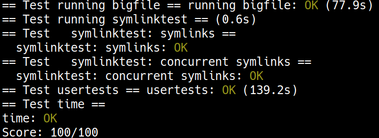

+++
date = '2025-11-01T11:48:29+08:00'
draft = false
title = '[xv6 學習紀錄 09] Lab: file system'
series = ["xv6 學習紀錄"]
weight = 94
+++

Lab 連結：[Lab: file system](https://pdos.csail.mit.edu/6.S081/2022/labs/fs.html)

## Large files (moderate)
>  Modify `bmap()` so that it implements a doubly-indirect block, in addition to direct blocks and a singly-indirect block. You'll have to have only 11 direct blocks, rather than 12, to make room for your new doubly-indirect block; you're not allowed to change the size of an on-disk inode. The first 11 elements of `ip->addrs[]` should be direct blocks; the 12th should be a singly-indirect block (just like the current one); the 13th should be your new doubly-indirect block. You are done with this exercise when `bigfile` writes 65803 blocks and usertests runs successfully: 

這題的策略會是實做出一個 doubly-indirect block
* 不可以更改 on-disk inode `dinode` 的大小，所以這裡要犧牲一個 direct block 來作為 doubly-indirect block 的用途
* `ip->addrs[0] ~ ip->addr[10]` 做為原本的 direct block 的用途
* 第 12 個的 `ip->addr[11]` 做為原本的 singly-indirect block (原本的 `ip->addr[12]`) 的用途
* 第 13 個的 `ip->addr[12]` 是新增的，這是 doubly-indirect block

> * Make sure you understand `bmap()`. Write out a diagram of the relationships between `ip->addrs[]`, the indirect block, the doubly-indirect block and the singly-indirect blocks it points to, and data blocks. Make sure you understand why adding a doubly-indirect block increases the maximum file size by `256*256` blocks (really -1, since you have to decrease the number of direct blocks by one). 

這個 hint 要我們先理解原版的 `bmap()`

這在 [File System 相關程式碼解析](../filesystem/) 有分析過了
* `kernel/fs.c: bmap()`
```c
// Inode content
//
// The content (data) associated with each inode is stored
// in blocks on the disk. The first NDIRECT block numbers
// are listed in ip->addrs[].  The next NINDIRECT blocks are
// listed in block ip->addrs[NDIRECT].

// Return the disk block address of the nth block in inode ip.
// If there is no such block, bmap allocates one.
// returns 0 if out of disk space.
static uint
bmap(struct inode *ip, uint bn)
{
  uint addr, *a;
  struct buf *bp;

  // direct 的情形
  if(bn < NDIRECT){
    // 直接拿第 bn 個 address
    // 例如 bn == 0 就拿 ip->addrs[0]
    // 一直到第 12 個的 bn == 11 就拿取 ip->addrs[11]
    // 現在 addr 拿到了 block address
    if((addr = ip->addrs[bn]) == 0){
      // 如果 addr 不存在 (addr == 0) balloc 一個新的 block 給 ip->addrs[bn]
      addr = balloc(ip->dev);
      if(addr == 0)
        return 0;
      // 原本沒有內容的 ip->addrs[bn] 現在有了一個新的 block
      ip->addrs[bn] = addr;
    }
    // 拿到了 addr 之後就回傳，這也是 bmap() 最重要的任務
    // 得知一個 inode 中的第 bn 個 block 的 block address
    return addr;
  }

  // 如果不是 direct mapping，例如想知道第 bn == 12 個 block
  // 實際上這是 indirect mapping 中的第 (12 - NDIRECT) == 0 個 block
  bn -= NDIRECT;

  // bn 照理來說不應該超過 256
  if(bn < NINDIRECT){
    // Load indirect block, allocating if necessary.
    // 先取得圖片中 "indirect" 的那一個 address
    // 如果為 0 則一樣 balloc() 一個新的 block 給他
    if((addr = ip->addrs[NDIRECT]) == 0){
      addr = balloc(ip->dev);
      if(addr == 0)
        return 0;
      ip->addrs[NDIRECT] = addr;
    }
    // 往下尋找 bmap() 需要回傳的 address
    // 要從 addr = ip->addrs[NDIRECT] 的這個 block 中尋找
    // 使用 bread() 讀取這個 block 的資料
    bp = bread(ip->dev, addr);
    a = (uint*)bp->data;
    // 還是一樣的套路，沒有資料則 balloc 一個新的 block
    // 現在的 addr 就會是 bmap() 要回傳的 address 了
    if((addr = a[bn]) == 0){
      addr = balloc(ip->dev);
      if(addr){
        a[bn] = addr;
        log_write(bp);
      }
    }
    brelse(bp);
    return addr;
  }

  // 如果不是 direct or indirect, panic()
  panic("bmap: out of range");
}
```

> * Think about how you'll index the doubly-indirect block, and the indirect blocks it points to, with the logical block number.

> * If you change the definition of `NDIRECT`, you'll probably have to change the declaration of `addrs[]` in `struct inode` in `file.h`. Make sure that `struct inode` and `struct dinode` have the same number of elements in their `addrs[]` arrays.


> * If you change the definition of `NDIRECT`, make sure to create a new `fs.img`, since `mkfs` uses `NDIRECT` to build the file system.

更改完 `NDIRECT` 之後要重新 `make` 一次

> * If your file system gets into a bad state, perhaps by crashing, delete `fs.img` (do this from Unix, not xv6). make will build a new clean file system image for you.

如果系統 crash 掉，先 delete `fs.img` 再重新 make 出一個新的

> * Don't forget to `brelse()` each block that you `bread()`.

實做 `bmap()` 要注意的點

> * You should allocate indirect blocks and doubly-indirect blocks only as needed, like the original `bmap()`.

有需要的時候再使用 `balloc()` 出新的 block，這個套路在原版的 `bmap()` 就已經看過了

> * Make sure `itrunc` frees all blocks of a file, including double-indirect blocks.

這在 [File System 相關程式碼解析](../filesystem/) 有分析過原版的，等一下再加入 doubly-indirect 的部份
```c
// Truncate inode (discard contents).
// Caller must hold ip->lock.
void
itrunc(struct inode *ip)
{
  int i, j;
  struct buf *bp;
  uint *a;

  // 刪除 12 個 direct
  for(i = 0; i < NDIRECT; i++){
    if(ip->addrs[i]){
      bfree(ip->dev, ip->addrs[i]);
      ip->addrs[i] = 0;
    }
  }

  // 刪除 indirect 的部份
  if(ip->addrs[NDIRECT]){
    bp = bread(ip->dev, ip->addrs[NDIRECT]);
    a = (uint*)bp->data;
    // 刪除 indirect block 中 0 ~ 511 的 data block
    for(j = 0; j < NINDIRECT; j++){
      if(a[j])
        bfree(ip->dev, a[j]);
    }
    brelse(bp);
    bfree(ip->dev, ip->addrs[NDIRECT]);
    ip->addrs[NDIRECT] = 0;
  }

  ip->size = 0;
  iupdate(ip);
}
```

> * `usertests` takes longer to run than in previous labs because for this lab `FSSIZE` is larger and big files are larger. 

先前的 `usertests` 就已經蠻慢的了，這個 big file 的 lab 又會更慢一點，畢竟 `FSSIZE` 又更大

### 程式實做

#### data structure
* `kernel/fs.h`
```c
#define BSIZE 1024  // block size

#define NDIRECT 12
#define NINDIRECT (BSIZE / sizeof(uint)) // 512
#define MAXFILE (NDIRECT + NINDIRECT)
```
現在 `NDIRECT` 改為 11，把多出來的做為 doubly-indirect 用
* `kernel/fs.h`
```c
#define BSIZE 1024  // block size

#define NDIRECT 11
#define NINDIRECT (BSIZE / sizeof(uint)) // 512
#define MAXFILE (NDIRECT + NINDIRECT + NINDIRECT * NINDIRECT)
```

連帶 `struct inode` 與 `struct dinode` 要做更動
* `kernel/file.h`
```c
// in-memory copy of an inode
struct inode {
  uint dev;           // Device number
  uint inum;          // Inode number
  int ref;            // Reference count
  struct sleeplock lock; // protects everything below here
  int valid;          // inode has been read from disk?

  short type;         // copy of disk inode
  short major;
  short minor;
  short nlink;
  uint size;
  uint addrs[NDIRECT+2];
};
```

* `kernel/fs.h`
```c
// On-disk inode structure
struct dinode {
  short type;           // File type
  short major;          // Major device number (T_DEVICE only)
  short minor;          // Minor device number (T_DEVICE only)
  short nlink;          // Number of links to inode in file system
  uint size;            // Size of file (bytes)
  uint addrs[NDIRECT+2];   // Data block addresses
};
```

#### `bmap()`
```c
static uint
bmap(struct inode *ip, uint bn)
{
  uint addr, *a;
  struct buf *bp;

  if(bn < NDIRECT){
    if((addr = ip->addrs[bn]) == 0){
      addr = balloc(ip->dev);
      if(addr == 0)
        return 0;
      ip->addrs[bn] = addr;
    }
    return addr;
  }
  bn -= NDIRECT;

  if(bn < NINDIRECT){
    // Load indirect block, allocating if necessary.
    if((addr = ip->addrs[NDIRECT]) == 0){
      addr = balloc(ip->dev);
      if(addr == 0)
        return 0;
      ip->addrs[NDIRECT] = addr;
    }
    bp = bread(ip->dev, addr);
    a = (uint*)bp->data;
    if((addr = a[bn]) == 0){
      addr = balloc(ip->dev);
      if(addr){
        a[bn] = addr;
        log_write(bp);
      }
    }
    brelse(bp);
    return addr;
  }
  // 現在 bn 代表的是 doubly-indirect 中的第 bn 個
  bn -= NINDIRECT;

  // 在這時候先釐清一下
  // 在 ip->addrs[] 的層級中，要拿的是 ip->addrs[NDIRECT + 1]
  // 在這一個 doubly-indirect block 中總共有 512 個 address
  // 這 512 個 address 指向 512 個 indirect block
  // 第 0 個 address 指向的第 0 個 indirect block 負責 bn == 0 ~ 511
  // 第 1 個 address 指向的第 1 個 indirect block 負責 bn == 512 ~ (512 * 2 - 1)
  // 第 n 個 address 指向的第 n 個 indirect block 負責 ((n - 1) * NINDIRECT) <= bn && bn < n * NINDIRECT
  // doubly-indirect 中的第 bn 個 block
  // 是由 doubly-indirect block 中
  // 第 (bn / NINDIRECT) 個 address 指向的第 (bn / NINDIRECT) 個 indirect block 負責
  // 在這個 indrect block 中，
  // 又是其中的第 (bn % NINDIRECT) 個 address

  // 總之
  // 1. ip->addrs[NDIRECT + 1] 得知 doubly-indirect block
  // 2. doubly-indirect block 中的第 (bn / NINDIRECT) 個 address 可得知 indirect block
  // 3. indirect block 中的第 (bn % NINDIRECT) 個 address 是 bmap() 要回傳的 address
  if (bn < NINDIRECT * NINDIRECT) {
    if ((addr = ip->addrs[NDIRECT + 1]) == 0) {
      addr = balloc(ip->dev);
      if(addr == 0)
        return 0;
      ip->addrs[NDIRECT + 1] = addr;
    }
    // 此時 addr 拿到的是 doubly-indirect block
    bp = bread(ip->dev, addr);
    a = (uint*)bp->data;
    // 現在要拿第 (bn / NINDIRECT) 個 address，
    // 可得知 indirect block 的 address
    if((addr = a[bn / NINDIRECT]) == 0){
      addr = balloc(ip->dev);
      if(addr){
        a[bn / NINDIRECT] = addr;
        log_write(bp);
      }
    }
    brelse(bp);
    // 現在這個 addr 是 indirect block 的 address
    // 要拿取第 (bn % NINDIRECT) 個 address
    bp = bread(ip->dev, addr);
    a = (uint*)bp->data;
    if ((addr = a[bn % NINDIRECT]) == 0) {
      addr = balloc(ip->dev);
      if(addr){
        a[bn % NINDIRECT] = addr;
        log_write(bp);
      }
    }
    brelse(bp);
    return addr;
  }

  panic("bmap: out of range");
}
```

#### `itrunc()`
```c
// Truncate inode (discard contents).
// Caller must hold ip->lock.
void
itrunc(struct inode *ip)
{
  int i, j, k;
  struct buf *bp;
  uint *a;
  // for doubly-indirect block
  struct buf *bp0, *bp1;
  uint *a0, *a1;

  for(i = 0; i < NDIRECT; i++){
    if(ip->addrs[i]){
      bfree(ip->dev, ip->addrs[i]);
      ip->addrs[i] = 0;
    }
  }

  if(ip->addrs[NDIRECT]){
    bp = bread(ip->dev, ip->addrs[NDIRECT]);
    a = (uint*)bp->data;
    for(j = 0; j < NINDIRECT; j++){
      if(a[j])
        bfree(ip->dev, a[j]);
    }
    brelse(bp);
    bfree(ip->dev, ip->addrs[NDIRECT]);
    ip->addrs[NDIRECT] = 0;
  }

  // 處理 doubly-indirect block 的部份
  if (ip->addrs[NDIRECT + 1]) {
    bp1 = bread(ip->dev, ip->addrs[NDIRECT + 1]);
    a1 = (uint*)bp1->data;
    // 分別檢查這之中的 512 個 indirect block
    for(j = 0; j < NINDIRECT; j++){
      if(a1[j]) {
        bp0 = bread(ip->dev, a1[j]);
        a0 = (uint *) bp0->data;
        for (k = 0; k < NINDIRECT; k++) {
          if (a0[k])
            bfree(ip->dev, a0[k]);
        }
        brelse(bp0);
        bfree(ip->dev, a1[j]);
        a1[j] = 0;
      }
    }
    brelse(bp1);
    bfree(ip->dev, ip->addrs[NDIRECT + 1]);
    ip->addrs[NDIRECT + 1] = 0;
  }

  ip->size = 0;
  iupdate(ip);
}
```

## Symbolic links (moderate)
> In this exercise you will add symbolic links to xv6. Symbolic links (or soft links) refer to a linked file by pathname; when a symbolic link is opened, the kernel follows the link to the referred file. Symbolic links resembles hard links, but hard links are restricted to pointing to file on the same disk, while symbolic links can cross disk devices. Although xv6 doesn't support multiple devices, implementing this system call is a good exercise to understand how pathname lookup works. 

hard link 只限縮在同一個 disk，symbolic link (soft link) 則可以跨 disk，這一題要做的是 soft link，雖然 xv6 並沒有支援多個 devices，不過實做這個 system call 可以很好的了解 pathname 的尋找過程

> You will implement the `symlink(char *target, char *path)` system call, which creates a new symbolic link at `path` that refers to file named by `target`. For further information, see the `man` page `symlink`. To test, add `symlinktest` to the `Makefile` and run it. Your solution is complete when the tests produce the following output (including `usertests` succeeding). 

例如原本有一個檔案 `target`，在 `symlink(char *target, char *path)` 之後，`path` 就會也指向 `target` 這個檔案
* 現在的策略是把這個 `target` (或是 `target` 的 `inum`) 存放於這個 type 為 `T_SYMLINK` 的檔案，在拿到 `target` 之後，再用原先的方式把檔案開啟，所以這裡需要先了解有了 `target` (or `inum`) 之後，原本的檔案開啟流程為何？

> * First, create a new system call number for `symlink`, add an entry to `user/usys.pl`, `user/user.h`, and implement an empty `sys_symlink` in `kernel/sysfile.c`.

* `user/usys.pl`
```perl
entry("symlink");
```

* `user/user.h`
```c
int symlink(char *target, char *path);
```

* `kernel/syscall.h`
```c
#define SYS_symlink 22
```

* `kernel/syscall.c`
```c
extern uint64 sys_symlink(void);

static uint64 (*syscalls[])(void) = {
// ...
[SYS_symlink] sys_symlink,
};
```

* `kernel/sysfile.c`
```c
uint64
sys_symlink(void)
{
  // TODO
  return 0;
}
```

> * Add a new file type (`T_SYMLINK`) to `kernel/stat.h` to represent a symbolic link.

```c
#define T_DIR     1   // Directory
#define T_FILE    2   // File
#define T_DEVICE  3   // Device
#define T_SYMLINK 4   // Symbolic link

struct stat {
  int dev;     // File system's disk device
  uint ino;    // Inode number
  short type;  // Type of file
  short nlink; // Number of links to file
  uint64 size; // Size of file in bytes
};
```

> * Add a new flag to `kernel/fcntl.h`, (`O_NOFOLLOW`), that can be used with the open system call. Note that flags passed to open are combined using a bitwise OR operator, so your new flag should not overlap with any existing flags. This will let you compile `user/symlinktest.c` once you add it to the `Makefile`.

例如這個使用情形
* `user/symlinktest.c`
```c
// stat a symbolic link using O_NOFOLLOW
static int
stat_slink(char *pn, struct stat *st)
{
  int fd = open(pn, O_RDONLY | O_NOFOLLOW);
  if(fd < 0)
    return -1;
  if(fstat(fd, st) != 0)
    return -1;
  return 0;
}
```
使用 flag `O_NOFOLLOW`，代表的意義為，如果打開了一個 `symlink`，不要跟著 follow 下去打開這個 link

> * Implement the `symlink(target, path)` system call to create a new symbolic link at `path` that refers to `target`. Note that `target` does not need to exist for the system call to succeed. You will need to choose somewhere to store the `target` path of a symbolic link, for example, in the inode's data blocks. `symlink` should `return` an integer representing success (0) or failure (-1) similar to `link` and `unlink`.

* 需要找個地方存放 the `target` path of a symbolic link，會像是 inode 中的 data blocks
* `return 0` 代表 success; `return -1` 代表 failure，這跟 `link` and `unlink` 一樣
* 就算 `target` 不存在，這個 system call 也算是成功
    * 我想失敗應該會失敗在接下去的 open or 就真的是失敗？

> * Modify the open system call to handle the case where the `path` refers to a symbolic link. If the file does not exist, `open` must fail. When a process specifies `O_NOFOLLOW` in the flags to open, open should open the `symlink` (and not follow the symbolic link).

* `O_NOFOLLOW` 的用意在於還是要有一個方法可以打開這個 `symlink` 本身

> * If the linked file is also a symbolic link, you must recursively follow it until a non-link file is reached. If the links form a cycle, you must return an error code. You may approximate this by returning an error code if the depth of links reaches some threshold (e.g., 10).

symbolic link 也可以指向一個 symbolic link，需要 recursive 的方式解析
* 可以設定一個 threshold，畢竟也有可能發生 circular 的事情發生

> * Other system calls (e.g., `link` and `unlink`) must not follow symbolic links; these system calls operate on the symbolic link itself.

why?

> * You do not have to handle symbolic links to directories for this lab. 

* 這個 lab 不需要處理 directories 的 symbolic link

### 程式實做
* `kernel/stat.h`
```c
#define T_DIR     1   // Directory
#define T_FILE    2   // File
#define T_DEVICE  3   // Device
#define T_SYMLINK 4   // Symbolic link

struct stat {
  int dev;     // File system's disk device
  uint ino;    // Inode number
  short type;  // Type of file
  short nlink; // Number of links to file
  uint64 size; // Size of file in bytes
};
```

* `kernle/fcntl.h`: 新增 `O_NOFOLLOW`
```c
#define O_RDONLY   0x000
#define O_WRONLY   0x001
#define O_RDWR     0x002
#define O_CREATE   0x200
#define O_TRUNC    0x400
#define O_NOFOLLOW 0x800
```

* `kernel/sysfile.c: sys_symlink()`
這裡的目的在於把 `target` 存放於此 `T_SYMLINK` 的 file 中
```c
uint64
sys_symlink(void)
{
  char path[MAXPATH], target[MAXPATH];
  struct inode *ip;
  int n;

  if(argstr(0, target, MAXPATH) < 0 || argstr(1, path, MAXPATH) < 0)
    return -1;
  begin_op();
  if ((ip = create(path, T_SYMLINK, 0, 0)) == 0) {
    end_op();
    return -1;
  }
  n = writei(ip, 0, (uint64) target, 0, strlen(target));
  if (n < strlen(target)) {
    ip->nlink = 0;
    iupdate(ip);
    iunlockput(ip);
    end_op();
    return -1;
  }
  iunlockput(ip);
  end_op();
  return 0;
}
```

* `kernel/sysfile.c: sys_open()`
```c
uint64
sys_open(void)
{
  char path[MAXPATH];
  char current_path[MAXPATH];
  char next_path[MAXPATH];
  int fd, omode;
  struct file *f;
  struct inode *ip;
  int n;
  int depth;

  argint(1, &omode);
  if((n = argstr(0, path, MAXPATH)) < 0)
    return -1;

  begin_op();

  if(omode & O_CREATE){
    ip = create(path, T_FILE, 0, 0);
    if(ip == 0){
      end_op();
      return -1;
    }
  } else {
    strncpy(current_path, path, MAXPATH);
    depth = 0;
    while (1) {
      if((ip = namei(current_path)) == 0){
        end_op();
        return -1;
      }
      ilock(ip);
      if (ip->type != T_SYMLINK)
        break;
      if (omode & O_NOFOLLOW)
        break;
      if (++depth > 10) {
        iunlockput(ip);
        end_op();
        return -1;
      }

      // read the `target`
      memset(next_path, 0, MAXPATH);
      n = readi(ip, 0, (uint64) next_path, 0, sizeof(next_path) - 1);

      iunlockput(ip);
      end_op();
      if (n <= 0)
        return -1;
      strncpy(current_path, next_path, MAXPATH);
      begin_op();
    }
    if(ip->type == T_DIR && omode != O_RDONLY){
      iunlockput(ip);
      end_op();
      return -1;
    }
  }

  if(ip->type == T_DEVICE && (ip->major < 0 || ip->major >= NDEV)){
    iunlockput(ip);
    end_op();
    return -1;
  }

  if((f = filealloc()) == 0 || (fd = fdalloc(f)) < 0){
    if(f)
      fileclose(f);
    iunlockput(ip);
    end_op();
    return -1;
  }

  if(ip->type == T_DEVICE){
    f->type = FD_DEVICE;
    f->major = ip->major;
  } else {
    f->type = FD_INODE;
    f->off = 0;
  }
  f->ip = ip;
  f->readable = !(omode & O_WRONLY);
  f->writable = (omode & O_WRONLY) || (omode & O_RDWR);

  if((omode & O_TRUNC) && ip->type == T_FILE){
    itrunc(ip);
  }

  iunlock(ip);
  end_op();

  return fd;
}
```



## 心得
這個 lab 對我來說的課題是抓重點程式碼，其實不必了解到所有到底層的流程，更多的時候了解各個主要功能 function 之間的互動會更重要一些


